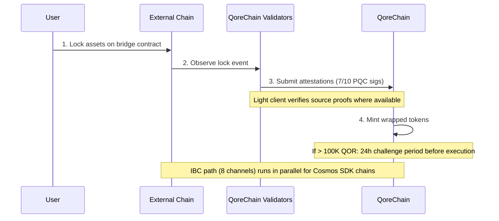

# Bridge Architecture

The `x/bridge` module is designed to connect QoreChain to the broader blockchain ecosystem through **37 QCB (QoreChain Bridge) chain configurations and 8 IBC (Inter-Blockchain Communication) channels**. Every bridge operation is secured by post-quantum cryptography.

:::caution
The cross-chain bridge is **currently in testnet and pending — it is not yet a production system**. The chain configurations, light clients, and flows described below reflect the bridge as designed and as exercised on testnet. External connectivity is being rolled out progressively; treat all targets as design intent rather than live mainnet guarantees.
:::

## Connection Overview

QoreChain is designed to support two bridge protocols operating in parallel:

| Protocol | Connections          | Security Model                       | Use Case                                |
| -------- | -------------------- | ------------------------------------ | --------------------------------------- |
| **IBC**  | 8 channels           | Standard IBC + PQC packet signatures | Cosmos SDK-compatible chains            |
| **QCB**  | 37 chain configs     | 7-of-10 Dilithium-5 multisig         | Non-IBC chains (EVM, Solana, TON, etc.) |

The **37 QCB chain configurations** include **36 external chains** plus **QoreChain itself** as a native/loopback configuration (used for internal routing and self-referential settlement). The 8 IBC channels connect to Cosmos SDK-compatible chains.

## IBC Channels

QoreChain is designed to maintain IBC connections to the following 8 chains, relayed via Hermes v1.x:

| Chain      | Description                    |
| ---------- | ------------------------------ |
| Cosmos Hub | Primary hub connection         |
| Osmosis    | DEX liquidity routing          |
| Noble      | USDC native issuance           |
| Celestia   | Data availability layer        |
| Stride     | Liquid staking                 |
| Akash      | Decentralized compute          |
| Babylon    | BTC restaking protocol         |
| Injective  | DeFi / orderbook interoperability |

### IBC Relayer Configuration

* **Relayer software**: Hermes v1.x
* **Client updates**: Automatic light client refresh
* **Misbehaviour detection**: Enabled — the relayer monitors for equivocation
* **Packet clearing**: Every 100 blocks, pending IBC packets are cleared
* **PQC enhancement**: Every IBC packet originating from QoreChain includes an optional Dilithium-5 signature for forward quantum security. PQC-aware receiving chains can verify this signature alongside standard IBC verification.

## QCB (QoreChain Bridge) Protocol

The QCB protocol uses a hub-and-spoke architecture secured by post-quantum cryptography. QoreChain acts as the hub, with spoke configurations for each external chain plus a native/loopback configuration for QoreChain itself.

### External Chain Configurations (36)

The QCB protocol is designed to target the following 36 external chains. Combined with QoreChain's own native/loopback configuration, this gives **37 QCB chain configs in total (including QoreChain itself)**.

**Baseline chains (10)**

Ethereum, Solana, TON, BSC, Avalanche, Polygon, Arbitrum, Optimism, Base, Sui.

**EVM-family chains (14)**

zkSync Era, Linea, Scroll, Blast, Mantle, Hyperliquid, Berachain, Sonic, Sei, Monad, Plasma, Filecoin FVM, Cronos, Kaia.

**Non-EVM chains (5)**

Starknet, XRP Ledger, Stellar, Hedera, Algorand.

**Pending chains (7)**

NEAR, Bitcoin, Cardano, Polkadot, Tezos, Tron, Aptos.

:::note
Count check: 10 baseline + 14 EVM-family + 5 non-EVM + 7 pending = **36 external chains**. Adding QoreChain's own native/loopback configuration yields **37 QCB chain configs**.
:::

### Address Formats

The QCB protocol classifies chains by type to validate destination addresses:

| Chain Type   | Example Chains                                                          | Address Format                                     |
| ------------ | ----------------------------------------------------------------------- | -------------------------------------------------- |
| `evm`        | Ethereum, BSC, Avalanche, Polygon, Arbitrum, Optimism, Base             | `0x` + 40 hex characters                           |
| `solana`     | Solana                                                                  | Base58, 32-44 characters                           |
| `ton`        | TON                                                                     | `EQ` + base64 encoded                              |
| `sui_move`   | Sui                                                                     | `0x` + 64 hex characters                           |
| `aptos_move` | Aptos                                                                   | `0x` + 64 hex characters                           |
| `bitcoin`    | Bitcoin                                                                 | Bech32 (`bc1`), P2SH (`3...`), or legacy (`1...`)  |
| `near`       | NEAR Protocol                                                           | `.near` suffix or implicit                         |
| `cardano`    | Cardano                                                                 | `addr1` (payment) or `stake1` (staking)            |
| `polkadot`   | Polkadot                                                                | SS58 encoded                                       |
| `tezos`      | Tezos                                                                   | `tz1`/`tz2`/`tz3` (implicit) or `KT1` (originated) |
| `tron`       | TRON                                                                    | `T` + base58, 34 characters                        |

## Light Clients

To verify external-chain events trustlessly, the bridge is designed to run on-chain light clients tailored to each source chain's consensus and proof system. These light clients enable QoreChain to validate deposits and withdrawals without relying solely on validator attestations.

| Light Client            | Source Chain        | Verification Primitives                                              |
| ----------------------- | ------------------- | ------------------------------------------------------------------- |
| **Ethereum light client** | Ethereum / EVM L1 | BLS12-381 signature verification, SSZ serialization, MPT state proofs |
| **Bitcoin SPV**         | Bitcoin             | Simplified Payment Verification against block headers                |
| **Starknet STARK**      | Starknet            | STARK proof verification of Starknet state transitions              |
| **Sui BLS**             | Sui                 | BLS aggregate signature verification of Sui checkpoints             |
| **Wormhole / Solana VAA** | Solana (via Wormhole) | Verified Action Approval (VAA) guardian-signature verification     |

## Deposit Flow (External to QoreChain)

The sequence below shows a QCB deposit: assets are locked on an external chain, QoreChain validators submit PQC-signed attestations (7-of-10 Dilithium-5), and wrapped tokens are minted. Cosmos SDK-compatible chains instead use the parallel IBC path (8 channels, with optional Dilithium-5 packet signatures). Both paths are testnet/pending.



```
External Chain          QoreChain Validators           QoreChain
     |                         |                          |
     | 1. Lock assets on       |                          |
     |    bridge contract      |                          |
     |------------------------>|                          |
     |                         | 2. Observe & attest      |
     |                         |    (7/10 PQC sigs)       |
     |                         |------------------------->|
     |                         |                          | 3. Mint wrapped
     |                         |                          |    tokens
     |                         |                          |
     |                         |    [If > 100K QOR]       |
     |                         |    24h challenge period   |
     |                         |    before execution       |
```

1. **Lock** — User locks assets in the bridge contract on the external chain.
2. **Attest** — Bridge validators observe the lock transaction and submit Dilithium-5 signed attestations. A minimum of **7 out of 10** validator attestations are required. Where a light client is available for the source chain, the locked event is additionally verified against the chain's own proofs.
3. **Mint** — Once the attestation threshold is met, wrapped tokens are minted on QoreChain.
4. **Challenge period** — For transfers exceeding 100,000 QOR equivalent, a **24-hour challenge period** applies before execution. During this window, validators can flag suspicious activity.

## Withdrawal Flow (QoreChain to External)

```
QoreChain               QoreChain Validators           External Chain
     |                         |                          |
     | 1. Burn wrapped tokens  |                          |
     |------------------------>|                          |
     |                         | 2. Attest burn           |
     |                         |    (7/10 PQC sigs)       |
     |                         |------------------------->|
     |                         |                          | 3. Unlock original
     |                         |                          |    assets
```

1. **Burn** — User burns wrapped tokens on QoreChain.
2. **Attest** — Validators attest to the burn event with Dilithium-5 signatures (7/10 threshold).
3. **Unlock** — Once the threshold is reached, original assets are unlocked on the external chain.

All bridge fees collected during withdrawals are routed to the `x/burn` module via the `bridge_fee` burn channel (100% of bridge fees are burned).

### L2 → L1 Withdrawal Flow (Rollup Settlement)

The bridge is also designed to settle **rollup (L2) withdrawals back to their host chain (L1)**. Rollups deployed via the [Rollup Development Kit](/architecture/rollup-development-kit) periodically anchor their state to QoreChain; the bridge consumes those finalized anchors to authorize withdrawals from the rollup to the host chain:

1. A user initiates a withdrawal on the rollup (L2), which is included in a settlement batch.
2. The batch is anchored to QoreChain and proven/finalized according to the rollup's settlement mode (for example, after the optimistic challenge window expires, or upon valid proof verification).
3. Once the anchor is finalized, the withdrawal becomes claimable and the corresponding assets are released on the host chain (L1) through the standard burn-and-attest path.

This ties rollup finality directly to the host-chain settlement guarantees, so that L2 withdrawals cannot be released before the corresponding L2 state is irreversibly settled.

## Security Architecture

### PQC Multisig

All QCB bridge operations require a **7-of-10 threshold** of Dilithium-5 post-quantum signatures from registered bridge validators. Each bridge validator registers with:

* A QoreChain validator address
* A Dilithium-5 public key (2,592 bytes)
* A list of supported chains
* A reputation score (maintained by `x/reputation`)

### Circuit Breakers

Each connected chain has independent circuit breaker protections:

| Protection                | Description                                                                          |
| ------------------------- | ------------------------------------------------------------------------------------ |
| **Single transfer limit** | Maximum amount for any individual bridge operation per chain                         |
| **Daily aggregate limit** | Total volume cap per chain per 24-hour window                                        |
| **Manual pause**          | Governance or validator-triggered emergency halt per chain                           |
| **Anomaly detection**     | Automatic pause if >50 operations in a short window or volume exceeds 5x daily limit |

Circuit breaker state is tracked per chain and includes: max single transfer, daily limit, current daily usage, last reset height, and pause status with reason.

### Challenge Period

For large transfers (>100,000 QOR equivalent, configurable via `large_transfer_threshold`):

* A **24-hour challenge period** (86,400 seconds) applies after the attestation threshold is met.
* During this window, any validator can flag the operation.
* If unchallenged, the operation executes automatically after the period expires.
* Challenged operations are frozen for governance review.

### AI Path Optimization

The bridge module integrates with the AI subsystem for route optimization. For transfers that can traverse multiple paths (e.g., chain A to chain B via an intermediary), the path optimizer evaluates:

* Estimated fees across routes
* Estimated completion time
* Security score per path
* Confidence level of the estimate

## REST API Endpoints

As of chain version **v3.1.77**, bridge state is also queryable **read-only over REST** via grpc-gateway under the `/qorechain/bridge/v1/...` prefix (`config`, `chains`, `chains/{chain_id}`, `validators`, `validators/{address}`, `operations`, `operations/{id}`) — previously gRPC-only. These serve real on-chain JSON over HTTP for explorers and light-node telemetry. See [REST / gRPC Endpoints](/api-reference/rest-grpc-endpoints#bridge-module) for the full list.

| Method | Endpoint                                           | Description                                      |
| ------ | -------------------------------------------------- | ------------------------------------------------ |
| GET    | `/bridge/v1/chains`                                | List all supported chain configurations          |
| GET    | `/bridge/v1/chains/{chain_id}`                     | Get configuration for a specific chain           |
| GET    | `/bridge/v1/validators`                            | List all registered bridge validators            |
| GET    | `/bridge/v1/operations`                            | List all bridge operations (most recent first)   |
| GET    | `/bridge/v1/operations/{operation_id}`             | Get details of a specific operation              |
| GET    | `/bridge/v1/locked/{chain}/{asset}`                | Get locked/minted amounts for a chain/asset pair |
| GET    | `/bridge/v1/circuit-breakers`                      | List all circuit breaker states                  |
| GET    | `/bridge/v1/estimate/{from}/{to}/{asset}/{amount}` | Get AI-optimized route estimate                  |

## Bridge Events

The bridge module emits the following on-chain events:

| Event Type                    | Description                                     |
| ----------------------------- | ----------------------------------------------- |
| `bridge_deposit`              | New deposit operation created                   |
| `bridge_withdraw`             | New withdrawal operation created                |
| `bridge_attestation`          | Validator attestation submitted                 |
| `bridge_operation_executed`   | Operation finalized and executed                |
| `bridge_circuit_breaker_trip` | Circuit breaker activated or deactivated        |
| `bridge_validator_registered` | New bridge validator registered                 |
| `bridge_pqc_verification`     | PQC signature verification result (IBC packets) |

## Related

* [Bridging Assets](/user-guide/bridging-assets) — move assets across chains step by step.
* [Dashboard Bridge](/dashboard/bridge) — the bridge interface for everyday users.
* [BTC Restaking via Babylon](/architecture/btc-restaking-babylon) — Bitcoin-backed security.
* [Post-Quantum Security](/architecture/post-quantum-security) — PQC verification on IBC packets.
