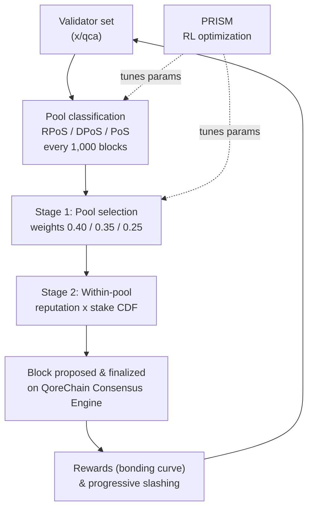

# Consensus Mechanism

QoreChain implements **Triple-Pool Composite Proof-of-Stake (CPoS)**, a consensus mechanism that classifies validators into three specialized pools and uses reputation-weighted selection to balance security, decentralization, and performance. CPoS is implemented in the `x/qca` module and operates on top of the **QoreChain Consensus Engine**.

The reinforcement-learning optimization layer that tunes consensus parameters at runtime is branded **PRISM** (Policy-driven Reinforcement-learning for Intelligent State Machines). See the [PRISM Consensus Engine](/architecture/prism-consensus-engine) for details.

The diagram below summarizes one block/consensus cycle of Triple-Pool CPoS on the QoreChain Consensus Engine, and shows where PRISM feeds back into the tunable `x/qca` parameters.



---

## Triple-Pool Architecture

CPoS divides the active validator set into three pools based on reputation, stake, and delegation metrics. Each pool serves a distinct role in the consensus process.

### Pool Classification

| Pool                                 | Criteria                                                                | Selection Weight |
| ------------------------------------ | ----------------------------------------------------------------------- | ---------------- |
| **RPoS** (Reputation Proof-of-Stake) | Reputation score >= 70th percentile **AND** self-bonded stake >= median | 40%              |
| **DPoS** (Delegated Proof-of-Stake)  | Total delegation >= 10,000 QOR                                          | 35%              |
| **PoS** (Standard Proof-of-Stake)    | All remaining active validators                                         | 25%              |

Classification is evaluated with the following priority: **RPoS > DPoS > PoS**. A validator that qualifies for both RPoS and DPoS is assigned to RPoS.

Reclassification occurs every **1,000 blocks**. At each reclassification epoch:

1. **Collect reputation scores** — Reputation scores are collected from the `x/reputation` module for all active validators.
2. **Compute reputation threshold** — The 70th-percentile reputation threshold is computed from the sorted score distribution.
3. **Compute median self-bonded stake** — The median self-bonded stake is computed from the sorted stake distribution.
4. **Reassign validators** — Each active validator is reassigned to the highest-priority pool for which it qualifies.
5. **Default assignment** — Unclassified validators (those not yet evaluated) default to the PoS pool.

---

## Pool-Weighted Proposer Selection

Block proposer selection follows a two-stage deterministic process.

### Stage 1: Pool Selection

A deterministic random value selects which pool proposes the next block:

```
seed = SHA256(lastBlockHash || height || "pool")
randVal = uint64(seed[:8]) / MaxUint64    // uniform in [0, 1)
```

The pool is chosen by comparing `randVal` against cumulative weight thresholds:

* `randVal < 0.40` → RPoS pool
* `0.40 <= randVal < 0.75` → DPoS pool
* `randVal >= 0.75` → PoS pool

### Stage 2: Within-Pool Selection

Within the selected pool, the proposer is chosen via a **reputation × stake weighted CDF**. For each validator in the pool:

1. The reputation score `r` is retrieved from `x/reputation`.
2. The composite weight is `w = r * tokens`.
3. A cumulative distribution function (CDF) is constructed from all composite weights.
4. The proposer is selected using a deterministic random draw against the CDF, seeded by the block hash and height.

### Fallback Behavior

If the selected pool is empty, the system falls back to the PoS pool. If the PoS pool is also empty, selection falls back to reputation-weighted selection across the full active validator set.

---

## Custom Bonding Curve

Validator rewards are computed using a multi-factor bonding curve that incentivizes long-term participation, high reputation, and alignment with protocol growth phases.

### Formula

```
R(v, t) = beta * S_v * (1 + alpha * ln(1 + L_v)) * Q(r_v) * P(t)
```

### Factor Definitions

| Factor                 | Symbol   | Description                                                 | Default   |
| ---------------------- | -------- | ----------------------------------------------------------- | --------- |
| Base Reward Multiplier | `beta`   | Scales the overall reward magnitude                         | 1.0       |
| Self-Bonded Stake      | `S_v`    | The validator's self-bonded tokens (uqor)                   | --        |
| Loyalty Sensitivity    | `alpha`  | Controls how much loyalty duration amplifies rewards        | 0.1       |
| Loyalty Duration       | `L_v`    | Number of consecutive blocks the validator has been active  | --        |
| Reputation Quality     | `Q(r_v)` | Maps reputation `r` to a reward multiplier in \[0.75, 1.25] | --        |
| Protocol Phase         | `P(t)`   | Phase-dependent multiplier to bootstrap or moderate rewards | See below |

### Reputation Quality Function

```
Q(r) = 1 + 0.5 * (r - 0.5)
```

The result is clamped to the range **\[0.75, 1.25]**:

| Reputation Score | Q(r)  |
| ---------------- | ----- |
| 0.0              | 0.75  |
| 0.25             | 0.875 |
| 0.5              | 1.0   |
| 0.75             | 1.125 |
| 1.0              | 1.25  |

### Protocol Phase Multipliers

| Phase   | P(t) | Description                                   |
| ------- | ---- | --------------------------------------------- |
| Genesis | 1.5  | Higher rewards to bootstrap the validator set |
| Growth  | 1.0  | Standard rewards during network expansion     |
| Mature  | 0.8  | Reduced emission as the network stabilizes    |

### Deterministic Math

The `ln(1 + L_v)` computation uses a Taylor series approximation with argument reduction (`TaylorLn1PlusX`), operating entirely on `LegacyDec` fixed-precision decimals. No floating-point arithmetic is used in consensus-critical reward calculations.

---

## Progressive Slashing

QoreChain replaces flat slashing rates with a **progressive penalty model** that escalates consequences for repeat offenders while allowing infractions to decay over time.

### Formula

```
penalty = base_rate * escalation_factor^effective_count * severity_factor
```

### Temporal Decay

Past infractions contribute a decaying weight to the effective count:

```
effective_count = SUM( 0.5^(blocks_since_i / decay_halflife) )
```

For each past infraction `i`, the contribution halves every `decay_halflife` blocks (default: 100,000). This means a single old infraction at 200,000 blocks ago contributes only 0.25 to the effective count.

### Severity Factors

| Infraction Type     | Severity Factor |
| ------------------- | --------------- |
| Downtime            | 1.0             |
| Double Sign         | 2.0             |
| Light Client Attack | 3.0             |

### Maximum Penalty

The penalty is capped at **33%** per slash event, regardless of how many past infractions a validator has accumulated.

### Example Calculation

A validator with 2 prior infractions (one at 50,000 blocks ago, one at 150,000 blocks ago) commits a double-sign:

1. **Decay contributions**:
   * Infraction 1: `0.5^(50000 / 100000) = 0.5^0.5 = 0.707`
   * Infraction 2: `0.5^(150000 / 100000) = 0.5^1.5 = 0.354`
   * `effective_count = 0.707 + 0.354 = 1.061`
2. **Escalation**: `1.5^1.061 = 1.516`
3. **Penalty**: `0.01 * 1.516 * 2.0 = 0.0303` (3.03%)

Compare this to a first-time offender: `0.01 * 1.5^0 * 2.0 = 0.02` (2.0%).

---

## QDRW Governance

QoreChain governance uses **Quadratic Delegation with Reputation Weighting (QDRW)** to prevent plutocratic capture while rewarding long-term network participants.

### Voting Power Formula

```
VP(v) = sqrt(staked + 2 * xQORE) * ReputationMultiplier(r)
```

Where:

* `staked` = the voter's bonded QOR tokens
* `xQORE` = the voter's xQORE balance (long-term staking derivative)
* `2` = the xQORE weight multiplier (governance-configurable)
* `r` = the voter's reputation score from `x/reputation`

### Reputation Multiplier

The reputation multiplier maps `r` in \[0, 1] to a multiplier in \[0.5, 2.0] via a sigmoid curve:

```
ReputationMultiplier(r) = 0.5 + 1.5 * sigmoid(6 * (r - 0.5))
```

| Reputation Score | Multiplier |
| ---------------- | ---------- |
| 0.0              | 0.50       |
| 0.1              | 0.52       |
| 0.2              | 0.58       |
| 0.3              | 0.71       |
| 0.4              | 0.93       |
| 0.5              | 1.25       |
| 0.6              | 1.57       |
| 0.7              | 1.79       |
| 0.8              | 1.92       |
| 0.9              | 1.98       |
| 1.0              | 2.00       |

### Quadratic Scaling

The square root function ensures that voting power scales sub-linearly with stake. A voter with 4x the stake of another voter receives only 2x the voting power, not 4x. This prevents large token holders from dominating governance decisions.

### Deterministic Math

`IntegerSqrt` uses Newton's method with `LegacyDec` precision. `SigmoidApprox` uses a Taylor-series `ExpApprox` with 12 terms. All governance math is fully deterministic across all validator nodes.

---

## QCA Parameters

The following table lists all governance-configurable parameters in the `x/qca` module:

### Core Parameters

| Parameter                  | Type    | Default | Description                                       |
| -------------------------- | ------- | ------- | ------------------------------------------------- |
| `use_reputation_weighting` | bool    | `true`  | Enable reputation-weighted proposer selection     |
| `min_reputation_score`     | float64 | `0.1`   | Minimum reputation score for active participation |

### Pool Configuration

| Parameter                 | Type      | Default          | Description                                      |
| ------------------------- | --------- | ---------------- | ------------------------------------------------ |
| `classification_interval` | uint64    | `1000`           | Blocks between pool reclassification             |
| `weight_rpos`             | LegacyDec | `0.40`           | RPoS pool selection weight                       |
| `weight_dpos`             | LegacyDec | `0.35`           | DPoS pool selection weight                       |
| `min_delegation_dpos`     | uint64    | `10,000,000,000` | Minimum delegation for DPoS (10,000 QOR in uqor) |
| `rep_percentile_rpos`     | uint64    | `70`             | Reputation percentile threshold for RPoS         |

### Bonding Curve Configuration

| Parameter          | Type      | Default | Description                                      |
| ------------------ | --------- | ------- | ------------------------------------------------ |
| `alpha`            | LegacyDec | `0.1`   | Loyalty sensitivity coefficient                  |
| `beta`             | LegacyDec | `1.0`   | Base reward multiplier                           |
| `phase_multiplier` | LegacyDec | `1.5`   | Protocol phase reward multiplier (Genesis phase) |

### Slashing Configuration

| Parameter           | Type      | Default   | Description                            |
| ------------------- | --------- | --------- | -------------------------------------- |
| `base_rate`         | LegacyDec | `0.01`    | Base slash rate (1%)                   |
| `escalation_factor` | LegacyDec | `1.5`     | Progressive escalation base            |
| `max_penalty`       | LegacyDec | `0.33`    | Maximum penalty per event (33%)        |
| `decay_halflife`    | uint64    | `100,000` | Blocks for infraction weight half-life |

### QDRW Governance Configuration

| Parameter            | Type      | Default | Description                            |
| -------------------- | --------- | ------- | -------------------------------------- |
| `enabled`            | bool      | `false` | Enable QDRW governance tally           |
| `xqore_multiplier`   | LegacyDec | `2.0`   | xQORE weight relative to staked tokens |
| `rep_min_multiplier` | LegacyDec | `0.5`   | Minimum reputation multiplier          |
| `rep_max_multiplier` | LegacyDec | `2.0`   | Maximum reputation multiplier          |

## Related

* [PRISM Consensus Engine](/architecture/prism-consensus-engine) — AI layer that tunes consensus parameters.
* [Multilayer Architecture](/architecture/multilayer-architecture) — how sidechains anchor to the base layer.
* [Running a Validator](/developer-guide/running-a-validator) — operate a validator that secures the chain.
* [Tokenomics](/architecture/tokenomics) — staking rewards, inflation, and slashing economics.
