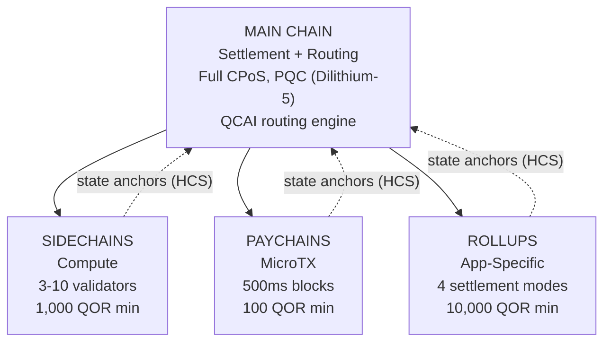

# Multilayer Architecture

QoreChain implements a **4-tier hierarchical chain architecture** through the `x/multilayer` module. The main chain serves as the settlement and trust root, while subsidiary layers (sidechains, paychains, and rollups) handle specialized workloads with different performance and security trade-offs.

---

## System Overview

The 4-tier hierarchy below shows the main chain as the settlement and trust root, with three subsidiary layer types anchoring their state roots back to it via Hierarchical Commitment Schemes (HCS).



```
                    +---------------------------+
                    |       MAIN CHAIN          |
                    |  (Settlement + Routing)   |
                    |  Full CPoS consensus      |
                    |  PQC-secured (Dilithium-5)|
                    |  QCAI routing engine       |
                    +------+------+------+------+
                           |      |      |
              +------------+      |      +------------+
              |                   |                    |
    +---------v--------+ +-------v--------+ +---------v---------+
    |   SIDECHAINS     | |   PAYCHAINS    | |     ROLLUPS       |
    |  (Compute)       | |  (MicroTX)     | |  (App-Specific)   |
    |  3-10 validators | |  500ms blocks  | |  4 settlement     |
    |  1,000 QOR min   | |  100 QOR min   | |    modes          |
    |  Max: 10         | |  Max: 50       | |  10,000 QOR min   |
    +------------------+ +----------------+ |  Max: 100         |
                                            +-------------------+
```

---

## Layer Types

### Main Chain

The main chain is the trust root for the entire QoreChain ecosystem.

| Property   | Value                                                                          |
| ---------- | ------------------------------------------------------------------------------ |
| Consensus  | Full Triple-Pool CPoS (see [Consensus Mechanism](/architecture/consensus-mechanism)) |
| Security   | PQC-secured with Dilithium-5 signatures                                        |
| Role       | Settlement layer, state anchor storage, QCAI routing engine, trust root        |
| Block time | \~5 seconds                                                                    |

All subsidiary layers periodically anchor their state roots to the main chain via Hierarchical Commitment Schemes (HCS).

### Sidechains

Sidechains handle **compute-intensive operations** such as DeFi protocols, gaming engines, and IoT data processing.

| Parameter                 | Value             |
| ------------------------- | ----------------- |
| Minimum validators        | 3                 |
| Maximum validators        | 10                |
| Minimum creator stake     | 1,000 QOR         |
| Maximum active sidechains | 10                |
| Target domains            | DeFi, Gaming, IoT |

### Paychains

Paychains are optimized for **high-frequency microtransactions** with minimal latency.

| Parameter                | Value                                   |
| ------------------------ | --------------------------------------- |
| Target block time        | 500 ms                                  |
| Maximum active paychains | 50                                      |
| Minimum creator stake    | 100 QOR                                 |
| Target domains           | Payments, streaming, micro-transactions |

### Rollups

Rollups are **application-specific chains** deployed via the Rollup Development Kit (`x/rdk`). They register as a rollup layer type within the multilayer module.

| Parameter              | Value                                       |
| ---------------------- | ------------------------------------------- |
| Settlement modes       | 4 (optimistic, zk, based, sovereign)        |
| Maximum active rollups | 100                                         |
| Minimum creator stake  | 10,000 QOR                                  |
| Layer type             | `rollup`                                    |
| Target domains         | DeFi, Gaming, NFT, Enterprise               |

Rollup deployment and configuration is covered in detail in the [Rollup Development Kit](/architecture/rollup-development-kit).

---

## QCAI Transaction Routing

The QCAI router evaluates all active layers for each incoming transaction and selects the optimal destination using a 4-factor weighted scoring model.

### Scoring Formula

Each candidate layer receives a composite score (higher is better):

```
Score = w_congestion * (1 - Congestion) + w_capability * Capability + w_cost * (1 - Cost) + w_latency * (1 - Latency)
```

| Factor     | Weight | Description                                                                 |
| ---------- | ------ | --------------------------------------------------------------------------- |
| Congestion | 0.30   | Current load level (inverted: lower congestion = higher score)              |
| Capability | 0.40   | How well the layer matches the transaction requirements                     |
| Cost       | 0.20   | Fee multiplier relative to main chain (inverted: lower cost = higher score) |
| Latency    | 0.10   | Expected time to finality (inverted: lower latency = higher score)          |

### Confidence Threshold

The router requires a minimum confidence score of **0.6** before routing a transaction to a subsidiary layer. If no layer meets this threshold, the transaction defaults to the main chain.

A preferred layer hint can be supplied by the transaction sender. If the preferred layer scores at least 80% of the confidence threshold (i.e., 0.48), it is accepted as the routing target.

### Payload Heuristics

When detailed transaction metadata is unavailable, the router uses payload size as a classification signal:

| Payload Size      | Preferred Layer | Rationale                                    |
| ----------------- | --------------- | -------------------------------------------- |
| &lt; 256 bytes    | Paychain        | Likely a simple transfer or microtransaction |
| 256 - 1,024 bytes | Main Chain      | Standard transaction complexity              |
| > 1,024 bytes     | Sidechain       | Likely a complex contract interaction        |

---

## Hierarchical Commitment Schemes (HCS)

Subsidiary layers periodically commit their state to the main chain via **state anchors**. Each anchor contains a cryptographic proof of the subsidiary chain's state at a given height.

### Anchor Contents

| Field                     | Description                                          |
| ------------------------- | ---------------------------------------------------- |
| `layer_id`                | Identifier of the subsidiary layer                   |
| `layer_height`            | Block height on the subsidiary chain                 |
| `state_root`              | Merkle root of the subsidiary chain's state tree     |
| `validator_set_hash`      | Hash of the validator set that signed the commitment |
| `pqc_aggregate_signature` | Dilithium-5 aggregate signature over the anchor data |
| `transaction_count`       | Number of transactions since the last anchor         |
| `compressed_state_proof`  | Compressed state transition proof                    |

### Anchor Submission

Anchors are submitted to the main chain via `MsgAnchorState`. The keeper validates the anchor according to the following steps:

1. **Layer exists and is active** — The keeper verifies that the layer exists in state and currently has `active` status.
2. **Minimum anchor interval elapsed** — The keeper checks that at least `min_anchor_interval` blocks (default: 100) have elapsed since the last anchor for this layer.
3. **PQC aggregate signature** — The keeper ensures the PQC aggregate signature is present and valid for the anchor data.

### Challenge Period

Each anchor enters a **challenge period** of **24 hours** (86,400 seconds, configurable per layer). During this period, any party can dispute the anchor by submitting a fraud proof via `MsgChallengeAnchor`. If the fraud proof is valid, the anchor is invalidated and the subsidiary chain's state is rolled back to the previous anchor.

After the challenge period expires without a successful dispute, the anchor is considered finalized.

### Reading Anchors

As of chain version **v3.1.80**, anchors are also **readable** through the multilayer query service. Two queries expose anchor state over both gRPC and REST:

* **`Anchor`** (`/qorechain/multilayer/v1/anchor/{layer_id}`) — returns the latest finalized state anchor for a layer.
* **`Anchors`** (`/qorechain/multilayer/v1/anchors/{layer_id}`) — returns the anchor history for a layer.

Because each anchor carries a Dilithium-5 signature over the canonical message `layer_id || layer_height || state_root || validator_set_hash` (verified against the layer creator's registered PQC key), a client can fetch an anchor and verify it **offline**, without trusting the serving node. This is the on-chain primitive behind the Rollup Development Kit's [quantum-safe settlement receipts](/rollups/settlement-receipts).

---

## Cross-Layer Fee Bundling (CLFB)

CLFB allows a single fee payment on the source layer to cover execution across multiple layers in a cross-layer transaction path.

### Fee Calculation

```
avgMultiplier = sum(layer_multiplier_i) / num_layers
bundledFee = (totalGas / 1000) * avgMultiplier
```

Where:

* `layer_multiplier_i` is the base fee multiplier for each layer in the transaction path (main chain = 1.0).
* `totalGas` is the estimated total gas consumption across all layers.
* The result is denominated in **uqor** with a minimum fee of 1 uqor.

### Example

A cross-layer transaction touches three layers: main chain (multiplier 1.0), a sidechain (multiplier 0.5), and a paychain (multiplier 0.1).

```
avgMultiplier = (1.0 + 0.5 + 0.1) / 3 = 0.533
bundledFee = (150,000 / 1000) * 0.533 = 80 uqor
```

CLFB can be enabled or disabled globally via the `cross_layer_fee_bundling` parameter, and individual layers can opt out via their `cross_layer_fee_bundling_enabled` configuration flag.

---

## Layer Lifecycle

Each subsidiary layer progresses through a well-defined lifecycle:

```
Proposed --> Active --> Suspended --> Decommissioned
                  \                /
                   +-- Active <--+
```

| Status             | Description                                                                     | Allowed Transitions       |
| ------------------ | ------------------------------------------------------------------------------- | ------------------------- |
| **Proposed**       | Layer has been registered but not yet activated                                 | Active, Decommissioned    |
| **Active**         | Layer is operational and accepting transactions                                 | Suspended, Decommissioned |
| **Suspended**      | Layer is temporarily paused (e.g., for maintenance or due to security concerns) | Active, Decommissioned    |
| **Decommissioned** | Layer is permanently shut down (terminal state)                                 | None                      |

Status transitions are enforced by the keeper. Invalid transitions (e.g., Decommissioned to Active) are rejected.

---

## Parameters

| Parameter                      | Type   | Default         | Description                                             |
| ------------------------------ | ------ | --------------- | ------------------------------------------------------- |
| `max_sidechains`               | uint64 | `10`            | Maximum number of active sidechains                     |
| `max_paychains`                | uint64 | `50`            | Maximum number of active paychains                      |
| `min_anchor_interval`          | uint64 | `100`           | Minimum blocks between state anchors                    |
| `max_anchor_interval`          | uint64 | `1,000`         | Maximum blocks between state anchors (forced anchor)    |
| `default_challenge_period`     | uint64 | `86,400`        | Default challenge period in seconds (24 hours)          |
| `min_sidechain_stake`          | string | `1,000,000,000` | Minimum stake to create a sidechain (1,000 QOR in uqor) |
| `min_paychain_stake`           | string | `100,000,000`   | Minimum stake to create a paychain (100 QOR in uqor)    |
| `routing_enabled`              | bool   | `true`          | Enable QCAI-based transaction routing                   |
| `routing_confidence_threshold` | string | `0.6`           | Minimum confidence for QCAI routing decisions           |
| `cross_layer_fee_bundling`     | bool   | `true`          | Enable global Cross-Layer Fee Bundling                  |
