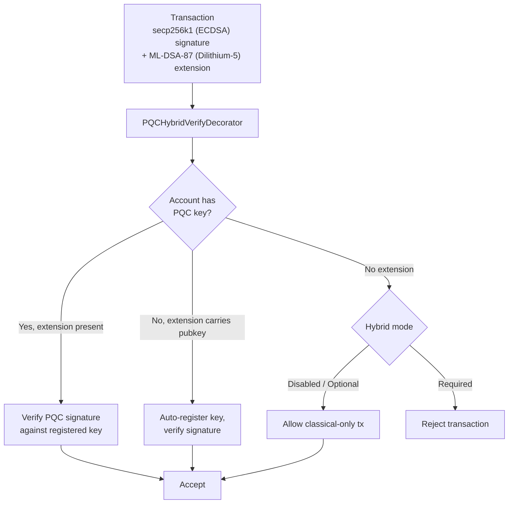

# Post-Quantum Security

QoreChain is built with **post-quantum cryptography (PQC) at genesis** — not retrofitted as an upgrade. The `x/pqc` module provides lattice-based digital signatures and key encapsulation as the primary cryptographic primitives, with a governance-controlled algorithm agility framework for long-term resilience.

## Design Principles

* **PQC-first**: Post-quantum signatures are the primary authentication scheme. Classical ECDSA is available as an optional fallback, not the default.
* **Hybrid mode**: Transactions can carry both classical and PQC signatures simultaneously, enabling a gradual migration path.
* **Algorithm agility**: The cryptographic algorithm registry is governance-controlled, allowing the network to adopt new algorithms or deprecate compromised ones without hard forks.
* **Deterministic verification**: All signature verification is deterministic and reproducible across validator nodes.

## Supported Algorithms

| Algorithm       | Standard             | Category          | NIST Level | Public Key  | Private Key | Signature / Ciphertext | Shared Secret |
| --------------- | -------------------- | ----------------- | ---------- | ----------- | ----------- | ---------------------- | ------------- |
| **Dilithium-5** | ML-DSA-87 (FIPS 204) | Signature         | 5          | 2,592 bytes | 4,896 bytes | 4,627 bytes            | --            |
| **ML-KEM-1024** | FIPS 203             | Key Encapsulation | 5          | 1,568 bytes | 3,168 bytes | 1,568 bytes            | 32 bytes      |

Both algorithms operate at **NIST Security Level 5**, the highest standardized security category, providing protection equivalent to AES-256 against both classical and quantum adversaries.

## Cryptographic Backend

PQC operations are implemented in a high-performance, memory-safe cryptographic backend that exposes lattice-based signing, verification, and key encapsulation to the QoreChain runtime. The backend provides:

Algorithm-specific operations:

* Dilithium-5 key generation, signing, and verification
* ML-KEM-1024 key generation, encapsulation, and decapsulation
* Deterministic random beacon generation (`seed`, `epoch`)

Algorithm-aware operations:

* `Keygen(algorithmID)` — Generate a keypair for any registered algorithm
* `Sign(algorithmID, privkey, message)` — Create a signature
* `Verify(algorithmID, pubkey, message, signature)` — Verify a signature
* `AlgorithmInfo(algorithmID)` — Query key/output sizes
* `ListAlgorithms()` — Enumerate all supported algorithms

All signing and verification operations are deterministic and produce identical results across every validator node and supported platform.

## Key Registration

Accounts register PQC keys via `MsgRegisterPQCKey` (legacy, defaults to Dilithium-5) or `MsgRegisterPQCKeyV2` (algorithm-aware). Each message includes:

* **Sender**: The account address registering the key.
* **PublicKey**: The PQC public key bytes.
* **AlgorithmID**: The PQC algorithm identifier (v2 only).
* **KeyType**: One of three registration modes:

| Key Type         | Description                                                              |
| ---------------- | ------------------------------------------------------------------------ |
| `hybrid`         | Both classical (ECDSA) and PQC keys. Transactions carry dual signatures. |
| `pqc_only`       | PQC key only. Classical signature is not required.                       |
| `classical_only` | Classical key only. No PQC protection (not recommended).                 |

## Hybrid Signatures

The hybrid signature system allows transactions to carry **both** a classical signature and a PQC signature simultaneously. This provides defense-in-depth: even if one scheme is broken, the other protects the transaction.

*A transaction signed with secp256k1 (ECDSA) plus ML-DSA-87 (Dilithium-5), verified by the ante handler under the chain-wide enforcement mode.*



### TX Extension Format

PQC signatures are attached to transactions as a **TX extension** with type URL `/qorechain.pqc.v1.PQCHybridSignature`:

```text
{
  "algorithm_id": 1,
  "pqc_signature": "<4627 bytes for Dilithium-5>",
  "pqc_public_key": "<2592 bytes, optional>"
}
```

The `pqc_public_key` field is optional. If present and the account has no registered PQC key, the ante handler will **auto-register** the key on first use.

### PQCHybridVerifyDecorator

The `PQCHybridVerifyDecorator` ante handler processes hybrid signatures with three-way verification logic:

| Scenario | Account Has PQC Key | Extension Present | Public Key in Extension | Result                                              |
| -------- | ------------------- | ----------------- | ----------------------- | --------------------------------------------------- |
| Path 1   | Yes                 | Yes               | --                      | Verify PQC signature against registered key         |
| Path 2   | No                  | Yes               | Yes                     | Auto-register key, verify signature                 |
| Path 3a  | No                  | No                | --                      | **Optional mode**: Allow classical-only transaction |
| Path 3b  | No                  | No                | --                      | **Required mode**: Reject transaction               |
| Path 4   | Yes                 | No                | --                      | Handled by the standard PQCVerifyDecorator          |

### Hybrid Signature Modes

The chain-wide hybrid enforcement level is governance-configurable:

| Mode         | ID | Default | Behavior                                                                                                          |
| ------------ | -- | ------- | ----------------------------------------------------------------------------------------------------------------- |
| **Disabled** | 0  | No      | Classical signatures only. PQC extensions are ignored.                                                            |
| **Optional** | 1  | Yes     | PQC extensions are verified if present. Accounts without PQC keys may transact with classical signatures only.    |
| **Required** | 2  | No      | All transactions must carry both classical and PQC signatures. Transactions without a PQC extension are rejected. |

The recommended migration path is: **Optional** (default at genesis) → **Required** (via governance proposal when PQC wallet adoption reaches sufficient levels).

## Algorithm Agility Framework

The algorithm agility framework provides a governance-controlled registry for PQC algorithms, enabling the network to add new algorithms, deprecate vulnerable ones, and migrate accounts — all without hard forks.

### Algorithm Lifecycle

Each registered algorithm has a lifecycle status:

```
active --> migrating --> deprecated --> disabled
```

| Status         | Description                                                                                                                                 |
| -------------- | ------------------------------------------------------------------------------------------------------------------------------------------- |
| **Active**     | Fully operational. New key registrations and verifications are accepted.                                                                    |
| **Migrating**  | Dual-signature period is active. Accounts are encouraged to migrate to the replacement algorithm. Both old and new signatures are accepted. |
| **Deprecated** | Existing signatures can still be verified, but no new key registrations are accepted.                                                       |
| **Disabled**   | Emergency kill switch. The algorithm cannot verify any signatures. Used when a vulnerability is discovered.                                 |

### Dual-Signature Migration

When an algorithm is deprecated, a **migration period** begins (default: 1,000,000 blocks, approximately 69 days at 6s/block). During this period:

1. Accounts with keys using the deprecated algorithm must migrate to the replacement.
2. Migration requires dual signatures (`MsgMigratePQCKey`): one from the old key and one from the new key, proving ownership of both.
3. Both algorithms are accepted for verification throughout the migration period.

### Governance Messages

| Message                 | Description                                                                                                                                                       |
| ----------------------- | ----------------------------------------------------------------------------------------------------------------------------------------------------------------- |
| `MsgAddAlgorithm`       | Proposes adding a new PQC algorithm to the registry. Includes full `AlgorithmInfo` (name, category, NIST level, key sizes). Must be submitted through governance. |
| `MsgDeprecateAlgorithm` | Begins the deprecation process for an algorithm. Specifies the replacement algorithm and migration period in blocks.                                              |
| `MsgDisableAlgorithm`   | Emergency-disables an algorithm immediately. Requires a reason string. Used when a cryptographic vulnerability is discovered.                                     |

### Extensibility

Adding a new algorithm requires:

1. Implementing the algorithm in the cryptographic backend behind the unified signing and verification interface.
2. Submitting a `MsgAddAlgorithm` governance proposal with the algorithm metadata.
3. Once approved, the algorithm becomes available for key registration and verification.

## SHAKE-256 Foundation

QoreChain uses **SHAKE-256** (SHA-3 extendable-output function) as its quantum-resistant hash primitive. The `x/pqc` module provides pure-Go SHAKE-256 utilities:

| Function                           | Description                       | Output           |
| ---------------------------------- | --------------------------------- | ---------------- |
| `SHAKE256Hash(data, outputLen)`    | Variable-length SHAKE-256 digest  | Arbitrary length |
| `SHAKE256Hash32(data)`             | Standard 256-bit SHAKE-256 digest | 32 bytes         |
| `SHAKE256ConcatHash(left, right)`  | Hash of concatenated inputs       | 32 bytes         |
| `SHAKE256DomainHash(domain, data)` | Domain-separated hash             | 32 bytes         |

These utilities serve as the foundation for:

* Merkle tree node hashing (preparatory for future quantum-safe state tree replacement)
* Hash commitments in cross-layer attestations
* Domain separation for different hash contexts (e.g., `"leaf:"` vs `"node:"`)

## Bridge PQC

All cross-chain bridge attestations and state commitments use **Dilithium-5** signatures. The `x/multilayer` module requires PQC aggregate signatures on every `MsgAnchorState` submission, and ML-KEM commitments secure key exchange channels between bridge relayers.

This ensures that cross-chain security is not degraded by the use of classical cryptography in bridge infrastructure, maintaining quantum resistance across the entire protocol stack.

## Module Parameters

| Parameter                  | Type                | Default           | Description                                           |
| -------------------------- | ------------------- | ----------------- | ----------------------------------------------------- |
| `pqc_primary`              | bool                | `true`            | PQC is the primary signature scheme                   |
| `allow_classical_fallback` | bool                | `true`            | Allow ECDSA fallback for accounts without PQC keys    |
| `min_security_level`       | int32               | `5`               | Minimum NIST security level for accepted algorithms   |
| `default_migration_blocks` | int64               | `1,000,000`       | Default dual-signature migration period in blocks     |
| `default_signature_algo`   | AlgorithmID         | `1` (Dilithium-5) | Default signature algorithm for new key registrations |
| `hybrid_signature_mode`    | HybridSignatureMode | `1` (Optional)    | Chain-wide hybrid signature enforcement level         |
