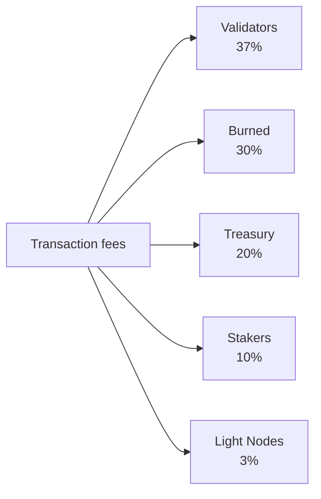

# Tokenomics

QoreChain uses a **fixed-supply** economic model centered on the native **QOR** token. Rather than inflating the supply over time, the network funds staking rewards from a finite, pre-allocated emission budget while a multi-channel burn engine applies sustained deflationary pressure as network usage grows.

---

## Token Basics

| Property              | Value                                                    |
| --------------------- | -------------------------------------------------------- |
| **Display token**     | QOR                                                      |
| **Base denomination** | uqor                                                     |
| **Decimal precision** | 10^6 (1 QOR = 1,000,000 uqor)                            |
| **Total supply**      | 4,500,000,000 QOR (fixed)                                |
| **Chain ID**          | `qorechain-vladi` (mainnet, EVM chain ID 9801)          |
| **Bech32 prefix**     | `qor` (accounts: `qor1...`, validators: `qorvaloper...`) |

:::note
The figures on this page describe the **mainnet** (`qorechain-vladi`, EVM chain ID **9801**), live since 7 June 2026 on chain version **v3.1.77**. The **`qorechain-diana`** testnet (EVM chain ID **9800**) shares the same economic model.
:::

---

## Supply and Emission Model

QoreChain has a **fixed total supply of 4,500,000,000 QOR**. New QOR is never minted to inflate the supply. Instead:

* **80,000,000 QOR (1.78% of supply)** was burned at the Token Generation Event (TGE).
* Staking rewards are paid from a **finite emission budget of 590,000,000 QOR**, drawn down over time on a declining schedule.

This is a **fixed-supply model with a finite emission budget**, not an inflation-of-supply model. Once the emission budget is exhausted, no further reward emission occurs beyond what governance allocates from the remaining budget.

### Staking Reward Schedule {#staking-reward-schedule}

Staking rewards are distributed from the 590,000,000 QOR emission budget on a declining schedule:

| Period      | Target APY              | Emission Budget                  |
| ----------- | ----------------------- | -------------------------------- |
| Year 1      | 8–12% APY               | 127,500,000 QOR                  |
| Year 2      | 6–10% APY               | 106,250,000 QOR                  |
| Years 3–4   | 5–8% APY                | 85,000,000 QOR per year          |
| Year 5+     | Governance-determined   | ~186,000,000 QOR remaining       |

APY ranges are targets that depend on the bonded ratio; the emission budget figures are the hard caps on QOR released to stakers in each period. From Year 5 onward, the remaining ~186,000,000 QOR is released at a rate set by governance.

---

## x/burn — Multi-Channel Burn Engine

The `x/burn` module implements a 10-channel token burn system. Every burned token is permanently removed from circulating supply, creating sustained deflationary pressure as network usage grows.

### Burn Channels

| #  | Channel            | Source                     | Description                                   |
| -- | ------------------ | -------------------------- | --------------------------------------------- |
| 1  | `gas_fee`          | Transaction fees           | 30% of all gas fees are burned                |
| 2  | `contract_create`  | Smart contract deployment  | Flat 100 QOR fee burned per contract creation |
| 3  | `ai_service`       | AI module usage fees       | 50% of AI service fees burned                 |
| 4  | `bridge_fee`       | Cross-chain bridge fees    | 100% of bridge fees burned                    |
| 5  | `treasury_buyback` | Treasury operations        | Periodic buyback-and-burn from treasury       |
| 6  | `failed_tx`        | Failed transaction gas     | 10% of gas from failed transactions burned    |
| 7  | `xqore_penalty`    | xQORE early exit penalties | Penalty amounts routed through burn           |
| 8  | `auto_buyback`     | Automated buyback program  | Protocol-level automated burns                |
| 9  | `tge`              | Token generation event     | One-time genesis burns (80,000,000 QOR)       |
| 10 | `rollup_create`    | Rollup deployment          | 1% of rollup creation stake burned            |

### Fee Distribution

All transaction fees collected by the network are split across five destinations, as shown below. The shares are enforced on-chain and always sum to exactly 100%.



All transaction fees collected by the network are split across five destinations:

| Recipient       | Share | Description                                                          |
| --------------- | ----- | -------------------------------------------------------------------- |
| **Validators**  | 37%   | Distributed to the active validator set proportional to stake        |
| **Burned**      | 30%   | Permanently removed from supply via the `gas_fee` burn channel       |
| **Treasury**    | 20%   | Allocated to the community treasury for governance-directed spending |
| **Stakers**     | 10%   | Distributed to all QOR stakers proportional to delegation            |
| **Light Nodes** | 3%    | Distributed to light nodes for serving network data                  |

The shares are enforced on-chain and must always sum to exactly 100%.

### Burn Parameters

| Parameter              | Default                    | Description                              |
| ---------------------- | -------------------------- | ---------------------------------------- |
| `gas_burn_rate`        | 0.30                       | Fraction of gas fees burned (30%)        |
| `contract_create_fee`  | 100,000,000 uqor (100 QOR) | Flat burn fee for contract creation      |
| `ai_service_burn_rate` | 0.50                       | Fraction of AI service fees burned (50%) |
| `bridge_burn_rate`     | 1.00                       | Fraction of bridge fees burned (100%)    |
| `failed_tx_burn_rate`  | 0.10                       | Fraction of failed TX gas burned (10%)   |

Each burn event is recorded on-chain with its source, amount, block height, and associated transaction hash. Aggregate statistics are queryable per channel and in total.

---

## x/xqore — Locked Staking and Governance Amplification

The `x/xqore` module introduces **xQORE**, a non-transferable locked-staking derivative. Users lock QOR to mint xQORE at a 1:1 ratio. xQORE holders receive amplified governance power and a share of redistributed exit penalties.

### Lock Mechanism

* **Lock**: Send QOR to the xQORE module to mint xQORE at a 1:1 ratio.
* **Governance weight**: xQORE holders receive **2x governance voting power** compared to standard QOR stakers.
* **Non-transferable**: xQORE cannot be sent between accounts. It is bound to the locking address.

### Exit Penalty Schedule

Early withdrawal from xQORE incurs a penalty that decreases with lock duration:

| Lock Duration  | Penalty Rate | Description                                |
| -------------- | ------------ | ------------------------------------------ |
| &lt; 30 days   | **50%**      | Half of locked QOR is forfeited            |
| 30 -- 90 days  | **35%**      | Significant penalty for short-term locks   |
| 90 -- 180 days | **15%**      | Reduced penalty for medium-term commitment |
| > 180 days     | **0%**       | Full withdrawal with no penalty            |

### PvP Rebase Redistribution

Penalties collected from early exits are not simply destroyed. Instead, they follow a PvP (player-versus-player) rebase model:

1. **50%** of penalty amounts are burned (routed through `x/burn` via the `xqore_penalty` channel).
2. **50%** are redistributed pro-rata to all remaining xQORE holders.

This creates a positive-sum dynamic for long-term holders: every early exit increases the effective value of remaining xQORE positions. Rebases occur every **100 blocks**.

### xQORE Parameters

| Parameter               | Default                | Description                               |
| ----------------------- | ---------------------- | ----------------------------------------- |
| `governance_multiplier` | 2.0                    | Voting power multiplier for xQORE holders |
| `min_lock_amount`       | 1,000,000 uqor (1 QOR) | Minimum QOR required to lock              |
| `penalty_burn_rate`     | 0.50                   | Fraction of exit penalties burned (50%)   |
| `rebase_interval`       | 100 blocks             | Blocks between PvP rebase events          |
| `enabled`               | true                   | Module activation flag                    |

---

## x/inflation — Emission Budget Schedule

Despite its module name, the `x/inflation` module does **not** inflate the total supply. It governs the release of staking rewards from the finite **590,000,000 QOR** emission budget according to the declining [staking reward schedule](#staking-reward-schedule). Emissions are computed per epoch and distributed to stakers and validators, drawing down the pre-allocated budget rather than minting new supply.

### Epoch Mechanics

* **Epoch length**: 17,280 blocks (\~1 day at 5-second block times)
* **Blocks per year**: \~6,311,520
* At the start of each epoch, the scheduled emission for the current period is released from the emission budget and distributed to stakers and validators.
* The epoch tracker records the current epoch number, current year, starting block, cumulative QOR released from the emission budget, and the remaining budget.

### Inflation Parameters

| Parameter      | Default          | Description                                                |
| -------------- | ---------------- | ---------------------------------------------------------- |
| `schedule`     | declining        | Period-indexed emission budget (see staking reward schedule) |
| `epoch_length` | 17,280 blocks    | Blocks per emission epoch                                  |
| `enabled`      | true             | Module activation flag                                     |

---

## Deflationary Dynamics

Because the supply is fixed and emission is drawn from a finite budget, QoreChain's net token dynamics trend deflationary as adoption grows:

```
Years 1-2:  Larger scheduled emissions from the budget offset burns → near-neutral supply
Years 3-4:  Scheduled emissions decline; burn volume grows with usage → convergence
Year 5+:    Emission budget is largely drawn down; burn channels (gas, bridge,
            contracts, rollups) scale with transaction volume → net deflationary
```

The 10 burn channels ensure that every major network activity removes tokens from supply. As transaction volume, bridge usage, AI service calls, and rollup deployments increase, cumulative burns accelerate while scheduled emissions decline toward the end of the finite budget.

---

## Module Lifecycle Order

The economic modules execute in a specific order during each block's `EndBlocker`:

```
x/burn → x/xqore → x/inflation → x/rlconsensus
```

1. **x/burn** — Processes pending burn records and updates aggregate statistics.
2. **x/xqore** — Executes PvP rebases (every `rebase_interval` blocks) and routes penalties to burn.
3. **x/inflation** — Releases scheduled staking-reward emissions from the budget at epoch boundaries.
4. **x/rlconsensus** — Adjusts consensus parameters based on PRISM reinforcement-learning signals.

This ordering ensures that burns are finalized before rebases, and rebases complete before scheduled emissions are released, maintaining consistent economic state transitions.

## Related

* [Chain Parameters](/appendix/chain-parameters) — canonical economic and consensus defaults.
* [Staking and Delegation](/user-guide/staking-and-delegation) — delegate QOR and earn rewards.
* [xQORE Staking](/user-guide/xqore-staking) — the PvP rebase staking mechanism.
* [Light Node Rewards](/light-node/rewards-and-monitoring) — the light-node reward share.
