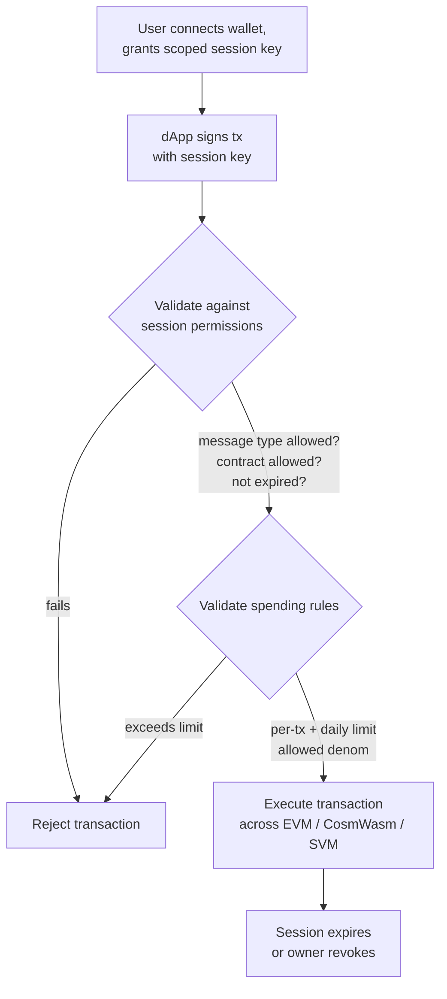

# Account Abstraction

QoreChain provides **protocol-level account abstraction** through the `x/abstractaccount` module. This enables programmable accounts with flexible authentication rules, session keys, spending limits, and social recovery — all without requiring external smart contract infrastructure.

:::note
The commands below use the **`qorechain-vladi`** mainnet, live since 7 June 2026 running chain version **v3.1.82**. Substitute `--chain-id qorechain-diana` for the testnet.
:::

## Overview

Traditional blockchain accounts are controlled by a single private key. Account abstraction decouples the concept of "who can authorize a transaction" from a single cryptographic key, enabling:

* **Multisig accounts** with configurable threshold signing
* **Social recovery accounts** with guardian-based key recovery
* **Session-based accounts** with granular, time-limited permissions for dApps

The `x/abstractaccount` module implements these capabilities at the protocol layer, meaning they work across all three VMs (EVM, CosmWasm, SVM) and benefit from native gas efficiency.

*A session-based dApp flow: a scoped session key signs a transaction, the module validates it against the session and spending rules, then executes.*



## Account Types

| Type              | Description                             | Use Case                       |
| ----------------- | --------------------------------------- | ------------------------------ |
| `multisig`        | M-of-N threshold signing                | DAO treasuries, shared wallets |
| `social_recovery` | Guardian-assisted key recovery          | Consumer wallets, onboarding   |
| `session_based`   | Delegated session keys with constraints | dApp sessions, mobile wallets  |

## Creating an Abstract Account

### Session-Based Account

```bash
qorechaind tx abstractaccount create \
  --account-type session_based \
  --from mykey \
  --gas auto \
  -y
```

### Multisig Account

```bash
qorechaind tx abstractaccount create \
  --account-type multisig \
  --signers qor1alice...,qor1bob...,qor1carol... \
  --threshold 2 \
  --from mykey \
  --gas auto \
  -y
```

### Social Recovery Account

```bash
qorechaind tx abstractaccount create \
  --account-type social_recovery \
  --guardians qor1guardian1...,qor1guardian2...,qor1guardian3... \
  --recovery-threshold 2 \
  --from mykey \
  --gas auto \
  -y
```

## Session Keys

Session keys are the cornerstone of the `session_based` account type. They allow you to grant **temporary, scoped permissions** to a secondary key — perfect for dApp interactions where you do not want to expose your primary key.

### Key Properties

| Property              | Description                                          |
| --------------------- | ---------------------------------------------------- |
| **Permissions**       | Which message types the session key can sign         |
| **Expiry**            | Automatic expiration after a configurable duration   |
| **Spending limits**   | Maximum amounts the session key can spend            |
| **Allowed contracts** | Restrict interactions to specific contract addresses |

### Grant a Session Key

```bash
qorechaind tx abstractaccount grant-session \
  --session-key qor1sessionkey... \
  --permissions "bank/MsgSend,wasm/MsgExecuteContract" \
  --expiry "2026-03-01T00:00:00Z" \
  --allowed-contracts qor1contract1...,0x1234...abcd \
  --from mykey \
  -y
```

### Revoke a Session Key

```bash
qorechaind tx abstractaccount revoke-session \
  --session-key qor1sessionkey... \
  --from mykey \
  -y
```

### List Active Sessions

```bash
qorechaind query abstractaccount sessions <account-address>
```

## Spending Rules

Spending rules add financial guardrails to abstract accounts, regardless of account type:

| Rule             | Description                                     |
| ---------------- | ----------------------------------------------- |
| `daily_limit`    | Maximum total spend per 24-hour rolling window  |
| `per_tx_limit`   | Maximum spend per individual transaction        |
| `allowed_denoms` | Restrict which token denominations can be spent |

### Set Spending Rules

```bash
qorechaind tx abstractaccount update-spending-rules \
  --daily-limit 1000000000uqor \
  --per-tx-limit 100000000uqor \
  --allowed-denoms uqor \
  --from mykey \
  -y
```

### Query Current Rules

```bash
qorechaind query abstractaccount spending-rules <account-address>
```

### Example Response

```json
{
  "daily_limit": {
    "denom": "uqor",
    "amount": "1000000000"
  },
  "per_tx_limit": {
    "denom": "uqor",
    "amount": "100000000"
  },
  "allowed_denoms": ["uqor"],
  "daily_spent": {
    "denom": "uqor",
    "amount": "250000000"
  },
  "window_reset": "2026-02-27T00:00:00Z"
}
```

## Querying Abstract Accounts

### CLI

```bash
# Get full account configuration
qorechaind query abstractaccount account <address>

# List all abstract accounts (paginated)
qorechaind query abstractaccount list --limit 10
```

### JSON-RPC

```bash
curl -X POST http://localhost:8545 \
  -H "Content-Type: application/json" \
  -d '{
    "jsonrpc": "2.0",
    "method": "qor_getAbstractAccount",
    "params": ["0xYourAddress"],
    "id": 1
  }'
```

### Example Account Response

```json
{
  "address": "qor1myaccount...",
  "account_type": "session_based",
  "owner": "qor1owner...",
  "active_sessions": 2,
  "spending_rules": {
    "daily_limit": "1000000000uqor",
    "per_tx_limit": "100000000uqor",
    "allowed_denoms": ["uqor"]
  },
  "created_at_height": 54321
}
```

## Social Recovery Flow

If the account owner loses access to their primary key, guardians can authorize a key rotation.

1. **Owner reports lost key (or a guardian initiates):**

   ```bash
   qorechaind tx abstractaccount initiate-recovery \
     --account <account-address> \
     --new-owner qor1newkey... \
     --from guardian1 \
     -y
   ```

2. **Additional guardians approve** (must meet `recovery_threshold`):

   ```bash
   qorechaind tx abstractaccount approve-recovery \
     --account <account-address> \
     --recovery-id <recovery-id> \
     --from guardian2 \
     -y
   ```

3. **Recovery executes automatically** once the threshold is met. A **time-lock period** (default: 48 hours) gives the original owner a chance to cancel a fraudulent recovery attempt.

## Integration with dApps

Session keys enable seamless dApp experiences:

1. **User connects wallet** and creates a session key scoped to the dApp's contract
2. **dApp uses session key** to submit transactions on behalf of the user
3. **No repeated signing** — the session key handles authorization within its permissions
4. **Session expires** automatically, or the user revokes it at any time

This pattern is especially useful for:

* Mobile wallets where repeated biometric prompts are disruptive
* Gaming dApps that need rapid transaction signing
* DeFi protocols that execute multiple sequential operations

## Next Steps

* [Running a Validator](/developer-guide/running-a-validator) — Set up and operate a validator node
* [EVM Development](/developer-guide/evm-development) — Integrate abstract accounts with Solidity dApps
* [Cross-VM Interoperability](/developer-guide/cross-vm-interoperability) — Cross-VM messaging with abstract accounts
