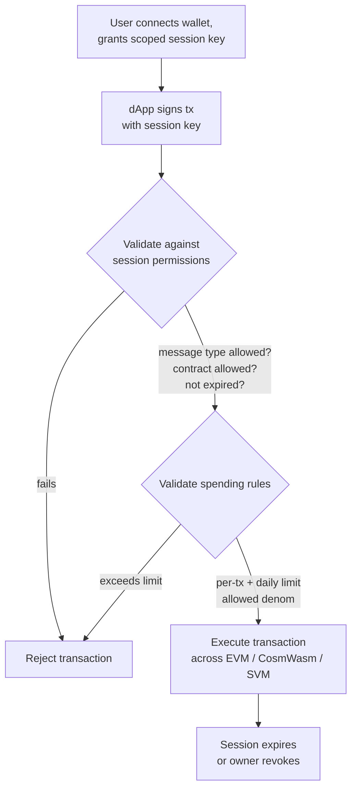

# Account Abstraction

QoreChain provides **protocol-level account abstraction** through the `x/abstractaccount` module. This enables programmable accounts with flexible authentication rules, session keys, spending limits, and social recovery — all without requiring external smart contract infrastructure.

:::note
The commands below use the **`qorechain-vladi`** mainnet, live since 7 June 2026 running chain version **v3.1.92**. Substitute `--chain-id qorechain-diana` for the testnet.
:::

## Overview

Traditional blockchain accounts are controlled by a single private key. Account abstraction decouples the concept of "who can authorize a transaction" from a single cryptographic key, enabling:

* **Multisig accounts** with configurable threshold signing
* **Social recovery accounts** with guardian-based key recovery
* **Session-based accounts** with granular, time-limited permissions for dApps

The `x/abstractaccount` module implements these capabilities at the protocol layer, meaning they work across all three VMs (EVM, CosmWasm, SVM) and benefit from native gas efficiency.

*A session-based dApp flow: a scoped session key signs a transaction, the module validates it against the session and spending rules, then executes.*


```mermaid
flowchart TD
    A["User connects wallet,<br/>grants scoped session key"] --> B["dApp signs tx<br/>with session key"]
    B --> C{"Validate against<br/>session permissions"}
    C -- "message type allowed?<br/>contract allowed?<br/>not expired?" --> D{"Validate spending rules"}
    C -- "fails" --> R["Reject transaction"]
    D -- "per-tx + daily limit<br/>allowed denom" --> E["Execute transaction<br/>across EVM / CosmWasm / SVM"]
    D -- "exceeds limit" --> R
    E --> F["Session expires<br/>or owner revokes"]
```

## Account Types

| Type              | Description                             | Use Case                       |
| ----------------- | --------------------------------------- | ------------------------------ |
| `multisig`        | M-of-N threshold signing                | DAO treasuries, shared wallets |
| `social_recovery` | Guardian-assisted key recovery          | Consumer wallets, onboarding   |
| `session_based`   | Delegated session keys with constraints | dApp sessions, mobile wallets  |

## Creating an Abstract Account

### Session-Based Account

```bash
qorechaind tx abstractaccount create \
  --account-type session_based \
  --from mykey \
  --gas auto \
  -y
```

### Multisig Account

```bash
qorechaind tx abstractaccount create \
  --account-type multisig \
  --signers qor1alice...,qor1bob...,qor1carol... \
  --threshold 2 \
  --from mykey \
  --gas auto \
  -y
```

### Social Recovery Account

```bash
qorechaind tx abstractaccount create \
  --account-type social_recovery \
  --guardians qor1guardian1...,qor1guardian2...,qor1guardian3... \
  --recovery-threshold 2 \
  --from mykey \
  --gas auto \
  -y
```

## Session Keys

Session keys are the cornerstone of the `session_based` account type. They allow you to grant **temporary, scoped permissions** to a secondary key — perfect for dApp interactions where you do not want to expose your primary key.

### Key Properties

| Property              | Description                                          |
| --------------------- | ---------------------------------------------------- |
| **Permissions**       | Which message types the session key can sign         |
| **Expiry**            | Automatic expiration after a configurable duration   |
| **Spending limits**   | Maximum amounts the session key can spend            |
| **Allowed contracts** | Restrict interactions to specific contract addresses |

### Grant a Session Key

```bash
qorechaind tx abstractaccount grant-session \
  --session-key qor1sessionkey... \
  --permissions "bank/MsgSend,wasm/MsgExecuteContract" \
  --expiry "2026-03-01T00:00:00Z" \
  --allowed-contracts qor1contract1...,0x1234...abcd \
  --from mykey \
  -y
```

### Revoke a Session Key

```bash
qorechaind tx abstractaccount revoke-session \
  --session-key qor1sessionkey... \
  --from mykey \
  -y
```

### List Active Sessions

```bash
qorechaind query abstractaccount sessions <account-address>
```

## Spending Rules

Spending rules add financial guardrails to abstract accounts, regardless of account type:

| Rule             | Description                                     |
| ---------------- | ----------------------------------------------- |
| `daily_limit`    | Maximum total spend per 24-hour rolling window  |
| `per_tx_limit`   | Maximum spend per individual transaction        |
| `allowed_denoms` | Restrict which token denominations can be spent |

### Set Spending Rules

```bash
qorechaind tx abstractaccount update-spending-rules \
  --daily-limit 1000000000uqor \
  --per-tx-limit 100000000uqor \
  --allowed-denoms uqor \
  --from mykey \
  -y
```

### Query Current Rules

```bash
qorechaind query abstractaccount spending-rules <account-address>
```

### Example Response

```json
{
  "daily_limit": {
    "denom": "uqor",
    "amount": "1000000000"
  },
  "per_tx_limit": {
    "denom": "uqor",
    "amount": "100000000"
  },
  "allowed_denoms": ["uqor"],
  "daily_spent": {
    "denom": "uqor",
    "amount": "250000000"
  },
  "window_reset": "2026-02-27T00:00:00Z"
}
```

## Linked Wallet Authenticators — Delegated Spending {#authenticators}

As of chain version **v3.1.85** (building on the v3.1.84 permission model), a **linked external wallet key** — a Phantom (ed25519) key or a MetaMask (secp256k1) account — can **spend from the canonical post-quantum account** under least-privilege, spending-limited, revocable terms. The external key never produces an ML-DSA signature; a **relayer** submits and pays for the transaction envelope (the relayer's own hybrid PQC signature satisfies the chain's signing requirements), while the authenticator's signature over **domain-separated, replay-bound sign bytes** is the authorization.

### Register an authenticator {#register-authenticator}

The account owner registers the external key with `MsgRegisterAuthenticator` (an ordinary root-key transaction), giving it a scheme, permissions, an expiry, and optional spending limits:

```js
import { registerEthAuthenticatorMsg } from "@qorechain/wallet-adapter";

// Link a MetaMask account by its 20-byte address (EIP-191 verification):
const msg = registerEthAuthenticatorMsg({
  account: "qor1owner...",            // the canonical account
  ethAddress: "0xAbC...123",          // the MetaMask address to link
  permissions: ["evm"],               // least privilege — see the taxonomy below
  expirySeconds: 30 * 24 * 3600,      // ≤ 30 days recommended
  spendingRule: { perTxLimit: "100000000uqor", dailyLimit: "1000000000uqor" },
});
// Sign & broadcast this msg with the OWNER's normal hybrid-PQC signer.
```

A Phantom key is registered the same way with `scheme: "ed25519"` and the Phantom public key. Revocation is instant via `MsgRevokeAuthenticator`.

### Permission taxonomy {#permission-taxonomy}

Eleven canonical permissions gate what a registered authenticator may do. The map is **fail-closed**: a message type with no mapping is denied.

| Permission | Grants |
| --- | --- |
| `send` | Native-lane bank transfers |
| `delegate` / `withdraw` / `vote` | Staking, reward withdrawal, governance |
| `evm` / `wasm` / `svm` | Execution on the respective VM lane |
| `amm` / `ibc` / `deploy` | AMM operations, IBC transfers, contract deployment |
| `all` | Any *delegable* message |

**Key-management messages are never delegable** — `MsgRegisterAuthenticator`, `MsgRevokeAuthenticator`, PQC key registration/migration, and `MsgRotatePQCKey` always require the root key, so a linked key can never escalate its own privileges.

Read the live taxonomy (with `schema_version` for drift detection) instead of hardcoding it:

```bash
curl -s https://api.qore.host/qorechain/abstractaccount/v1/permission_schema | jq
# or: qorechaind query abstractaccount permission-schema
```

### Spend via a linked key {#execute-messages}

Two messages carry authenticator-authorized actions. In both, the relayer is the transaction's signer/fee-payer; the authenticator's signature travels inside the message.

**`MsgExecuteEVM`** — an EVM call or transfer **from the canonical account's `0x…` address**. The authenticator signs `sha256("qorechain-evm-auth-v1" ‖ chainId ‖ account ‖ pubkey ‖ to ‖ value ‖ data ‖ nonce)` (all fields length-prefixed). Replay protection is the account's own EVM nonce.

**`MsgExecuteCosmos`** — a Native-lane bank send from the canonical account. The authenticator signs `sha256("qorechain-cosmos-auth-v1" ‖ chainId ‖ account ‖ pubkey ‖ to ‖ amount ‖ nonce)`. Replay protection is a **per-authenticator sequence** kept by the module (a bank send does not bump the account nonce). Self-sends are rejected.

:::caution Nonce rules
* `MsgExecuteEVM.nonce` = the account's **current** EVM nonce (`eth_getTransactionCount(account0x, "latest")`). In production the relayer is a *different* account, so do **not** add +1. Signing a stale nonce returns code `11`.
* `MsgExecuteCosmos.nonce` = the per-authenticator sequence (query the account's authenticator state), **not** the account's Cosmos sequence.
:::

**Phantom example** (browser: Phantom signs, your backend relays):

```js
import { buildPhantomExecuteCosmos } from "@qorechain/wallet-adapter";

// In the dApp: Phantom signs the digest with ed25519 signMessage.
const msg = await buildPhantomExecuteCosmos({
  provider: window.solana,            // Phantom
  chainId: "qorechain-vladi",
  account: "qor1owner...",            // canonical account being spent from
  to: "qor1recipient...",
  amount: { denom: "uqor", amount: "900000" },
  nonce: authSequence,                // per-authenticator sequence
});
// Send `msg` to your relayer; the relayer wraps it in a tx it signs
// (hybrid PQC) and broadcasts. The transfer moves the OWNER's funds.
```

**MetaMask example** (EIP-191 `personal_sign` from the linked 20-byte address):

```js
import { buildMetaMaskExecuteEvm } from "@qorechain/wallet-adapter";

const msg = await buildMetaMaskExecuteEvm({
  provider: window.ethereum,          // MetaMask (EIP-1193)
  chainId: "qorechain-vladi",
  account: "qor1owner...",
  to: "0xRecipient...",
  valueWei: 10n ** 16n,               // 0.01 QOR (18-dec EVM view)
  nonce: currentEvmNonce,             // eth_getTransactionCount(owner0x, "latest")
});
// Relay as above. The chain verifies the signature via EIP-191 + ecrecover
// against the registered 20-byte address.
```

The same builders exist in the [QoreChain SDK](/sdk/guides/authenticators) for all five languages, plus CLI equivalents:

```bash
# Produce the exact sign bytes the chain verifies (for custom signers):
qorechaind query abstractaccount auth-sign-cosmos <account> <to> <amount> <nonce>
qorechaind query abstractaccount auth-sign-evm <account> <to> <value> <data-hex> <nonce>

# Relay a pre-signed authorization:
qorechaind tx abstractaccount execute-cosmos <account> <to> <amount> <auth-pubkey> <auth-sig> <nonce> --from relayer -y
qorechaind tx abstractaccount execute-evm    <account> <to> <value> <data-hex> <auth-pubkey> <auth-sig> <nonce> --from relayer -y
```

### Error codes {#authenticator-errors}

Enforcement failures return distinct codes (codespace `abstractaccount`) so wallets can show the right message:

| Code | Meaning | Wallet UX |
| --- | --- | --- |
| `5` | Spending limit exceeded (per-tx or daily) | Show the remaining allowance |
| `6` | Authenticator expired | "Expired — re-link your wallet" |
| `10` | Permission denied (scope or non-delegable msg) | Show the missing permission |
| `11` | Replay rejected (stale nonce/sequence) | Re-query the nonce and re-sign |

(Codespace `pqc` code `21` = hybrid signature verification failed — a relayer-side signing problem, not an authorization one.)

### REST queries {#abstractaccount-rest}

As of **v3.1.85** the module's read queries are also served over REST:

```
GET /qorechain/abstractaccount/v1/config
GET /qorechain/abstractaccount/v1/accounts
GET /qorechain/abstractaccount/v1/accounts/{address}
GET /qorechain/abstractaccount/v1/permission_schema
```

## Querying Abstract Accounts

### CLI

```bash
# Get full account configuration
qorechaind query abstractaccount account <address>

# List all abstract accounts (paginated)
qorechaind query abstractaccount list --limit 10
```

### JSON-RPC

```bash
curl -X POST http://localhost:8545 \
  -H "Content-Type: application/json" \
  -d '{
    "jsonrpc": "2.0",
    "method": "qor_getAbstractAccount",
    "params": ["0xYourAddress"],
    "id": 1
  }'
```

### Example Account Response

```json
{
  "address": "qor1myaccount...",
  "account_type": "session_based",
  "owner": "qor1owner...",
  "active_sessions": 2,
  "spending_rules": {
    "daily_limit": "1000000000uqor",
    "per_tx_limit": "100000000uqor",
    "allowed_denoms": ["uqor"]
  },
  "created_at_height": 54321
}
```

## Social Recovery Flow

If the account owner loses access to their primary key, guardians can authorize a key rotation.

1. **Owner reports lost key (or a guardian initiates):**

   ```bash
   qorechaind tx abstractaccount initiate-recovery \
     --account <account-address> \
     --new-owner qor1newkey... \
     --from guardian1 \
     -y
   ```

2. **Additional guardians approve** (must meet `recovery_threshold`):

   ```bash
   qorechaind tx abstractaccount approve-recovery \
     --account <account-address> \
     --recovery-id <recovery-id> \
     --from guardian2 \
     -y
   ```

3. **Recovery executes automatically** once the threshold is met. A **time-lock period** (default: 48 hours) gives the original owner a chance to cancel a fraudulent recovery attempt.

## Integration with dApps

Session keys enable seamless dApp experiences:

1. **User connects wallet** and creates a session key scoped to the dApp's contract
2. **dApp uses session key** to submit transactions on behalf of the user
3. **No repeated signing** — the session key handles authorization within its permissions
4. **Session expires** automatically, or the user revokes it at any time

This pattern is especially useful for:

* Mobile wallets where repeated biometric prompts are disruptive
* Gaming dApps that need rapid transaction signing
* DeFi protocols that execute multiple sequential operations

## Next Steps

* [Running a Validator](/developer-guide/running-a-validator) — Set up and operate a validator node
* [EVM Development](/developer-guide/evm-development) — Integrate abstract accounts with Solidity dApps
* [Cross-VM Interoperability](/developer-guide/cross-vm-interoperability) — Cross-VM messaging with abstract accounts
