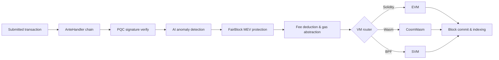

# Architecture Overview

QoreChain is a modular blockchain node composed of three primary processes — the chain node, AI sidecar, and block indexer — backed by a Postgres database and monitored via Prometheus and Grafana. Mainnet (`qorechain-vladi`, EVM chain ID **9801**) has been live since 7 June 2026 on chain version **v3.1.80**, with a parallel testnet (`qorechain-diana`, EVM chain ID **9800**). The chain is built on the Cosmos SDK v0.53. The following diagram shows the high-level component layout.

The transaction lifecycle below summarises how a submitted transaction flows through the node — from the AnteHandler decorator chain (security and fee checks) into VM execution and on-chain settlement:



```
┌────────────────────────────────────────────────────────────────────────────┐
│                            QoreChain Node                                  │
│                                                                            │
│  ┌──────────────────── Virtual Machines ──────────────────────┐           │
│  │  ┌───────┐    ┌──────────┐    ┌───────┐                   │           │
│  │  │  EVM  │    │ CosmWasm │    │  SVM  │                   │           │
│  │  │(Sol.) │◄──►│ (Wasm)   │◄──►│ (BPF) │                   │           │
│  │  └───┬───┘    └────┬─────┘    └───┬───┘                   │           │
│  │      └─────────┬───┘──────────────┘                       │           │
│  │           x/crossvm (bridge)                               │           │
│  └────────────────────────────────────────────────────────────┘           │
│                                                                            │
│  ┌────────────────────── Tokenomics ─────────────────────────┐           │
│  │  ┌──────┐   ┌───────┐   ┌───────────┐                    │           │
│  │  │x/burn│   │x/xqore│   │x/inflation│                    │           │
│  │  │10 ch.│   │lock/  │   │finite     │                    │           │
│  │  │37/30/│   │unlock │   │emission   │                    │           │
│  │  │20/10/│   │PvP    │   │590M       │                    │           │
│  │  │3     │   │       │   │budget     │                    │           │
│  │  └──────┘   └───────┘   └───────────┘                    │           │
│  └────────────────────────────────────────────────────────────┘           │
│                                                                            │
│  ┌──────────── IBC / Bridges ────────────────────────────────┐           │
│  │  ┌──────────┐  ┌──────────┐  ┌───────────┐  ┌──────────┐ │           │
│  │  │x/bridge  │  │x/babylon │  │x/abstract │  │x/gas     │ │           │
│  │  │37 QCB +  │  │BTC re-   │  │ account   │  │abstract. │ │           │
│  │  │8 IBC     │  │staking   │  │session key│  │multi-tok │ │           │
│  │  └────┬─────┘  └────┬─────┘  └───────────┘  └──────────┘ │           │
│  │  QCB Bridge     Babylon IBC   ERC-4337-like   ibc/USDC    │           │
│  │  PQC-signed     BTC finality  social recov.   ibc/ATOM    │           │
│  │  36 ext chains  checkpoint    spending rules  fee convert  │           │
│  │  ┌──────────┐                                              │           │
│  │  │x/fair    │  5-Lane Prioritization: PQC|MEV|AI|Def|Free │           │
│  │  │ block    │  tIBE encrypted mempool framework           │           │
│  │  └──────────┘                                              │           │
│  └────────────────────────────────────────────────────────────┘           │
│                                                                            │
│  ┌──── Rollup Development Kit ───────────────────────────────┐           │
│  │  ┌──────────┐  ┌──────────┐  ┌───────────┐  ┌──────────┐ │           │
│  │  │ x/rdk    │  │Settlement│  │ DA Router │  │ Profiles │ │           │
│  │  │ 4 modes: │  │Optimistic│  │ Native    │  │ defi     │ │           │
│  │  │ opt/zk/  │  │ZK/Based/ │  │ Celestia* │  │ gaming   │ │           │
│  │  │ based/   │  │Sovereign │  │ Both      │  │ nft      │ │           │
│  │  │ sovereign│  │          │  │           │  │ social/  │ │           │
│  │  │          │  │          │  │           │  │ general  │ │           │
│  │  └────┬─────┘  └────┬─────┘  └───────────┘  └──────────┘ │           │
│  │  Bank escrow    Auto-finalize  SHA-256 commit  AI-assisted │           │
│  │  Burn on create EndBlocker     Blob pruning    PRISM sugg. │           │
│  │  → x/multilayer (RegisterSidechain + AnchorState)          │           │
│  └────────────────────────────────────────────────────────────┘           │
│                                                                            │
│  ┌──────────────┐ ┌──────┐ ┌────────────┐ ┌─────┐                       │
│  │x/rlconsensus │ │ x/ai │ │x/reputation│ │x/qca│                       │
│  │  PRISM (RL)  │ │      │ │            │ │     │                       │
│  └──────┬───────┘ └──┬───┘ └────┬──────┘ └──┬──┘                       │
│   PPO MLP         AI Engine   Scoring    CPoS Pools                      │
│   Obs/Action      Fraud Det.  Decay      Bonding                         │
│   Circuit Brk     Fee Opt.    Sigmoid    Slashing                        │
│   Rollup Adv.     TEE/FL                 QDRW Gov                        │
│                                                                            │
│  ┌──────┐ ┌──────────┐                                                   │
│  │x/pqc │ │ x/multi  │                                                   │
│  └──┬───┘ └────┬─────┘                                                   │
│  Dilithium    Layer Router                                                │
│  ML-KEM       Sidechains                                                  │
│  Hybrid Sig   + Rollups                                                   │
│  SHAKE-256                                                                │
│                                                                            │
│  ┌──────┐ ┌───────┐                                                      │
│  │x/svm │ │x/cross│                                                      │
│  └──┬───┘ └───┬───┘                                                      │
│  BPF Exec   CrossVM Msg                                                   │
└────────┬──────┬───────────────────────────────────────┬───────────────────┘
         │      │                                       │
   ┌─────┴─────┐│                              ┌───────┴──────┐
   │libqorepqc ││                              │  Indexer     │
   │(Rust PQC) ││                              │  (Postgres)  │
   └───────────┘│                              └──────────────┘
   ┌───────────┐│  ┌──────────┐
   │libqoresvm ││  │AI Sidecar│
   │(Rust BPF) │└──│ (gRPC)   │
   └───────────┘   └──────────┘
```

## Node Components

QoreChain runs as three cooperating processes, each with its own Go module and binary:

| Component          | Description                                                                                                                                                                                                                                                                                          | Location                  |
| ------------------ | ---------------------------------------------------------------------------------------------------------------------------------------------------------------------------------------------------------------------------------------------------------------------------------------------------- | ------------------------- |
| **qorechain-node** | The core blockchain node. Runs the QoreChain Consensus Engine, executes all custom modules, manages all three VM runtimes, and exposes RPC, REST, gRPC, and JSON-RPC endpoints.                                                                                                                      | `qorechain-core/`         |
| **ai-sidecar**     | A gRPC service that provides advanced AI inference capabilities backed by the QCAI Backend. The sidecar handles inference requests that exceed the on-chain RL agent's scope, such as natural language analysis and complex pattern recognition. Communicates with the node over gRPC on port 50051. | `qorechain-core/sidecar/` |
| **block-indexer**  | A WebSocket listener that subscribes to new blocks and transactions from the node's RPC endpoint, parses events, and writes structured data to a Postgres database for fast querying by explorers and APIs.                                                                                          | `qorechain-core/indexer/` |

## Ports

| Port  | Protocol       | Service                                                                           |
| ----- | -------------- | --------------------------------------------------------------------------------- |
| 26657 | HTTP/WebSocket | QoreChain Consensus Engine RPC (blocks, transactions, consensus state)            |
| 1317  | HTTP           | REST API (query endpoints, transaction broadcast)                                 |
| 9090  | gRPC           | gRPC query and transaction endpoints                                              |
| 8545  | HTTP           | EVM JSON-RPC (`eth_`, `web3_`, `net_`, `txpool_`, `qor_` namespaces)              |
| 8546  | WebSocket      | EVM JSON-RPC (WebSocket subscriptions)                                            |
| 8899  | HTTP           | SVM JSON-RPC (Solana-compatible: `getAccountInfo`, `getBalance`, `getSlot`, etc.) |
| 50051 | gRPC           | AI Sidecar (inference requests from the node)                                     |
| 5432  | TCP            | Postgres (block indexer storage)                                                  |
| 9091  | HTTP           | Prometheus metrics                                                                |
| 3000  | HTTP           | Grafana dashboards                                                                |

## Module Map

QoreChain registers **45+ genesis modules including 20+ custom modules**, grouped by function:

**Security**

* `x/pqc` — Post-quantum cryptography: Dilithium-5, ML-KEM-1024, hybrid secp256k1 (ECDSA) + ML-DSA-87, SHAKE-256, algorithm agility

**AI and Machine Learning**

* `x/ai` — Transaction routing, anomaly detection, fraud detection, fee optimization, TEE attestation, federated learning
* `x/reputation` — Multi-factor validator reputation scoring with temporal decay
* `x/rlconsensus` — On-chain RL agent (PPO MLP), dynamic consensus tuning, circuit breaker, rollup advisory — the PRISM optimization layer

**Consensus**

* `x/qca` — Triple-Pool Composite PoS (RPoS/DPoS/PoS) on the QoreChain Consensus Engine, custom bonding curve, progressive slashing, QDRW governance

**Virtual Machines**

* `x/vm` — VM routing and lifecycle management
* `x/svm` — SVM runtime: BPF deployment/execution, rent collection, Solana-compatible RPC
* `x/crossvm` — Cross-VM communication: EVM-CosmWasm precompile + SVM async events

**Tokenomics and Liquidity**

* `x/burn` — 10 burn channels, EndBlocker fee distribution (37/30/20/10/3 split)
* `x/xqore` — Governance-boosted staking: lock/unlock, graduated exit penalties, PvP rebase
* `x/inflation` — Fixed-supply emission from a finite staking-rewards budget on a multi-year schedule
* `x/amm` — On-chain liquidity / automated market maker

**Bridges and Interoperability**

* `x/bridge` — 37 QCB configs (36 external chains + QoreChain loopback) across every major chain type, PQC-signed attestations, circuit breakers
* `x/babylon` — BTC restaking via Babylon Protocol, epoch checkpoints
* `x/multilayer` — Sidechain/paychain/rollup layer management, state anchoring

**Governance and Licensing Extensions**

* `x/abstractaccount` — Smart accounts: multisig, social recovery, session keys, spending rules
* `x/fairblock` — MEV protection: threshold IBE encrypted mempool framework
* `x/gasabstraction` — Multi-token gas payment: ibc/USDC, ibc/ATOM fee conversion
* `x/license` — Chain licensing

**Rollups**

* `x/rdk` — Rollup Development Kit: 4 settlement modes (optimistic, zk, based, sovereign), preset profiles, native DA, bank escrow

## AnteHandler Chain

Every transaction passes through the following decorator chain before execution. Decorators run in order; any decorator can reject the transaction.

```
SetUpContext
  → CircuitBreaker
    → PQCVerify
      → PQCHybridVerify
        → AIAnomaly
          → FairBlock
            → SVMComputeBudget
              → SVMDeductFee
                → Extension
                  → ValidateBasic
                    → TxTimeout
                      → Memo
                        → MinGasPrice
                          → ConsumeTxSize
                            → GasAbstraction
                              → DeductFee
                                → SetPubKey
                                  → ValidateSigCount
                                    → SigGasConsume
                                      → SigVerify
                                        → IncrementSequence
```

Key decorators run in the following sequence (each decorator runs in order and can reject a transaction):

1. **PQCVerify** — Module `x/pqc`. Verify Dilithium-5 signatures on PQC-flagged transactions.
2. **PQCHybridVerify** — Module `x/pqc`. Verify dual secp256k1 (ECDSA) + ML-DSA-87 hybrid signatures.
3. **AIAnomaly** — Module `x/ai`. Run isolation forest anomaly detection and risk scoring.
4. **FairBlock** — Module `x/fairblock`. Process tIBE encrypted transactions for MEV protection.
5. **SVMComputeBudget** — Module `x/svm`. Validate and allocate compute units for SVM programs.
6. **SVMDeductFee** — Module `x/svm`. Deduct SVM-specific execution fees.
7. **GasAbstraction** — Module `x/gasabstraction`. Convert non-native fee tokens (USDC, ATOM) before deduction.

## Docker Compose Stack

The full development stack runs as a six-service Docker Compose deployment on a shared bridge network (`qorechain-net`):

| Service          | Image                      | Purpose                                             |
| ---------------- | -------------------------- | --------------------------------------------------- |
| `qorechain-node` | `qorechain-core:latest`    | Chain node with all modules, VMs, and RPC endpoints |
| `ai-sidecar`     | `qorechain-sidecar:latest` | AI inference service (gRPC + QCAI Backend)          |
| `block-indexer`  | `qorechain-indexer:latest` | Block/transaction indexer (WebSocket + Postgres)    |
| `postgres`       | `postgres:16-alpine`       | Database for the block indexer                      |
| `prometheus`     | `prom/prometheus:latest`   | Metrics collection and storage                      |
| `grafana`        | `grafana/grafana:latest`   | Monitoring dashboards and alerting                  |

Start the full stack:

```bash
docker compose up -d
```

All persistent data is stored in named Docker volumes: `node-data`, `postgres-data`, `prometheus-data`, and `grafana-data`.

## Related

* [Multilayer Architecture](/architecture/multilayer-architecture) — sidechain registration and state anchoring.
* [Consensus Mechanism](/architecture/consensus-mechanism) — block production, finality, and slashing.
* [PRISM Consensus Engine](/architecture/prism-consensus-engine) — AI-driven parameter optimization.
* [Post-Quantum Security](/architecture/post-quantum-security) — Dilithium-5 signatures across the stack.
