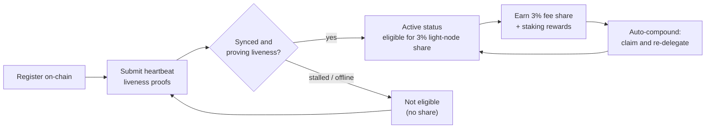

# Rewards and Monitoring

A light node both **earns rewards** and **needs to stay healthy** to keep earning them. This page covers the 3% light-node reward share, how delegated staking and auto-compounding work, and how to monitor the node.

## The 3% block-reward share

QoreChain's fee distribution reserves a fixed **3% share for light nodes** that serve network data. This is one of the five destinations in the protocol's reward split — validators (37%), burned (30%), treasury (20%), stakers (10%), and **light nodes (3%)** — enforced on-chain. See [Tokenomics](/architecture/tokenomics) for the full breakdown.

To be eligible for this share, a node must be **registered on-chain and actively proving liveness** via heartbeat proofs. A node that is registered but offline does not earn the share. See [Registration and Licensing](/light-node/registration-and-licensing) for how registration and heartbeats work.

*Reward eligibility: register on-chain, prove liveness via heartbeats to reach active status, earn the 3% share, then auto-compound it into stake.*



## How rewards work

Beyond the light-node share, the node manages delegated stake and the staking rewards it produces. The behaviour is driven by the `[delegation]` section of `config.toml`.

### Delegated staking with multi-validator split

You can delegate across **multiple validators** rather than concentrating stake on one. The node tracks each delegation and the share of stake assigned to each validator using configurable **split weights**, so you can spread risk across the set.

### Auto-compound rewards

The node can **claim rewards and re-delegate them automatically** on a configurable interval. By default auto-compound is enabled on a `1h` interval, with a minimum reward threshold (in `uqor`) that must accumulate before a claim is triggered. Compounding turns earned rewards into additional stake without manual intervention.

### Reputation-aware rebalancing

When rebalancing is enabled, the node can **shift delegation toward higher-reputation validators** automatically, subject to a configurable minimum reputation score. This keeps stake working with validators that are performing well rather than leaving it with ones that have degraded.

### Inspecting rewards and delegations

The SX edition exposes commands to inspect this state:

```bash
lightnode-sx delegation   # current delegations and their split
lightnode-sx rewards      # pending staking rewards (uqor)
lightnode-sx validators   # the bonded validator set
```

In the UX edition, the **Delegation** view shows the same delegation and reward information in the browser.

## Monitoring

Keeping the node healthy is what keeps it eligible for rewards. There are three things worth watching.

### Telemetry

Real-time telemetry covers validators, consensus/network, the bridge, and tokenomics, each refreshed on its own interval (configured under `[telemetry]` in `config.toml`). From the CLI:

```bash
lightnode-sx status    # node and light-client sync status
lightnode-sx network   # recent synced headers and latest height
```

The UX edition surfaces the same data live across its **Overview**, **Network**, **Bridge**, and **Tokenomics** views — see [UX Edition](/light-node/ux-edition).

### Sync and heartbeat health

The `status` command reports the chain ID, latest block height, whether the chain is catching up, and the light client's synced height and syncing state. A node that is registered, synced, and running continues to submit **heartbeat liveness proofs** and so stays eligible for the reward share. If `status` shows the node stalled or not syncing, it may be failing to prove liveness — investigate before eligibility is affected.

### Self-test health

If you suspect a problem with the cryptographic stack, run the PQC self-test at any time:

```bash
lightnode-sx selftest
```

It runs keygen → sign → verify → tamper-detection (five checks) and exits non-zero on any failure. This is the fastest way to rule out a broken or missing `libqorepqc` library when diagnosing node issues. See [SX Edition](/light-node/sx-edition) for the full self-test breakdown.

## Where to go next

- [Registration and Licensing](/light-node/registration-and-licensing) — get registered and stay live.
- [Tokenomics](/architecture/tokenomics) — the full reward and burn model.
