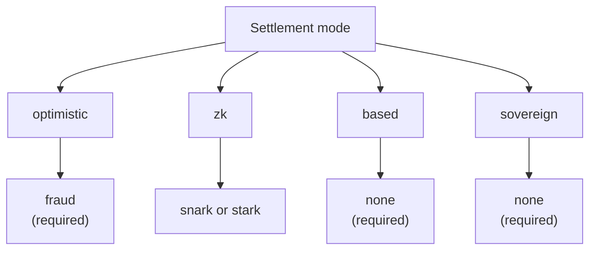

# Rollups Overview

The QoreChain **Rollup Development Kit (RDK)** — the `x/rdk` module — lets developers launch application-specific rollups that settle on QoreChain. Each rollup is an independent execution environment with its own block time, virtual machine, fee model, and sequencing, while it inherits QoreChain's security, post-quantum cryptography, and data availability guarantees.

:::caution
The RDK and the rollup settlement layer are an actively evolving capability. Treat the settlement modes, proof systems, presets, and per-feature maturity described across this section as design intent that is subject to change, and validate any deployment on the **`qorechain-diana`** testnet before targeting mainnet (**`qorechain-vladi`**, EVM chain ID **9801**, chain version **v3.1.70**).
:::

For the lower-level module reference — module parameters, lifecycle internals, burn integration, and multilayer anchoring — see the **[Rollup Development Kit](/architecture/rollup-development-kit)** page in the Architecture section. This Rollups section is the developer-facing how-to: what the RDK is, which paradigm to choose, how to deploy, how data availability works, and how withdrawals settle from L2 back to L1.

---

## What the RDK gives you

A rollup created through the RDK bundles four configurable concerns:

| Concern | What it controls | Options |
| ------- | ---------------- | ------- |
| **Settlement mode** | How the rollup's state transitions are verified and finalized on QoreChain | `optimistic`, `zk`, `based`, `sovereign` |
| **Proof system** | The cryptographic or economic mechanism backing settlement | `fraud`, `snark`, `stark`, `none` |
| **Sequencer mode** | Who orders transactions before they are settled | `dedicated`, `shared`, `based` |
| **Data availability** | Where transaction data is published so anyone can reconstruct state | `native`, `celestia`, `both` |

Each rollup is registered with a unique `rollup-id`, backed by a stake bond in QOR, and assigned a lifecycle status (`pending`, `active`, `paused`, `stopped`). See **[Deploying a Rollup](/rollups/deploying-a-rollup)** for the full create and lifecycle flow.

---

## The four settlement paradigms

QoreChain RDK supports four distinct settlement modes, each with different trust assumptions, finality characteristics, and proof requirements. The combination of settlement mode and proof system is validated on-chain — an incompatible pairing is rejected at creation. The diagram below maps each settlement mode to its valid proof system.

### Optimistic

Optimistic rollups assume submitted batches are valid by default and rely on **fraud proofs** for dispute resolution.

* **Proof system**: `fraud` — interactive fraud proofs
* **Sequencer**: `dedicated` or `shared`
* **Finality**: Delayed until a configurable challenge window expires with no successful challenge
* **Disputes**: Anyone may submit a fraud-proof challenge against a submitted batch within the window; a successful challenge rejects the batch

### ZK (Zero-Knowledge)

ZK rollups attach a cryptographic validity proof to each batch, proving state-transition correctness without re-execution.

* **Proof system**: `snark` (succinct proofs) or `stark` (transparent proofs, no trusted setup)
* **Sequencer**: `dedicated` or `shared`
* **Finality**: On valid proof verification — no challenge window required
* **Maturity**: ZK and STARK verification are still maturing. Treat ZK settlement as not yet production-hardened and validate on testnet. See **[ZK / STARK & Withdrawals](/rollups/zk-stark-withdrawals)** for details.

### Based

Based rollups delegate transaction sequencing to QoreChain (L1) proposers, inheriting the host chain's liveness and censorship resistance.

* **Proof system**: `none` — L1 proposers are the source of ordering truth
* **Sequencer**: `based` (required — enforced by on-chain validation)
* **Finality**: Follows host-chain confirmation
* **Trade-off**: Simplest operational model, since QoreChain validators handle sequencing, at the cost of dedicated-sequencer latency control

### Sovereign

Sovereign rollups run their own consensus and self-sequence. They anchor state to QoreChain for verifiability but do not depend on the host chain for finality.

* **Proof system**: `none`
* **Sequencer**: self-managed by the rollup
* **Finality**: Independent — determined by the rollup's own consensus
* **State anchoring**: State roots are posted to QoreChain for transparency, but the host chain does not enforce them

---

## Proof-system compatibility

The settlement mode constrains which proof systems are valid. These pairings are enforced when a rollup is created.

| Settlement mode | `fraud` | `snark` | `stark` | `none` |
| --------------- | :-----: | :-----: | :-----: | :----: |
| **optimistic**  | Required | — | — | — |
| **zk**          | — | Supported | Supported | — |
| **based**       | — | — | — | Required |
| **sovereign**   | — | — | — | Required |

---

## Sequencer modes

The sequencer determines who orders transactions within a rollup block before settlement.

| Mode | Who sequences | Notes |
| ---- | ------------- | ----- |
| **`dedicated`** | A single designated operator address | Lowest latency; requires trust in the operator for liveness and fair ordering |
| **`shared`** | A shared sequencer set | Ordering distributed across the set; slightly higher coordination overhead |
| **`based`** | QoreChain L1 proposers | Inherits host-chain validator security and censorship resistance; required for `based` settlement |

---

## Choosing a paradigm

| If you want... | Consider |
| -------------- | -------- |
| The simplest operational setup, with QoreChain validators sequencing | **based** |
| Fast finality with cryptographic guarantees (maturing) | **zk** (`snark` / `stark`) |
| A well-understood model with economic dispute resolution | **optimistic** (`fraud`) |
| Full independence with your own consensus, anchored for verifiability | **sovereign** |

Not sure where to start? The RDK ships **preset profiles** that bundle these choices for common application categories — see **[Preset Profiles](/rollups/preset-profiles)** — and a `suggest-profile` query that recommends one from a plain-language description of your use case.

For developers, the RDK also ships as the public TypeScript SDK **`@qorechain/rdk`** plus the **`create-qorechain-rollup`** scaffolder, which drive the same on-chain module from code — see **[Deploying a Rollup](/rollups/deploying-a-rollup#deploy-with-the-typescript-rdk-qorechainrdk)**.
