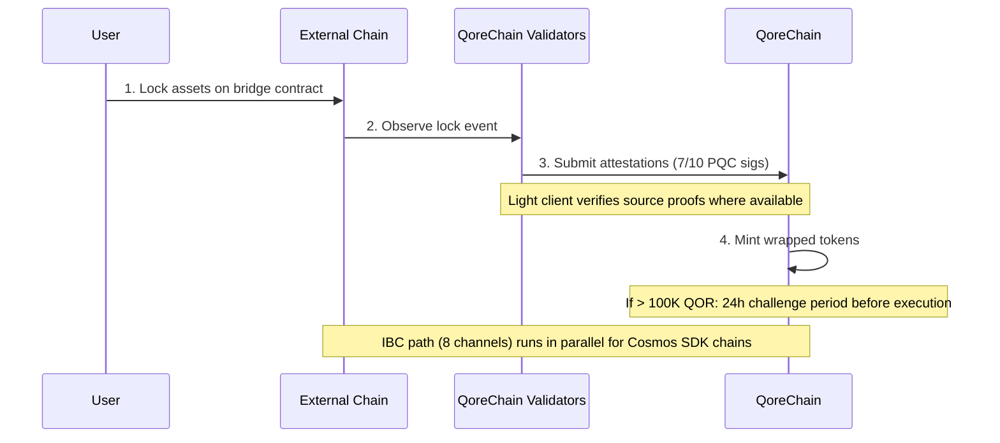

# بنية الجسر

تم تصميم وحدة `x/bridge` لربط QoreChain بنظام البلوكتشين الأوسع من خلال **37 تكوينًا لسلاسل QCB (QoreChain Bridge) و8 قنوات IBC (Inter-Blockchain Communication)**. كل عملية جسر مؤمَّنة بتشفير ما بعد الكم.

:::caution
الجسر عبر السلاسل **حاليًا في شبكة الاختبار وقيد الانتظار — وهو ليس بعد نظامًا للإنتاج**. تعكس تكوينات السلاسل والعملاء الخفيفون والتدفقات الموصوفة أدناه الجسر كما هو مصمَّم وكما تم تشغيله على شبكة الاختبار. يجري طرح الاتصال الخارجي تدريجيًا؛ تعامل مع جميع الأهداف على أنها نية تصميمية بدلاً من ضمانات حية على الشبكة الرئيسية.
:::

## نظرة عامة على الاتصال

تم تصميم QoreChain لدعم بروتوكولَي جسر يعملان بالتوازي:

| البروتوكول | الاتصالات          | نموذج الأمان                       | حالة الاستخدام                                |
| -------- | -------------------- | ------------------------------------ | --------------------------------------- |
| **IBC**  | 8 قنوات           | IBC قياسي + توقيعات حزم PQC | السلاسل المتوافقة مع Cosmos SDK            |
| **QCB**  | 37 تكوين سلسلة     | توقيع متعدد Dilithium-5 بنسبة 7 من 10         | السلاسل غير IBC (EVM، Solana، TON، إلخ) |

تتضمن **تكوينات سلاسل QCB الـ37** **36 سلسلة خارجية** بالإضافة إلى **QoreChain نفسها** كتكوين أصلي/استرجاعي (loopback) (يُستخدم للتوجيه الداخلي والتسوية المرجعية الذاتية). تتصل قنوات IBC الـ8 بالسلاسل المتوافقة مع Cosmos SDK.

## قنوات IBC

تم تصميم QoreChain للحفاظ على اتصالات IBC مع السلاسل الـ8 التالية، المُرحَّلة عبر Hermes v1.x:

| السلسلة      | الوصف                    |
| ---------- | ------------------------------ |
| Cosmos Hub | اتصال الـ hub الأساسي         |
| Osmosis    | توجيه سيولة DEX          |
| Noble      | الإصدار الأصلي لـ USDC            |
| Celestia   | طبقة توفّر البيانات        |
| Stride     | الـ staking السائل                 |
| Akash      | الحوسبة اللامركزية          |
| Babylon    | بروتوكول إعادة staking لـ BTC         |
| Injective  | قابلية التشغيل البيني لـ DeFi / دفتر الأوامر |

### تكوين مُرحِّل IBC

* **برمجية المُرحِّل**: Hermes v1.x
* **تحديثات العميل**: تحديث تلقائي للعميل الخفيف
* **كشف سوء السلوك**: مُفعَّل — يراقب المُرحِّل التوقيع المزدوج (equivocation)
* **مسح الحزم**: كل 100 كتلة، تُمسح حزم IBC المعلقة
* **تعزيز PQC**: كل حزمة IBC تنشأ من QoreChain تتضمن توقيع Dilithium-5 اختياريًا لأمان كمي استباقي. يمكن للسلاسل المستقبِلة المدركة لـ PQC التحقق من هذا التوقيع جنبًا إلى جنب مع التحقق القياسي لـ IBC.

## بروتوكول QCB (QoreChain Bridge)

يستخدم بروتوكول QCB بنية hub-and-spoke مؤمَّنة بتشفير ما بعد الكم. تعمل QoreChain بصفتها الـ hub، مع تكوينات spoke لكل سلسلة خارجية بالإضافة إلى تكوين أصلي/استرجاعي (loopback) لـ QoreChain نفسها.

### تكوينات السلاسل الخارجية (36)

تم تصميم بروتوكول QCB لاستهداف السلاسل الخارجية الـ36 التالية. بالاقتران مع تكوين QoreChain الأصلي/الاسترجاعي الخاص بها، يعطي ذلك **37 تكوين سلسلة QCB إجمالًا (بما في ذلك QoreChain نفسها)**.

**السلاسل الأساسية (10)**

Ethereum، Solana، TON، BSC، Avalanche، Polygon، Arbitrum، Optimism، Base، Sui.

**سلاسل عائلة EVM (14)**

zkSync Era، Linea، Scroll، Blast، Mantle، Hyperliquid، Berachain، Sonic، Sei، Monad، Plasma، Filecoin FVM، Cronos، Kaia.

**السلاسل غير EVM (5)**

Starknet، XRP Ledger، Stellar، Hedera، Algorand.

**السلاسل قيد الانتظار (7)**

NEAR، Bitcoin، Cardano، Polkadot، Tezos، Tron، Aptos.

:::note
التحقق من العدد: 10 أساسية + 14 من عائلة EVM + 5 غير EVM + 7 قيد الانتظار = **36 سلسلة خارجية**. وبإضافة تكوين QoreChain الأصلي/الاسترجاعي الخاص بها يعطي **37 تكوين سلسلة QCB**.
:::

### تنسيقات العناوين

يصنّف بروتوكول QCB السلاسل حسب النوع للتحقق من عناوين الوجهة:

| نوع السلسلة   | أمثلة على السلاسل                                                          | تنسيق العنوان                                     |
| ------------ | ----------------------------------------------------------------------- | -------------------------------------------------- |
| `evm`        | Ethereum، BSC، Avalanche، Polygon، Arbitrum، Optimism، Base             | `0x` + 40 حرفًا سداسيًا عشريًا                           |
| `solana`     | Solana                                                                  | Base58، 32-44 حرفًا                           |
| `ton`        | TON                                                                     | `EQ` + مُرمَّز بـ base64                              |
| `sui_move`   | Sui                                                                     | `0x` + 64 حرفًا سداسيًا عشريًا                           |
| `aptos_move` | Aptos                                                                   | `0x` + 64 حرفًا سداسيًا عشريًا                           |
| `bitcoin`    | Bitcoin                                                                 | Bech32 (`bc1`)، P2SH (`3...`)، أو الإرث (`1...`)  |
| `near`       | NEAR Protocol                                                           | لاحقة `.near` أو ضمنية                         |
| `cardano`    | Cardano                                                                 | `addr1` (دفع) أو `stake1` (staking)            |
| `polkadot`   | Polkadot                                                                | مُرمَّز بـ SS58                                       |
| `tezos`      | Tezos                                                                   | `tz1`/`tz2`/`tz3` (ضمني) أو `KT1` (منشأ) |
| `tron`       | TRON                                                                    | `T` + base58، 34 حرفًا                           |

## العملاء الخفيفون

للتحقق من أحداث السلاسل الخارجية دون الحاجة إلى الثقة، تم تصميم الجسر لتشغيل عملاء خفيفين على السلسلة مصممين خصيصًا لإجماع كل سلسلة مصدر ونظام إثباتها. يمكّن هؤلاء العملاء الخفيفون QoreChain من التحقق من صحة الإيداعات والسحوبات دون الاعتماد كليًا على شهادات المُحقِّقين.

| العميل الخفيف            | السلسلة المصدر        | بدائيات التحقق                                              |
| ----------------------- | ------------------- | ------------------------------------------------------------------- |
| **العميل الخفيف لـ Ethereum** | Ethereum / EVM L1 | التحقق من توقيع BLS12-381، تسلسل SSZ، إثباتات حالة MPT |
| **Bitcoin SPV**         | Bitcoin             | التحقق المبسّط من الدفع (Simplified Payment Verification) مقابل رؤوس الكتل                |
| **Starknet STARK**      | Starknet            | التحقق من إثبات STARK لانتقالات حالة Starknet              |
| **Sui BLS**             | Sui                 | التحقق من توقيع BLS المجمَّع لنقاط تفتيش Sui             |
| **Wormhole / Solana VAA** | Solana (عبر Wormhole) | التحقق من توقيع حارس Verified Action Approval (VAA)     |

## تدفق الإيداع (من خارجي إلى QoreChain)

يوضح التسلسل أدناه إيداع QCB: تُقفل الأصول على سلسلة خارجية، ويقدّم مُحقِّقو QoreChain شهادات موقَّعة بـ PQC (7 من 10 Dilithium-5)، وتُسكّ الرموز المغلَّفة. تستخدم السلاسل المتوافقة مع Cosmos SDK بدلاً من ذلك مسار IBC الموازي (8 قنوات، مع توقيعات حزم Dilithium-5 اختيارية). كلا المسارين في شبكة الاختبار/قيد الانتظار.



```
External Chain          QoreChain Validators           QoreChain
     |                         |                          |
     | 1. Lock assets on       |                          |
     |    bridge contract      |                          |
     |------------------------>|                          |
     |                         | 2. Observe & attest      |
     |                         |    (7/10 PQC sigs)       |
     |                         |------------------------->|
     |                         |                          | 3. Mint wrapped
     |                         |                          |    tokens
     |                         |                          |
     |                         |    [If > 100K QOR]       |
     |                         |    24h challenge period   |
     |                         |    before execution       |
```

1. **القفل** — يقفل المستخدم الأصول في عقد الجسر على السلسلة الخارجية.
2. **الشهادة** — يراقب مُحقِّقو الجسر معاملة القفل ويقدّمون شهادات موقَّعة بـ Dilithium-5. مطلوب حد أدنى من **7 من 10** شهادات للمُحقِّقين. وحيث يتوفر عميل خفيف للسلسلة المصدر، يُتحقَّق من حدث القفل إضافيًا مقابل إثباتات السلسلة الخاصة.
3. **السك** — بمجرد بلوغ عتبة الشهادة، تُسكّ الرموز المغلَّفة على QoreChain.
4. **فترة الطعن** — بالنسبة للتحويلات التي تتجاوز ما يعادل 100,000 QOR، تنطبق **فترة طعن مدتها 24 ساعة** قبل التنفيذ. خلال هذه النافذة، يمكن للمُحقِّقين الإبلاغ عن النشاط المشبوه.

## تدفق السحب (من QoreChain إلى خارجي)

```
QoreChain               QoreChain Validators           External Chain
     |                         |                          |
     | 1. Burn wrapped tokens  |                          |
     |------------------------>|                          |
     |                         | 2. Attest burn           |
     |                         |    (7/10 PQC sigs)       |
     |                         |------------------------->|
     |                         |                          | 3. Unlock original
     |                         |                          |    assets
```

1. **الحرق** — يحرق المستخدم الرموز المغلَّفة على QoreChain.
2. **الشهادة** — يشهد المُحقِّقون على حدث الحرق بتوقيعات Dilithium-5 (عتبة 7/10).
3. **إلغاء القفل** — بمجرد بلوغ العتبة، يُلغى قفل الأصول الأصلية على السلسلة الخارجية.

تُوجَّه جميع رسوم الجسر المحصَّلة أثناء السحوبات إلى وحدة `x/burn` عبر قناة الحرق `bridge_fee` (تُحرق 100% من رسوم الجسر).

### تدفق السحب من L2 إلى L1 (تسوية الـ Rollup)

تم تصميم الجسر أيضًا لتسوية **سحوبات الـ rollup (L2) عائدةً إلى سلسلتها المضيفة (L1)**. تقوم عمليات الـ rollup المنشورة عبر [Rollup Development Kit](/architecture/rollup-development-kit) دوريًا بتثبيت حالتها على QoreChain؛ يستهلك الجسر تلك المثبتات النهائية لتفويض السحوبات من الـ rollup إلى السلسلة المضيفة:

1. يبدأ المستخدم سحبًا على الـ rollup (L2)، يُدرَج في دفعة تسوية.
2. تُثبَّت الدفعة على QoreChain ويتم إثباتها/إنهاؤها وفقًا لوضع التسوية الخاص بالـ rollup (على سبيل المثال، بعد انتهاء نافذة الطعن التفاؤلي، أو عند التحقق من صحة الإثبات).
3. بمجرد إنهاء المثبت، يصبح السحب قابلًا للمطالبة وتُطلَق الأصول المقابلة على السلسلة المضيفة (L1) عبر مسار الحرق والشهادة القياسي.

يربط هذا نهائية الـ rollup مباشرةً بضمانات تسوية السلسلة المضيفة، بحيث لا يمكن إطلاق سحوبات L2 قبل أن تُسوَّى حالة L2 المقابلة بشكل لا رجعة فيه.

## بنية الأمان

### التوقيع المتعدد لـ PQC

تتطلب جميع عمليات جسر QCB **عتبة 7 من 10** من توقيعات Dilithium-5 لما بعد الكم من مُحقِّقي الجسر المسجَّلين. يسجّل كل مُحقِّق جسر بـ:

* عنوان مُحقِّق QoreChain
* مفتاح Dilithium-5 العام (2,592 بايت)
* قائمة بالسلاسل المدعومة
* درجة سمعة (تحافظ عليها `x/reputation`)

### قواطع الدائرة

لكل سلسلة متصلة حمايات قاطع دائرة مستقلة:

| الحماية                | الوصف                                                                          |
| ------------------------- | ------------------------------------------------------------------------------------ |
| **حد التحويل الواحد** | الحد الأقصى لمبلغ أي عملية جسر فردية لكل سلسلة                         |
| **الحد الإجمالي اليومي** | سقف الحجم الإجمالي لكل سلسلة لكل نافذة 24 ساعة                                        |
| **الإيقاف اليدوي**          | إيقاف طارئ تطلقه الحوكمة أو المُحقِّق لكل سلسلة                           |
| **كشف الشذوذ**     | إيقاف تلقائي إذا تجاوزت العمليات 50 خلال نافذة قصيرة أو تجاوز الحجم 5 أضعاف الحد اليومي |

تُتتبع حالة قاطع الدائرة لكل سلسلة وتتضمن: الحد الأقصى للتحويل الواحد، الحد اليومي، الاستخدام اليومي الحالي، ارتفاع آخر إعادة ضبط، وحالة الإيقاف مع السبب.

### فترة الطعن

بالنسبة للتحويلات الكبيرة (أكثر من ما يعادل 100,000 QOR، قابلة للتكوين عبر `large_transfer_threshold`):

* تنطبق **فترة طعن مدتها 24 ساعة** (86,400 ثانية) بعد بلوغ عتبة الشهادة.
* خلال هذه النافذة، يمكن لأي مُحقِّق الإبلاغ عن العملية.
* إذا لم يُطعن فيها، تُنفَّذ العملية تلقائيًا بعد انتهاء الفترة.
* تُجمَّد العمليات المطعون فيها لمراجعة الحوكمة.

### تحسين المسار بالذكاء الاصطناعي

تتكامل وحدة الجسر مع نظام الذكاء الاصطناعي الفرعي لتحسين المسار. بالنسبة للتحويلات التي يمكن أن تعبر مسارات متعددة (مثلًا، من السلسلة A إلى السلسلة B عبر وسيط)، يقيّم مُحسِّن المسار:

* الرسوم المقدَّرة عبر المسارات
* وقت الإكمال المقدَّر
* درجة الأمان لكل مسار
* مستوى الثقة في التقدير

## إدارة الجسر

### تفعيل السلسلة بعد النشر (بدون حوكمة)

اعتبارًا من إصدار السلسلة **v3.1.78**، يمكن تفعيل سلسلة جسر وإعادة تكوينها بعد النشر بمعاملة موقَّعة واحدة — دون اقتراح حوكمة ودون ترقية سلسلة. يمكن لمفتاح `bridge_admin` (المعيَّن في `BridgeConfig.BridgeAdmin` عند genesis) أو لحامل ترخيص `qcb_bridge`:

* **`tx bridge update-chain-config`** — تعيين عنوان عقد السلسلة، وعدد التأكيدات، والبنية، والحالة (`MsgUpdateChainConfig`).
* **`tx bridge set-verifier-bootstrap`** — اختيار المُحقِّق النشط لسلسلة وتثبيت جذر الثقة الخاص بها (`MsgSetVerifierBootstrap`).

يتيح هذا لمشغِّل أن يُشغِّل جسر سلسلة متصلة — أو يدوّر مُحقِّقها — مباشرةً، مع التحقق من التفويض مقابل مفتاح مدير الجسر.

### التحقق من الشبكات المتصلة

اعتبارًا من إصدار السلسلة **v3.1.79**، يمكن لمُحقِّق يحمل ترخيص `validator_<chain>` (أو `qcb_bridge`) المطابق تشغيل عميل الشبكة الخارجية على العقدة نفسها، مُهيَّأً تلقائيًا تحت تنسيق QoreChain بمجرد تفعيل الترخيص. تُشحن المشغّلات (drivers) لجميع شبكات الجسر الـ37، مصنّفة حسب نموذج المشاركة (مُحقِّق بدون إذن، محدود/منتخَب/بقبول، عقدة كاملة L2، وغير staking/قائمة ثقة). يوفّر المشغِّل حصة الشبكة الخارجية ومفاتيح التوقيع لكل شبكة. راجع [Run a Validator](/developer-guide/running-a-validator#connected-networks) لخطوات المشغِّل.

## نقاط نهاية REST API

اعتبارًا من إصدار السلسلة **v3.1.77**، أصبحت حالة الجسر قابلة للاستعلام أيضًا **للقراءة فقط عبر REST** من خلال grpc-gateway تحت البادئة `/qorechain/bridge/v1/...` (`config`، `chains`، `chains/{chain_id}`، `validators`، `validators/{address}`، `operations`، `operations/{id}`) — كانت سابقًا عبر gRPC فقط. تقدّم هذه بيانات JSON حقيقية على السلسلة عبر HTTP للمستكشفات وقياس العقد الخفيفة عن بُعد. راجع [REST / gRPC Endpoints](/api-reference/rest-grpc-endpoints#bridge-module) للقائمة الكاملة.

| الطريقة | نقطة النهاية                                           | الوصف                                      |
| ------ | -------------------------------------------------- | ------------------------------------------------ |
| GET    | `/bridge/v1/chains`                                | سرد جميع تكوينات السلاسل المدعومة          |
| GET    | `/bridge/v1/chains/{chain_id}`                     | الحصول على تكوين سلسلة محددة           |
| GET    | `/bridge/v1/validators`                            | سرد جميع مُحقِّقي الجسر المسجَّلين            |
| GET    | `/bridge/v1/operations`                            | سرد جميع عمليات الجسر (الأحدث أولًا)   |
| GET    | `/bridge/v1/operations/{operation_id}`             | الحصول على تفاصيل عملية محددة              |
| GET    | `/bridge/v1/locked/{chain}/{asset}`                | الحصول على المبالغ المقفلة/المسكوكة لزوج سلسلة/أصل |
| GET    | `/bridge/v1/circuit-breakers`                      | سرد جميع حالات قواطع الدائرة                  |
| GET    | `/bridge/v1/estimate/{from}/{to}/{asset}/{amount}` | الحصول على تقدير مسار مُحسَّن بالذكاء الاصطناعي                  |

## أحداث الجسر

تصدر وحدة الجسر الأحداث التالية على السلسلة:

| نوع الحدث                    | الوصف                                     |
| ----------------------------- | ----------------------------------------------- |
| `bridge_deposit`              | إنشاء عملية إيداع جديدة                   |
| `bridge_withdraw`             | إنشاء عملية سحب جديدة                |
| `bridge_attestation`          | تقديم شهادة مُحقِّق                 |
| `bridge_operation_executed`   | إنهاء العملية وتنفيذها                |
| `bridge_circuit_breaker_trip` | تفعيل قاطع الدائرة أو إلغاء تفعيله        |
| `bridge_validator_registered` | تسجيل مُحقِّق جسر جديد                 |
| `bridge_pqc_verification`     | نتيجة التحقق من توقيع PQC (حزم IBC) |

## ذات صلة

* [Bridging Assets](/user-guide/bridging-assets) — نقل الأصول عبر السلاسل خطوة بخطوة.
* [Dashboard Bridge](/dashboard/bridge) — واجهة الجسر للمستخدمين اليوميين.
* [BTC Restaking via Babylon](/architecture/btc-restaking-babylon) — أمان مدعوم بـ Bitcoin.
* [Post-Quantum Security](/architecture/post-quantum-security) — التحقق من PQC على حزم IBC.
