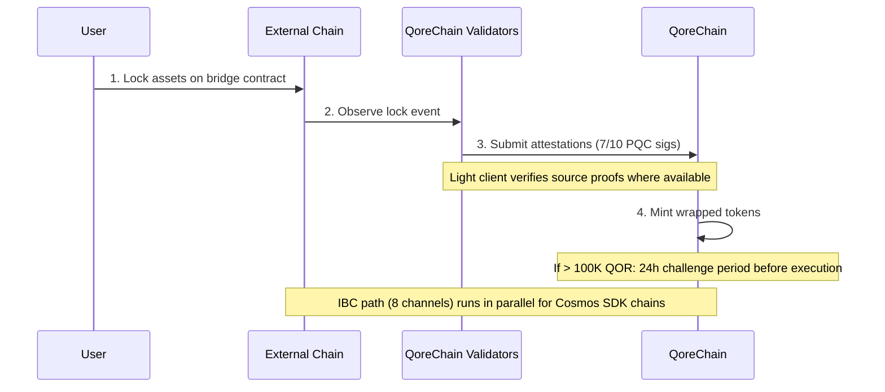

# معمارية الجسر

صُممت وحدة `x/bridge` لربط QoreChain بمنظومة سلاسل الكتل الأوسع عبر **37 تهيئة سلسلة QCB (جسر QoreChain) و8 قنوات IBC (التواصل بين سلاسل الكتل)**. كل عملية جسر مؤمَّنة بالتشفير المقاوم للكم.

:::caution
الجسر عبر السلاسل **حالياً في الشبكة التجريبية وقيد الانتظار — وليس بعد نظاماً إنتاجياً**. تعكس تهيئات السلاسل والعملاء الخفيفون والتدفقات الموصوفة أدناه الجسر كما صُمم وكما جُرِّب على الشبكة التجريبية. يجري طرح الاتصال الخارجي تدريجياً؛ تعامل مع جميع الأهداف كنية تصميمية لا كضمانات حية على الشبكة الرئيسية.
:::

## نظرة عامة على الاتصال

صُممت QoreChain لدعم بروتوكولي جسر يعملان بالتوازي:

| البروتوكول | الاتصالات          | نموذج الأمان                       | حالة الاستخدام                                |
| -------- | -------------------- | ------------------------------------ | --------------------------------------- |
| **IBC**  | 8 قنوات           | IBC قياسي + تواقيع PQC للحزم | السلاسل المتوافقة مع Cosmos SDK            |
| **QCB**  | 37 تهيئة سلسلة     | متعدد التواقيع 7-من-10 بـ Dilithium-5         | السلاسل غير المتوافقة مع IBC (EVM، Solana، TON، إلخ.) |

تشمل **تهيئات سلاسل QCB الـ 37** **36 سلسلة خارجية** بالإضافة إلى **QoreChain نفسها** كتهيئة أصلية/استرجاعية (loopback) (تُستخدم للتوجيه الداخلي والتسوية ذاتية المرجع). تتصل قنوات IBC الـ 8 بالسلاسل المتوافقة مع Cosmos SDK.

## قنوات IBC

صُممت QoreChain للحفاظ على اتصالات IBC مع السلاسل الـ 8 التالية، تُنقل عبر Hermes v1.x:

| السلسلة      | الوصف                    |
| ---------- | ------------------------------ |
| Cosmos Hub | اتصال المحور الأساسي         |
| Osmosis    | توجيه سيولة DEX          |
| Noble      | إصدار USDC الأصلي            |
| Celestia   | طبقة توافر البيانات        |
| Stride     | التخزين السائل                 |
| Akash      | الحوسبة اللامركزية          |
| Babylon    | بروتوكول إعادة تخزين BTC         |
| Injective  | قابلية التشغيل البيني لـ DeFi / دفتر الأوامر |

### تهيئة مُرحِّل IBC

* **برنامج المُرحِّل**: Hermes v1.x
* **تحديثات العميل**: تحديث تلقائي للعميل الخفيف
* **كشف السلوك الخاطئ**: مُفعَّل — يراقب المُرحِّل التواقيع المتناقضة (equivocation)
* **إخلاء الحزم**: كل 100 كتلة، تُخلى حزم IBC المعلَّقة
* **تعزيز PQC**: تتضمن كل حزمة IBC صادرة من QoreChain توقيع Dilithium-5 اختيارياً للأمان الكمي المستقبلي. يمكن للسلاسل المستقبِلة المدركة لـ PQC التحقق من هذا التوقيع إلى جانب التحقق القياسي لـ IBC.

## بروتوكول QCB (جسر QoreChain)

يستخدم بروتوكول QCB معمارية محور-وأطراف (hub-and-spoke) مؤمَّنة بالتشفير المقاوم للكم. تعمل QoreChain كمحور، مع تهيئات طرفية (spoke) لكل سلسلة خارجية بالإضافة إلى تهيئة أصلية/استرجاعية لـ QoreChain نفسها.

### تهيئات السلاسل الخارجية (36)

صُمم بروتوكول QCB لاستهداف السلاسل الخارجية الـ 36 التالية. وبدمجها مع تهيئة QoreChain الأصلية/الاسترجاعية، يعطي ذلك **37 تهيئة سلسلة QCB إجمالاً (بما في ذلك QoreChain نفسها)**.

**السلاسل الأساسية (10)**

Ethereum، Solana، TON، BSC، Avalanche، Polygon، Arbitrum، Optimism، Base، Sui.

**سلاسل عائلة EVM (14)**

zkSync Era، Linea، Scroll، Blast، Mantle، Hyperliquid، Berachain، Sonic، Sei، Monad، Plasma، Filecoin FVM، Cronos، Kaia.

**السلاسل غير العاملة بـ EVM (5)**

Starknet، XRP Ledger، Stellar، Hedera، Algorand.

**السلاسل قيد الانتظار (7)**

NEAR، Bitcoin، Cardano، Polkadot، Tezos، Tron، Aptos.

:::note
تحقق من العدد: 10 أساسية + 14 من عائلة EVM + 5 غير عاملة بـ EVM + 7 قيد الانتظار = **36 سلسلة خارجية**. وإضافة تهيئة QoreChain الأصلية/الاسترجاعية تعطي **37 تهيئة سلسلة QCB**.
:::

### صيغ العناوين

يصنّف بروتوكول QCB السلاسل حسب النوع للتحقق من عناوين الوجهة:

| نوع السلسلة   | أمثلة على السلاسل                                                          | صيغة العنوان                                     |
| ------------ | ----------------------------------------------------------------------- | -------------------------------------------------- |
| `evm`        | Ethereum، BSC، Avalanche، Polygon، Arbitrum، Optimism، Base             | `0x` + 40 حرفاً سداسي عشري                           |
| `solana`     | Solana                                                                  | Base58، 32-44 حرفاً                           |
| `ton`        | TON                                                                     | `EQ` + مُرمَّز بـ base64                              |
| `sui_move`   | Sui                                                                     | `0x` + 64 حرفاً سداسي عشري                           |
| `aptos_move` | Aptos                                                                   | `0x` + 64 حرفاً سداسي عشري                           |
| `bitcoin`    | Bitcoin                                                                 | Bech32 (`bc1`)، P2SH (`3...`)، أو القديم (`1...`)  |
| `near`       | NEAR Protocol                                                           | لاحقة `.near` أو ضمني                         |
| `cardano`    | Cardano                                                                 | `addr1` (للدفع) أو `stake1` (للتخزين)            |
| `polkadot`   | Polkadot                                                                | مُرمَّز بـ SS58                                       |
| `tezos`      | Tezos                                                                   | `tz1`/`tz2`/`tz3` (ضمني) أو `KT1` (مُنشأ) |
| `tron`       | TRON                                                                    | `T` + base58، 34 حرفاً                           |

## العملاء الخفيفون

للتحقق من أحداث السلاسل الخارجية دون الحاجة إلى ثقة، صُمم الجسر لتشغيل عملاء خفيفين على السلسلة مصممين خصيصاً لنظام إجماع وإثبات كل سلسلة مصدر. يمكّن هؤلاء العملاء الخفيفون QoreChain من التحقق من الإيداعات والسحوبات دون الاعتماد فقط على شهادات المدققين.

| العميل الخفيف            | السلسلة المصدر        | بدائيات التحقق                                              |
| ----------------------- | ------------------- | ------------------------------------------------------------------- |
| **العميل الخفيف لـ Ethereum** | Ethereum / EVM L1 | التحقق من توقيع BLS12-381، تسلسل SSZ، إثباتات حالة MPT |
| **Bitcoin SPV**         | Bitcoin             | التحقق المبسط من الدفع مقابل ترويسات الكتل                |
| **Starknet STARK**      | Starknet            | التحقق من إثبات STARK لانتقالات حالة Starknet              |
| **Sui BLS**             | Sui                 | التحقق من توقيع BLS المجمَّع لنقاط تفتيش Sui             |
| **Wormhole / Solana VAA** | Solana (عبر Wormhole) | التحقق من توقيع الحُرّاس لموافقة الإجراء المتحقَّق منه (VAA)     |

## تدفق الإيداع (من الخارج إلى QoreChain)

يُظهر التسلسل أدناه إيداع QCB: تُقفل الأصول على سلسلة خارجية، ويقدّم مدققو QoreChain شهادات موقَّعة بـ PQC (7-من-10 بـ Dilithium-5)، وتُسكّ رموز مغلَّفة. تستخدم السلاسل المتوافقة مع Cosmos SDK بدلاً من ذلك مسار IBC الموازي (8 قنوات، مع تواقيع حزم اختيارية بـ Dilithium-5). كلا المسارين على الشبكة التجريبية/قيد الانتظار.



```
External Chain          QoreChain Validators           QoreChain
     |                         |                          |
     | 1. Lock assets on       |                          |
     |    bridge contract      |                          |
     |------------------------>|                          |
     |                         | 2. Observe & attest      |
     |                         |    (7/10 PQC sigs)       |
     |                         |------------------------->|
     |                         |                          | 3. Mint wrapped
     |                         |                          |    tokens
     |                         |                          |
     |                         |    [If > 100K QOR]       |
     |                         |    24h challenge period   |
     |                         |    before execution       |
```

1. **القفل** — يقفل المستخدم الأصول في عقد الجسر على السلسلة الخارجية.
2. **الشهادة** — يلاحظ مدققو الجسر معاملة القفل ويقدّمون شهادات موقَّعة بـ Dilithium-5. يُطلب حد أدنى من **7 من 10** شهادات مدققين. وحيث يتوفر عميل خفيف للسلسلة المصدر، يُتحقَّق من حدث القفل إضافةً مقابل إثباتات السلسلة نفسها.
3. **السكّ** — بمجرد بلوغ عتبة الشهادات، تُسكّ رموز مغلَّفة على QoreChain.
4. **فترة التحدي** — للتحويلات التي تتجاوز ما يعادل 100,000 QOR، تُطبَّق **فترة تحدٍّ مدتها 24 ساعة** قبل التنفيذ. خلال هذه النافذة، يمكن للمدققين الإبلاغ عن نشاط مشبوه.

## تدفق السحب (من QoreChain إلى الخارج)

```
QoreChain               QoreChain Validators           External Chain
     |                         |                          |
     | 1. Burn wrapped tokens  |                          |
     |------------------------>|                          |
     |                         | 2. Attest burn           |
     |                         |    (7/10 PQC sigs)       |
     |                         |------------------------->|
     |                         |                          | 3. Unlock original
     |                         |                          |    assets
```

1. **الحرق** — يحرق المستخدم الرموز المغلَّفة على QoreChain.
2. **الشهادة** — يشهد المدققون على حدث الحرق بتواقيع Dilithium-5 (عتبة 7/10).
3. **فك القفل** — بمجرد بلوغ العتبة، تُفكّ الأصول الأصلية على السلسلة الخارجية.

تُوجَّه جميع رسوم الجسر المحصَّلة أثناء السحوبات إلى وحدة `x/burn` عبر قناة حرق `bridge_fee` (تُحرق 100% من رسوم الجسر).

### تدفق السحب L2 ← L1 (تسوية الرول-أب)

صُمم الجسر أيضاً لتسوية **سحوبات الرول-أب (L2) إلى سلسلتها المضيفة (L1)**. ترسي الرول-أبات المنشورة عبر [مجموعة تطوير الرول-أب](/architecture/rollup-development-kit) حالتها دورياً على QoreChain؛ ويستهلك الجسر تلك المراسي النهائية لتفويض السحوبات من الرول-أب إلى السلسلة المضيفة:

1. يبدأ مستخدم سحباً على الرول-أب (L2)، يُضمَّن في دفعة تسوية.
2. تُرسى الدفعة على QoreChain وتُثبَت/تُنهَى وفقاً لوضع تسوية الرول-أب (مثلاً، بعد انتهاء نافذة التحدي التفاؤلية، أو عند التحقق من إثبات صالح).
3. بمجرد إنهاء المرساة، يصبح السحب قابلاً للمطالبة وتُحرَّر الأصول المقابلة على السلسلة المضيفة (L1) عبر مسار الحرق-والشهادة القياسي.

يربط هذا نهائية الرول-أب مباشرةً بضمانات تسوية السلسلة المضيفة، بحيث لا يمكن تحرير سحوبات L2 قبل أن تُسوَّى حالة L2 المقابلة بلا رجعة.

## معمارية الأمان

### متعدد التواقيع PQC

تتطلب جميع عمليات جسر QCB **عتبة 7-من-10** من تواقيع Dilithium-5 المقاومة للكم من مدققي الجسر المسجلين. يسجّل كل مدقق جسر بـ:

* عنوان مدقق QoreChain
* مفتاح Dilithium-5 العام (2,592 بايت)
* قائمة بالسلاسل المدعومة
* درجة سمعة (تُدار بواسطة `x/reputation`)

### قواطع الدائرة

لكل سلسلة متصلة حمايات قاطع دائرة مستقلة:

| الحماية                | الوصف                                                                          |
| ------------------------- | ------------------------------------------------------------------------------------ |
| **حد التحويل الفردي** | الحد الأقصى لمقدار أي عملية جسر فردية لكل سلسلة                         |
| **الحد الإجمالي اليومي** | سقف الحجم الإجمالي لكل سلسلة في نافذة كل 24 ساعة                                        |
| **الإيقاف اليدوي**          | إيقاف طارئ مُشغَّل بواسطة الحوكمة أو المدقق لكل سلسلة                           |
| **كشف الشذوذ**     | إيقاف تلقائي إذا تجاوزت العمليات 50 في نافذة قصيرة أو تجاوز الحجم 5x الحد اليومي |

تُتتبَّع حالة قاطع الدائرة لكل سلسلة وتتضمن: الحد الأقصى للتحويل الفردي، والحد اليومي، والاستخدام اليومي الحالي، وارتفاع آخر إعادة تعيين، وحالة الإيقاف مع السبب.

### فترة التحدي

للتحويلات الكبيرة (>100,000 ما يعادل QOR، قابلة للتهيئة عبر `large_transfer_threshold`):

* تُطبَّق **فترة تحدٍّ مدتها 24 ساعة** (86,400 ثانية) بعد بلوغ عتبة الشهادات.
* خلال هذه النافذة، يمكن لأي مدقق الإبلاغ عن العملية.
* إذا لم تُتحدَّ، تُنفَّذ العملية تلقائياً بعد انتهاء الفترة.
* تُجمَّد العمليات المُتحدَّاة لمراجعة الحوكمة.

### تحسين المسار بالذكاء الاصطناعي

تتكامل وحدة الجسر مع نظام الذكاء الاصطناعي الفرعي لتحسين المسار. للتحويلات التي يمكن أن تجتاز مسارات متعددة (مثلاً، من السلسلة A إلى السلسلة B عبر وسيط)، يقيّم محسِّن المسار:

* الرسوم المقدَّرة عبر المسارات
* وقت الإكمال المقدَّر
* درجة الأمان لكل مسار
* مستوى ثقة التقدير

## نقاط نهاية واجهة REST API

اعتباراً من إصدار السلسلة **v3.1.77**، أصبحت حالة الجسر قابلة للاستعلام أيضاً **للقراءة فقط عبر REST** من خلال grpc-gateway تحت البادئة `/qorechain/bridge/v1/...` (`config`، `chains`، `chains/{chain_id}`، `validators`، `validators/{address}`، `operations`، `operations/{id}`) — كانت سابقاً عبر gRPC فقط. تخدم هذه بيانات JSON حقيقية على السلسلة عبر HTTP للمستكشفات وقياسات العقد الخفيفة. انظر [نقاط نهاية REST / gRPC](/api-reference/rest-grpc-endpoints#bridge-module) للقائمة الكاملة.

| الطريقة | نقطة النهاية                                           | الوصف                                      |
| ------ | -------------------------------------------------- | ------------------------------------------------ |
| GET    | `/bridge/v1/chains`                                | سرد جميع تهيئات السلاسل المدعومة          |
| GET    | `/bridge/v1/chains/{chain_id}`                     | الحصول على تهيئة سلسلة محددة           |
| GET    | `/bridge/v1/validators`                            | سرد جميع مدققي الجسر المسجلين            |
| GET    | `/bridge/v1/operations`                            | سرد جميع عمليات الجسر (الأحدث أولاً)   |
| GET    | `/bridge/v1/operations/{operation_id}`             | الحصول على تفاصيل عملية محددة              |
| GET    | `/bridge/v1/locked/{chain}/{asset}`                | الحصول على المبالغ المقفلة/المسكوكة لزوج سلسلة/أصل |
| GET    | `/bridge/v1/circuit-breakers`                      | سرد جميع حالات قواطع الدائرة                  |
| GET    | `/bridge/v1/estimate/{from}/{to}/{asset}/{amount}` | الحصول على تقدير مسار مُحسَّن بالذكاء الاصطناعي                  |

## أحداث الجسر

تُصدر وحدة الجسر الأحداث التالية على السلسلة:

| نوع الحدث                    | الوصف                                     |
| ----------------------------- | ----------------------------------------------- |
| `bridge_deposit`              | إنشاء عملية إيداع جديدة                   |
| `bridge_withdraw`             | إنشاء عملية سحب جديدة                |
| `bridge_attestation`          | تقديم شهادة مدقق                 |
| `bridge_operation_executed`   | إنهاء العملية وتنفيذها                |
| `bridge_circuit_breaker_trip` | تفعيل قاطع الدائرة أو إلغاء تفعيله        |
| `bridge_validator_registered` | تسجيل مدقق جسر جديد                 |
| `bridge_pqc_verification`     | نتيجة التحقق من توقيع PQC (حزم IBC) |

## ذات صلة

* [جسر الأصول](/user-guide/bridging-assets) — نقل الأصول عبر السلاسل خطوة بخطوة.
* [جسر لوحة التحكم](/dashboard/bridge) — واجهة الجسر للمستخدمين اليوميين.
* [إعادة تخزين BTC عبر Babylon](/architecture/btc-restaking-babylon) — أمان مدعوم بـ Bitcoin.
* [الأمان المقاوم للكم](/architecture/post-quantum-security) — التحقق من PQC على حزم IBC.
