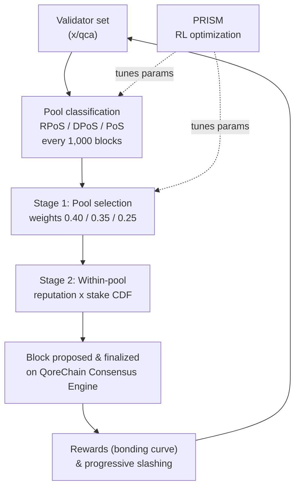

# آلية الإجماع

تطبّق QoreChain **إثبات الحصة المركّب ثلاثي التجمّعات (Triple-Pool Composite Proof-of-Stake، CPoS)**، وهي آلية إجماع تصنّف المدققين إلى ثلاثة تجمّعات متخصصة وتستخدم اختيارًا موزونًا بالسمعة لتحقيق التوازن بين الأمان واللامركزية والأداء. يُطبَّق CPoS في وحدة `x/qca` ويعمل فوق **محرك إجماع QoreChain**.

أما طبقة التحسين القائمة على التعلّم المعزَّز التي تضبط معاملات الإجماع أثناء التشغيل فتحمل العلامة **PRISM** (Policy-driven Reinforcement-learning for Intelligent State Machines). راجع [محرك إجماع PRISM](/architecture/prism-consensus-engine) للاطلاع على التفاصيل.

يلخّص المخطط أدناه دورة كتلة/إجماع واحدة من CPoS ثلاثي التجمّعات على محرك إجماع QoreChain، ويوضّح المكان الذي يغذّي فيه PRISM المعاملات القابلة للضبط في `x/qca`.



---

## بنية التجمّعات الثلاثة

يقسّم CPoS مجموعة المدققين النشطين إلى ثلاثة تجمّعات بناءً على السمعة والحصة ومقاييس التفويض. ويؤدي كل تجمّع دورًا متميزًا في عملية الإجماع.

### تصنيف التجمّعات

| التجمّع                                 | المعايير                                                                | وزن الاختيار |
| ------------------------------------ | ----------------------------------------------------------------------- | ---------------- |
| **RPoS** (إثبات الحصة القائم على السمعة) | درجة السمعة >= المئين الـ70 **و** الحصة المرهونة ذاتيًا >= الوسيط | 40%              |
| **DPoS** (إثبات الحصة المفوَّض)  | إجمالي التفويض >= 10,000 QOR                                          | 35%              |
| **PoS** (إثبات الحصة القياسي)    | جميع المدققين النشطين المتبقّين                                         | 25%              |

يُقيَّم التصنيف وفق الأولوية التالية: **RPoS > DPoS > PoS**. ويُسنَد المدقق المؤهَّل لكل من RPoS وDPoS إلى RPoS.

تحدث إعادة التصنيف كل **1,000 كتلة**. وفي كل حقبة إعادة تصنيف:

1. **جمع درجات السمعة** — تُجمَع درجات السمعة من وحدة `x/reputation` لجميع المدققين النشطين.
2. **حساب عتبة السمعة** — تُحسَب عتبة السمعة عند المئين الـ70 من توزيع الدرجات المرتَّب.
3. **حساب وسيط الحصة المرهونة ذاتيًا** — يُحسَب وسيط الحصة المرهونة ذاتيًا من توزيع الحصص المرتَّب.
4. **إعادة إسناد المدققين** — يُعاد إسناد كل مدقق نشط إلى التجمّع الأعلى أولوية الذي يتأهل له.
5. **الإسناد الافتراضي** — يُسنَد المدققون غير المصنَّفين (الذين لم تُقيَّم حالتهم بعد) افتراضيًا إلى تجمّع PoS.

---

## اختيار المقترِح الموزون بالتجمّعات

يتبع اختيار مقترِح الكتلة عملية حتمية من مرحلتين.

### المرحلة 1: اختيار التجمّع

تختار قيمة عشوائية حتمية أيّ تجمّع يقترح الكتلة التالية:

```
seed = SHA256(lastBlockHash || height || "pool")
randVal = uint64(seed[:8]) / MaxUint64    // uniform in [0, 1)
```

يُختار التجمّع بمقارنة `randVal` بعتبات الوزن التراكمي:

* `randVal < 0.40` → تجمّع RPoS
* `0.40 <= randVal < 0.75` → تجمّع DPoS
* `randVal >= 0.75` → تجمّع PoS

### المرحلة 2: الاختيار داخل التجمّع

داخل التجمّع المختار، يُختار المقترِح عبر **دالة توزيع تراكمي (CDF) موزونة بالسمعة × الحصة**. ولكل مدقق في التجمّع:

1. تُستَرجَع درجة السمعة `r` من `x/reputation`.
2. الوزن المركّب هو `w = r * tokens`.
3. تُبنى دالة توزيع تراكمي (CDF) من جميع الأوزان المركّبة.
4. يُختار المقترِح باستخدام سحب عشوائي حتمي مقابل الـCDF، تُغذّيه قيمة بَذرية من تجزئة الكتلة وارتفاعها.

### سلوك الاحتياط

إذا كان التجمّع المختار فارغًا، يرجع النظام إلى تجمّع PoS. وإذا كان تجمّع PoS فارغًا أيضًا، يرجع الاختيار إلى اختيار موزون بالسمعة عبر مجموعة المدققين النشطين بالكامل.

---

## منحنى الترابط المخصَّص

تُحسَب مكافآت المدققين باستخدام منحنى ترابط متعدد العوامل يحفّز المشاركة طويلة الأمد والسمعة العالية والتوافق مع مراحل نمو البروتوكول.

### المعادلة

```
R(v, t) = beta * S_v * (1 + alpha * ln(1 + L_v)) * Q(r_v) * P(t)
```

### تعريفات العوامل

| العامل                 | الرمز   | الوصف                                                 | الافتراضي   |
| ---------------------- | -------- | ----------------------------------------------------------- | --------- |
| مضاعِف المكافأة الأساسي | `beta`   | يحدّد مقدار المكافأة الإجمالي                         | 1.0       |
| الحصة المرهونة ذاتيًا      | `S_v`    | رموز المدقق المرهونة ذاتيًا (uqor)                   | --        |
| حساسية الولاء    | `alpha`  | تتحكّم في مدى تضخيم مدة الولاء للمكافآت        | 0.1       |
| مدة الولاء       | `L_v`    | عدد الكتل المتتالية التي ظلّ فيها المدقق نشطًا  | --        |
| جودة السمعة     | `Q(r_v)` | تربط السمعة `r` بمضاعِف مكافأة في \[0.75، 1.25] | --        |
| مرحلة البروتوكول         | `P(t)`   | مضاعِف يعتمد على المرحلة لإطلاق المكافآت أو ضبطها | انظر أدناه |

### دالة جودة السمعة

```
Q(r) = 1 + 0.5 * (r - 0.5)
```

تُحصَر النتيجة في النطاق **\[0.75، 1.25]**:

| درجة السمعة | Q(r)  |
| ---------------- | ----- |
| 0.0              | 0.75  |
| 0.25             | 0.875 |
| 0.5              | 1.0   |
| 0.75             | 1.125 |
| 1.0              | 1.25  |

### مضاعِفات مرحلة البروتوكول

| المرحلة   | P(t) | الوصف                                   |
| ------- | ---- | --------------------------------------------- |
| Genesis | 1.5  | مكافآت أعلى لإطلاق مجموعة المدققين |
| Growth  | 1.0  | مكافآت قياسية أثناء توسّع الشبكة     |
| Mature  | 0.8  | انبعاث مخفَّض مع استقرار الشبكة    |

### الرياضيات الحتمية

يستخدم حساب `ln(1 + L_v)` تقريبًا بمتسلسلة تايلور مع تقليص الوسيط (`TaylorLn1PlusX`)، ويعمل بالكامل على أعداد عشرية ثابتة الدقة من نوع `LegacyDec`. ولا تُستخدَم أي حسابات فاصلة عائمة في حسابات المكافآت الحرجة للإجماع.

---

## القَطع التدرّجي (Progressive Slashing)

تستبدل QoreChain معدّلات القطع الثابتة بـ**نموذج عقوبة تدرّجي** يصعّد العواقب على المخالفين المتكررين مع السماح للمخالفات بالاضمحلال بمرور الوقت.

### المعادلة

```
penalty = base_rate * escalation_factor^effective_count * severity_factor
```

### الاضمحلال الزمني

تساهم المخالفات السابقة بوزن متضائل في العدّ الفعّال:

```
effective_count = SUM( 0.5^(blocks_since_i / decay_halflife) )
```

لكل مخالفة سابقة `i`، تتناصف المساهمة كل `decay_halflife` كتلة (الافتراضي: 100,000). وهذا يعني أن مخالفة قديمة منفردة وقعت قبل 200,000 كتلة تساهم بـ0.25 فقط في العدّ الفعّال.

### عوامل الخطورة

| نوع المخالفة     | عامل الخطورة |
| ------------------- | --------------- |
| التعطّل            | 1.0             |
| التوقيع المزدوج         | 2.0             |
| هجوم العميل الخفيف | 3.0             |

### الحد الأقصى للعقوبة

تُحصَر العقوبة عند **33%** لكل حدث قطع، بصرف النظر عن عدد المخالفات السابقة التي راكمها المدقق.

### مثال على الحساب

مدقق لديه مخالفتان سابقتان (واحدة قبل 50,000 كتلة، وأخرى قبل 150,000 كتلة) يرتكب توقيعًا مزدوجًا:

1. **مساهمات الاضمحلال**:
   * المخالفة 1: `0.5^(50000 / 100000) = 0.5^0.5 = 0.707`
   * المخالفة 2: `0.5^(150000 / 100000) = 0.5^1.5 = 0.354`
   * `effective_count = 0.707 + 0.354 = 1.061`
2. **التصعيد**: `1.5^1.061 = 1.516`
3. **العقوبة**: `0.01 * 1.516 * 2.0 = 0.0303` (3.03%)

قارن ذلك بمخالف لأول مرة: `0.01 * 1.5^0 * 2.0 = 0.02` (2.0%).

---

## حوكمة QDRW

تستخدم حوكمة QoreChain **التفويض التربيعي مع الترجيح بالسمعة (Quadratic Delegation with Reputation Weighting، QDRW)** لمنع الاستحواذ البلوتوقراطي مع مكافأة المشاركين طويلي الأمد في الشبكة.

### معادلة قوة التصويت

```
VP(v) = sqrt(staked + 2 * xQORE) * ReputationMultiplier(r)
```

حيث:

* `staked` = رموز QOR المرهونة للناخب
* `xQORE` = رصيد xQORE للناخب (مشتق الرهن طويل الأمد)
* `2` = مضاعِف وزن xQORE (قابل للضبط بالحوكمة)
* `r` = درجة سمعة الناخب من `x/reputation`

### مضاعِف السمعة

يربط مضاعِف السمعة `r` في \[0، 1] بمضاعِف في \[0.5، 2.0] عبر منحنى سيني:

```
ReputationMultiplier(r) = 0.5 + 1.5 * sigmoid(6 * (r - 0.5))
```

| درجة السمعة | المضاعِف |
| ---------------- | ---------- |
| 0.0              | 0.50       |
| 0.1              | 0.52       |
| 0.2              | 0.58       |
| 0.3              | 0.71       |
| 0.4              | 0.93       |
| 0.5              | 1.25       |
| 0.6              | 1.57       |
| 0.7              | 1.79       |
| 0.8              | 1.92       |
| 0.9              | 1.98       |
| 1.0              | 2.00       |

### التحجيم التربيعي

تضمن دالة الجذر التربيعي أن تتحجّم قوة التصويت بشكل دون خطّي مع الحصة. فالناخب الذي يملك 4 أضعاف حصة ناخب آخر يحصل على ضعف قوة التصويت فقط، لا 4 أضعاف. ويمنع هذا حائزي الرموز الكبار من الهيمنة على قرارات الحوكمة.

### الرياضيات الحتمية

يستخدم `IntegerSqrt` طريقة نيوتن بدقة `LegacyDec`. ويستخدم `SigmoidApprox` دالة `ExpApprox` بمتسلسلة تايلور من 12 حدًّا. وجميع حسابات الحوكمة حتمية بالكامل عبر كل عقد المدققين.

---

## معاملات QCA

يسرد الجدول التالي جميع المعاملات القابلة للضبط بالحوكمة في وحدة `x/qca`:

### المعاملات الأساسية

| المعامل                  | النوع    | الافتراضي | الوصف                                       |
| -------------------------- | ------- | ------- | ------------------------------------------------- |
| `use_reputation_weighting` | bool    | `true`  | تفعيل اختيار المقترِح الموزون بالسمعة     |
| `min_reputation_score`     | float64 | `0.1`   | الحد الأدنى لدرجة السمعة للمشاركة النشطة |

### إعداد التجمّعات

| المعامل                 | النوع      | الافتراضي          | الوصف                                      |
| ------------------------- | --------- | ---------------- | ------------------------------------------------ |
| `classification_interval` | uint64    | `1000`           | عدد الكتل بين إعادة تصنيف التجمّعات             |
| `weight_rpos`             | LegacyDec | `0.40`           | وزن اختيار تجمّع RPoS                       |
| `weight_dpos`             | LegacyDec | `0.35`           | وزن اختيار تجمّع DPoS                       |
| `min_delegation_dpos`     | uint64    | `10,000,000,000` | الحد الأدنى للتفويض لـDPoS (10,000 QOR بوحدة uqor) |
| `rep_percentile_rpos`     | uint64    | `70`             | عتبة مئين السمعة لـRPoS         |

### إعداد منحنى الترابط

| المعامل          | النوع      | الافتراضي | الوصف                                      |
| ------------------ | --------- | ------- | ------------------------------------------------ |
| `alpha`            | LegacyDec | `0.1`   | معامل حساسية الولاء                  |
| `beta`             | LegacyDec | `1.0`   | مضاعِف المكافأة الأساسي                           |
| `phase_multiplier` | LegacyDec | `1.5`   | مضاعِف مكافأة مرحلة البروتوكول (مرحلة Genesis) |

### إعداد القَطع

| المعامل           | النوع      | الافتراضي   | الوصف                            |
| ------------------- | --------- | --------- | -------------------------------------- |
| `base_rate`         | LegacyDec | `0.01`    | معدّل القطع الأساسي (1%)                   |
| `escalation_factor` | LegacyDec | `1.5`     | أساس التصعيد التدرّجي            |
| `max_penalty`       | LegacyDec | `0.33`    | الحد الأقصى للعقوبة لكل حدث (33%)        |
| `decay_halflife`    | uint64    | `100,000` | عدد الكتل لعمر النصف لوزن المخالفة |

### إعداد حوكمة QDRW

| المعامل            | النوع      | الافتراضي | الوصف                            |
| -------------------- | --------- | ------- | -------------------------------------- |
| `enabled`            | bool      | `false` | تفعيل فرز حوكمة QDRW           |
| `xqore_multiplier`   | LegacyDec | `2.0`   | وزن xQORE نسبةً إلى الرموز المرهونة |
| `rep_min_multiplier` | LegacyDec | `0.5`   | الحد الأدنى لمضاعِف السمعة          |
| `rep_max_multiplier` | LegacyDec | `2.0`   | الحد الأقصى لمضاعِف السمعة          |

## ذات صلة

* [محرك إجماع PRISM](/architecture/prism-consensus-engine) — طبقة الذكاء الاصطناعي التي تضبط معاملات الإجماع.
* [البنية متعددة الطبقات](/architecture/multilayer-architecture) — كيف ترسو السلاسل الجانبية إلى الطبقة الأساسية.
* [تشغيل مدقق](/developer-guide/running-a-validator) — تشغيل مدقق يؤمّن السلسلة.
* [اقتصاديات الرمز](/architecture/tokenomics) — مكافآت الرهن والتضخم واقتصاديات القَطع.
