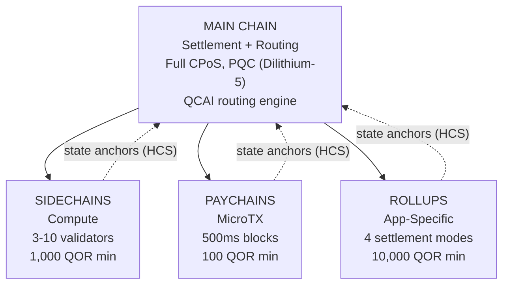

# البنية متعددة الطبقات

تطبّق QoreChain **بنية سلاسل هرمية من 4 مستويات** عبر وحدة `x/multilayer`. وتعمل السلسلة الرئيسية بوصفها جذر التسوية والثقة، بينما تتولى الطبقات الفرعية (السلاسل الجانبية وسلاسل الدفع والتجميعات) الأعباء المتخصصة بمقايضات مختلفة في الأداء والأمان.

---

## نظرة عامة على النظام

يوضّح التسلسل الهرمي من 4 مستويات أدناه السلسلة الرئيسية بوصفها جذر التسوية والثقة، مع ثلاثة أنواع من الطبقات الفرعية ترسو جذور حالتها إليها عبر مخططات الالتزام الهرمي (Hierarchical Commitment Schemes، HCS).



```
                    +---------------------------+
                    |       MAIN CHAIN          |
                    |  (Settlement + Routing)   |
                    |  Full CPoS consensus      |
                    |  PQC-secured (Dilithium-5)|
                    |  QCAI routing engine       |
                    +------+------+------+------+
                           |      |      |
              +------------+      |      +------------+
              |                   |                    |
    +---------v--------+ +-------v--------+ +---------v---------+
    |   SIDECHAINS     | |   PAYCHAINS    | |     ROLLUPS       |
    |  (Compute)       | |  (MicroTX)     | |  (App-Specific)   |
    |  3-10 validators | |  500ms blocks  | |  4 settlement     |
    |  1,000 QOR min   | |  100 QOR min   | |    modes          |
    |  Max: 10         | |  Max: 50       | |  10,000 QOR min   |
    +------------------+ +----------------+ |  Max: 100         |
                                            +-------------------+
```

---

## أنواع الطبقات

### السلسلة الرئيسية

السلسلة الرئيسية هي جذر الثقة لمنظومة QoreChain بأكملها.

| الخاصية   | القيمة                                                                          |
| ---------- | ------------------------------------------------------------------------------ |
| الإجماع  | CPoS ثلاثي التجمّعات الكامل (راجع [آلية الإجماع](/architecture/consensus-mechanism)) |
| الأمان   | مؤمَّنة بـPQC بتواقيع Dilithium-5                                        |
| الدور       | طبقة التسوية، تخزين مراسي الحالة، محرك توجيه QCAI، جذر الثقة        |
| زمن الكتلة | \~5 ثوانٍ                                                                    |

ترسو جميع الطبقات الفرعية جذور حالتها دوريًا إلى السلسلة الرئيسية عبر مخططات الالتزام الهرمي (HCS).

### السلاسل الجانبية

تتولى السلاسل الجانبية **العمليات كثيفة الحوسبة** مثل بروتوكولات التمويل اللامركزي ومحركات الألعاب ومعالجة بيانات إنترنت الأشياء.

| المعامل                 | القيمة             |
| ------------------------- | ----------------- |
| الحد الأدنى للمدققين        | 3                 |
| الحد الأقصى للمدققين        | 10                |
| الحد الأدنى لحصة المنشئ     | 1,000 QOR         |
| الحد الأقصى للسلاسل الجانبية النشطة | 10                |
| المجالات المستهدفة            | DeFi، Gaming، IoT |

### سلاسل الدفع

سلاسل الدفع مُحسَّنة لـ**المعاملات الصغيرة عالية التردد** بأدنى زمن استجابة.

| المعامل                | القيمة                                   |
| ------------------------ | --------------------------------------- |
| زمن الكتلة المستهدف        | 500 ms                                  |
| الحد الأقصى لسلاسل الدفع النشطة | 50                                      |
| الحد الأدنى لحصة المنشئ    | 100 QOR                                 |
| المجالات المستهدفة           | المدفوعات، البثّ، المعاملات الصغيرة |

### التجميعات

التجميعات هي **سلاسل خاصة بالتطبيقات** تُنشَر عبر مجموعة تطوير التجميعات (`x/rdk`). وتُسجَّل بوصفها نوع طبقة تجميع داخل وحدة الطبقات المتعددة.

| المعامل              | القيمة                                       |
| ---------------------- | ------------------------------------------- |
| أوضاع التسوية       | 4 (optimistic، zk، based، sovereign)        |
| الحد الأقصى للتجميعات النشطة | 100                                         |
| الحد الأدنى لحصة المنشئ  | 10,000 QOR                                  |
| نوع الطبقة             | `rollup`                                    |
| المجالات المستهدفة         | DeFi، Gaming، NFT، Enterprise               |

يُغطّى نشر التجميعات وإعدادها بالتفصيل في [مجموعة تطوير التجميعات](/architecture/rollup-development-kit).

---

## توجيه المعاملات بـQCAI

يقيّم موجِّه QCAI جميع الطبقات النشطة لكل معاملة واردة ويختار الوجهة المثلى باستخدام نموذج تسجيل موزون من 4 عوامل.

### معادلة التسجيل

تحصل كل طبقة مرشَّحة على درجة مركّبة (الأعلى أفضل):

```
Score = w_congestion * (1 - Congestion) + w_capability * Capability + w_cost * (1 - Cost) + w_latency * (1 - Latency)
```

| العامل     | الوزن | الوصف                                                                 |
| ---------- | ------ | --------------------------------------------------------------------------- |
| الازدحام | 0.30   | مستوى الحمل الحالي (معكوس: ازدحام أقل = درجة أعلى)              |
| القدرة | 0.40   | مدى مطابقة الطبقة لمتطلبات المعاملة                     |
| التكلفة       | 0.20   | مضاعِف الرسوم نسبةً للسلسلة الرئيسية (معكوس: تكلفة أقل = درجة أعلى) |
| زمن الاستجافة    | 0.10   | الزمن المتوقَّع حتى الحسم (معكوس: زمن استجابة أقل = درجة أعلى)          |

### عتبة الثقة

يتطلب الموجِّه درجة ثقة دنيا قدرها **0.6** قبل توجيه معاملة إلى طبقة فرعية. وإذا لم تستوفِ أي طبقة هذه العتبة، تتحوّل المعاملة افتراضيًا إلى السلسلة الرئيسية.

يمكن لمرسِل المعاملة تقديم تلميح بطبقة مفضَّلة. وإذا سجّلت الطبقة المفضَّلة 80% على الأقل من عتبة الثقة (أي 0.48)، تُقبَل بوصفها وجهة التوجيه.

### إرشادات الحمولة

عندما تكون البيانات الوصفية المفصَّلة للمعاملة غير متاحة، يستخدم الموجِّه حجم الحمولة بوصفه إشارة تصنيف:

| حجم الحمولة      | الطبقة المفضَّلة | المبرّر                                    |
| ----------------- | --------------- | -------------------------------------------- |
| &lt; 256 bytes    | سلسلة دفع        | على الأرجح تحويل بسيط أو معاملة صغيرة |
| 256 - 1,024 bytes | السلسلة الرئيسية      | تعقيد معاملة قياسي              |
| > 1,024 bytes     | سلسلة جانبية       | على الأرجح تفاعل عقد معقّد        |

---

## مخططات الالتزام الهرمي (HCS)

تلتزم الطبقات الفرعية بحالتها دوريًا للسلسلة الرئيسية عبر **مراسي الحالة**. ويحتوي كل مرساة على إثبات تشفيري لحالة السلسلة الفرعية عند ارتفاع معيَّن.

### محتويات المرساة

| الحقل                     | الوصف                                          |
| ------------------------- | ---------------------------------------------------- |
| `layer_id`                | معرّف الطبقة الفرعية                   |
| `layer_height`            | ارتفاع الكتلة على السلسلة الفرعية                 |
| `state_root`              | جذر ميركل لشجرة حالة السلسلة الفرعية     |
| `validator_set_hash`      | تجزئة مجموعة المدققين التي وقّعت الالتزام |
| `pqc_aggregate_signature` | توقيع Dilithium-5 المجمَّع على بيانات المرساة |
| `transaction_count`       | عدد المعاملات منذ المرساة الأخيرة         |
| `compressed_state_proof`  | إثبات انتقال الحالة المضغوط                |

### تقديم المرساة

تُقدَّم المراسي إلى السلسلة الرئيسية عبر `MsgAnchorState`. ويتحقق الحافظ (keeper) من المرساة وفق الخطوات التالية:

1. **الطبقة موجودة ونشطة** — يتحقق الحافظ من أن الطبقة موجودة في الحالة وأن وضعها حاليًا `active`.
2. **انقضاء الحد الأدنى لفاصل المرساة** — يتحقق الحافظ من انقضاء `min_anchor_interval` كتلة على الأقل (الافتراضي: 100) منذ آخر مرساة لهذه الطبقة.
3. **توقيع PQC المجمَّع** — يتأكد الحافظ من وجود توقيع PQC المجمَّع وصحته لبيانات المرساة.

### فترة الطعن

تدخل كل مرساة **فترة طعن** مدتها **24 ساعة** (86,400 ثانية، قابلة للضبط لكل طبقة). وخلال هذه الفترة، يمكن لأي طرف الطعن في المرساة بتقديم إثبات احتيال عبر `MsgChallengeAnchor`. وإذا كان إثبات الاحتيال صحيحًا، تُبطَل المرساة وتُعاد حالة السلسلة الفرعية إلى المرساة السابقة.

بعد انقضاء فترة الطعن دون طعن ناجح، تُعَدّ المرساة محسومة.

---

## تجميع الرسوم عبر الطبقات (CLFB)

يتيح CLFB لدفعة رسوم واحدة على الطبقة المصدر أن تغطي التنفيذ عبر طبقات متعددة في مسار معاملة عابرة للطبقات.

### حساب الرسوم

```
avgMultiplier = sum(layer_multiplier_i) / num_layers
bundledFee = (totalGas / 1000) * avgMultiplier
```

حيث:

* `layer_multiplier_i` هو مضاعِف الرسوم الأساسي لكل طبقة في مسار المعاملة (السلسلة الرئيسية = 1.0).
* `totalGas` هو إجمالي استهلاك الغاز المقدَّر عبر جميع الطبقات.
* النتيجة مقوَّمة بوحدة **uqor** بحد أدنى للرسوم قدره 1 uqor.

### مثال

تمسّ معاملة عابرة للطبقات ثلاث طبقات: السلسلة الرئيسية (المضاعِف 1.0)، وسلسلة جانبية (المضاعِف 0.5)، وسلسلة دفع (المضاعِف 0.1).

```
avgMultiplier = (1.0 + 0.5 + 0.1) / 3 = 0.533
bundledFee = (150,000 / 1000) * 0.533 = 80 uqor
```

يمكن تفعيل CLFB أو تعطيله عالميًا عبر معامل `cross_layer_fee_bundling`، ويمكن للطبقات الفردية الانسحاب عبر علامة الإعداد `cross_layer_fee_bundling_enabled` الخاصة بها.

---

## دورة حياة الطبقة

تمرّ كل طبقة فرعية بدورة حياة محدَّدة جيدًا:

```
Proposed --> Active --> Suspended --> Decommissioned
                  \                /
                   +-- Active <--+
```

| الوضع             | الوصف                                                                     | الانتقالات المسموحة       |
| ------------------ | ------------------------------------------------------------------------------- | ------------------------- |
| **Proposed**       | الطبقة مسجَّلة لكنها لم تُفعَّل بعد                                 | Active، Decommissioned    |
| **Active**         | الطبقة عاملة وتقبل المعاملات                                 | Suspended، Decommissioned |
| **Suspended**      | الطبقة متوقفة مؤقتًا (مثلًا للصيانة أو بسبب مخاوف أمنية) | Active، Decommissioned    |
| **Decommissioned** | الطبقة موقَفة بشكل دائم (حالة طرفية)                                 | لا شيء                      |

يفرض الحافظ انتقالات الوضع. وتُرفَض الانتقالات غير الصالحة (مثل Decommissioned إلى Active).

---

## المعاملات

| المعامل                      | النوع   | الافتراضي         | الوصف                                             |
| ------------------------------ | ------ | --------------- | ------------------------------------------------------- |
| `max_sidechains`               | uint64 | `10`            | الحد الأقصى لعدد السلاسل الجانبية النشطة                     |
| `max_paychains`                | uint64 | `50`            | الحد الأقصى لعدد سلاسل الدفع النشطة                      |
| `min_anchor_interval`          | uint64 | `100`           | الحد الأدنى للكتل بين مراسي الحالة                    |
| `max_anchor_interval`          | uint64 | `1,000`         | الحد الأقصى للكتل بين مراسي الحالة (مرساة مفروضة)    |
| `default_challenge_period`     | uint64 | `86,400`        | فترة الطعن الافتراضية بالثواني (24 ساعة)          |
| `min_sidechain_stake`          | string | `1,000,000,000` | الحد الأدنى للحصة لإنشاء سلسلة جانبية (1,000 QOR بوحدة uqor) |
| `min_paychain_stake`           | string | `100,000,000`   | الحد الأدنى للحصة لإنشاء سلسلة دفع (100 QOR بوحدة uqor)    |
| `routing_enabled`              | bool   | `true`          | تفعيل توجيه المعاملات القائم على QCAI                   |
| `routing_confidence_threshold` | string | `0.6`           | الحد الأدنى للثقة لقرارات توجيه QCAI           |
| `cross_layer_fee_bundling`     | bool   | `true`          | تفعيل تجميع الرسوم عبر الطبقات عالميًا                  |
