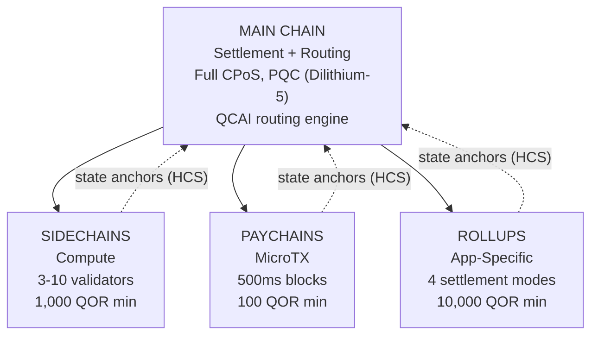

# البنية متعددة الطبقات

تطبّق QoreChain **بنية سلسلة هرمية من 4 مستويات** من خلال وحدة `x/multilayer`. تعمل السلسلة الرئيسية بوصفها جذر التسوية والثقة، بينما تتولى الطبقات الفرعية (السلاسل الجانبية، وسلاسل الدفع، والـ rollups) أعباء العمل المتخصصة بمقايضات مختلفة من حيث الأداء والأمان.

---

## نظرة عامة على النظام

تُظهر الهرمية المؤلفة من 4 مستويات أدناه السلسلة الرئيسية بوصفها جذر التسوية والثقة، مع ثلاثة أنواع من الطبقات الفرعية التي ترسّخ جذور حالتها إليها عبر مخططات الالتزام الهرمية (HCS).



```
                    +---------------------------+
                    |       MAIN CHAIN          |
                    |  (Settlement + Routing)   |
                    |  Full CPoS consensus      |
                    |  PQC-secured (Dilithium-5)|
                    |  QCAI routing engine       |
                    +------+------+------+------+
                           |      |      |
              +------------+      |      +------------+
              |                   |                    |
    +---------v--------+ +-------v--------+ +---------v---------+
    |   SIDECHAINS     | |   PAYCHAINS    | |     ROLLUPS       |
    |  (Compute)       | |  (MicroTX)     | |  (App-Specific)   |
    |  3-10 validators | |  500ms blocks  | |  4 settlement     |
    |  1,000 QOR min   | |  100 QOR min   | |    modes          |
    |  Max: 10         | |  Max: 50       | |  10,000 QOR min   |
    +------------------+ +----------------+ |  Max: 100         |
                                            +-------------------+
```

---

## أنواع الطبقات

### السلسلة الرئيسية

السلسلة الرئيسية هي جذر الثقة لمنظومة QoreChain بأكملها.

| الخاصية   | القيمة                                                                          |
| ---------- | ------------------------------------------------------------------------------ |
| التوافق  | Triple-Pool CPoS كامل (انظر [آلية التوافق](/architecture/consensus-mechanism)) |
| الأمان   | مؤمَّنة بـ PQC باستخدام توقيعات Dilithium-5                                        |
| الدور       | طبقة التسوية، تخزين مراسي الحالة، محرك توجيه QCAI، جذر الثقة        |
| زمن الكتلة | \~5 ثوانٍ                                                                    |

تقوم جميع الطبقات الفرعية دوريًا بترسيخ جذور حالتها إلى السلسلة الرئيسية عبر مخططات الالتزام الهرمية (HCS).

### السلاسل الجانبية

تتولى السلاسل الجانبية **العمليات كثيفة الحوسبة** مثل بروتوكولات DeFi، ومحركات الألعاب، ومعالجة بيانات إنترنت الأشياء.

| المعامل                 | القيمة             |
| ------------------------- | ----------------- |
| الحد الأدنى للمدققين        | 3                 |
| الحد الأقصى للمدققين        | 10                |
| الحد الأدنى لرهان المنشئ     | 1,000 QOR         |
| الحد الأقصى للسلاسل الجانبية النشطة | 10                |
| المجالات المستهدفة            | DeFi, Gaming, IoT |

### سلاسل الدفع

سلاسل الدفع مُحسَّنة من أجل **المعاملات الدقيقة عالية التردد** بأدنى زمن استجابة.

| المعامل                | القيمة                                   |
| ------------------------ | --------------------------------------- |
| زمن الكتلة المستهدف        | 500 ms                                  |
| الحد الأقصى لسلاسل الدفع النشطة | 50                                      |
| الحد الأدنى لرهان المنشئ    | 100 QOR                                 |
| المجالات المستهدفة           | المدفوعات، البث، المعاملات الدقيقة |

### Rollups

الـ rollups هي **سلاسل خاصة بالتطبيقات** تُنشر عبر مجموعة تطوير الـ Rollup (`x/rdk`). وتُسجَّل بوصفها نوع طبقة rollup ضمن وحدة multilayer.

| المعامل              | القيمة                                       |
| ---------------------- | ------------------------------------------- |
| أوضاع التسوية       | 4 (optimistic, zk, based, sovereign)        |
| الحد الأقصى للـ rollups النشطة | 100                                         |
| الحد الأدنى لرهان المنشئ  | 10,000 QOR                                  |
| نوع الطبقة             | `rollup`                                    |
| المجالات المستهدفة         | DeFi, Gaming, NFT, Enterprise               |

يُغطّى نشر الـ rollup وتهيئته بالتفصيل في [مجموعة تطوير الـ Rollup](/architecture/rollup-development-kit).

---

## توجيه معاملات QCAI

يقيّم موجّه QCAI جميع الطبقات النشطة لكل معاملة واردة ويختار الوجهة المثلى باستخدام نموذج تسجيل مرجّح رباعي العوامل.

### صيغة التسجيل

تتلقى كل طبقة مرشحة درجة مركّبة (الأعلى أفضل):

```
Score = w_congestion * (1 - Congestion) + w_capability * Capability + w_cost * (1 - Cost) + w_latency * (1 - Latency)
```

| العامل     | الوزن | الوصف                                                                 |
| ---------- | ------ | --------------------------------------------------------------------------- |
| Congestion | 0.30   | مستوى الحمل الحالي (معكوس: ازدحام أقل = درجة أعلى)              |
| Capability | 0.40   | مدى تطابق الطبقة مع متطلبات المعاملة                     |
| Cost       | 0.20   | مضاعِف الرسوم نسبةً إلى السلسلة الرئيسية (معكوس: تكلفة أقل = درجة أعلى) |
| Latency    | 0.10   | الزمن المتوقع للنهائية (معكوس: زمن استجابة أقل = درجة أعلى)          |

### عتبة الثقة

يتطلب الموجّه درجة ثقة دنيا قدرها **0.6** قبل توجيه معاملة إلى طبقة فرعية. وإذا لم تستوفِ أي طبقة هذه العتبة، تتحول المعاملة افتراضيًا إلى السلسلة الرئيسية.

يمكن لمرسل المعاملة تقديم تلميح بطبقة مفضّلة. وإذا سجّلت الطبقة المفضّلة ما لا يقل عن 80% من عتبة الثقة (أي 0.48)، تُقبل بوصفها هدف التوجيه.

### استدلالات الحمولة

عندما تكون البيانات الوصفية التفصيلية للمعاملة غير متوفرة، يستخدم الموجّه حجم الحمولة بوصفه إشارة تصنيف:

| حجم الحمولة      | الطبقة المفضّلة | الأساس المنطقي                                    |
| ----------------- | --------------- | -------------------------------------------- |
| &lt; 256 bytes    | Paychain        | على الأرجح تحويل بسيط أو معاملة دقيقة |
| 256 - 1,024 bytes | Main Chain      | تعقيد معاملة قياسي              |
| > 1,024 bytes     | Sidechain       | على الأرجح تفاعل عقد معقّد        |

---

## مخططات الالتزام الهرمية (HCS)

تلتزم الطبقات الفرعية دوريًا بحالتها إلى السلسلة الرئيسية عبر **مراسي الحالة**. يحتوي كل مرساة على إثبات تشفيري لحالة السلسلة الفرعية عند ارتفاع معيّن.

### محتويات المرساة

| الحقل                     | الوصف                                          |
| ------------------------- | ---------------------------------------------------- |
| `layer_id`                | معرّف الطبقة الفرعية                   |
| `layer_height`            | ارتفاع الكتلة على السلسلة الفرعية                 |
| `state_root`              | جذر Merkle لشجرة حالة السلسلة الفرعية     |
| `validator_set_hash`      | تجزئة مجموعة المدققين التي وقّعت الالتزام |
| `pqc_aggregate_signature` | توقيع Dilithium-5 المجمّع على بيانات المرساة |
| `transaction_count`       | عدد المعاملات منذ المرساة الأخيرة         |
| `compressed_state_proof`  | إثبات انتقال الحالة المضغوط                   |

### تقديم المراسي

تُقدَّم المراسي إلى السلسلة الرئيسية عبر `MsgAnchorState`. ويتحقق الـ keeper من صحة المرساة وفق الخطوات التالية:

1. **الطبقة موجودة ونشطة** — يتحقق الـ keeper من أن الطبقة موجودة في الحالة ولها حاليًا الحالة `active`.
2. **انقضاء الحد الأدنى لفترة الترسيخ** — يتحقق الـ keeper من انقضاء ما لا يقل عن `min_anchor_interval` كتلة (الافتراضي: 100) منذ المرساة الأخيرة لهذه الطبقة.
3. **توقيع PQC المجمّع** — يضمن الـ keeper أن توقيع PQC المجمّع موجود وصالح لبيانات المرساة.

### فترة الطعن

تدخل كل مرساة في **فترة طعن** مدتها **24 ساعة** (86,400 ثانية، قابلة للتهيئة لكل طبقة). خلال هذه الفترة، يمكن لأي طرف الاعتراض على المرساة بتقديم إثبات احتيال عبر `MsgChallengeAnchor`. وإذا كان إثبات الاحتيال صالحًا، تُبطَل المرساة وتُعاد حالة السلسلة الفرعية إلى المرساة السابقة.

بعد انقضاء فترة الطعن دون اعتراض ناجح، تُعتبر المرساة نهائية.

### قراءة المراسي

اعتبارًا من إصدار السلسلة **v3.1.80**، أصبحت المراسي أيضًا **قابلة للقراءة** من خلال خدمة استعلام multilayer. يكشف استعلامان عن حالة المرساة عبر كل من gRPC و REST:

* **`Anchor`** (`/qorechain/multilayer/v1/anchor/{layer_id}`) — يعيد آخر مرساة حالة نهائية لطبقة.
* **`Anchors`** (`/qorechain/multilayer/v1/anchors/{layer_id}`) — يعيد سجل المراسي لطبقة.

ولأن كل مرساة تحمل توقيع Dilithium-5 على الرسالة المعيارية `layer_id || layer_height || state_root || validator_set_hash` (يُتحقق منه مقابل مفتاح PQC المسجّل لمنشئ الطبقة)، يمكن للعميل جلب مرساة والتحقق منها **دون اتصال**، دون الوثوق بالعقدة المقدِّمة للخدمة. وهذه هي البدائية على السلسلة وراء [إيصالات التسوية الآمنة كموميًا](/rollups/settlement-receipts) في مجموعة تطوير الـ Rollup.

---

## تجميع الرسوم عبر الطبقات (CLFB)

يتيح CLFB لدفعة رسوم واحدة على الطبقة المصدر تغطية التنفيذ عبر طبقات متعددة في مسار معاملة عبر الطبقات.

### حساب الرسوم

```
avgMultiplier = sum(layer_multiplier_i) / num_layers
bundledFee = (totalGas / 1000) * avgMultiplier
```

حيث:

* `layer_multiplier_i` هو مضاعِف الرسوم الأساسي لكل طبقة في مسار المعاملة (السلسلة الرئيسية = 1.0).
* `totalGas` هو إجمالي استهلاك الغاز المقدّر عبر جميع الطبقات.
* تكون النتيجة مقوّمة بـ **uqor** بحد أدنى للرسوم قدره 1 uqor.

### مثال

تمسّ معاملة عبر الطبقات ثلاث طبقات: السلسلة الرئيسية (مضاعِف 1.0)، وسلسلة جانبية (مضاعِف 0.5)، وسلسلة دفع (مضاعِف 0.1).

```
avgMultiplier = (1.0 + 0.5 + 0.1) / 3 = 0.533
bundledFee = (150,000 / 1000) * 0.533 = 80 uqor
```

يمكن تمكين CLFB أو تعطيله عالميًا عبر المعامل `cross_layer_fee_bundling`، ويمكن للطبقات الفردية الانسحاب عبر علامة التهيئة `cross_layer_fee_bundling_enabled` الخاصة بها.

---

## دورة حياة الطبقة

تتقدم كل طبقة فرعية عبر دورة حياة محددة جيدًا:

```
Proposed --> Active --> Suspended --> Decommissioned
                  \                /
                   +-- Active <--+
```

| الحالة             | الوصف                                                                     | الانتقالات المسموح بها       |
| ------------------ | ------------------------------------------------------------------------------- | ------------------------- |
| **Proposed**       | جرى تسجيل الطبقة لكن لم تُفعَّل بعد                                 | Active, Decommissioned    |
| **Active**         | الطبقة قيد التشغيل وتقبل المعاملات                                 | Suspended, Decommissioned |
| **Suspended**      | الطبقة موقوفة مؤقتًا (مثلًا للصيانة أو بسبب مخاوف أمنية) | Active, Decommissioned    |
| **Decommissioned** | الطبقة مغلقة نهائيًا (حالة طرفية)                                 | لا شيء                      |

تُفرض انتقالات الحالة بواسطة الـ keeper. وتُرفض الانتقالات غير الصالحة (مثلًا من Decommissioned إلى Active).

---

## المعاملات

| المعامل                      | النوع   | الافتراضي         | الوصف                                             |
| ------------------------------ | ------ | --------------- | ------------------------------------------------------- |
| `max_sidechains`               | uint64 | `10`            | الحد الأقصى لعدد السلاسل الجانبية النشطة                     |
| `max_paychains`                | uint64 | `50`            | الحد الأقصى لعدد سلاسل الدفع النشطة                      |
| `min_anchor_interval`          | uint64 | `100`           | الحد الأدنى للكتل بين مراسي الحالة                    |
| `max_anchor_interval`          | uint64 | `1,000`         | الحد الأقصى للكتل بين مراسي الحالة (ترسيخ قسري)    |
| `default_challenge_period`     | uint64 | `86,400`        | فترة الطعن الافتراضية بالثواني (24 ساعة)          |
| `min_sidechain_stake`          | string | `1,000,000,000` | الحد الأدنى للرهان لإنشاء سلسلة جانبية (1,000 QOR بـ uqor) |
| `min_paychain_stake`           | string | `100,000,000`   | الحد الأدنى للرهان لإنشاء سلسلة دفع (100 QOR بـ uqor)    |
| `routing_enabled`              | bool   | `true`          | تمكين توجيه المعاملات المعتمد على QCAI                   |
| `routing_confidence_threshold` | string | `0.6`           | الحد الأدنى للثقة لقرارات توجيه QCAI           |
| `cross_layer_fee_bundling`     | bool   | `true`          | تمكين تجميع الرسوم عبر الطبقات عالميًا                  |
