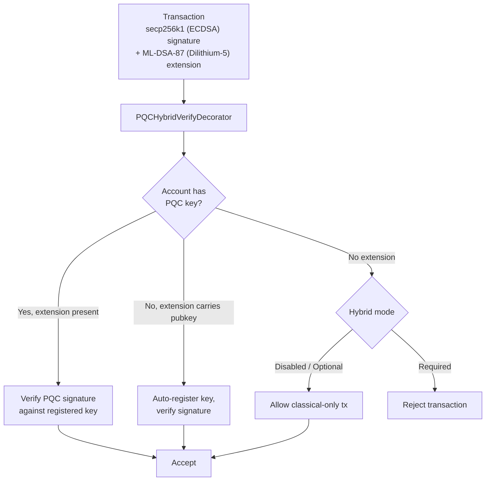

# الأمان ما بعد الكمومي

بُنيت QoreChain بـ**التشفير ما بعد الكمومي (post-quantum cryptography، PQC) منذ نشأتها** — لا مُضافًا لاحقًا كترقية. وتوفّر وحدة `x/pqc` تواقيع رقمية شبكية (lattice-based) وتغليفًا للمفاتيح بوصفها البدائيات التشفيرية الأساسية، مع إطار رشاقة خوارزمية خاضع للحوكمة من أجل المرونة طويلة الأمد.

اكتمل الآن خطّ الأساس الكامل لـPQC — **Dilithium-5 (التواقيع) + ML-KEM-1024 (KEM) + SHAKE-256 (التجزئة)** — وأصبح هو الافتراضي للشبكة. واعتبارًا من إصدار السلسلة الحالي (**v3.1.77**)، أصبحت التواقيع الهجينة **مطلوبة افتراضيًا** على مسار معاملات cosmos: `hybrid_signature_mode = required` و`allow_classical_fallback = false`. ويجب أن تحمل كل معاملة على مسار cosmos توقيع Dilithium-5 إلى جانب توقيعها الكلاسيكي secp256k1؛ وتُرفَض المعاملات الكلاسيكية فقط الصادرة من حساب PQC، كما أُغلق مسار التخفيض الكلاسيكي.

## مبادئ التصميم

* **PQC مطلوب افتراضيًا**: التواقيع ما بعد الكمومية إلزامية على مسار cosmos. ولم تعد تواقيع secp256k1 الكلاسيكية وحدها كافية — `allow_classical_fallback = false`.
* **هجين افتراضيًا**: تحمل معاملات cosmos في آنٍ واحد توقيعًا كلاسيكيًا secp256k1 وتوقيع PQC من نوع Dilithium-5. والاحتياط الكلاسيكي فقط مُغلق.
* **رشاقة الخوارزميات**: سجلّ الخوارزميات التشفيرية خاضع للحوكمة، ما يتيح للشبكة اعتماد خوارزميات جديدة أو إيقاف المخترَقة دون انقسامات صلبة (hard forks).
* **التحقق الحتمي**: كل عمليات التحقق من التواقيع حتمية وقابلة لإعادة الإنتاج عبر عقد المدققين.

## الخوارزميات المدعومة

| الخوارزمية       | المعيار             | الفئة          | مستوى NIST | المفتاح العام  | المفتاح الخاص | التوقيع / النص المشفَّر | السرّ المشترك |
| --------------- | -------------------- | ----------------- | ---------- | ----------- | ----------- | ---------------------- | ------------- |
| **Dilithium-5** | ML-DSA-87 (FIPS 204) | توقيع         | 5          | 2,592 bytes | 4,896 bytes | 4,627 bytes            | --            |
| **ML-KEM-1024** | FIPS 203             | تغليف المفاتيح | 5          | 1,568 bytes | 3,168 bytes | 1,568 bytes            | 32 bytes      |

تعمل كلتا الخوارزميتين عند **مستوى الأمان 5 من NIST**، وهو أعلى فئة أمان موحَّدة، ما يوفّر حمايةً مكافئة لـAES-256 ضد الخصوم الكلاسيكيين والكموميين على حدٍّ سواء.

## الخلفية التشفيرية

تُطبَّق عمليات PQC في خلفية تشفيرية عالية الأداء وآمنة الذاكرة تتيح التوقيع والتحقق الشبكيين وتغليف المفاتيح لزمن تشغيل QoreChain. وتوفّر الخلفية:

عمليات خاصة بالخوارزمية:

* توليد مفاتيح Dilithium-5 والتوقيع والتحقق
* توليد مفاتيح ML-KEM-1024 والتغليف وفكّ التغليف
* توليد إشارة عشوائية حتمية (`seed`، `epoch`)

عمليات مدركة للخوارزمية:

* `Keygen(algorithmID)` — توليد زوج مفاتيح لأي خوارزمية مسجَّلة
* `Sign(algorithmID, privkey, message)` — إنشاء توقيع
* `Verify(algorithmID, pubkey, message, signature)` — التحقق من توقيع
* `AlgorithmInfo(algorithmID)` — الاستعلام عن أحجام المفاتيح/المخرجات
* `ListAlgorithms()` — تعداد جميع الخوارزميات المدعومة

كل عمليات التوقيع والتحقق حتمية وتنتج نتائج متطابقة عبر كل عقدة مدقق ومنصة مدعومة.

تتوفّر هذه البدائيات نفسها — ML-DSA (FIPS-204) وML-KEM (FIPS-203) وSHAKE-256 (FIPS-202) — للمحافظ والمكامِلين عبر مكتبة [**qorechain-pqc**](https://github.com/qorechain/qorechain-pqc) مفتوحة المصدر، التي توفّر واجهة برمجية واحدة متسقة ومتوافقة على مستوى البايت عبر ست لغات (JavaScript/TypeScript، Rust، Go، C، Python، Java). راجع [التوقيع ما بعد الكمومي](/developer-guide/post-quantum-signing).

## تسجيل المفاتيح

تسجّل الحسابات مفاتيح PQC عبر `MsgRegisterPQCKey` (القديم، يُعتمد افتراضيًا على Dilithium-5) أو `MsgRegisterPQCKeyV2` (المدرك للخوارزمية). وتتضمن كل رسالة:

* **Sender**: عنوان الحساب الذي يسجّل المفتاح.
* **PublicKey**: بايتات المفتاح العام لـPQC.
* **AlgorithmID**: معرّف خوارزمية PQC (الإصدار v2 فقط).
* **KeyType**: أحد ثلاثة أوضاع تسجيل:

| نوع المفتاح         | الوصف                                                              |
| ---------------- | ------------------------------------------------------------------------ |
| `hybrid`         | مفتاحان كلاسيكي (ECDSA) وPQC معًا. تحمل المعاملات توقيعين مزدوجين. |
| `pqc_only`       | مفتاح PQC فقط. التوقيع الكلاسيكي غير مطلوب.                       |
| `classical_only` | مفتاح كلاسيكي فقط. لا حماية PQC (غير موصى به).                 |

## التواقيع الهجينة

يتطلب نظام التواقيع الهجينة أن تحمل معاملات مسار cosmos في آنٍ واحد **كلًّا من** توقيع كلاسيكي وتوقيع PQC. ويوفّر هذا دفاعًا متعمّقًا: حتى لو كُسر أحد المخططين، يحمي الآخر المعاملة.

مع الافتراضي الشبكي `hybrid_signature_mode = required`، يجب أن تتضمن كل معاملة على مسار cosmos امتداد Dilithium-5 إلى جانب توقيع secp256k1. والاستثناءات الوحيدة (للإقلاع) هي **معاملات التكوين عند النشأة gentxs (الارتفاع 0)** و**معاملات تسجيل/ترحيل مفتاح PQC** (`MsgRegisterPQCKey`، `MsgRegisterPQCKeyV2`، `MsgMigratePQCKey`)، التي يُسمح بأن تكون كلاسيكية فقط لكي تتمكّن الحسابات من تسجيل أول مفتاح PQC لها.

**معاملات EVM غير متأثرة.** تُصادَق معاملات EVM على مسار ما قبل المعاملة المنفصل `eth_secp256k1` (مسار محرك EVM في QoreChain) ولا تتطلب أبدًا امتداد PQC الهجين. ولا ينطبق الشرط الهجين إلا على مسار معاملات cosmos.

### تدفّق التوقيع المشترك

لإنتاج معاملة cosmos متوافقة، يُحسَب توقيع secp256k1 الكلاسيكي على بايتات التوقيع القياسية (التي تستثني امتداد PQC)، ويُحسَب توقيع Dilithium-5 ويُرفَق بوصفه امتداد `PQCHybridSignature`. ويجب على أدوات CosmJS / المُرحِّل القياسية إنتاج هذا الامتداد للتعامل على مسار cosmos. ويُنجَز ذلك اليوم عبر:

* `qorechaind tx pqc gen-key` — توليد مفتاح Dilithium-5.
* `qorechaind tx pqc cosign` — إرفاق التوقيع المشترك لـDilithium-5 بمعاملة.
* التوقيع الهجين في QoreChain SDK — `buildHybridTx` مع `includePqcPublicKey` (يضمّن المفتاح العام لـPQC للتسجيل التلقائي عند أول استخدام).

*معاملة موقَّعة بـsecp256k1 (ECDSA) إضافة إلى ML-DSA-87 (Dilithium-5)، يتحقق منها مُعالِج ما قبل المعاملة وفق وضع الفرض على مستوى السلسلة.*



### صيغة امتداد المعاملة

تُرفَق تواقيع PQC بالمعاملات بوصفها **امتداد معاملة (TX extension)** بعنوان النوع `/qorechain.pqc.v1.PQCHybridSignature`:

```text
{
  "algorithm_id": 1,
  "pqc_signature": "<4627 bytes for Dilithium-5>",
  "pqc_public_key": "<2592 bytes, optional>"
}
```

حقل `pqc_public_key` اختياري. وإذا كان موجودًا ولم يكن للحساب مفتاح PQC مسجَّل، فسيقوم مُعالِج ما قبل المعاملة بـ**التسجيل التلقائي** للمفتاح عند أول استخدام.

### PQCHybridVerifyDecorator

يعالج مُعالِج ما قبل المعاملة `PQCHybridVerifyDecorator` التواقيع الهجينة بمنطق تحقق ثلاثي:

| السيناريو | للحساب مفتاح PQC | الامتداد موجود | المفتاح العام في الامتداد | النتيجة                                              |
| -------- | ------------------- | ----------------- | ----------------------- | --------------------------------------------------- |
| المسار 1   | نعم                 | نعم               | --                      | التحقق من توقيع PQC مقابل المفتاح المسجَّل         |
| المسار 2   | لا                  | نعم               | نعم                     | تسجيل تلقائي للمفتاح، التحقق من التوقيع                 |
| المسار 3a  | لا                  | لا                | --                      | **الوضع الاختياري**: السماح بمعاملة كلاسيكية فقط |
| المسار 3b  | لا                  | لا                | --                      | **الوضع المطلوب**: رفض المعاملة               |
| المسار 4   | نعم                 | لا                | --                      | يُعالَج بواسطة PQCVerifyDecorator القياسي          |

### أوضاع التوقيع الهجين

مستوى فرض الهجين على مستوى السلسلة قابل للضبط بالحوكمة. **الافتراضي الشبكي الحالي هو `required`**:

| الوضع         | المعرّف | الافتراضي | السلوك                                                                                                          |
| ------------ | -- | ------- | ----------------------------------------------------------------------------------------------------------------- |
| **Disabled** | 0  | لا      | تواقيع كلاسيكية فقط. وتُتجاهَل امتدادات PQC.                                                            |
| **Optional** | 1  | لا      | تُتحقَّق امتدادات PQC إن وُجدت. ويمكن للحسابات بلا مفاتيح PQC التعامل بتواقيع كلاسيكية فقط.    |
| **Required** | 2  | **نعم** | يجب أن تحمل كل معاملات مسار cosmos توقيعين كلاسيكيًا وPQC. وتُرفَض المعاملات بلا امتداد PQC. |

أكملت الشبكة ترحيلها: **Optional** (النشأة) ← **Required** (الافتراضي الحالي منذ v3.1.71، مع `allow_classical_fallback = false`). وتبقى الأوضاع الثلاثة خاضعة للحوكمة ويمكن تعديلها بمقترح.

## إطار رشاقة الخوارزميات

يوفّر إطار رشاقة الخوارزميات سجلًّا خاضعًا للحوكمة لخوارزميات PQC، ما يتيح للشبكة إضافة خوارزميات جديدة وإيقاف الهشّة منها وترحيل الحسابات — كل ذلك دون انقسامات صلبة.

### دورة حياة الخوارزمية

لكل خوارزمية مسجَّلة وضع دورة حياة:

```
active --> migrating --> deprecated --> disabled
```

| الوضع         | الوصف                                                                                                                                 |
| -------------- | ------------------------------------------------------------------------------------------------------------------------------------------- |
| **Active**     | عاملة بالكامل. وتُقبَل تسجيلات المفاتيح الجديدة وعمليات التحقق.                                                                    |
| **Migrating**  | فترة التوقيع المزدوج نشطة. وتُشجَّع الحسابات على الترحيل إلى الخوارزمية البديلة. وتُقبَل التواقيع القديمة والجديدة معًا. |
| **Deprecated** | لا يزال يمكن التحقق من التواقيع القائمة، لكن لا تُقبَل تسجيلات مفاتيح جديدة.                                                       |
| **Disabled**   | مفتاح إيقاف طارئ. لا يمكن للخوارزمية التحقق من أي تواقيع. يُستخدَم عند اكتشاف ثغرة.                                 |

### الترحيل بالتوقيع المزدوج

عند إيقاف خوارزمية، تبدأ **فترة ترحيل** (الافتراضي: 1,000,000 كتلة، نحو 69 يومًا عند 6 ثوانٍ/كتلة). وخلال هذه الفترة:

1. يجب على الحسابات ذات المفاتيح المستخدِمة للخوارزمية الموقوفة الترحيل إلى البديلة.
2. يتطلب الترحيل توقيعين مزدوجين (`MsgMigratePQCKey`): واحد من المفتاح القديم وواحد من المفتاح الجديد، لإثبات ملكية كليهما.
3. تُقبَل كلتا الخوارزميتين للتحقق طوال فترة الترحيل.

### رسائل الحوكمة

| الرسالة                 | الوصف                                                                                                                                                       |
| ----------------------- | ----------------------------------------------------------------------------------------------------------------------------------------------------------- |
| `MsgAddAlgorithm`       | يقترح إضافة خوارزمية PQC جديدة إلى السجلّ. يتضمن `AlgorithmInfo` كاملًا (الاسم، الفئة، مستوى NIST، أحجام المفاتيح). ويجب تقديمه عبر الحوكمة. |
| `MsgDeprecateAlgorithm` | يبدأ عملية إيقاف خوارزمية. يحدّد الخوارزمية البديلة وفترة الترحيل بالكتل.                                              |
| `MsgDisableAlgorithm`   | يعطّل خوارزمية فورًا في حالة طوارئ. يتطلب نصّ سبب. يُستخدَم عند اكتشاف ثغرة تشفيرية.                                     |

### قابلية التوسعة

تتطلب إضافة خوارزمية جديدة:

1. تطبيق الخوارزمية في الخلفية التشفيرية خلف واجهة التوقيع والتحقق الموحَّدة.
2. تقديم مقترح حوكمة `MsgAddAlgorithm` مع بيانات الخوارزمية الوصفية.
3. حالما يُوافَق عليها، تصبح الخوارزمية متاحة لتسجيل المفاتيح والتحقق.

## تجزئة SHAKE-256

اعتبارًا من v3.1.73، أصبحت **SHAKE-256** (دالة SHA-3 ذات المخرجات القابلة للتمديد) هي **تجزئة التطبيق الافتراضية** عبر QoreChain — توفّرها حزمة `qorehash` — مكمِّلةً خطّ الأساس التشفيري المقاوم للكمومية إلى جانب تواقيع Dilithium-5 وتغليف مفاتيح ML-KEM-1024. وتوفّر وحدة `x/pqc` أدوات SHAKE-256 خالصة بلغة Go:

| الدالة                           | الوصف                       | المخرَج           |
| ---------------------------------- | --------------------------------- | ---------------- |
| `SHAKE256Hash(data, outputLen)`    | ملخّص SHAKE-256 متغيّر الطول  | طول اعتباطي |
| `SHAKE256Hash32(data)`             | ملخّص SHAKE-256 قياسي بـ256 بت | 32 bytes         |
| `SHAKE256ConcatHash(left, right)`  | تجزئة المدخلات المتسلسلة       | 32 bytes         |
| `SHAKE256DomainHash(domain, data)` | تجزئة مفصولة بالنطاق             | 32 bytes         |

تدعم هذه الأدوات تجزئة التطبيق الافتراضية وتُستخدَم لـ:

* تجزئة عقد شجرة ميركل
* التزامات التجزئة في إثباتات الطبقات المتقاطعة
* فصل النطاقات لسياقات تجزئة مختلفة (مثل `"leaf:"` مقابل `"node:"`)

## PQC للجسر

تستخدم جميع إثباتات الجسر العابر للسلاسل والتزامات الحالة تواقيع **Dilithium-5**. وتتطلب وحدة `x/multilayer` تواقيع PQC مجمَّعة على كل تقديم `MsgAnchorState`، وتؤمّن التزامات ML-KEM قنوات تبادل المفاتيح بين مُرحِّلي الجسر.

يضمن هذا ألا يتدهور أمان السلاسل المتقاطعة بسبب استخدام التشفير الكلاسيكي في بنية الجسر، محافظًا على المقاومة الكمومية عبر مكدّس البروتوكول بأكمله.

## معاملات الوحدة

| المعامل                  | النوع                | الافتراضي           | الوصف                                           |
| -------------------------- | ------------------- | ----------------- | ----------------------------------------------------- |
| `pqc_primary`              | bool                | `true`            | PQC هو مخطط التوقيع الأساسي                   |
| `allow_classical_fallback` | bool                | `false`           | الاحتياط الكلاسيكي فقط مُغلق؛ يجب أن تكون معاملات cosmos هجينة |
| `min_security_level`       | int32               | `5`               | الحد الأدنى لمستوى أمان NIST للخوارزميات المقبولة   |
| `default_migration_blocks` | int64               | `1,000,000`       | فترة ترحيل التوقيع المزدوج الافتراضية بالكتل     |
| `default_signature_algo`   | AlgorithmID         | `1` (Dilithium-5) | خوارزمية التوقيع الافتراضية لتسجيلات المفاتيح الجديدة |
| `hybrid_signature_mode`    | HybridSignatureMode | `2` (Required)    | مستوى فرض التوقيع الهجين على مستوى السلسلة         |

## ذات صلة

* [التوقيع ما بعد الكمومي](/developer-guide/post-quantum-signing) — مكتبة `qorechain-pqc` مفتوحة المصدر (ست لغات) لهذه البدائيات والتوقيع الهجين.
* [إعداد المحفظة](/getting-started/wallet-setup) — إنشاء وإدارة حسابات مدعومة بـPQC.
* [حسابات SDK والتوقيع بـPQC](/sdk/concepts/accounts-pqc) — المفاتيح والتوقيع ما بعد الكمومي من خلال الكود.
* [معاملات السلسلة](/appendix/chain-parameters) — الخوارزميات الافتراضية وإعدادات الترحيل.
* [بنية الجسر](/architecture/bridge-architecture) — التحقق بـPQC على الحزم العابرة للسلاسل.
