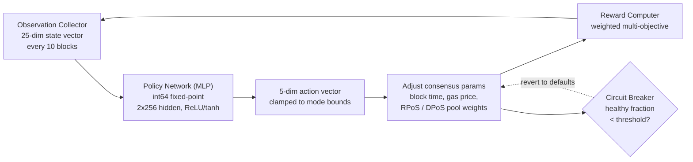

# محرك إجماع PRISM

تدمج QoreChain **PRISM** (Policy-driven Reinforcement-learning for Intelligent State Machines)، وهي طبقة تحسين قائمة على التعلّم المعزَّز، مباشرةً في طبقة الإجماع عبر وحدة `x/rlconsensus`. تراقب PRISM مقاييس السلسلة كل N كتلة، وتُجري الاستدلال عبر شبكة عصبية ثابتة الفاصلة، وتقترح تعديلات لمعاملات الإجماع — كل ذلك بشكل حتمي، دون أي حسابات فاصلة عائمة في المسارات الحرجة للإجماع.

*حلقة تحسين PRISM: مراقبة حالة السلسلة، تشغيل استدلال السياسة، حصر تغييرات المعاملات وتطبيقها، ثم تغذية النتيجة راجعةً.*



---

## نظرة عامة على البنية

تتألف PRISM من أربعة مكوّنات:

1. **مجمِّع المراقبة (Observation Collector)** — يجمع متجهات حالة السلسلة ذات الأبعاد الـ25 على فواصل قابلة للضبط.
2. **شبكة السياسة (Policy Network، MLP)** — مدرَك متعدد الطبقات أصيل بلغة Go يربط المراقبات بالإجراءات.
3. **حاسِب المكافأة (Reward Computer)** — يقيّم جودة تغييرات المعاملات باستخدام دالة موزونة متعددة الأهداف.
4. **قاطع الدارة (Circuit Breaker)** — يراقب صحة السلسلة ويعيد جميع المعاملات المضبوطة بـPRISM إن اكتُشف عدم استقرار.

تعمل جميع المكوّنات ضمن دورة حياة ABCI وتنتج مخرجات حتمية وقابلة للتحقق عبر كل عقد المدققين.

---

## شبكة السياسة

شبكة السياسة هي مدرَك متعدد الطبقات أمامي التغذية (MLP) مطبَّق بالكامل بلغة Go باستخدام **حساب فاصلة ثابتة من نوع int64** (مقيَّس بـ10^8).

### بنية الشبكة

| الخاصية            | القيمة                              |
| ------------------- | ---------------------------------- |
| أبعاد المدخل    | 25                                 |
| الطبقات المخفية       | 2                                  |
| أحجام الطبقات المخفية  | 256, 256                           |
| أبعاد المخرَج   | 5                                  |
| التفعيل (المخفي) | ReLU                               |
| التفعيل (المخرَج) | tanh                               |
| إجمالي المعاملات    | 73,733                             |
| الدقة           | فاصلة ثابتة int64 (مقيَّسة بـ10^8) |

### تفصيل عدد المعاملات

```
Layer 1: 25 * 256 + 256   =  6,656  (input -> hidden_1)
Layer 2: 256 * 256 + 256   = 65,792  (hidden_1 -> hidden_2)
Layer 3: 256 * 5 + 5       =  1,285  (hidden_2 -> output)
Total:                       73,733
```

### حساب الفاصلة الثابتة

تستخدم جميع حسابات الـMLP قيم `int64` مقيَّسة بـ`FixedPointScale = 10^8`. ويلغي هذا عدم الحتمية الناتج عن اختلافات تقريب الفاصلة العائمة وفق IEEE 754 عبر المنصات العتادية.

* **الضرب**: `fixMul(a, b) = (a / SCALE) * b + (a % SCALE) * b / SCALE` (مقسوم لمنع الفيضان)
* **ReLU**: `relu(x) = max(0, x)`
* **tanh**: مقرَّب بادي `tanh(x) ~ x * (3*S - x^2) / (3*S + x^2)` عندما `|x| <= 2.5*SCALE`، ويُحصَر إلى +/- SCALE خلاف ذلك

تُخزَّن أوزان السياسة على السلسلة بوصفها متجه `[]int64` مسطَّحًا ويمكن تحديثها عبر مقترح حوكمة.

---

## متجه المراقبة

تجمع PRISM متجه مراقبة ذا 25 بُعدًا عند كل فاصل مراقبة (الافتراضي: كل 10 كتل).

| الفهرس | البُعد              | الوصف                                      |
| ----- | ---------------------- | ------------------------------------------------ |
| 0     | `block_utilization`    | غاز الكتلة المستخدَم / حد غاز الكتلة                 |
| 1     | `tx_count`             | عدد المعاملات في الكتلة              |
| 2     | `avg_tx_size`          | متوسط حجم المعاملة بالبايت              |
| 3     | `block_time`           | الزمن منذ الكتلة السابقة (ms)                   |
| 4     | `block_time_delta`     | زمن الكتلة ناقص زمن الكتلة المستهدف (ms)          |
| 5     | `gas_price_50th`       | وسيط سعر الغاز                                 |
| 6     | `gas_price_95th`       | سعر الغاز عند المئين الـ95                        |
| 7     | `mempool_size`         | عدد المعاملات المعلَّقة                   |
| 8     | `mempool_bytes`        | إجمالي بايتات المعاملات المعلَّقة              |
| 9     | `validator_count`      | عدد المدققين النشطين                           |
| 10    | `validator_gini`       | معامل جيني لتوزيع قوة المدققين |
| 11    | `missed_block_ratio`   | نسبة المدققين الذين فاتهم التوقيع       |
| 12    | `avg_commit_latency`   | متوسط زمن استجابة جولة الالتزام (ms)                |
| 13    | `max_commit_latency`   | أقصى زمن استجابة لجولة الالتزام (ms)                |
| 14    | `precommit_ratio`      | نسبة التزامات ما قبل التثبيت المستلمة                 |
| 15    | `failed_tx_ratio`      | نسبة المعاملات الفاشلة                  |
| 16    | `avg_gas_per_tx`       | متوسط الغاز المستهلَك لكل معاملة                 |
| 17    | `reward_per_validator` | متوسط المكافأة لكل مدقق (uqor)                 |
| 18    | `slash_count`          | عدد أحداث القَطع في نافذة المراقبة  |
| 19    | `jail_count`           | عدد أحداث السجن في نافذة المراقبة     |
| 20    | `inflation_rate`       | معدّل الانبعاث الحالي                           |
| 21    | `bonded_ratio`         | الرموز المرهونة / إجمالي المعروض                  |
| 22    | `reputation_mean`      | متوسط درجة السمعة عبر المدققين النشطين   |
| 23    | `reputation_stddev`    | الانحراف المعياري لدرجات السمعة             |
| 24    | `mev_estimate`         | MEV المقدَّر المستخلَص (إرشادي)              |

تُخزَّن جميع القيم بوصفها تمثيلات نصية من نوع `LegacyDec` وتُحوَّل إلى فاصلة ثابتة int64 قبل الاستدلال.

---

## فضاء الإجراءات

مخرَج الـMLP هو متجه إجراء ذو 5 أبعاد، حيث يمثّل كل بُعد تغييرًا مقترحًا لمعامل إجماع. ويقيّد تفعيل tanh المخرجات الخام إلى \[-1، 1]، التي تُقيَّس بعدها بحدود خاصة بالوضع.

| الفهرس | بُعد الإجراء           | الوصف                                                             |
| ----- | -------------------------- | ----------------------------------------------------------------------- |
| 0     | `block_time_delta`         | التغيير المقترح لزمن الكتلة المستهدف (ms)                               |
| 1     | `gas_price_delta`          | التغيير المقترح لسعر الغاز الأساسي                                     |
| 2     | `validator_set_size_delta` | التغيير المقترح لحجم مجموعة المدققين المستهدَف (مسجَّل فقط، غير مطبَّق) |
| 3     | `pool_weight_rpos_delta`   | التغيير المقترح لوزن أولوية تجمّع RPoS                            |
| 4     | `pool_weight_dpos_delta`   | التغيير المقترح لوزن أولوية تجمّع DPoS                            |

تُحصَر الإجراءات إلى حدود التغيير القصوى المحدَّدة بوضع PRISM الحالي قبل التطبيق.

---

## دالة المكافأة

تقيّم إشارة المكافأة مدى تحسين التغييرات الأخيرة للمعاملات لأداء السلسلة. وتُحسَب بوصفها مجموعًا موزونًا لخمسة أهداف:

```
R = 0.30 * delta_throughput
  + 0.25 * delta_finality
  + 0.20 * delta_decentralization
  - 0.15 * mev_estimate
  - 0.10 * failed_tx_ratio
```

| المكوّن           | الوزن | الاتجاه | المقياس المصدر                                 |
| ------------------- | ------ | --------- | --------------------------------------------- |
| الإنتاجية          | +0.30  | تعظيم  | التغيير في استخدام الكتلة                   |
| الحسم            | +0.25  | تعظيم  | التغيير في نسبة ما قبل التثبيت                     |
| اللامركزية    | +0.20  | تعظيم  | التغيير السالب في معامل جيني للمدققين |
| MEV                 | -0.15  | تصغير  | تقدير MEV الحالي                              |
| المعاملات الفاشلة | -0.10  | تصغير  | نسبة المعاملات الفاشلة الحالية              |

أوزان المكافأة قابلة للضبط بالحوكمة ويجب أن يكون مجموعها 1.0 بالضبط.

---

## أوضاع PRISM

تعمل PRISM بأحد أربعة أوضاع، قابلة للتحكم عبر الحوكمة:

| الوضع             | المعرّف | أقصى تغيير | السلوك                                                                                   |
| ---------------- | -- | ---------- | ------------------------------------------------------------------------------------------ |
| **Shadow**       | 0  | 0%         | المراقبة وتسجيل التوصيات فقط. لا تتغيّر أي معاملات. وهذا هو الوضع الافتراضي. |
| **Conservative** | 1  | +/- 10%    | تطبيق تغييرات المعاملات ضمن حدود ضيّقة. مناسب للنشر الحيّ الأولي.         |
| **Autonomous**   | 2  | +/- 25%    | تطبيق تغييرات المعاملات ضمن حدود أوسع. للشبكات الناضجة ذات السياسات المُتحقَّقة.  |
| **Paused**       | 3  | 0%         | PRISM خاملة تمامًا. لا تُجمَع مراقبات ولا يُشغَّل استدلال.             |

تتطلب انتقالات الوضع مقترح حوكمة. ومسار النشر الموصى به هو: Shadow ← Conservative ← Autonomous.

---

## قاطع الدارة

قاطع الدارة آلية أمان تراقب صحة السلسلة وتعيد تلقائيًا جميع المعاملات المضبوطة بـPRISM إن اكتُشف عدم استقرار.

### منطق الكشف

يقيّم قاطع الدارة آخر **50 كتلة** (قابلة للضبط عبر `circuit_breaker_window`):

1. **حساب فروق زمن الكتلة** — لكل زوج متتالٍ من طوابع زمن الكتل، يُحسَب فرق زمن الكتلة.
2. **تصنيف الكتل السليمة** — تُعَدّ الكتلة **سليمة** إن كان فرقها موجبًا وضمن ضعفَي زمن الكتلة المستهدف.
3. **حساب النسبة السليمة** — تُحسَب **النسبة السليمة** = الكتل السليمة / إجمالي الفروق.

### شرط الإطلاق

إذا انخفضت النسبة السليمة دون العتبة (الافتراضي: **50%**)، يُطلَق قاطع الدارة.

### الاستجابة

عند الإطلاق، يقوم قاطع الدارة بـ:

1. **إعادة** جميع المعاملات المطبَّقة بـPRISM (زمن الكتلة، سعر الغاز، أوزان التجمّعات) إلى قيمها الافتراضية.
2. **إيقاف** PRISM مؤقتًا (يضبط `CircuitBreakerActive = true`).
3. **مسح** السياسة في الذاكرة لفرض إعادة تحميل جديدة.
4. **إصدار** حدث `circuit_breaker_triggered`.

يُلغى قاطع الدارة تلقائيًا عندما تتعافى النسبة السليمة فوق العتبة في التقييمات اللاحقة.

---

## دوال التجميعات الاستشارية

توفّر PRISM دوالًا استشارية لتحسين معاملات التجميعات:

* **`SuggestRollupProfile`** — تحلّل ظروف السلسلة الحالية وتقترح معاملات إعداد التجميع المثلى (زمن الكتلة، حد الغاز، تردد التسوية).
* **`OptimizeRollupGas`** — توصي بتعديلات تسعير الغاز لمعاملات تسوية التجميعات بناءً على أنماط ازدحام السلسلة الرئيسية.

هذه الدوال إعلامية فقط ولا تعدّل حالة السلسلة.

---

## مكتبة الرياضيات الحتمية

تستخدم جميع حسابات PRISM حزمة `mathutil`، التي توفّر بدائل حتمية لرياضيات الفاصلة العائمة القياسية:

| الدالة                  | الوصف                 | الطريقة                                                    |
| ------------------------- | --------------------------- | --------------------------------------------------------- |
| `IntegerSqrt(x)`          | الجذر التربيعي                 | طريقة نيوتن على `LegacyDec`، تقارب بـ100 تكرار |
| `TaylorLn1PlusX(x)`       | اللوغاريتم الطبيعي `ln(1+x)` | تقليص الوسيط + متسلسلة تايلور من 15 حدًّا                |
| `ExpApprox(x)`            | الأسّي `e^x`           | متسلسلة تايلور من 12 حدًّا                                     |
| `SigmoidApprox(x)`        | السيني `1/(1+e^-x)`        | `ExpApprox` بتناظر للمدخلات السالبة             |
| `ReputationMultiplier(r)` | يربط \[0،1] بـ\[0.5،2.0]   | سيني مع تحجيم وإزاحة                       |

تعمل جميع الدوال على قيم `cosmossdk.io/math.LegacyDec`، ما يضمن نتائج متطابقة عبر كل المنصات العتادية وإصدارات مترجم Go.

---

## المعاملات

| المعامل                        | النوع      | الافتراضي      | الوصف                                          |
| -------------------------------- | --------- | ------------ | ---------------------------------------------------- |
| `enabled`                        | bool      | `true`       | تفعيل PRISM                                          |
| `observation_interval`           | uint64    | `10`         | عدد الكتل بين جمع المراقبات               |
| `agent_mode`                     | PrismMode | `0` (Shadow) | الوضع التشغيلي الحالي                               |
| `max_change_conservative`        | LegacyDec | `0.10`       | أقصى تغيير للمعامل في وضع Conservative        |
| `max_change_autonomous`          | LegacyDec | `0.25`       | أقصى تغيير للمعامل في وضع Autonomous          |
| `circuit_breaker_window`         | uint64    | `50`         | عدد الكتل الأخيرة التي يراقبها قاطع الدارة |
| `circuit_breaker_threshold`      | LegacyDec | `0.50`       | الحد الأدنى للنسبة السليمة من الكتل قبل الإطلاق        |
| `default_block_time_ms`          | int64     | `5000`       | زمن الكتلة المستهدف الافتراضي (ms)                       |
| `default_base_gas_price`         | LegacyDec | `100`        | سعر الغاز الأساسي الافتراضي                       |
| `default_validator_set_size`     | uint64    | `100`        | حجم مجموعة المدققين المستهدَف الافتراضي                    |
| `reward_weight_throughput`       | LegacyDec | `0.30`       | وزن المكافأة لتحسين الإنتاجية             |
| `reward_weight_finality`         | LegacyDec | `0.25`       | وزن المكافأة لتحسين الحسم               |
| `reward_weight_decentralization` | LegacyDec | `0.20`       | وزن المكافأة لتحسين اللامركزية       |
| `reward_weight_mev`              | LegacyDec | `0.15`       | وزن العقوبة لاستخلاص MEV                    |
| `reward_weight_failed_txs`       | LegacyDec | `0.10`       | وزن العقوبة للمعاملات الفاشلة               |

## ذات صلة

* [آلية الإجماع](/architecture/consensus-mechanism) — طبقة الإجماع التي تحسّنها PRISM.
* [محرك الذكاء الاصطناعي](/architecture/ai-engine) — خدمات ونقاط نهاية الذكاء الاصطناعي الأوسع على السلسلة.
* [اقتصاديات الرمز](/architecture/tokenomics) — كيف تغذّي إشارات التعلّم المعزَّز تعديلات المكافآت والمعاملات.
