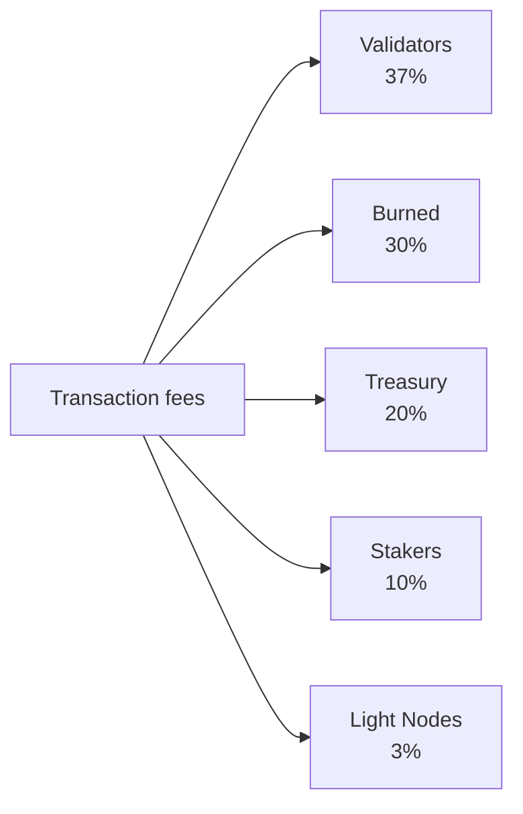

# اقتصاديات الرمز

تستخدم QoreChain نموذجًا اقتصاديًا **ثابت المعروض** يتمحور حول رمز **QOR** الأصلي. فبدلًا من تضخيم المعروض بمرور الوقت، تموّل الشبكة مكافآت الـ staking من ميزانية إصدار محدودة ومخصّصة مسبقًا، بينما يمارس محرك حرق متعدد القنوات ضغطًا انكماشيًا مستمرًا مع نمو استخدام الشبكة.

---

## أساسيات الرمز

| الخاصية              | القيمة                                                    |
| --------------------- | -------------------------------------------------------- |
| **الرمز المعروض**     | QOR                                                      |
| **الفئة الأساسية** | uqor                                                     |
| **دقة الكسور العشرية** | 10^6 (1 QOR = 1,000,000 uqor)                            |
| **إجمالي المعروض**      | 4,500,000,000 QOR (ثابت)                                |
| **معرّف السلسلة**          | `qorechain-vladi` (الشبكة الرئيسية، معرّف سلسلة EVM 9801)          |
| **بادئة Bech32**     | `qor` (الحسابات: `qor1...`، المدققون: `qorvaloper...`) |

:::note
تصف الأرقام في هذه الصفحة **الشبكة الرئيسية** (`qorechain-vladi`، معرّف سلسلة EVM **9801**)، الحيّة منذ 7 يونيو 2026 على إصدار السلسلة **v3.1.77**. وتشترك شبكة الاختبار **`qorechain-diana`** (معرّف سلسلة EVM **9800**) في النموذج الاقتصادي نفسه.
:::

---

## نموذج المعروض والإصدار

تمتلك QoreChain **معروضًا إجماليًا ثابتًا قدره 4,500,000,000 QOR**. ولا تُسكّ QOR جديدة قط لتضخيم المعروض. بدلًا من ذلك:

* تم حرق **80,000,000 QOR (1.78% من المعروض)** عند حدث توليد الرمز (TGE).
* تُدفع مكافآت الـ staking من **ميزانية إصدار محدودة قدرها 590,000,000 QOR**، يُسحب منها بمرور الوقت وفق جدول متناقص.

هذا **نموذج ثابت المعروض بميزانية إصدار محدودة**، وليس نموذج تضخيم للمعروض. وبمجرد استنفاد ميزانية الإصدار، لا يحدث أي إصدار إضافي للمكافآت بما يتجاوز ما تخصّصه الحوكمة من الميزانية المتبقية.

### جدول مكافآت الـ Staking {#staking-reward-schedule}

تُوزَّع مكافآت الـ staking من ميزانية الإصدار البالغة 590,000,000 QOR وفق جدول متناقص:

| الفترة      | العائد السنوي المستهدف              | ميزانية الإصدار                  |
| ----------- | ----------------------- | -------------------------------- |
| السنة 1      | 8–12% APY               | 127,500,000 QOR                  |
| السنة 2      | 6–10% APY               | 106,250,000 QOR                  |
| السنتان 3–4   | 5–8% APY                | 85,000,000 QOR سنويًا          |
| السنة 5 فما فوق     | تحدّده الحوكمة   | ~186,000,000 QOR متبقية       |

نطاقات الـ APY أهداف تعتمد على نسبة الرمز المُجمَّد (bonded ratio)؛ أما أرقام ميزانية الإصدار فهي الحدود القصوى الصارمة لكمية QOR المُطلقة للمشاركين في الـ staking في كل فترة. واعتبارًا من السنة 5 فصاعدًا، تُطلق الـ ~186,000,000 QOR المتبقية بمعدل تحدّده الحوكمة.

---

## x/burn — محرك الحرق متعدد القنوات

تنفّذ وحدة `x/burn` نظام حرق للرمز بـ 10 قنوات. كل رمز محروق يُزال نهائيًا من المعروض المتداول، مما يخلق ضغطًا انكماشيًا مستمرًا مع نمو استخدام الشبكة.

### قنوات الحرق

| #  | القناة            | المصدر                     | الوصف                                   |
| -- | ------------------ | -------------------------- | --------------------------------------------- |
| 1  | `gas_fee`          | رسوم المعاملات           | يُحرق 30% من جميع رسوم الغاز                |
| 2  | `contract_create`  | نشر العقود الذكية  | تُحرق رسوم ثابتة قدرها 100 QOR لكل عملية إنشاء عقد |
| 3  | `ai_service`       | رسوم استخدام وحدة الذكاء الاصطناعي         | يُحرق 50% من رسوم خدمة الذكاء الاصطناعي                |
| 4  | `bridge_fee`       | رسوم الجسر عبر السلاسل    | يُحرق 100% من رسوم الجسر                |
| 5  | `treasury_buyback` | عمليات الخزينة        | إعادة شراء وحرق دورية من الخزينة       |
| 6  | `failed_tx`        | غاز المعاملات الفاشلة     | يُحرق 10% من غاز المعاملات الفاشلة    |
| 7  | `xqore_penalty`    | غرامات الخروج المبكر من xQORE | تُوجَّه مبالغ الغرامات عبر الحرق           |
| 8  | `auto_buyback`     | برنامج إعادة الشراء الآلي  | عمليات حرق آلية على مستوى البروتوكول                |
| 9  | `tge`              | حدث توليد الرمز     | عمليات حرق لمرة واحدة عند التكوين (80,000,000 QOR)       |
| 10 | `rollup_create`    | نشر الـ rollup          | يُحرق 1% من حصة إنشاء الـ rollup            |

### توزيع الرسوم

تُقسَّم جميع رسوم المعاملات التي تجمعها الشبكة على خمس وجهات، كما هو موضّح أدناه. تُفرض الحصص على السلسلة ويبلغ مجموعها دائمًا 100% بالضبط.



تُقسَّم جميع رسوم المعاملات التي تجمعها الشبكة على خمس وجهات:

| المستلِم       | الحصة | الوصف                                                          |
| --------------- | ----- | -------------------------------------------------------------------- |
| **المدققون**  | 37%   | تُوزَّع على مجموعة المدققين النشطين بالتناسب مع الحصة        |
| **محروق**      | 30%   | يُزال نهائيًا من المعروض عبر قناة الحرق `gas_fee`       |
| **الخزينة**    | 20%   | تُخصَّص لخزينة المجتمع للإنفاق الموجَّه بالحوكمة |
| **المشاركون في الـ Staking**     | 10%   | تُوزَّع على جميع المشاركين في staking الـ QOR بالتناسب مع التفويض |
| **العُقد الخفيفة** | 3%    | تُوزَّع على العُقد الخفيفة مقابل تقديم بيانات الشبكة                  |

تُفرض الحصص على السلسلة ويجب أن يبلغ مجموعها دائمًا 100% بالضبط.

### معلمات الحرق

| المعلمة              | الافتراضي                    | الوصف                              |
| ---------------------- | -------------------------- | ---------------------------------------- |
| `gas_burn_rate`        | 0.30                       | نسبة رسوم الغاز المحروقة (30%)        |
| `contract_create_fee`  | 100,000,000 uqor (100 QOR) | رسوم حرق ثابتة لإنشاء العقد      |
| `ai_service_burn_rate` | 0.50                       | نسبة رسوم خدمة الذكاء الاصطناعي المحروقة (50%) |
| `bridge_burn_rate`     | 1.00                       | نسبة رسوم الجسر المحروقة (100%)    |
| `failed_tx_burn_rate`  | 0.10                       | نسبة غاز المعاملات الفاشلة المحروق (10%)   |

يُسجَّل كل حدث حرق على السلسلة مع مصدره ومبلغه وارتفاع الكتلة وتجزئة المعاملة المرتبطة. وتكون الإحصاءات الإجمالية قابلة للاستعلام لكل قناة وبالمجمل.

---

## x/xqore — الـ Staking المقفول وتضخيم الحوكمة

تقدّم وحدة `x/xqore` رمز **xQORE**، وهو مشتق staking مقفول غير قابل للتحويل. يقفل المستخدمون QOR لسكّ xQORE بنسبة 1:1. ويحصل حاملو xQORE على قوة حوكمة مضخّمة وحصة من غرامات الخروج المُعاد توزيعها.

### آلية القفل

* **القفل**: أرسِل QOR إلى وحدة xQORE لسكّ xQORE بنسبة 1:1.
* **وزن الحوكمة**: يحصل حاملو xQORE على **ضِعف قوة التصويت في الحوكمة** مقارنة بالمشاركين في staking الـ QOR المعياري.
* **غير قابل للتحويل**: لا يمكن إرسال xQORE بين الحسابات. فهو مرتبط بعنوان القفل.

### جدول غرامات الخروج

يترتّب على السحب المبكر من xQORE غرامة تتناقص مع مدة القفل:

| مدة القفل  | معدل الغرامة | الوصف                                |
| -------------- | ------------ | ------------------------------------------ |
| &lt; 30 يومًا   | **50%**      | يُصادَر نصف الـ QOR المقفول            |
| 30 -- 90 يومًا  | **35%**      | غرامة كبيرة على عمليات القفل قصيرة الأجل   |
| 90 -- 180 يومًا | **15%**      | غرامة مخفّضة على الالتزام متوسط الأجل |
| > 180 يومًا     | **0%**       | سحب كامل دون غرامة            |

### إعادة التوزيع بنموذج PvP Rebase

لا تُدمَّر الغرامات المُحصَّلة من الخروج المبكر ببساطة. بل تتّبع نموذج إعادة احتساب (rebase) قائمًا على مبدأ PvP (لاعب ضد لاعب):

1. يُحرق **50%** من مبالغ الغرامات (يُوجَّه عبر `x/burn` بواسطة قناة `xqore_penalty`).
2. يُعاد توزيع **50%** بالتناسب على جميع حاملي xQORE المتبقين.

وهذا يخلق ديناميكية موجبة المجموع لحاملي الرمز طويلي الأجل: فكل خروج مبكر يزيد القيمة الفعلية لمراكز xQORE المتبقية. وتحدث عمليات إعادة الاحتساب كل **100 كتلة**.

### معلمات xQORE

| المعلمة               | الافتراضي                | الوصف                               |
| ----------------------- | ---------------------- | ----------------------------------------- |
| `governance_multiplier` | 2.0                    | مضاعِف قوة التصويت لحاملي xQORE |
| `min_lock_amount`       | 1,000,000 uqor (1 QOR) | الحد الأدنى من QOR المطلوب للقفل              |
| `penalty_burn_rate`     | 0.50                   | نسبة غرامات الخروج المحروقة (50%)   |
| `rebase_interval`       | 100 كتلة             | عدد الكتل بين أحداث PvP rebase          |
| `enabled`               | true                   | علم تفعيل الوحدة                    |

---

## x/inflation — جدول ميزانية الإصدار

على الرغم من اسم الوحدة، فإن وحدة `x/inflation` **لا** تضخّم المعروض الإجمالي. بل تتحكم في إطلاق مكافآت الـ staking من ميزانية الإصدار المحدودة البالغة **590,000,000 QOR** وفق [جدول مكافآت الـ staking](#staking-reward-schedule) المتناقص. وتُحسب الإصدارات لكل حقبة (epoch) وتُوزَّع على المشاركين في الـ staking والمدققين، سحبًا من الميزانية المخصّصة مسبقًا بدلًا من سكّ معروض جديد.

### آليات الحقبة (Epoch)

* **طول الحقبة**: 17,280 كتلة (\~يوم واحد عند زمن كتلة قدره 5 ثوانٍ)
* **الكتل في السنة**: \~6,311,520
* في بداية كل حقبة، يُطلق الإصدار المجدول للفترة الحالية من ميزانية الإصدار ويُوزَّع على المشاركين في الـ staking والمدققين.
* يسجّل متتبّع الحقبة رقم الحقبة الحالية، والسنة الحالية، وكتلة البداية، وإجمالي الـ QOR المُطلق من ميزانية الإصدار، والميزانية المتبقية.

### معلمات الإصدار (Inflation)

| المعلمة      | الافتراضي          | الوصف                                                |
| -------------- | ---------------- | ---------------------------------------------------------- |
| `schedule`     | declining        | ميزانية إصدار مفهرسة حسب الفترة (انظر جدول مكافآت الـ staking) |
| `epoch_length` | 17,280 كتلة    | عدد الكتل لكل حقبة إصدار                                  |
| `enabled`      | true             | علم تفعيل الوحدة                                       |

---

## الديناميكيات الانكماشية

نظرًا لأن المعروض ثابت والإصدار يُسحب من ميزانية محدودة، فإن الديناميكية الصافية لرمز QoreChain تميل إلى الانكماش مع نمو التبنّي:

```
Years 1-2:  Larger scheduled emissions from the budget offset burns → near-neutral supply
Years 3-4:  Scheduled emissions decline; burn volume grows with usage → convergence
Year 5+:    Emission budget is largely drawn down; burn channels (gas, bridge,
            contracts, rollups) scale with transaction volume → net deflationary
```

تضمن قنوات الحرق الـ 10 أن يُزيل كل نشاط رئيسي في الشبكة رموزًا من المعروض. ومع زيادة حجم المعاملات واستخدام الجسر واستدعاءات خدمة الذكاء الاصطناعي وعمليات نشر الـ rollup، تتسارع عمليات الحرق التراكمية بينما تتناقص الإصدارات المجدولة باتجاه نهاية الميزانية المحدودة.

---

## ترتيب دورة حياة الوحدات

تُنفَّذ الوحدات الاقتصادية بترتيب محدد أثناء الـ `EndBlocker` لكل كتلة:

```
x/burn → x/xqore → x/inflation → x/rlconsensus
```

1. **x/burn** — تعالج سجلات الحرق المعلّقة وتحدّث الإحصاءات الإجمالية.
2. **x/xqore** — تنفّذ عمليات PvP rebase (كل `rebase_interval` كتلة) وتوجّه الغرامات إلى الحرق.
3. **x/inflation** — تُطلق إصدارات مكافآت الـ staking المجدولة من الميزانية عند حدود الحقب.
4. **x/rlconsensus** — تضبط معلمات الإجماع بناءً على إشارات التعلّم المعزّز من PRISM.

يضمن هذا الترتيب أن تُنهى عمليات الحرق قبل عمليات إعادة الاحتساب، وأن تكتمل عمليات إعادة الاحتساب قبل إطلاق الإصدارات المجدولة، مما يحافظ على انتقالات حالة اقتصادية متّسقة.

## ذات صلة

* [معلمات السلسلة](/appendix/chain-parameters) — الإعدادات الاقتصادية وإعدادات الإجماع الافتراضية المعتمدة.
* [الـ Staking والتفويض](/user-guide/staking-and-delegation) — فوّض QOR واكسب المكافآت.
* [الـ Staking عبر xQORE](/user-guide/xqore-staking) — آلية staking القائمة على PvP rebase.
* [مكافآت العُقد الخفيفة](/light-node/rewards-and-monitoring) — حصة مكافأة العُقد الخفيفة.
