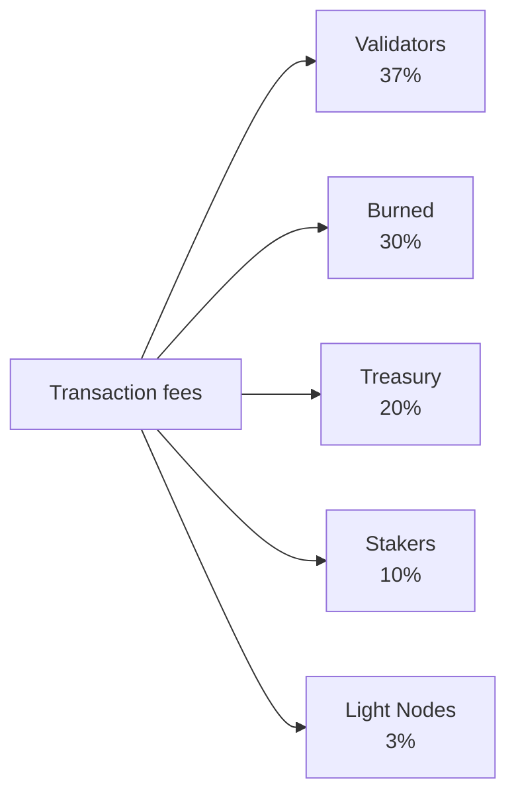

# اقتصاديات الرمز

تستخدم QoreChain نموذجًا اقتصاديًا **ثابت المعروض** يتمحور حول رمز **QOR** الأصلي. فبدلًا من تضخيم المعروض بمرور الوقت، تموّل الشبكة مكافآت الـ staking من ميزانية إصدار محدودة ومخصّصة مسبقًا، بينما يمارس محرك حرق متعدد القنوات ضغطًا انكماشيًا مستمرًا مع نمو استخدام الشبكة.

---

## أساسيات الرمز

| الخاصية              | القيمة                                                    |
| --------------------- | -------------------------------------------------------- |
| **الرمز المعروض**     | QOR                                                      |
| **الفئة الأساسية** | uqor                                                     |
| **دقة الكسور العشرية** | 10^6 (1 QOR = 1,000,000 uqor)                            |
| **إجمالي المعروض**      | 4,500,000,000 QOR (ثابت)                                |
| **معرّف السلسلة**          | `qorechain-vladi` (الشبكة الرئيسية، معرّف سلسلة EVM 9801)          |
| **بادئة Bech32**     | `qor` (الحسابات: `qor1...`، المدققون: `qorvaloper...`) |

:::note
تصف الأرقام في هذه الصفحة **الشبكة الرئيسية** (`qorechain-vladi`، معرّف سلسلة EVM **9801**)، الحيّة منذ 7 يونيو 2026 على إصدار السلسلة **v3.1.95**. وتشترك شبكة الاختبار **`qorechain-diana`** (معرّف سلسلة EVM **9800**) في النموذج الاقتصادي نفسه.
:::

---

## نموذج المعروض والإصدار

تمتلك QoreChain **معروضًا إجماليًا ثابتًا قدره 4,500,000,000 QOR**. ولا تُسكّ QOR جديدة قط لتضخيم المعروض. بدلًا من ذلك:

* تم حرق **80,000,000 QOR (1.78% من المعروض)** عند حدث توليد الرمز (TGE).
* تُدفع مكافآت الـ staking من **ميزانية إصدار محدودة قدرها 590,000,000 QOR**، يُسحب منها بمرور الوقت وفق جدول متناقص.

هذا **نموذج ثابت المعروض بميزانية إصدار محدودة**، وليس نموذج تضخيم للمعروض. وبمجرد استنفاد ميزانية الإصدار، لا يحدث أي إصدار إضافي للمكافآت بما يتجاوز ما تخصّصه الحوكمة من الميزانية المتبقية.

### جدول مكافآت الـ Staking {#staking-reward-schedule}

:::note حدّت الحوكمة سقف الإصدار في 26 أغسطس 2026
كان الجدول المتناقص أدناه هو التصميم الأصلي، وكان موجّهًا لشبكة ناضجة تكون فيها غالبية المعروض مرهونة (bonded). وعند قياسه مقابل الشبكة كما كانت فعليًا — نحو 6.8 مليون QOR مرهونة، أي أقل بكثير من ذلك الهدف — كان يدفع نحو 20% من الحصة المرهونة *يوميًا*. مرّر اقتراح الحوكمة رقم 4 بموافقة 100% من الحصة المرهونة وسرى مفعوله عند الارتفاع 2,122,074 (2026-08-26 الساعة 03:27 بتوقيت UTC، إصدار السلسلة v3.1.94): انخفض الإصدار لكل حقبة من 2,153,583 QOR إلى **16,239 QOR**، ضمن سقف تراكمي صارم جديد قدره **114,285,714 QOR** لهذه الوحدة — وهو قرار تصميم، وليس إصلاحًا لخلل. وبحلول موعد سريان السقف، كان قد تم بالفعل إصدار **104,680,531 QOR (91.6%)** وفق الجدول القديم؛ وبالمعدل الجديد، من المتوقع أن يستمر الرصيد المتبقي لنحو **سنة و11 شهرًا** أخرى، وبعدها تتوقف هذه الوحدة عن الإصدار نهائيًا وتصبح مكافآت المدققين/المراهنين قائمة على رسوم المعاملات وحدها (انظر [توزيع الرسوم](#fee-distribution) أدناه). الجدول أدناه محفوظ كمرجع للتصميم الأصلي — ولم يعد يصف معدّل الدفع الحيّ الفعلي.
:::

تُوزَّع مكافآت الـ staking من ميزانية الإصدار البالغة 590,000,000 QOR وفق جدول متناقص:

| الفترة      | العائد السنوي المستهدف              | ميزانية الإصدار                  |
| ----------- | ----------------------- | -------------------------------- |
| السنة 1      | 8–12% عائد سنوي               | 127,500,000 QOR                  |
| السنة 2      | 6–10% عائد سنوي               | 106,250,000 QOR                  |
| السنتان 3–4   | 5–8% عائد سنوي                | 85,000,000 QOR سنويًا          |
| السنة 5+     | تحدّده الحوكمة   | ~186,000,000 QOR متبقية       |

كانت نطاقات العائد السنوي هي أهداف التصميم الأصلية لكل فترة؛ وهي ليست معدّل الدفع الحيّ الآن بعد تحديد سقف الإصدار كما هو موضح أعلاه. ولا تُتيح QoreChain حاليًا نقطة استعلام لحساب رقم عائد سنوي حيّ — لذا تعامل مع أي نسبة عائد رهن محدَّدة تراها مذكورة (بما في ذلك في هذه الصفحة سابقًا) باعتبارها غير قابلة للتحقق مقابل السلسلة اليوم، وليست رقمًا يُعتمد عليه في التخطيط.

---

## x/burn — محرك الحرق متعدد القنوات

تُنفّذ وحدة `x/burn` نظام حرق للرموز عبر 10 قنوات. كل رمز يُحرق يُزال نهائيًا من المعروض المتداول، مما يخلق ضغطًا انكماشيًا مستمرًا مع نمو استخدام الشبكة.

### قنوات الحرق

| # | القناة            | المصدر                     | الوصف                                   |
| -- | ------------------ | -------------------------- | --------------------------------------------- |
| 1  | `gas_fee`          | رسوم المعاملات           | يُحرق 30% من إجمالي رسوم الغاز                |
| 2  | `contract_create`  | نشر العقود الذكية  | رسم ثابت قدره 100 QOR يُحرق لكل عملية إنشاء عقد |
| 3  | `ai_service`       | رسوم استخدام وحدة الذكاء الاصطناعي       | يُحرق 50% من رسوم خدمات الذكاء الاصطناعي                 |
| 4  | `bridge_fee`       | رسوم الجسر عبر السلاسل    | يُحرق 100% من رسوم الجسر                    |
| 5  | `treasury_buyback` | عمليات الخزينة        | إعادة شراء وحرق دورية من الخزينة       |
| 6  | `failed_tx`        | غاز المعاملات الفاشلة     | يُحرق 10% من غاز المعاملات الفاشلة    |
| 7  | `xqore_penalty`    | غرامات الخروج المبكر من xQORE | تُوجَّه مبالغ الغرامة عبر الحرق |
| 8  | `auto_buyback`     | برنامج إعادة الشراء التلقائي  | حرق تلقائي على مستوى البروتوكول |
| 9  | `tge`              | حدث توليد الرمز     | حرق تأسيسي لمرة واحدة (80,000,000 QOR)       |
| 10 | `rollup_create`    | نشر الـ rollup           | يُحرق 1% من رهن إنشاء الـ rollup             |

### توزيع الرسوم {#fee-distribution}

تُقسَّم جميع رسوم المعاملات التي تجمعها الشبكة على خمس جهات، كما هو موضح أدناه. وهذه الحصص مفروضة على مستوى السلسلة وتساوي دائمًا 100% بالمجموع.


```mermaid
flowchart LR
    F["Transaction fees"]
    F --> V["Validators<br/>37%"]
    F --> B["Burned<br/>30%"]
    F --> T["Treasury<br/>20%"]
    F --> S["Stakers<br/>10%"]
    F --> L["Light Nodes<br/>3%"]
```

تُقسَّم جميع رسوم المعاملات التي تجمعها الشبكة على خمس جهات:

| الجهة المستفيدة       | الحصة | الوصف                                                          |
| --------------- | ----- | ---------------------------------------------------------------------- |
| **المدققون**  | 37%   | تُوزَّع على مجموعة المدققين النشطين تناسبيًا مع الرهن        |
| **الحرق**      | 30%   | تُزال نهائيًا من المعروض عبر قناة الحرق `gas_fee`       |
| **الخزينة**    | 20%   | تُخصَّص لخزينة المجتمع لإنفاق موجّه بقرار الحوكمة |
| **المراهنون**     | 10%   | تُوزَّع على جميع مراهني QOR تناسبيًا مع التفويض        |
| **العقد الخفيفة** | 3%    | تُوزَّع على العقد الخفيفة مقابل تقديم بيانات الشبكة                  |

هذه الحصص مفروضة على مستوى السلسلة ويجب أن تساوي دائمًا 100% بالمجموع.

:::note هذه هي الحصص المُعدّة في الإعدادات، لا قياسًا حيًّا مؤكَّدًا
يعكس الجدول أعلاه معاملات `x/burn` المُعدّة. وقد وجد جهد قياس مقابل حالة السلسلة الحية أن الحصة الفعلية المجمَّعة التي تصل بالفعل إلى المدققين والمراهنين معًا أقل من نسبة الـ 47% التي يجمعها هذان الصفّان. ولم نتحقق بعد بشكل مستقل من هذا التباين، لذا تذكر هذه الصفحة قيم التصميم المُعدّة بدلًا من تأكيد أي من الرقمين باعتباره الرقم الحيّ المؤكَّد — استعلم عن معاملات وإحصاءات `x/burn` مباشرة (انظر [نقاط نهاية REST/gRPC](/api-reference/rest-grpc-endpoints)) إذا كان استخدامك يعتمد على النسبة الحالية الدقيقة.
:::

### معاملات الحرق

| المعامل              | القيمة الافتراضية                    | الوصف                              |
| ---------------------- | -------------------------- | ---------------------------------------- |
| `gas_burn_rate`        | 0.30                       | نسبة رسوم الغاز المحروقة (30%)        |
| `contract_create_fee`  | 100,000,000 uqor (100 QOR) | رسم حرق ثابت لإنشاء العقود      |
| `ai_service_burn_rate` | 0.50                       | نسبة رسوم خدمات الذكاء الاصطناعي المحروقة (50%) |
| `bridge_burn_rate`     | 1.00                       | نسبة رسوم الجسر المحروقة (100%)    |
| `failed_tx_burn_rate`  | 0.10                       | نسبة غاز المعاملات الفاشلة المحروقة (10%)   |

يُسجَّل كل حدث حرق على السلسلة مع مصدره وقيمته وارتفاع الكتلة (block height) وتجزئة المعاملة المرتبطة به (transaction hash). ويمكن الاستعلام عن الإحصاءات الإجمالية لكل قناة وإجمالًا.

---

## x/xqore — الرهن المقفل والحوكمة المضخَّمة

تُقدّم وحدة `x/xqore` عملة **xQORE**، وهي مشتق رهن مقفل غير قابل للتحويل. يقفل المستخدمون QOR لسك xQORE بنسبة 1:1. ويحصل حاملو xQORE على قوة تصويت حوكمة مضخَّمة وحصة من غرامات الخروج المعاد توزيعها.

### آلية القفل

* **القفل**: إرسال QOR إلى وحدة xQORE لسك xQORE بنسبة 1:1.
* **وزن الحوكمة**: يحصل حاملو xQORE على **ضعف قوة التصويت في الحوكمة** مقارنة بمراهني QOR العاديين.
* **غير قابل للتحويل**: لا يمكن إرسال xQORE بين الحسابات. فهو مرتبط بعنوان القفل.

### جدول غرامة الخروج

يترتب على السحب المبكر من xQORE غرامة تتناقص مع مدة القفل:

| مدة القفل  | معدّل الغرامة | الوصف                                |
| -------------- | ------------ | ------------------------------------------ |
| أقل من 30 يومًا   | **50%**      | يُصادَر نصف QOR المقفل            |
| 30 -- 90 يومًا  | **35%**      | غرامة كبيرة على الأقفال قصيرة الأجل   |
| 90 -- 180 يومًا | **15%**      | غرامة مخفَّضة للالتزام متوسط الأجل |
| أكثر من 180 يومًا     | **0%**       | سحب كامل بدون غرامة            |

### إعادة التوزيع بنموذج PvP Rebase

الغرامات المحصَّلة من الخروج المبكر لا تُتلف ببساطة. بل تتبع نموذج إعادة توازن PvP (لاعب ضد لاعب):

1. تُحرق **50%** من قيم الغرامة (تُوجَّه عبر `x/burn` من خلال قناة `xqore_penalty`).
2. تُعاد توزيع **50%** تناسبيًا على جميع حاملي xQORE المتبقين.

يخلق هذا ديناميكية موجبة المحصلة لصالح الحاملين على المدى الطويل: فكل خروج مبكر يزيد القيمة الفعلية لمراكز xQORE المتبقية. وتحدث عمليات إعادة التوازن كل **100 كتلة**.

### معاملات xQORE

| المعامل               | القيمة الافتراضية                | الوصف                               |
| ----------------------- | ---------------------- | ----------------------------------------- |
| `governance_multiplier` | 2.0                    | مضاعِف قوة التصويت لحاملي xQORE |
| `min_lock_amount`       | 1,000,000 uqor (1 QOR) | الحد الأدنى من QOR المطلوب للقفل              |
| `penalty_burn_rate`     | 0.50                   | نسبة غرامات الخروج المحروقة (50%)   |
| `rebase_interval`       | 100 كتلة             | عدد الكتل بين أحداث إعادة توازن PvP           |
| `enabled`               | true                   | مفتاح تفعيل الوحدة                    |

---

## x/inflation — جدول ميزانية الإصدار

رغم اسم الوحدة، لا تُضخِّم وحدة `x/inflation` إجمالي المعروض. بل تحكم إصدار مكافآت الـ staking من ميزانية الإصدار المحدودة البالغة **590,000,000 QOR** وفق [جدول مكافآت الـ staking](#staking-reward-schedule) المتناقص. وتُحسَب الإصدارات لكل حقبة (epoch) وتُوزَّع على المراهنين والمدققين، بسحب من الميزانية المخصَّصة مسبقًا بدلًا من سك معروض جديد.

### آليات الحقبة (Epoch)

* **طول الحقبة**: 17,280 كتلة (\~يوم واحد بزمن كتلة قدره 5 ثوانٍ)
* **الكتل في السنة**: \~6,311,520
* في بداية كل حقبة، يُصدَر الإصدار المقرَّر للفترة الحالية من ميزانية الإصدار ويُوزَّع على المراهنين والمدققين.
* يسجّل متتبّع الحقبة رقم الحقبة الحالية، والسنة الحالية، وكتلة البداية، وإجمالي QOR المُصدَر تراكميًا من ميزانية الإصدار، والميزانية المتبقية.

### معاملات الإصدار

| المعامل      | القيمة الافتراضية          | الوصف                                                |
| -------------- | ---------------- | ------------------------------------------------------------ |
| `schedule`     | متناقص        | ميزانية إصدار مفهرَسة حسب الفترة (انظر جدول مكافآت الـ staking) |
| `epoch_length` | 17,280 كتلة    | عدد الكتل لكل حقبة إصدار                                  |
| `enabled`      | true             | مفتاح تفعيل الوحدة                                     |

---

## الديناميكيات الانكماشية

بما أن المعروض ثابت والإصدار يُسحب من ميزانية محدودة، تميل ديناميكيات الرمز الصافية لدى QoreChain نحو الانكماش مع نمو تبنّي الشبكة:

```
Years 1-2:  Larger scheduled emissions from the budget offset burns → near-neutral supply
Years 3-4:  Scheduled emissions decline; burn volume grows with usage → convergence
Year 5+:    Emission budget is largely drawn down; burn channels (gas, bridge,
            contracts, rollups) scale with transaction volume → net deflationary
```

تضمن قنوات الحرق العشر أن كل نشاط رئيسي على الشبكة يزيل رموزًا من المعروض. ومع تزايد حجم المعاملات واستخدام الجسر واستدعاءات خدمة الذكاء الاصطناعي ونشر الـ rollups، تتسارع عمليات الحرق التراكمية بينما تتناقص الإصدارات المقرَّرة مع اقتراب نهاية الميزانية المحدودة.

---

## ترتيب دورة حياة الوحدات

تُنفَّذ الوحدات الاقتصادية بترتيب محدَّد أثناء `EndBlocker` الخاص بكل كتلة:

```
x/burn → x/xqore → x/inflation → x/rlconsensus
```

1. **x/burn** — يعالج سجلات الحرق المعلَّقة ويُحدّث الإحصاءات الإجمالية.
2. **x/xqore** — ينفّذ عمليات إعادة توازن PvP (كل `rebase_interval` كتلة) ويوجّه الغرامات إلى الحرق.
3. **x/inflation** — يُصدر مكافآت الـ staking المقرَّرة من الميزانية عند حدود الحقبات.
4. **x/rlconsensus** — يضبط معاملات الإجماع بناءً على إشارات تعلّم PRISM المعزَّز.

يضمن هذا الترتيب إنهاء عمليات الحرق قبل إعادة التوازن، واكتمال إعادة التوازن قبل إصدار المكافآت المقرَّرة، مما يحافظ على انتقالات حالة اقتصادية متسقة.

## ذات صلة

* [معاملات السلسلة](/appendix/chain-parameters) — القيم الافتراضية الاقتصادية ومعاملات الإجماع المرجعية.
* [الرهن والتفويض](/user-guide/staking-and-delegation) — فوِّض QOR واكسب مكافآت.
* [رهن xQORE](/user-guide/xqore-staking) — آلية رهن إعادة التوازن PvP.
* [مكافآت العقد الخفيفة](/light-node/rewards-and-monitoring) — حصة مكافآت العقد الخفيفة.
