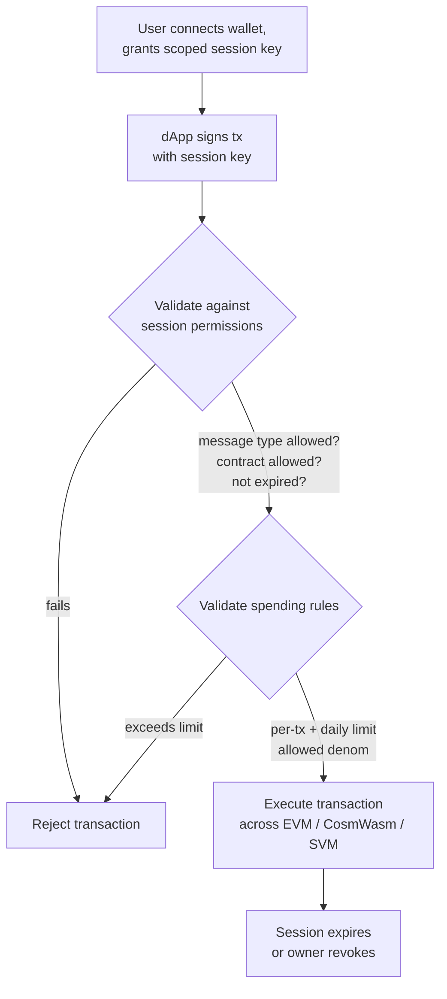

# تجريد الحساب

توفر QoreChain **تجريد الحساب على مستوى البروتوكول** عبر وحدة `x/abstractaccount`. يتيح ذلك حسابات قابلة للبرمجة بقواعد مصادقة مرنة، ومفاتيح جلسات، وحدود إنفاق، واسترداد اجتماعي — كل ذلك دون الحاجة إلى بنية تحتية خارجية للعقود الذكية.

:::note
تستخدم الأوامر أدناه شبكة **`qorechain-vladi`** الرئيسية، التي تعمل منذ 7 يونيو 2026 بإصدار السلسلة **v3.1.82**. استبدل `--chain-id qorechain-diana` لشبكة الاختبار.
:::

## نظرة عامة

تُتحكَّم في حسابات البلوك تشين التقليدية بمفتاح خاص واحد. يفصل تجريد الحساب مفهوم "من يمكنه تفويض معاملة" عن مفتاح تشفيري واحد، مما يتيح:

* **حسابات متعددة التوقيع (Multisig)** بتوقيع عتبي قابل للتهيئة
* **حسابات الاسترداد الاجتماعي** باسترداد المفاتيح المعتمد على أوصياء
* **حسابات قائمة على الجلسات** بأذونات دقيقة محدودة زمنياً للتطبيقات اللامركزية

تنفّذ وحدة `x/abstractaccount` هذه القدرات على طبقة البروتوكول، ما يعني أنها تعمل عبر الأنوية الافتراضية الثلاثة جميعها (EVM، CosmWasm، SVM) وتستفيد من كفاءة الغاز الأصلية.

*تدفق تطبيق لامركزي قائم على الجلسات: يوقّع مفتاح جلسة محدود النطاق معاملةً، فتتحقق الوحدة منها وفق قواعد الجلسة والإنفاق، ثم تنفّذها.*



## أنواع الحسابات

| النوع              | الوصف                             | حالة الاستخدام                       |
| ----------------- | --------------------------------------- | ------------------------------ |
| `multisig`        | توقيع عتبي M من N                | خزائن المنظمات اللامركزية (DAO)، المحافظ المشتركة |
| `social_recovery` | استرداد المفاتيح بمساعدة الأوصياء          | محافظ المستهلكين، الإعداد الأولي   |
| `session_based`   | مفاتيح جلسات مفوَّضة بقيود | جلسات التطبيقات اللامركزية، محافظ الجوال  |

## إنشاء حساب مجرَّد

### حساب قائم على الجلسات

```bash
qorechaind tx abstractaccount create \
  --account-type session_based \
  --from mykey \
  --gas auto \
  -y
```

### حساب متعدد التوقيع

```bash
qorechaind tx abstractaccount create \
  --account-type multisig \
  --signers qor1alice...,qor1bob...,qor1carol... \
  --threshold 2 \
  --from mykey \
  --gas auto \
  -y
```

### حساب الاسترداد الاجتماعي

```bash
qorechaind tx abstractaccount create \
  --account-type social_recovery \
  --guardians qor1guardian1...,qor1guardian2...,qor1guardian3... \
  --recovery-threshold 2 \
  --from mykey \
  --gas auto \
  -y
```

## مفاتيح الجلسات

مفاتيح الجلسات هي حجر الزاوية لنوع الحساب `session_based`. تتيح لك منح **أذونات مؤقتة محدودة النطاق** لمفتاح ثانوي — وهو مثالي لتفاعلات التطبيقات اللامركزية حيث لا تريد كشف مفتاحك الأساسي.

### الخصائص الرئيسية

| الخاصية              | الوصف                                          |
| --------------------- | ---------------------------------------------------- |
| **الأذونات**       | أنواع الرسائل التي يمكن لمفتاح الجلسة توقيعها         |
| **انتهاء الصلاحية**            | انتهاء صلاحية تلقائي بعد مدة قابلة للتهيئة   |
| **حدود الإنفاق**   | الحد الأقصى للمبالغ التي يمكن لمفتاح الجلسة إنفاقها            |
| **العقود المسموح بها** | تقييد التفاعلات بعناوين عقود محددة |

### منح مفتاح جلسة

```bash
qorechaind tx abstractaccount grant-session \
  --session-key qor1sessionkey... \
  --permissions "bank/MsgSend,wasm/MsgExecuteContract" \
  --expiry "2026-03-01T00:00:00Z" \
  --allowed-contracts qor1contract1...,0x1234...abcd \
  --from mykey \
  -y
```

### إلغاء مفتاح جلسة

```bash
qorechaind tx abstractaccount revoke-session \
  --session-key qor1sessionkey... \
  --from mykey \
  -y
```

### سرد الجلسات النشطة

```bash
qorechaind query abstractaccount sessions <account-address>
```

## قواعد الإنفاق

تضيف قواعد الإنفاق ضوابط مالية إلى الحسابات المجرَّدة، بغض النظر عن نوع الحساب:

| القاعدة             | الوصف                                     |
| ---------------- | ----------------------------------------------- |
| `daily_limit`    | الحد الأقصى لإجمالي الإنفاق لكل نافذة متجددة مدتها 24 ساعة  |
| `per_tx_limit`   | الحد الأقصى للإنفاق لكل معاملة فردية        |
| `allowed_denoms` | تقييد فئات الرموز التي يمكن إنفاقها |

### تعيين قواعد الإنفاق

```bash
qorechaind tx abstractaccount update-spending-rules \
  --daily-limit 1000000000uqor \
  --per-tx-limit 100000000uqor \
  --allowed-denoms uqor \
  --from mykey \
  -y
```

### الاستعلام عن القواعد الحالية

```bash
qorechaind query abstractaccount spending-rules <account-address>
```

### مثال على الاستجابة

```json
{
  "daily_limit": {
    "denom": "uqor",
    "amount": "1000000000"
  },
  "per_tx_limit": {
    "denom": "uqor",
    "amount": "100000000"
  },
  "allowed_denoms": ["uqor"],
  "daily_spent": {
    "denom": "uqor",
    "amount": "250000000"
  },
  "window_reset": "2026-02-27T00:00:00Z"
}
```

## الاستعلام عن الحسابات المجرَّدة

### واجهة سطر الأوامر (CLI)

```bash
# Get full account configuration
qorechaind query abstractaccount account <address>

# List all abstract accounts (paginated)
qorechaind query abstractaccount list --limit 10
```

### JSON-RPC

```bash
curl -X POST http://localhost:8545 \
  -H "Content-Type: application/json" \
  -d '{
    "jsonrpc": "2.0",
    "method": "qor_getAbstractAccount",
    "params": ["0xYourAddress"],
    "id": 1
  }'
```

### مثال على استجابة الحساب

```json
{
  "address": "qor1myaccount...",
  "account_type": "session_based",
  "owner": "qor1owner...",
  "active_sessions": 2,
  "spending_rules": {
    "daily_limit": "1000000000uqor",
    "per_tx_limit": "100000000uqor",
    "allowed_denoms": ["uqor"]
  },
  "created_at_height": 54321
}
```

## تدفق الاسترداد الاجتماعي

إذا فقد مالك الحساب الوصول إلى مفتاحه الأساسي، يمكن للأوصياء تفويض تدوير المفتاح.

1. **يبلّغ المالك عن فقدان المفتاح (أو يبادر أحد الأوصياء):**

   ```bash
   qorechaind tx abstractaccount initiate-recovery \
     --account <account-address> \
     --new-owner qor1newkey... \
     --from guardian1 \
     -y
   ```

2. **يوافق أوصياء إضافيون** (يجب استيفاء `recovery_threshold`):

   ```bash
   qorechaind tx abstractaccount approve-recovery \
     --account <account-address> \
     --recovery-id <recovery-id> \
     --from guardian2 \
     -y
   ```

3. **يُنفَّذ الاسترداد تلقائياً** بمجرد استيفاء العتبة. وتمنح **فترة قفل زمني** (الافتراضي: 48 ساعة) المالكَ الأصلي فرصةً لإلغاء محاولة استرداد احتيالية.

## التكامل مع التطبيقات اللامركزية

تتيح مفاتيح الجلسات تجارب سلسة للتطبيقات اللامركزية:

1. **يربط المستخدم محفظته** وينشئ مفتاح جلسة محدد النطاق على عقد التطبيق اللامركزي
2. **يستخدم التطبيق اللامركزي مفتاح الجلسة** لإرسال المعاملات نيابةً عن المستخدم
3. **لا توقيع متكرر** — يتولى مفتاح الجلسة التفويض ضمن أذوناته
4. **تنتهي صلاحية الجلسة** تلقائياً، أو يلغيها المستخدم في أي وقت

هذا النمط مفيد بشكل خاص لـ:

* محافظ الجوال حيث تكون المطالبات البيومترية المتكررة مزعجة
* تطبيقات الألعاب اللامركزية التي تحتاج إلى توقيع سريع للمعاملات
* بروتوكولات التمويل اللامركزي (DeFi) التي تنفّذ عمليات متتالية متعددة

## الخطوات التالية

* [تشغيل مدقّق](/developer-guide/running-a-validator) — إعداد وتشغيل عقدة مدقّق
* [تطوير EVM](/developer-guide/evm-development) — دمج الحسابات المجرَّدة مع تطبيقات Solidity اللامركزية
* [قابلية التشغيل البيني عبر الأنوية الافتراضية](/developer-guide/cross-vm-interoperability) — المراسلة عبر الأنوية الافتراضية مع الحسابات المجرَّدة
