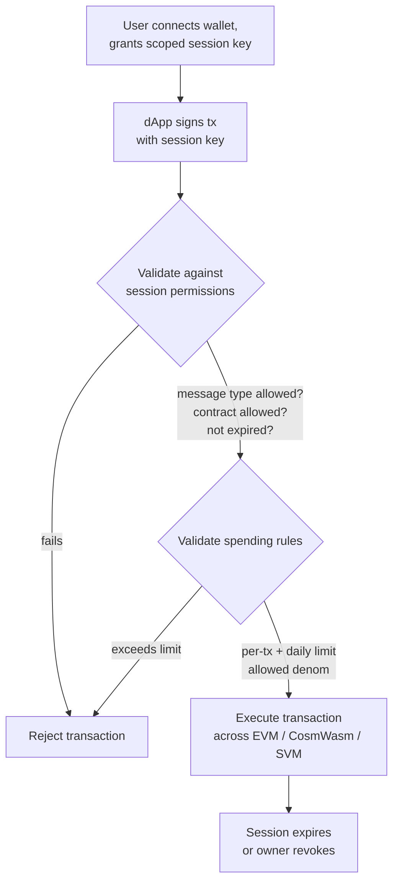

# تجريد الحسابات

توفر QoreChain **تجريد حسابات على مستوى البروتوكول** عبر الوحدة `x/abstractaccount`. يتيح ذلك حسابات قابلة للبرمجة مع قواعد مصادقة مرنة، ومفاتيح جلسات، وحدود إنفاق، واسترداد اجتماعي — كل ذلك دون الحاجة إلى بنية تحتية خارجية من العقود الذكية.

:::note
تستخدم الأوامر أدناه الشبكة الرئيسية **`qorechain-vladi`**، العاملة منذ 7 يونيو 2026 بإصدار السلسلة **v3.1.95**. استبدل `--chain-id qorechain-diana` لاستخدام شبكة الاختبار.
:::

## نظرة عامة

تُدار حسابات البلوكتشين التقليدية بمفتاح خاص واحد. يفصل تجريد الحسابات مفهوم «من يمكنه اعتماد المعاملة» عن مفتاح تشفيري واحد، مما يتيح:

* **حسابات متعددة التوقيع** مع عتبة توقيع قابلة للتهيئة
* **حسابات الاسترداد الاجتماعي** مع استرداد المفاتيح المعتمد على الأوصياء
* **حسابات قائمة على الجلسات** مع صلاحيات دقيقة ومحدودة زمنياً للتطبيقات اللامركزية (dApps)

تنفّذ الوحدة `x/abstractaccount` هذه القدرات على طبقة البروتوكول، ما يعني أنها تعمل عبر الأجهزة الافتراضية الثلاثة جميعها (EVM وCosmWasm وSVM) وتستفيد من كفاءة الغاز الأصلية.

*تدفق تطبيق لامركزي قائم على الجلسات: يوقّع مفتاح جلسة محدود النطاق معاملة، فتتحقق الوحدة منها مقابل الجلسة وقواعد الإنفاق، ثم تنفّذها.*


```mermaid
flowchart TD
    A["User connects wallet,<br/>grants scoped session key"] --> B["dApp signs tx<br/>with session key"]
    B --> C{"Validate against<br/>session permissions"}
    C -- "message type allowed?<br/>contract allowed?<br/>not expired?" --> D{"Validate spending rules"}
    C -- "fails" --> R["Reject transaction"]
    D -- "per-tx + daily limit<br/>allowed denom" --> E["Execute transaction<br/>across EVM / CosmWasm / SVM"]
    D -- "exceeds limit" --> R
    E --> F["Session expires<br/>or owner revokes"]
```

## أنواع الحسابات

| النوع              | الوصف                             | حالة الاستخدام                       |
| ----------------- | --------------------------------------- | ------------------------------ |
| `multisig`        | توقيع بعتبة M من N                | خزائن DAO والمحافظ المشتركة |
| `social_recovery` | استرداد المفاتيح بمساعدة الأوصياء          | محافظ المستهلكين وتهيئة المستخدمين الجدد   |
| `session_based`   | مفاتيح جلسات مفوَّضة مع قيود | جلسات التطبيقات اللامركزية والمحافظ المحمولة  |

## إنشاء حساب مجرَّد

### حساب قائم على الجلسات

```bash
qorechaind tx abstractaccount create \
  --account-type session_based \
  --from mykey \
  --gas auto \
  -y
```

### حساب متعدد التوقيع

```bash
qorechaind tx abstractaccount create \
  --account-type multisig \
  --signers qor1alice...,qor1bob...,qor1carol... \
  --threshold 2 \
  --from mykey \
  --gas auto \
  -y
```

### حساب الاسترداد الاجتماعي

```bash
qorechaind tx abstractaccount create \
  --account-type social_recovery \
  --guardians qor1guardian1...,qor1guardian2...,qor1guardian3... \
  --recovery-threshold 2 \
  --from mykey \
  --gas auto \
  -y
```

## مفاتيح الجلسات

مفاتيح الجلسات هي حجر الأساس لنوع الحساب `session_based`. تتيح لك منح **صلاحيات مؤقتة ومحددة النطاق** لمفتاح ثانوي — وهي مثالية لتفاعلات التطبيقات اللامركزية حيث لا ترغب في كشف مفتاحك الأساسي.

### خصائص المفتاح

| الخاصية              | الوصف                                          |
| --------------------- | ---------------------------------------------------- |
| **الصلاحيات**       | أنواع الرسائل التي يمكن لمفتاح الجلسة توقيعها         |
| **الانتهاء**            | انتهاء الصلاحية تلقائياً بعد مدة قابلة للتهيئة   |
| **حدود الإنفاق**   | الحد الأقصى للمبالغ التي يمكن لمفتاح الجلسة إنفاقها            |
| **العقود المسموح بها** | تقييد التفاعلات على عناوين عقود محددة |

### منح مفتاح جلسة

```bash
qorechaind tx abstractaccount grant-session \
  --session-key qor1sessionkey... \
  --permissions "bank/MsgSend,wasm/MsgExecuteContract" \
  --expiry "2026-03-01T00:00:00Z" \
  --allowed-contracts qor1contract1...,0x1234...abcd \
  --from mykey \
  -y
```

### إلغاء مفتاح جلسة

```bash
qorechaind tx abstractaccount revoke-session \
  --session-key qor1sessionkey... \
  --from mykey \
  -y
```

### سرد الجلسات النشطة

```bash
qorechaind query abstractaccount sessions <account-address>
```

## قواعد الإنفاق

تضيف قواعد الإنفاق ضمانات مالية إلى الحسابات المجرَّدة، بصرف النظر عن نوع الحساب:

| القاعدة             | الوصف                                     |
| ---------------- | ----------------------------------------------- |
| `daily_limit`    | الحد الأقصى لإجمالي الإنفاق خلال نافذة متجددة مدتها 24 ساعة  |
| `per_tx_limit`   | الحد الأقصى للإنفاق لكل معاملة فردية        |
| `allowed_denoms` | تقييد فئات الرموز التي يمكن إنفاقها |

### تعيين قواعد الإنفاق

```bash
qorechaind tx abstractaccount update-spending-rules \
  --daily-limit 1000000000uqor \
  --per-tx-limit 100000000uqor \
  --allowed-denoms uqor \
  --from mykey \
  -y
```

### الاستعلام عن القواعد الحالية

```bash
qorechaind query abstractaccount spending-rules <account-address>
```

### نموذج الاستجابة

```json
{
  "daily_limit": {
    "denom": "uqor",
    "amount": "1000000000"
  },
  "per_tx_limit": {
    "denom": "uqor",
    "amount": "100000000"
  },
  "allowed_denoms": ["uqor"],
  "daily_spent": {
    "denom": "uqor",
    "amount": "250000000"
  },
  "window_reset": "2026-02-27T00:00:00Z"
}
```

## مصادقات المحافظ المرتبطة — إنفاق مفوَّض {#authenticators}

اعتباراً من إصدار السلسلة **v3.1.85** (بالبناء على نموذج الصلاحيات في v3.1.84)، يمكن لـ**مفتاح محفظة خارجي مرتبط** — مفتاح Phantom (ed25519) أو حساب MetaMask (secp256k1) — أن **ينفق من الحساب الأساسي (canonical) المحمي بتوقيع ما بعد الكم** بشروط الحد الأدنى من الامتيازات، ومحدودة الإنفاق، وقابلة للإلغاء. لا ينتج المفتاح الخارجي أبداً توقيع ML-DSA؛ بل يقوم **مُرحِّل (relayer)** بإرسال ظرف المعاملة ودفع تكلفته (يفي توقيع PQC الهجين الخاص بالمُرحِّل بمتطلبات التوقيع الخاصة بالسلسلة)، بينما يكون توقيع المصادقة عبر **بايتات توقيع مفصولة النطاق ومرتبطة بمنع إعادة التشغيل** هو التفويض.

### تسجيل مصادقة {#register-authenticator}

يقوم مالك الحساب بتسجيل المفتاح الخارجي عبر `MsgRegisterAuthenticator` (معاملة عادية بالمفتاح الجذري)، مانحاً إياه مخططاً، وصلاحيات، وتاريخ انتهاء، وحدود إنفاق اختيارية:

```js
import { registerEthAuthenticatorMsg } from "@qorechain/wallet-adapter";

// Link a MetaMask account by its 20-byte address (EIP-191 verification):
const msg = registerEthAuthenticatorMsg({
  account: "qor1owner...",            // the canonical account
  ethAddress: "0xAbC...123",          // the MetaMask address to link
  permissions: ["evm"],               // least privilege — see the taxonomy below
  expirySeconds: 30 * 24 * 3600,      // ≤ 30 days recommended
  spendingRule: { perTxLimit: "100000000uqor", dailyLimit: "1000000000uqor" },
});
// Sign & broadcast this msg with the OWNER's normal hybrid-PQC signer.
```

يُسجَّل مفتاح Phantom بالطريقة نفسها مع `scheme: "ed25519"` والمفتاح العام الخاص بـ Phantom. الإلغاء فوري عبر `MsgRevokeAuthenticator`.

### تصنيف الصلاحيات {#permission-taxonomy}

إحدى عشرة صلاحية أساسية تتحكم فيما يمكن للمصادقة المسجَّلة القيام به. الخريطة **مغلقة افتراضياً (fail-closed)**: أي نوع رسالة بلا تعيين يُرفض.

| الصلاحية | تمنح |
| --- | --- |
| `send` | تحويلات مصرفية على المسار الأصلي (Native) |
| `delegate` / `withdraw` / `vote` | التفويض، وسحب المكافآت، والحوكمة |
| `evm` / `wasm` / `svm` | التنفيذ على الجهاز الافتراضي المعني |
| `amm` / `ibc` / `deploy` | عمليات AMM، وتحويلات IBC، ونشر العقود |
| `all` | أي رسالة *قابلة للتفويض* |

**لا يمكن أبداً تفويض رسائل إدارة المفاتيح** — `MsgRegisterAuthenticator` و`MsgRevokeAuthenticator` وتسجيل/ترحيل مفاتيح PQC و`MsgRotatePQCKey` تتطلب دائماً المفتاح الجذري، بحيث لا يمكن لمفتاح مرتبط أن يصعّد صلاحياته الخاصة أبداً.

اقرأ التصنيف الحي (مع `schema_version` لرصد أي انحراف) بدلاً من ترميزه ثابتاً في الكود:

```bash
curl -s https://api.qore.host/qorechain/abstractaccount/v1/permission_schema | jq
# or: qorechaind query abstractaccount permission-schema
```

### الإنفاق عبر مفتاح مرتبط {#execute-messages}

رسالتان تحملان الإجراءات المخوَّلة عبر المصادقة. في كلتيهما، المُرحِّل هو موقّع المعاملة ودافع الرسوم؛ ويسافر توقيع المصادقة داخل الرسالة.

**`MsgExecuteEVM`** — استدعاء أو تحويل EVM **من عنوان `0x…` الخاص بالحساب الأساسي**. توقّع المصادقة `sha256("qorechain-evm-auth-v1" ‖ chainId ‖ account ‖ pubkey ‖ to ‖ value ‖ data ‖ nonce)` (جميع الحقول مسبوقة بطولها). الحماية من إعادة التشغيل هي nonce الخاص بـ EVM للحساب نفسه.

**`MsgExecuteCosmos`** — تحويل مصرفي على المسار الأصلي (Native) من الحساب الأساسي. توقّع المصادقة `sha256("qorechain-cosmos-auth-v1" ‖ chainId ‖ account ‖ pubkey ‖ to ‖ amount ‖ nonce)`. الحماية من إعادة التشغيل هي **تسلسل خاص بكل مصادقة** تحتفظ به الوحدة (التحويل المصرفي لا يرفع nonce الحساب). التحويلات الذاتية (Self-sends) مرفوضة.

:::caution قواعد Nonce
* `MsgExecuteEVM.nonce` = nonce الـ EVM **الحالي** للحساب (`eth_getTransactionCount(account0x, "latest")`). في بيئة الإنتاج يكون المُرحِّل حساباً *مختلفاً*، لذا لا تُضِف +1. توقيع nonce قديم يُرجع الرمز `11`.
* `MsgExecuteCosmos.nonce` = التسلسل الخاص بالمصادقة (استعلم عن حالة مصادقة الحساب)، **وليس** تسلسل Cosmos الخاص بالحساب.
:::

**مثال Phantom** (في المتصفح: يوقّع Phantom، ويقوم الخادم الخلفي الخاص بك بالترحيل):

```js
import { buildPhantomExecuteCosmos } from "@qorechain/wallet-adapter";

// In the dApp: Phantom signs the digest with ed25519 signMessage.
const msg = await buildPhantomExecuteCosmos({
  provider: window.solana,            // Phantom
  chainId: "qorechain-vladi",
  account: "qor1owner...",            // canonical account being spent from
  to: "qor1recipient...",
  amount: { denom: "uqor", amount: "900000" },
  nonce: authSequence,                // per-authenticator sequence
});
// Send `msg` to your relayer; the relayer wraps it in a tx it signs
// (hybrid PQC) and broadcasts. The transfer moves the OWNER's funds.
```

**مثال MetaMask** (توقيع EIP-191 عبر `personal_sign` من العنوان المرتبط ذي الـ20 بايت):

```js
import { buildMetaMaskExecuteEvm } from "@qorechain/wallet-adapter";

const msg = await buildMetaMaskExecuteEvm({
  provider: window.ethereum,          // MetaMask (EIP-1193)
  chainId: "qorechain-vladi",
  account: "qor1owner...",
  to: "0xRecipient...",
  valueWei: 10n ** 16n,               // 0.01 QOR (18-dec EVM view)
  nonce: currentEvmNonce,             // eth_getTransactionCount(owner0x, "latest")
});
// Relay as above. The chain verifies the signature via EIP-191 + ecrecover
// against the registered 20-byte address.
```

نفس أدوات البناء متوفرة في [حزمة تطوير QoreChain](/sdk/guides/authenticators) لجميع اللغات الخمس، إضافة إلى مكافئات سطر الأوامر:

```bash
# Produce the exact sign bytes the chain verifies (for custom signers):
qorechaind query abstractaccount auth-sign-cosmos <account> <to> <amount> <nonce>
qorechaind query abstractaccount auth-sign-evm <account> <to> <value> <data-hex> <nonce>

# Relay a pre-signed authorization:
qorechaind tx abstractaccount execute-cosmos <account> <to> <amount> <auth-pubkey> <auth-sig> <nonce> --from relayer -y
qorechaind tx abstractaccount execute-evm    <account> <to> <value> <data-hex> <auth-pubkey> <auth-sig> <nonce> --from relayer -y
```

### رموز الأخطاء {#authenticator-errors}

تُرجع إخفاقات التطبيق رموزاً مميزة (نطاق الكود `abstractaccount`) لتتمكن المحافظ من عرض الرسالة الصحيحة:

| الرمز | المعنى | تجربة المستخدم في المحفظة |
| --- | --- | --- |
| `5` | تجاوز حد الإنفاق (لكل معاملة أو يومياً) | عرض الرصيد المتبقي |
| `6` | انتهاء صلاحية المصادقة | "منتهية الصلاحية — أعد ربط محفظتك" |
| `10` | رفض الصلاحية (نطاق أو رسالة غير قابلة للتفويض) | عرض الصلاحية الناقصة |
| `11` | رفض إعادة التشغيل (nonce/تسلسل قديم) | إعادة الاستعلام عن nonce وإعادة التوقيع |

(نطاق الكود `pqc` الرمز `21` = فشل التحقق من التوقيع الهجين — مشكلة توقيع من جهة المُرحِّل، وليست مشكلة تفويض.)

### استعلامات REST {#abstractaccount-rest}

اعتباراً من **v3.1.85**، تُقدَّم استعلامات القراءة الخاصة بالوحدة أيضاً عبر REST:

```
GET /qorechain/abstractaccount/v1/config
GET /qorechain/abstractaccount/v1/accounts
GET /qorechain/abstractaccount/v1/accounts/{address}
GET /qorechain/abstractaccount/v1/permission_schema
```

## استعلام الحسابات المجرَّدة

### واجهة سطر الأوامر (CLI)

```bash
# Get full account configuration
qorechaind query abstractaccount account <address>

# List all abstract accounts (paginated)
qorechaind query abstractaccount list --limit 10
```

### JSON-RPC

```bash
curl -X POST http://localhost:8545 \
  -H "Content-Type: application/json" \
  -d '{
    "jsonrpc": "2.0",
    "method": "qor_getAbstractAccount",
    "params": ["0xYourAddress"],
    "id": 1
  }'
```

### نموذج استجابة الحساب

```json
{
  "address": "qor1myaccount...",
  "account_type": "session_based",
  "owner": "qor1owner...",
  "active_sessions": 2,
  "spending_rules": {
    "daily_limit": "1000000000uqor",
    "per_tx_limit": "100000000uqor",
    "allowed_denoms": ["uqor"]
  },
  "created_at_height": 54321
}
```

## تدفق الاسترداد الاجتماعي

إذا فقد مالك الحساب الوصول إلى مفتاحه الأساسي، يمكن للأوصياء اعتماد تدوير المفتاح.

1. **يُبلغ المالك عن فقدان المفتاح (أو يبادر أحد الأوصياء):**

   ```bash
   qorechaind tx abstractaccount initiate-recovery \
     --account <account-address> \
     --new-owner qor1newkey... \
     --from guardian1 \
     -y
   ```

2. **يوافق أوصياء إضافيون** (يجب أن يبلغوا `recovery_threshold`):

   ```bash
   qorechaind tx abstractaccount approve-recovery \
     --account <account-address> \
     --recovery-id <recovery-id> \
     --from guardian2 \
     -y
   ```

3. **يُنفَّذ الاسترداد تلقائياً** بمجرد بلوغ العتبة. تمنح **فترة قفل زمني** (48 ساعة افتراضياً) المالك الأصلي فرصة لإلغاء محاولة استرداد احتيالية.

## التكامل مع التطبيقات اللامركزية

تتيح مفاتيح الجلسات تجارب سلسة للتطبيقات اللامركزية:

1. **يربط المستخدم محفظته** وينشئ مفتاح جلسة محدد النطاق لعقد التطبيق اللامركزي
2. **يستخدم التطبيق اللامركزي مفتاح الجلسة** لإرسال معاملات نيابة عن المستخدم
3. **لا حاجة لتوقيع متكرر** — يتولى مفتاح الجلسة التفويض ضمن صلاحياته
4. **تنتهي صلاحية الجلسة** تلقائياً، أو يلغيها المستخدم في أي وقت

هذا النمط مفيد بشكل خاص لـ:

* المحافظ المحمولة حيث تكون طلبات القياسات الحيوية المتكررة مزعجة
* تطبيقات الألعاب اللامركزية التي تحتاج إلى توقيع معاملات سريع
* بروتوكولات DeFi التي تنفّذ عمليات متسلسلة متعددة

## الخطوات التالية

* [تشغيل مدقق](/developer-guide/running-a-validator) — إعداد وتشغيل عقدة مدقق
* [تطوير EVM](/developer-guide/evm-development) — دمج الحسابات المجرَّدة مع تطبيقات Solidity اللامركزية
* [قابلية التشغيل البيني عبر الأنوية الافتراضية](/developer-guide/cross-vm-interoperability) — التراسل عبر الأنوية الافتراضية مع الحسابات المجرَّدة
