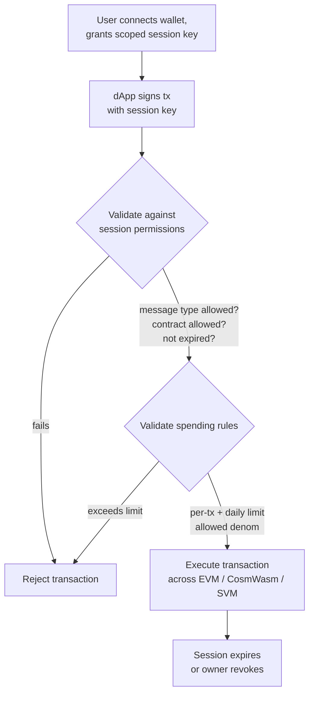

# تجريد الحسابات

توفر QoreChain **تجريد حسابات على مستوى البروتوكول** عبر الوحدة `x/abstractaccount`. يتيح ذلك حسابات قابلة للبرمجة مع قواعد مصادقة مرنة، ومفاتيح جلسات، وحدود إنفاق، واسترداد اجتماعي — كل ذلك دون الحاجة إلى بنية تحتية خارجية من العقود الذكية.

:::note
تستخدم الأوامر أدناه الشبكة الرئيسية **`qorechain-vladi`**، العاملة منذ 7 يونيو 2026 بإصدار السلسلة **v3.1.85**. استبدل `--chain-id qorechain-diana` لاستخدام شبكة الاختبار.
:::

## نظرة عامة

تُدار حسابات البلوكتشين التقليدية بمفتاح خاص واحد. يفصل تجريد الحسابات مفهوم «من يمكنه اعتماد المعاملة» عن مفتاح تشفيري واحد، مما يتيح:

* **حسابات متعددة التوقيع** مع عتبة توقيع قابلة للتهيئة
* **حسابات الاسترداد الاجتماعي** مع استرداد المفاتيح المعتمد على الأوصياء
* **حسابات قائمة على الجلسات** مع صلاحيات دقيقة ومحدودة زمنياً للتطبيقات اللامركزية (dApps)

تنفّذ الوحدة `x/abstractaccount` هذه القدرات على طبقة البروتوكول، ما يعني أنها تعمل عبر الأجهزة الافتراضية الثلاثة جميعها (EVM وCosmWasm وSVM) وتستفيد من كفاءة الغاز الأصلية.

*تدفق تطبيق لامركزي قائم على الجلسات: يوقّع مفتاح جلسة محدود النطاق معاملة، فتتحقق الوحدة منها مقابل الجلسة وقواعد الإنفاق، ثم تنفّذها.*


```mermaid
flowchart TD
    A["User connects wallet,<br/>grants scoped session key"] --> B["dApp signs tx<br/>with session key"]
    B --> C{"Validate against<br/>session permissions"}
    C -- "message type allowed?<br/>contract allowed?<br/>not expired?" --> D{"Validate spending rules"}
    C -- "fails" --> R["Reject transaction"]
    D -- "per-tx + daily limit<br/>allowed denom" --> E["Execute transaction<br/>across EVM / CosmWasm / SVM"]
    D -- "exceeds limit" --> R
    E --> F["Session expires<br/>or owner revokes"]
```

## أنواع الحسابات

| النوع              | الوصف                             | حالة الاستخدام                       |
| ----------------- | --------------------------------------- | ------------------------------ |
| `multisig`        | توقيع بعتبة M من N                | خزائن DAO والمحافظ المشتركة |
| `social_recovery` | استرداد المفاتيح بمساعدة الأوصياء          | محافظ المستهلكين وتهيئة المستخدمين الجدد   |
| `session_based`   | مفاتيح جلسات مفوَّضة مع قيود | جلسات التطبيقات اللامركزية والمحافظ المحمولة  |

## إنشاء حساب مجرَّد

### حساب قائم على الجلسات

```bash
qorechaind tx abstractaccount create \
  --account-type session_based \
  --from mykey \
  --gas auto \
  -y
```

### حساب متعدد التوقيع

```bash
qorechaind tx abstractaccount create \
  --account-type multisig \
  --signers qor1alice...,qor1bob...,qor1carol... \
  --threshold 2 \
  --from mykey \
  --gas auto \
  -y
```

### حساب الاسترداد الاجتماعي

```bash
qorechaind tx abstractaccount create \
  --account-type social_recovery \
  --guardians qor1guardian1...,qor1guardian2...,qor1guardian3... \
  --recovery-threshold 2 \
  --from mykey \
  --gas auto \
  -y
```

## مفاتيح الجلسات

مفاتيح الجلسات هي حجر الأساس لنوع الحساب `session_based`. فهي تتيح لك منح **صلاحيات مؤقتة ومحدودة النطاق** لمفتاح ثانوي — وهو أمر مثالي للتفاعل مع التطبيقات اللامركزية حيث لا تريد كشف مفتاحك الأساسي.

### الخصائص الرئيسية

| الخاصية              | الوصف                                          |
| --------------------- | ---------------------------------------------------- |
| **الصلاحيات**       | أنواع الرسائل التي يمكن لمفتاح الجلسة توقيعها         |
| **انتهاء الصلاحية**            | انتهاء تلقائي بعد مدة قابلة للتهيئة   |
| **حدود الإنفاق**   | الحد الأقصى للمبالغ التي يمكن لمفتاح الجلسة إنفاقها            |
| **العقود المسموح بها** | تقييد التفاعلات بعناوين عقود محددة |

### منح مفتاح جلسة

```bash
qorechaind tx abstractaccount grant-session \
  --session-key qor1sessionkey... \
  --permissions "bank/MsgSend,wasm/MsgExecuteContract" \
  --expiry "2026-03-01T00:00:00Z" \
  --allowed-contracts qor1contract1...,0x1234...abcd \
  --from mykey \
  -y
```

### إلغاء مفتاح جلسة

```bash
qorechaind tx abstractaccount revoke-session \
  --session-key qor1sessionkey... \
  --from mykey \
  -y
```

### عرض الجلسات النشطة

```bash
qorechaind query abstractaccount sessions <account-address>
```

## قواعد الإنفاق

تضيف قواعد الإنفاق ضوابط مالية إلى الحسابات المجرَّدة، بغضّ النظر عن نوع الحساب:

| القاعدة             | الوصف                                     |
| ---------------- | ----------------------------------------------- |
| `daily_limit`    | الحد الأقصى لإجمالي الإنفاق خلال نافذة متحركة مدتها 24 ساعة  |
| `per_tx_limit`   | الحد الأقصى للإنفاق في كل معاملة على حدة        |
| `allowed_denoms` | تقييد فئات الرموز (denominations) التي يمكن إنفاقها |

### تعيين قواعد الإنفاق

```bash
qorechaind tx abstractaccount update-spending-rules \
  --daily-limit 1000000000uqor \
  --per-tx-limit 100000000uqor \
  --allowed-denoms uqor \
  --from mykey \
  -y
```

### الاستعلام عن القواعد الحالية

```bash
qorechaind query abstractaccount spending-rules <account-address>
```

### مثال على الاستجابة

```json
{
  "daily_limit": {
    "denom": "uqor",
    "amount": "1000000000"
  },
  "per_tx_limit": {
    "denom": "uqor",
    "amount": "100000000"
  },
  "allowed_denoms": ["uqor"],
  "daily_spent": {
    "denom": "uqor",
    "amount": "250000000"
  },
  "window_reset": "2026-02-27T00:00:00Z"
}
```

## مصادِقات المحافظ المرتبطة — الإنفاق المفوَّض {#authenticators}

اعتباراً من إصدار السلسلة **v3.1.85** (بناءً على نموذج الصلاحيات في v3.1.84)، يمكن لـ **مفتاح محفظة خارجية مرتبطة** — مفتاح Phantom (ed25519) أو حساب MetaMask (secp256k1) — أن **يُنفق من الحساب القانوني ما بعد الكمومي** وفق شروط قابلة للإلغاء ومحدودة الإنفاق وقائمة على مبدأ الحد الأدنى من الامتيازات. لا يُنتج المفتاح الخارجي أبداً توقيع ML-DSA؛ إذ يقوم **مُرحِّل (relayer)** بتقديم غلاف المعاملة ودفع رسومه (توقيع PQC الهجين الخاص بالمُرحِّل نفسه يستوفي متطلبات التوقيع في السلسلة)، بينما يشكّل توقيع المصادِق على **بايتات توقيع مفصولة النطاق ومقيَّدة ضد إعادة التشغيل** التفويضَ ذاته.

### تسجيل مصادِق {#register-authenticator}

يسجّل مالك الحساب المفتاح الخارجي باستخدام `MsgRegisterAuthenticator` (معاملة عادية بالمفتاح الجذري)، مانحاً إياه مخططاً وصلاحيات ومدة انتهاء وحدود إنفاق اختيارية:

```js
import { registerEthAuthenticatorMsg } from "@qorechain/wallet-adapter";

// Link a MetaMask account by its 20-byte address (EIP-191 verification):
const msg = registerEthAuthenticatorMsg({
  account: "qor1owner...",            // the canonical account
  ethAddress: "0xAbC...123",          // the MetaMask address to link
  permissions: ["evm"],               // least privilege — see the taxonomy below
  expirySeconds: 30 * 24 * 3600,      // ≤ 30 days recommended
  spendingRule: { perTxLimit: "100000000uqor", dailyLimit: "1000000000uqor" },
});
// Sign & broadcast this msg with the OWNER's normal hybrid-PQC signer.
```

يُسجَّل مفتاح Phantom بالطريقة نفسها باستخدام `scheme: "ed25519"` والمفتاح العام لـ Phantom. الإلغاء فوري عبر `MsgRevokeAuthenticator`.

### تصنيف الصلاحيات {#permission-taxonomy}

إحدى عشرة صلاحية قانونية تتحكم فيما يمكن للمصادِق المسجَّل فعله. الخريطة **مغلقة عند الفشل (fail-closed)**: أي نوع رسالة بلا تعيين مقابل يُرفض.

| الصلاحية | تمنح |
| --- | --- |
| `send` | تحويلات بنكية على المسار الأصلي (Native) |
| `delegate` / `withdraw` / `vote` | التفويض للتحصيص، وسحب المكافآت، والحوكمة |
| `evm` / `wasm` / `svm` | التنفيذ على مسار الجهاز الافتراضي المقابل |
| `amm` / `ibc` / `deploy` | عمليات AMM، وتحويلات IBC، ونشر العقود |
| `all` | أي رسالة *قابلة للتفويض* |

**رسائل إدارة المفاتيح غير قابلة للتفويض أبداً** — تتطلب `MsgRegisterAuthenticator` و`MsgRevokeAuthenticator` وتسجيل/ترحيل مفاتيح PQC و`MsgRotatePQCKey` المفتاحَ الجذري دائماً، لذا لا يمكن لمفتاح مرتبط أبداً تصعيد امتيازاته الخاصة.

اقرأ التصنيف الحي (مع `schema_version` لاكتشاف الانحراف) بدلاً من ترميزه بشكل ثابت:

```bash
curl -s https://api.qore.host/qorechain/abstractaccount/v1/permission_schema | jq
# or: qorechaind query abstractaccount permission-schema
```

### الإنفاق عبر مفتاح مرتبط {#execute-messages}

رسالتان تحملان الإجراءات المفوَّضة من المصادِق. في كلتيهما، يكون المُرحِّل هو موقِّع المعاملة ودافع رسومها؛ بينما ينتقل توقيع المصادِق داخل الرسالة.

**`MsgExecuteEVM`** — استدعاء أو تحويل EVM **من عنوان `0x…` الخاص بالحساب القانوني**. يوقّع المصادِق `sha256("qorechain-evm-auth-v1" ‖ chainId ‖ account ‖ pubkey ‖ to ‖ value ‖ data ‖ nonce)` (جميع الحقول مسبوقة بطولها). الحماية من إعادة التشغيل هي عداد nonce الخاص بحساب EVM نفسه.

**`MsgExecuteCosmos`** — إرسال بنكي على المسار الأصلي من الحساب القانوني. يوقّع المصادِق `sha256("qorechain-cosmos-auth-v1" ‖ chainId ‖ account ‖ pubkey ‖ to ‖ amount ‖ nonce)`. الحماية من إعادة التشغيل هي **تسلسل خاص بكل مصادِق** تحتفظ به الوحدة (الإرسال البنكي لا يزيد عداد nonce الخاص بالحساب). عمليات الإرسال الذاتي مرفوضة.

:::caution قواعد الـ nonce
* `MsgExecuteEVM.nonce` = عداد nonce **الحالي** لحساب EVM (`eth_getTransactionCount(account0x, "latest")`). في بيئة الإنتاج، المُرحِّل حساب *مختلف*، لذا **لا** تضف +1. توقيع nonce قديم يُرجع الرمز `11`.
* `MsgExecuteCosmos.nonce` = التسلسل الخاص بالمصادِق (استعلم عن حالة المصادِق في الحساب)، **وليس** تسلسل Cosmos الخاص بالحساب.
:::

**مثال Phantom** (في المتصفح: يوقّع Phantom، وتُرحّل خلفيتك البرمجية):

```js
import { buildPhantomExecuteCosmos } from "@qorechain/wallet-adapter";

// In the dApp: Phantom signs the digest with ed25519 signMessage.
const msg = await buildPhantomExecuteCosmos({
  provider: window.solana,            // Phantom
  chainId: "qorechain-vladi",
  account: "qor1owner...",            // canonical account being spent from
  to: "qor1recipient...",
  amount: { denom: "uqor", amount: "900000" },
  nonce: authSequence,                // per-authenticator sequence
});
// Send `msg` to your relayer; the relayer wraps it in a tx it signs
// (hybrid PQC) and broadcasts. The transfer moves the OWNER's funds.
```

**مثال MetaMask** (توقيع `personal_sign` وفق EIP-191 من العنوان المرتبط ذي 20 بايتاً):

```js
import { buildMetaMaskExecuteEvm } from "@qorechain/wallet-adapter";

const msg = await buildMetaMaskExecuteEvm({
  provider: window.ethereum,          // MetaMask (EIP-1193)
  chainId: "qorechain-vladi",
  account: "qor1owner...",
  to: "0xRecipient...",
  valueWei: 10n ** 16n,               // 0.01 QOR (18-dec EVM view)
  nonce: currentEvmNonce,             // eth_getTransactionCount(owner0x, "latest")
});
// Relay as above. The chain verifies the signature via EIP-191 + ecrecover
// against the registered 20-byte address.
```

تتوفر أدوات البناء نفسها في [QoreChain SDK](/sdk/guides/authenticators) لجميع اللغات الخمس، إضافة إلى مكافئات في سطر الأوامر:

```bash
# Produce the exact sign bytes the chain verifies (for custom signers):
qorechaind query abstractaccount auth-sign-cosmos <account> <to> <amount> <nonce>
qorechaind query abstractaccount auth-sign-evm <account> <to> <value> <data-hex> <nonce>

# Relay a pre-signed authorization:
qorechaind tx abstractaccount execute-cosmos <account> <to> <amount> <auth-pubkey> <auth-sig> <nonce> --from relayer -y
qorechaind tx abstractaccount execute-evm    <account> <to> <value> <data-hex> <auth-pubkey> <auth-sig> <nonce> --from relayer -y
```

### رموز الأخطاء {#authenticator-errors}

تُرجع إخفاقات الإنفاذ رموزاً مميزة (نطاق الرموز `abstractaccount`) حتى تتمكن المحافظ من عرض الرسالة الصحيحة:

| الرمز | المعنى | تجربة المستخدم في المحفظة |
| --- | --- | --- |
| `5` | تجاوز حد الإنفاق (لكل معاملة أو يومي) | اعرض الرصيد المسموح المتبقي |
| `6` | انتهت صلاحية المصادِق | «انتهت الصلاحية — أعد ربط محفظتك» |
| `10` | رُفضت الصلاحية (خارج النطاق أو رسالة غير قابلة للتفويض) | اعرض الصلاحية المفقودة |
| `11` | رُفضت إعادة التشغيل (nonce/تسلسل قديم) | أعد الاستعلام عن الـ nonce وأعد التوقيع |

(الرمز `21` في نطاق الرموز `pqc` = فشل التحقق من التوقيع الهجين — وهي مشكلة توقيع من جهة المُرحِّل، وليست مشكلة تفويض.)

### استعلامات REST {#abstractaccount-rest}

اعتباراً من **v3.1.85** أصبحت استعلامات القراءة الخاصة بالوحدة متاحة أيضاً عبر REST:

```
GET /qorechain/abstractaccount/v1/config
GET /qorechain/abstractaccount/v1/accounts
GET /qorechain/abstractaccount/v1/accounts/{address}
GET /qorechain/abstractaccount/v1/permission_schema
```

## الاستعلام عن الحسابات المجرَّدة

### سطر الأوامر (CLI)

```bash
# Get full account configuration
qorechaind query abstractaccount account <address>

# List all abstract accounts (paginated)
qorechaind query abstractaccount list --limit 10
```

### JSON-RPC

```bash
curl -X POST http://localhost:8545 \
  -H "Content-Type: application/json" \
  -d '{
    "jsonrpc": "2.0",
    "method": "qor_getAbstractAccount",
    "params": ["0xYourAddress"],
    "id": 1
  }'
```

### مثال على استجابة الحساب

```json
{
  "address": "qor1myaccount...",
  "account_type": "session_based",
  "owner": "qor1owner...",
  "active_sessions": 2,
  "spending_rules": {
    "daily_limit": "1000000000uqor",
    "per_tx_limit": "100000000uqor",
    "allowed_denoms": ["uqor"]
  },
  "created_at_height": 54321
}
```

## تدفق الاسترداد الاجتماعي

إذا فقد مالك الحساب الوصول إلى مفتاحه الأساسي، يمكن للأوصياء اعتماد تدوير المفتاح.

1. **يبلّغ المالك عن فقدان المفتاح (أو يبدأ أحد الأوصياء العملية):**

   ```bash
   qorechaind tx abstractaccount initiate-recovery \
     --account <account-address> \
     --new-owner qor1newkey... \
     --from guardian1 \
     -y
   ```

2. **يوافق أوصياء إضافيون** (يجب استيفاء `recovery_threshold`):

   ```bash
   qorechaind tx abstractaccount approve-recovery \
     --account <account-address> \
     --recovery-id <recovery-id> \
     --from guardian2 \
     -y
   ```

3. **يُنفَّذ الاسترداد تلقائياً** بمجرد استيفاء العتبة. تمنح **فترة قفل زمني** (افتراضياً: 48 ساعة) المالكَ الأصلي فرصة لإلغاء أي محاولة استرداد احتيالية.

## التكامل مع التطبيقات اللامركزية

تتيح مفاتيح الجلسات تجارب سلسة مع التطبيقات اللامركزية:

1. **يربط المستخدم محفظته** وينشئ مفتاح جلسة محدود النطاق بعقد التطبيق اللامركزي
2. **يستخدم التطبيق اللامركزي مفتاح الجلسة** لتقديم المعاملات نيابةً عن المستخدم
3. **لا توقيع متكرر** — يتولى مفتاح الجلسة التفويض ضمن حدود صلاحياته
4. **تنتهي صلاحية الجلسة** تلقائياً، أو يلغيها المستخدم في أي وقت

هذا النمط مفيد بشكل خاص في:

* المحافظ المحمولة حيث تكون مطالبات القياسات الحيوية المتكررة مزعجة
* تطبيقات الألعاب اللامركزية التي تحتاج إلى توقيع سريع للمعاملات
* بروتوكولات DeFi التي تنفّذ عمليات متتابعة متعددة

## الخطوات التالية

* [تشغيل مدقق](/developer-guide/running-a-validator) — إعداد عقدة مدقق وتشغيلها
* [تطوير EVM](/developer-guide/evm-development) — دمج الحسابات المجرَّدة مع تطبيقات Solidity اللامركزية
* [قابلية التشغيل البيني عبر الأجهزة الافتراضية](/developer-guide/cross-vm-interoperability) — تراسل عبر الأجهزة الافتراضية باستخدام الحسابات المجرَّدة
