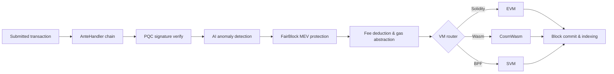

# نظرة عامة على البنية

QoreChain هي عقدة بلوك تشين معيارية تتألف من ثلاث عمليات رئيسية — عقدة السلسلة، والملحق الجانبي للذكاء الاصطناعي (AI sidecar)، ومُفهرس الكتل (block indexer) — مدعومة بقاعدة بيانات Postgres ومراقَبة عبر Prometheus وGrafana. الشبكة الرئيسية (`qorechain-vladi`، معرّف سلسلة EVM **9801**) نشطة منذ 7 يونيو 2026 على إصدار السلسلة **v3.1.80**، مع شبكة اختبار موازية (`qorechain-diana`، معرّف سلسلة EVM **9800**). السلسلة مبنية على Cosmos SDK v0.53. يوضّح الرسم البياني التالي التخطيط عالي المستوى للمكونات.

تلخّص دورة حياة المعاملة أدناه كيفية تدفّق معاملة مُرسَلة عبر العقدة — من سلسلة مُزخرِفات AnteHandler (فحوصات الأمان والرسوم) إلى تنفيذ VM والتسوية على السلسلة:



```
┌────────────────────────────────────────────────────────────────────────────┐
│                            QoreChain Node                                  │
│                                                                            │
│  ┌──────────────────── Virtual Machines ──────────────────────┐           │
│  │  ┌───────┐    ┌──────────┐    ┌───────┐                   │           │
│  │  │  EVM  │    │ CosmWasm │    │  SVM  │                   │           │
│  │  │(Sol.) │◄──►│ (Wasm)   │◄──►│ (BPF) │                   │           │
│  │  └───┬───┘    └────┬─────┘    └───┬───┘                   │           │
│  │      └─────────┬───┘──────────────┘                       │           │
│  │           x/crossvm (bridge)                               │           │
│  └────────────────────────────────────────────────────────────┘           │
│                                                                            │
│  ┌────────────────────── Tokenomics ─────────────────────────┐           │
│  │  ┌──────┐   ┌───────┐   ┌───────────┐                    │           │
│  │  │x/burn│   │x/xqore│   │x/inflation│                    │           │
│  │  │10 ch.│   │lock/  │   │finite     │                    │           │
│  │  │37/30/│   │unlock │   │emission   │                    │           │
│  │  │20/10/│   │PvP    │   │590M       │                    │           │
│  │  │3     │   │       │   │budget     │                    │           │
│  │  └──────┘   └───────┘   └───────────┘                    │           │
│  └────────────────────────────────────────────────────────────┘           │
│                                                                            │
│  ┌──────────── IBC / Bridges ────────────────────────────────┐           │
│  │  ┌──────────┐  ┌──────────┐  ┌───────────┐  ┌──────────┐ │           │
│  │  │x/bridge  │  │x/babylon │  │x/abstract │  │x/gas     │ │           │
│  │  │37 QCB +  │  │BTC re-   │  │ account   │  │abstract. │ │           │
│  │  │8 IBC     │  │staking   │  │session key│  │multi-tok │ │           │
│  │  └────┬─────┘  └────┬─────┘  └───────────┘  └──────────┘ │           │
│  │  QCB Bridge     Babylon IBC   ERC-4337-like   ibc/USDC    │           │
│  │  PQC-signed     BTC finality  social recov.   ibc/ATOM    │           │
│  │  36 ext chains  checkpoint    spending rules  fee convert  │           │
│  │  ┌──────────┐                                              │           │
│  │  │x/fair    │  5-Lane Prioritization: PQC|MEV|AI|Def|Free │           │
│  │  │ block    │  tIBE encrypted mempool framework           │           │
│  │  └──────────┘                                              │           │
│  └────────────────────────────────────────────────────────────┘           │
│                                                                            │
│  ┌──── Rollup Development Kit ───────────────────────────────┐           │
│  │  ┌──────────┐  ┌──────────┐  ┌───────────┐  ┌──────────┐ │           │
│  │  │ x/rdk    │  │Settlement│  │ DA Router │  │ Profiles │ │           │
│  │  │ 4 modes: │  │Optimistic│  │ Native    │  │ defi     │ │           │
│  │  │ opt/zk/  │  │ZK/Based/ │  │ Celestia* │  │ gaming   │ │           │
│  │  │ based/   │  │Sovereign │  │ Both      │  │ nft      │ │           │
│  │  │ sovereign│  │          │  │           │  │ social/  │ │           │
│  │  │          │  │          │  │           │  │ general  │ │           │
│  │  └────┬─────┘  └────┬─────┘  └───────────┘  └──────────┘ │           │
│  │  Bank escrow    Auto-finalize  SHA-256 commit  AI-assisted │           │
│  │  Burn on create EndBlocker     Blob pruning    PRISM sugg. │           │
│  │  → x/multilayer (RegisterSidechain + AnchorState)          │           │
│  └────────────────────────────────────────────────────────────┘           │
│                                                                            │
│  ┌──────────────┐ ┌──────┐ ┌────────────┐ ┌─────┐                       │
│  │x/rlconsensus │ │ x/ai │ │x/reputation│ │x/qca│                       │
│  │  PRISM (RL)  │ │      │ │            │ │     │                       │
│  └──────┬───────┘ └──┬───┘ └────┬──────┘ └──┬──┘                       │
│   PPO MLP         AI Engine   Scoring    CPoS Pools                      │
│   Obs/Action      Fraud Det.  Decay      Bonding                         │
│   Circuit Brk     Fee Opt.    Sigmoid    Slashing                        │
│   Rollup Adv.     TEE/FL                 QDRW Gov                        │
│                                                                            │
│  ┌──────┐ ┌──────────┐                                                   │
│  │x/pqc │ │ x/multi  │                                                   │
│  └──┬───┘ └────┬─────┘                                                   │
│  Dilithium    Layer Router                                                │
│  ML-KEM       Sidechains                                                  │
│  Hybrid Sig   + Rollups                                                   │
│  SHAKE-256                                                                │
│                                                                            │
│  ┌──────┐ ┌───────┐                                                      │
│  │x/svm │ │x/cross│                                                      │
│  └──┬───┘ └───┬───┘                                                      │
│  BPF Exec   CrossVM Msg                                                   │
└────────┬──────┬───────────────────────────────────────┬───────────────────┘
         │      │                                       │
   ┌─────┴─────┐│                              ┌───────┴──────┐
   │libqorepqc ││                              │  Indexer     │
   │(Rust PQC) ││                              │  (Postgres)  │
   └───────────┘│                              └──────────────┘
   ┌───────────┐│  ┌──────────┐
   │libqoresvm ││  │AI Sidecar│
   │(Rust BPF) │└──│ (gRPC)   │
   └───────────┘   └──────────┘
```

## مكونات العقدة

تعمل QoreChain كثلاث عمليات متعاونة، لكل منها وحدة Go ثنائية خاصة بها:

| المكوّن          | الوصف                                                                                                                                                                                                                                                                                          | الموقع                  |
| ------------------ | ---------------------------------------------------------------------------------------------------------------------------------------------------------------------------------------------------------------------------------------------------------------------------------------------------- | ------------------------- |
| **qorechain-node** | عقدة البلوك تشين الأساسية. تشغّل محرّك إجماع QoreChain، وتنفّذ جميع الوحدات المخصصة، وتدير أوقات تشغيل VM الثلاثة، وتعرض نقاط نهاية RPC وREST وgRPC وJSON-RPC.                                                                                                                      | `qorechain-core/`         |
| **ai-sidecar**     | خدمة gRPC توفّر قدرات استدلال متقدمة للذكاء الاصطناعي مدعومة بـ QCAI Backend. يتولى الملحق الجانبي طلبات الاستدلال التي تتجاوز نطاق وكيل RL على السلسلة، مثل تحليل اللغة الطبيعية والتعرّف على الأنماط المعقّدة. يتواصل مع العقدة عبر gRPC على المنفذ 50051. | `qorechain-core/sidecar/` |
| **block-indexer**  | مستمِع WebSocket يشترك في الكتل والمعاملات الجديدة من نقطة نهاية RPC الخاصة بالعقدة، ويحلّل الأحداث، ويكتب بيانات مهيكلة إلى قاعدة بيانات Postgres للاستعلام السريع من قِبل المستكشفات وواجهات API.                                                                                          | `qorechain-core/indexer/` |

## المنافذ

| المنفذ  | البروتوكول       | الخدمة                                                                           |
| ----- | -------------- | --------------------------------------------------------------------------------- |
| 26657 | HTTP/WebSocket | RPC لمحرّك إجماع QoreChain (الكتل، المعاملات، حالة الإجماع)            |
| 1317  | HTTP           | واجهة REST API (نقاط نهاية الاستعلام، بثّ المعاملات)                                 |
| 9090  | gRPC           | نقاط نهاية gRPC للاستعلام والمعاملات                                              |
| 8545  | HTTP           | EVM JSON-RPC (مساحات الأسماء `eth_`، `web3_`، `net_`، `txpool_`، `qor_`)              |
| 8546  | WebSocket      | EVM JSON-RPC (اشتراكات WebSocket)                                            |
| 8899  | HTTP           | SVM JSON-RPC (متوافق مع Solana: `getAccountInfo`، `getBalance`، `getSlot`، إلخ.) |
| 50051 | gRPC           | الملحق الجانبي للذكاء الاصطناعي (طلبات الاستدلال من العقدة)                                     |
| 5432  | TCP            | Postgres (تخزين مُفهرس الكتل)                                            |
| 9091  | HTTP           | مقاييس Prometheus                                                                |
| 3000  | HTTP           | لوحات معلومات Grafana                                                                |

## خريطة الوحدات

تسجّل QoreChain **أكثر من 45 وحدة genesis تشمل أكثر من 20 وحدة مخصصة**، مجمَّعة حسب الوظيفة:

**الأمان**

* `x/pqc` — التشفير المقاوم للحوسبة الكمومية: Dilithium-5، ML-KEM-1024، الهجين secp256k1 (ECDSA) + ML-DSA-87، SHAKE-256، مرونة الخوارزميات

**الذكاء الاصطناعي وتعلّم الآلة**

* `x/ai` — توجيه المعاملات، كشف الشذوذ، كشف الاحتيال، تحسين الرسوم، توثيق TEE، التعلّم الموحّد
* `x/reputation` — تقييم سمعة المُدقِّق متعدد العوامل مع اضمحلال زمني
* `x/rlconsensus` — وكيل RL على السلسلة (PPO MLP)، ضبط الإجماع الديناميكي، قاطع الدائرة، استشارة الـ rollup — طبقة تحسين PRISM

**الإجماع**

* `x/qca` — إثبات الحصة المركّب ثلاثي المجمّعات (RPoS/DPoS/PoS) على محرّك إجماع QoreChain، منحنى ربط مخصص، slashing تصاعدي، حوكمة QDRW

**الأجهزة الافتراضية**

* `x/vm` — توجيه VM وإدارة دورة الحياة
* `x/svm` — وقت تشغيل SVM: نشر/تنفيذ BPF، تحصيل الإيجار، RPC متوافق مع Solana
* `x/crossvm` — التواصل بين الأجهزة الافتراضية: precompile لـ EVM-CosmWasm + أحداث SVM غير المتزامنة

**اقتصاد الرموز والسيولة**

* `x/burn` — 10 قنوات حرق، توزيع رسوم EndBlocker (تقسيم 37/30/20/10/3)
* `x/xqore` — staking مُعزَّز بالحوكمة: قفل/فتح، عقوبات خروج متدرجة، إعادة موازنة PvP
* `x/inflation` — إصدار بإمداد ثابت من ميزانية مكافآت staking محدودة على جدول متعدد السنوات
* `x/amm` — سيولة على السلسلة / صانع سوق آلي

**الجسور وقابلية التشغيل البيني**

* `x/bridge` — 37 إعداد QCB (36 سلسلة خارجية + حلقة استرجاع QoreChain) عبر كل نوع رئيسي من السلاسل، توثيقات موقّعة بـ PQC، قواطع دوائر
* `x/babylon` — إعادة staking للبيتكوين عبر بروتوكول Babylon، نقاط تفتيش حقبية
* `x/multilayer` — إدارة طبقات السلاسل الجانبية/سلاسل الدفع/الـ rollups، تثبيت الحالة

**ملحقات الحوكمة والترخيص**

* `x/abstractaccount` — حسابات ذكية: متعددة التواقيع، استرداد اجتماعي، مفاتيح جلسات، قواعد إنفاق
* `x/fairblock` — حماية MEV: إطار عمل mempool مُشفَّر بعتبة IBE
* `x/gasabstraction` — دفع الغاز بعدة رموز: تحويل رسوم ibc/USDC، ibc/ATOM
* `x/license` — ترخيص السلسلة

**الـ Rollups**

* `x/rdk` — مجموعة تطوير الـ Rollup: 4 أوضاع تسوية (optimistic، zk، based، sovereign)، ملفات تعريف مُعدّة مسبقًا، DA أصلي، ضمان بنكي

## سلسلة AnteHandler

تمر كل معاملة عبر سلسلة المُزخرِفات التالية قبل التنفيذ. تعمل المُزخرِفات بالترتيب؛ ويمكن لأي مُزخرِف رفض المعاملة.

```
SetUpContext
  → CircuitBreaker
    → PQCVerify
      → PQCHybridVerify
        → AIAnomaly
          → FairBlock
            → SVMComputeBudget
              → SVMDeductFee
                → Extension
                  → ValidateBasic
                    → TxTimeout
                      → Memo
                        → MinGasPrice
                          → ConsumeTxSize
                            → GasAbstraction
                              → DeductFee
                                → SetPubKey
                                  → ValidateSigCount
                                    → SigGasConsume
                                      → SigVerify
                                        → IncrementSequence
```

تعمل المُزخرِفات الرئيسية بالتسلسل التالي (يعمل كل مُزخرِف بالترتيب ويمكنه رفض المعاملة):

1. **PQCVerify** — الوحدة `x/pqc`. التحقق من تواقيع Dilithium-5 على المعاملات المُعلَّمة بـ PQC.
2. **PQCHybridVerify** — الوحدة `x/pqc`. التحقق من التواقيع الهجينة المزدوجة secp256k1 (ECDSA) + ML-DSA-87.
3. **AIAnomaly** — الوحدة `x/ai`. تشغيل كشف الشذوذ بغابة العزل وتقييم المخاطر.
4. **FairBlock** — الوحدة `x/fairblock`. معالجة المعاملات المشفَّرة بـ tIBE لحماية MEV.
5. **SVMComputeBudget** — الوحدة `x/svm`. التحقق من وحدات الحوسبة وتخصيصها لبرامج SVM.
6. **SVMDeductFee** — الوحدة `x/svm`. خصم رسوم التنفيذ الخاصة بـ SVM.
7. **GasAbstraction** — الوحدة `x/gasabstraction`. تحويل رموز الرسوم غير الأصلية (USDC، ATOM) قبل الخصم.

## مجموعة Docker Compose

تعمل مجموعة التطوير الكاملة كنشر Docker Compose مكوّن من ست خدمات على شبكة جسر مشتركة (`qorechain-net`):

| الخدمة          | الصورة                      | الغرض                                             |
| ---------------- | -------------------------- | --------------------------------------------------- |
| `qorechain-node` | `qorechain-core:latest`    | عقدة السلسلة مع جميع الوحدات والأجهزة الافتراضية ونقاط نهاية RPC |
| `ai-sidecar`     | `qorechain-sidecar:latest` | خدمة استدلال الذكاء الاصطناعي (gRPC + QCAI Backend)          |
| `block-indexer`  | `qorechain-indexer:latest` | مُفهرس الكتل/المعاملات (WebSocket + Postgres)    |
| `postgres`       | `postgres:16-alpine`       | قاعدة بيانات مُفهرس الكتل                      |
| `prometheus`     | `prom/prometheus:latest`   | جمع المقاييس وتخزينها                            |
| `grafana`        | `grafana/grafana:latest`   | لوحات المراقبة والتنبيهات                  |

ابدأ المجموعة الكاملة:

```bash
docker compose up -d
```

تُخزَّن جميع البيانات الدائمة في أحجام Docker مُسمّاة: `node-data`، و`postgres-data`، و`prometheus-data`، و`grafana-data`.

## ذات صلة

* [البنية متعددة الطبقات](/architecture/multilayer-architecture) — تسجيل السلاسل الجانبية وتثبيت الحالة.
* [آلية الإجماع](/architecture/consensus-mechanism) — إنتاج الكتل، والنهائية، والـ slashing.
* [محرّك إجماع PRISM](/architecture/prism-consensus-engine) — تحسين المعاملات المدفوع بالذكاء الاصطناعي.
* [الأمان المقاوم للحوسبة الكمومية](/architecture/post-quantum-security) — تواقيع Dilithium-5 عبر المنظومة بأكملها.
