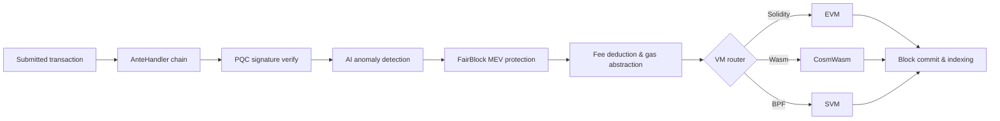

# نظرة عامة على البنية

QoreChain هي عقدة بلوكتشين معيارية مكوّنة من ثلاث عمليات أساسية — عقدة السلسلة، والملحق الجانبي للذكاء الاصطناعي (AI sidecar)، ومُفهرس الكتل (block indexer) — مدعومة بقاعدة بيانات Postgres ومراقَبة عبر Prometheus وGrafana. الشبكة الرئيسية (`qorechain-vladi`، معرّف سلسلة EVM **9801**) نشطة منذ 7 يونيو 2026 على إصدار السلسلة **v3.1.95**، إلى جانب شبكة اختبار موازية (`qorechain-diana`، معرّف سلسلة EVM **9800**). السلسلة مبنية على Cosmos SDK v0.53. يوضّح المخطط التالي التخطيط العام لمكوّنات النظام.

تلخّص دورة حياة المعاملة أدناه كيفية مرور معاملة مُرسَلة عبر العقدة — بدءًا من سلسلة مُزخرِفات AnteHandler (فحوصات الأمان والرسوم) وصولًا إلى تنفيذ الآلة الافتراضية (VM) والتسوية على السلسلة:


```mermaid
flowchart LR
    Tx[Submitted transaction] --> Ante[AnteHandler chain]
    Ante --> PQC[PQC signature verify]
    PQC --> AI[AI anomaly detection]
    AI --> Fair[FairBlock MEV protection]
    Fair --> Fee[Fee deduction & gas abstraction]
    Fee --> Router{VM router}
    Router -->|Solidity| EVM[EVM]
    Router -->|Wasm| Wasm[CosmWasm]
    Router -->|BPF| SVM[SVM]
    EVM --> Commit[Block commit & indexing]
    Wasm --> Commit
    SVM --> Commit
```

```
┌────────────────────────────────────────────────────────────────────────────┐
│                            QoreChain Node                                  │
│                                                                            │
│  ┌──────────────────── Virtual Machines ──────────────────────┐           │
│  │  ┌───────┐    ┌──────────┐    ┌───────┐                   │           │
│  │  │  EVM  │    │ CosmWasm │    │  SVM  │                   │           │
│  │  │(Sol.) │◄──►│ (Wasm)   │◄──►│ (BPF) │                   │           │
│  │  └───┬───┘    └────┬─────┘    └───┬───┘                   │           │
│  │      └─────────┬───┘──────────────┘                       │           │
│  │           x/crossvm (bridge)                               │           │
│  └────────────────────────────────────────────────────────────┘           │
│                                                                            │
│  ┌────────────────────── Tokenomics ─────────────────────────┐           │
│  │  ┌──────┐   ┌───────┐   ┌───────────┐                    │           │
│  │  │x/burn│   │x/xqore│   │x/inflation│                    │           │
│  │  │10 ch.│   │lock/  │   │finite     │                    │           │
│  │  │37/30/│   │unlock │   │emission   │                    │           │
│  │  │20/10/│   │PvP    │   │590M       │                    │           │
│  │  │3     │   │       │   │budget     │                    │           │
│  │  └──────┘   └───────┘   └───────────┘                    │           │
│  └────────────────────────────────────────────────────────────┘           │
│                                                                            │
│  ┌──────────── IBC / Bridges ────────────────────────────────┐           │
│  │  ┌──────────┐  ┌──────────┐  ┌───────────┐  ┌──────────┐ │           │
│  │  │x/bridge  │  │x/babylon │  │x/abstract │  │x/gas     │ │           │
│  │  │37 QCB +  │  │BTC re-   │  │ account   │  │abstract. │ │           │
│  │  │8 IBC     │  │staking   │  │session key│  │multi-tok │ │           │
│  │  └────┬─────┘  └────┬─────┘  └───────────┘  └──────────┘ │           │
│  │  QCB Bridge     Babylon IBC   ERC-4337-like   ibc/USDC    │           │
│  │  PQC-signed     BTC finality  social recov.   ibc/ATOM    │           │
│  │  36 ext chains  checkpoint    spending rules  fee convert  │           │
│  │  ┌──────────┐                                              │           │
│  │  │x/fair    │  5-Lane Prioritization: PQC|MEV|AI|Def|Free │           │
│  │  │ block    │  tIBE encrypted mempool framework           │           │
│  │  └──────────┘                                              │           │
│  └────────────────────────────────────────────────────────────┘           │
│                                                                            │
│  ┌──── Rollup Development Kit ───────────────────────────────┐           │
│  │  ┌──────────┐  ┌──────────┐  ┌───────────┐  ┌──────────┐ │           │
│  │  │ x/rdk    │  │Settlement│  │ DA Router │  │ Profiles │ │           │
│  │  │ 4 modes: │  │Optimistic│  │ Native    │  │ defi     │ │           │
│  │  │ opt/zk/  │  │ZK/Based/ │  │ Celestia* │  │ gaming   │ │           │
│  │  │ based/   │  │Sovereign │  │ Both      │  │ nft      │ │           │
│  │  │ sovereign│  │          │  │           │  │ social/  │ │           │
│  │  │          │  │          │  │           │  │ general  │ │           │
│  │  └────┬─────┘  └────┬─────┘  └───────────┘  └──────────┘ │           │
│  │  Bank escrow    Auto-finalize  SHA-256 commit  AI-assisted │           │
│  │  Burn on create EndBlocker     Blob pruning    PRISM sugg. │           │
│  │  → x/multilayer (RegisterSidechain + AnchorState)          │           │
│  └────────────────────────────────────────────────────────────┘           │
│                                                                            │
│  ┌──────────────┐ ┌──────┐ ┌────────────┐ ┌─────┐                       │
│  │x/rlconsensus │ │ x/ai │ │x/reputation│ │x/qca│                       │
│  │  PRISM (RL)  │ │      │ │            │ │     │                       │
│  └──────┬───────┘ └──┬───┘ └────┬──────┘ └──┬──┘                       │
│   PPO MLP         AI Engine   Scoring    CPoS Pools                      │
│   Obs/Action      Fraud Det.  Decay      Bonding                         │
│   Circuit Brk     Fee Opt.    Sigmoid    Slashing                        │
│   Rollup Adv.     TEE/FL                 QDRW Gov                        │
│                                                                            │
│  ┌──────┐ ┌──────────┐                                                   │
│  │x/pqc │ │ x/multi  │                                                   │
│  └──┬───┘ └────┬─────┘                                                   │
│  Dilithium    Layer Router                                                │
│  ML-KEM       Sidechains                                                  │
│  Hybrid Sig   + Rollups                                                   │
│  SHAKE-256                                                                │
│                                                                            │
│  ┌──────┐ ┌───────┐                                                      │
│  │x/svm │ │x/cross│                                                      │
│  └──┬───┘ └───┬───┘                                                      │
│  BPF Exec   CrossVM Msg                                                   │
└────────┬──────┬───────────────────────────────────────┬───────────────────┘
         │      │                                       │
   ┌─────┴─────┐│                              ┌───────┴──────┐
   │libqorepqc ││                              │  Indexer     │
   │(Rust PQC) ││                              │  (Postgres)  │
   └───────────┘│                              └──────────────┘
   ┌───────────┐│  ┌──────────┐
   │libqoresvm ││  │AI Sidecar│
   │(Rust BPF) │└──│ (gRPC)   │
   └───────────┘   └──────────┘
```

## مكوّنات العقدة

تعمل QoreChain كثلاث عمليات متعاونة، لكل منها وحدة Go وملف تنفيذي (binary) خاص بها:

| المكوّن          | الوصف                                                                                                                                                                                                                                                                                          | الموقع                  |
| ------------------ | ---------------------------------------------------------------------------------------------------------------------------------------------------------------------------------------------------------------------------------------------------------------------------------------------------- | ------------------------- |
| **qorechain-node** | العقدة الأساسية للبلوكتشين. تُشغّل محرّك إجماع QoreChain، وتنفّذ جميع الوحدات المخصّصة، وتدير بيئات تشغيل الآلات الافتراضية الثلاث، وتعرض نقاط نهاية RPC وREST وgRPC وJSON-RPC.                                                                                                                      | `qorechain-core/`         |
| **ai-sidecar**     | خدمة gRPC توفّر إمكانات استدلال متقدّمة للذكاء الاصطناعي مدعومة بخلفية QCAI. يتولى الملحق الجانبي طلبات الاستدلال التي تتجاوز نطاق وكيل التعلّم المعزَّز (RL) الموجود على السلسلة، مثل تحليل اللغة الطبيعية والتعرّف على الأنماط المعقّدة. يتواصل مع العقدة عبر gRPC على المنفذ 50051. | `qorechain-core/sidecar/` |
| **block-indexer**  | مستمِع WebSocket يشترك في الكتل والمعاملات الجديدة من نقطة نهاية RPC الخاصة بالعقدة، ويحلّل الأحداث، ويكتب بيانات مُهيكلة إلى قاعدة بيانات Postgres لتمكين الاستعلام السريع من قِبل المستكشفات (explorers) وواجهات البرمجة (APIs).                                                                                          | `qorechain-core/indexer/` |

## المنافذ

| المنفذ | البروتوكول    | الخدمة                                                                            |
| ----- | -------------- | --------------------------------------------------------------------------------- |
| 26657 | HTTP/WebSocket | RPC الخاص بمحرّك إجماع QoreChain (الكتل، المعاملات، حالة الإجماع)                 |
| 1317  | HTTP           | واجهة REST API (نقاط نهاية الاستعلام، بثّ المعاملات)                              |
| 9090  | gRPC           | نقاط نهاية gRPC للاستعلام والمعاملات                                              |
| 8545  | HTTP           | EVM JSON-RPC (مساحات الأسماء `eth_`، `web3_`، `net_`، `txpool_`، `qor_`)          |
| 8546  | WebSocket      | EVM JSON-RPC (اشتراكات WebSocket)                                                 |
| 8899  | HTTP           | SVM JSON-RPC (متوافق مع Solana: `getAccountInfo`، `getBalance`، `getSlot`، وغيرها) |
| 50051 | gRPC           | الملحق الجانبي للذكاء الاصطناعي (طلبات الاستدلال من العقدة)                       |
| 5432  | TCP            | Postgres (تخزين مُفهرس الكتل)                                                     |
| 9091  | HTTP           | مقاييس Prometheus                                                                  |
| 3000  | HTTP           | لوحات معلومات Grafana                                                             |

## خريطة الوحدات

تسجّل QoreChain **أكثر من 45 وحدة تأسيسية (genesis) تشمل أكثر من 20 وحدة مخصّصة**، مُصنّفة حسب الوظيفة:

**الأمان**

* `x/pqc` — التشفير المقاوم للحوسبة الكمومية: Dilithium-5، ML-KEM-1024، توقيع هجين secp256k1 (ECDSA) + ML-DSA-87، SHAKE-256، مرونة اختيار الخوارزمية

**الذكاء الاصطناعي والتعلّم الآلي**

* `x/ai` — توجيه المعاملات، كشف الشذوذ، كشف الاحتيال، تحسين الرسوم، تصديق TEE، التعلّم الموحّد (federated learning)
* `x/reputation` — تقييم سمعة المدقّقين (validators) متعدد العوامل مع اضمحلال زمني
* `x/rlconsensus` — وكيل تعلّم معزَّز (RL) على السلسلة (PPO MLP)، ضبط ديناميكي للإجماع، قاطع دارة (circuit breaker)، استشارة للتجميعات (rollups) — طبقة تحسين PRISM

**الإجماع**

* `x/qca` — إثبات حصة مركّب ثلاثي المجمّعات (RPoS/DPoS/PoS) على محرّك إجماع QoreChain، منحنى ربط (bonding curve) مخصّص، خصم تدريجي (slashing)، حوكمة QDRW

**الآلات الافتراضية**

* `x/vm` — توجيه الآلات الافتراضية وإدارة دورة حياتها
* `x/svm` — بيئة تشغيل SVM: نشر/تنفيذ BPF، تحصيل الإيجار، واجهة RPC متوافقة مع Solana
* `x/crossvm` — التواصل بين الآلات الافتراضية: مُجمّع مسبق (precompile) بين EVM وCosmWasm + أحداث SVM غير متزامنة

**اقتصاديات الرمز والسيولة**

* `x/burn` — 10 قنوات حرق (burn)، توزيع رسوم EndBlocker (تقسيم 37/30/20/10/3)
* `x/xqore` — تكديس (staking) معزَّز بالحوكمة: قفل/فك قفل، عقوبات خروج متدرّجة، إعادة موازنة PvP
* `x/inflation` — إصدار بعرض ثابت من ميزانية محدودة لمكافآت التكديس وفق جدول زمني متعدد السنوات
* `x/amm` — سيولة على السلسلة / صانع سوق آلي (AMM)

**الجسور وقابلية التشغيل البيني**

* `x/bridge` — 37 إعداد QCB (36 سلسلة خارجية + حلقة استرجاع QoreChain) عبر كل الأنواع الرئيسية للسلاسل، تصديقات موقّعة بـ PQC، قواطع دارة
* `x/babylon` — إعادة تكديس BTC عبر بروتوكول Babylon، نقاط تفتيش للحقب (epoch checkpoints)
* `x/multilayer` — إدارة طبقات السلاسل الجانبية (sidechain)/سلاسل الدفع (paychain)/التجميعات (rollup)، تثبيت الحالة (state anchoring)

**امتدادات الحوكمة والترخيص**

* `x/abstractaccount` — حسابات ذكية: توقيع متعدد (multisig)، استعادة اجتماعية، مفاتيح جلسة، قواعد إنفاق
* `x/fairblock` — حماية من MEV: إطار عمل لتشفير تجمّع المعاملات (mempool) باستخدام IBE العتبي (threshold IBE)
* `x/gasabstraction` — دفع الغاز بعملات متعددة: تحويل رسوم ibc/USDC، ibc/ATOM
* `x/license` — ترخيص السلسلة

**التجميعات (Rollups)**

* `x/rdk` — عدة تطوير التجميعات (Rollup Development Kit): 4 أوضاع تسوية (optimistic، zk، based، sovereign)، ملفات تعريف جاهزة، توفّر بيانات (DA) أصلي، ضمان بنكي (bank escrow)

## سلسلة AnteHandler

تمرّ كل معاملة عبر سلسلة المُزخرِفات (decorators) التالية قبل التنفيذ. تعمل المُزخرِفات بالترتيب، ويمكن لأي مُزخرِف رفض المعاملة.

```
SetUpContext
  → CircuitBreaker
    → PQCVerify
      → PQCHybridVerify
        → AIAnomaly
          → FairBlock
            → SVMComputeBudget
              → SVMDeductFee
                → Extension
                  → ValidateBasic
                    → TxTimeout
                      → Memo
                        → MinGasPrice
                          → ConsumeTxSize
                            → GasAbstraction
                              → DeductFee
                                → SetPubKey
                                  → ValidateSigCount
                                    → SigGasConsume
                                      → SigVerify
                                        → IncrementSequence
```

تعمل المُزخرِفات الرئيسية وفق التسلسل التالي (يعمل كل مُزخرِف بالترتيب ويمكنه رفض المعاملة):

1. **PQCVerify** — الوحدة `x/pqc`. التحقق من توقيعات Dilithium-5 على المعاملات المُعلَّمة بـ PQC.
2. **PQCHybridVerify** — الوحدة `x/pqc`. التحقق من التوقيعات الهجينة المزدوجة secp256k1 (ECDSA) + ML-DSA-87.
3. **AIAnomaly** — الوحدة `x/ai`. تشغيل كشف الشذوذ بخوارزمية الغابة العازلة (isolation forest) وتقييم المخاطر.
4. **FairBlock** — الوحدة `x/fairblock`. معالجة المعاملات المشفَّرة بـ tIBE للحماية من MEV.
5. **SVMComputeBudget** — الوحدة `x/svm`. التحقق من وحدات الحوسبة وتخصيصها لبرامج SVM.
6. **SVMDeductFee** — الوحدة `x/svm`. خصم رسوم التنفيذ الخاصة بـ SVM.
7. **GasAbstraction** — الوحدة `x/gasabstraction`. تحويل رموز الرسوم غير الأصلية (USDC، ATOM) قبل الخصم.

## حزمة Docker Compose

تعمل حزمة التطوير الكاملة كنشر Docker Compose من ست خدمات على شبكة جسر (bridge network) مشتركة (`qorechain-net`):

| الخدمة           | الصورة                      | الغرض                                                |
| ---------------- | -------------------------- | --------------------------------------------------- |
| `qorechain-node` | `qorechain-core:latest`    | عقدة السلسلة مع جميع الوحدات والآلات الافتراضية ونقاط نهاية RPC |
| `ai-sidecar`     | `qorechain-sidecar:latest` | خدمة استدلال الذكاء الاصطناعي (gRPC + خلفية QCAI)     |
| `block-indexer`  | `qorechain-indexer:latest` | مُفهرس الكتل/المعاملات (WebSocket + Postgres)         |
| `postgres`       | `postgres:16-alpine`       | قاعدة بيانات مُفهرس الكتل                             |
| `prometheus`     | `prom/prometheus:latest`   | جمع المقاييس وتخزينها                                |
| `grafana`        | `grafana/grafana:latest`   | لوحات مراقبة وتنبيهات                                |

لتشغيل الحزمة الكاملة:

```bash
docker compose up -d
```

تُخزَّن جميع البيانات الدائمة في مجلدات Docker مُسمّاة (named volumes): `node-data`، و`postgres-data`، و`prometheus-data`، و`grafana-data`.

## ذات صلة

* [بنية Multilayer](/architecture/multilayer-architecture) — تسجيل السلاسل الجانبية وتثبيت الحالة.
* [آلية الإجماع](/architecture/consensus-mechanism) — إنتاج الكتل، النهائية، والخصم (slashing).
* [محرّك إجماع PRISM](/architecture/prism-consensus-engine) — تحسين المعاملات المدفوع بالذكاء الاصطناعي.
* [الأمان المقاوم للحوسبة الكمومية](/architecture/post-quantum-security) — توقيعات Dilithium-5 عبر المنظومة بأكملها.
