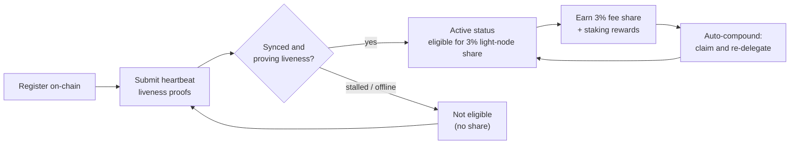

# المكافآت والمراقبة

العقدة الخفيفة **تكسب مكافآت** و**تحتاج إلى البقاء بصحة جيدة** للاستمرار في كسبها. تغطي هذه الصفحة حصة مكافأة العقدة الخفيفة البالغة 3%، وكيف يعمل التفويض بالحصص (الستيكينغ) والمراكمة التلقائية، وكيفية مراقبة العقدة.

## حصة مكافأة الكتلة البالغة 3%

يحجز توزيع الرسوم في QoreChain **حصة ثابتة بنسبة 3% للعقد الخفيفة** التي تقدم بيانات الشبكة. هذه واحدة من الوجهات الخمس في تقسيم المكافآت في البروتوكول — المُدققون (37%)، المحروق (30%)، الخزينة (20%)، أصحاب الحصص (10%)، و**العقد الخفيفة (3%)** — مفروضةً على السلسلة. راجع [اقتصاد الرمز](/architecture/tokenomics) للتفصيل الكامل.

لتكون مؤهلًا لهذه الحصة، يجب أن تكون العقدة **مسجَّلة على السلسلة وتُثبت نشاطها بفعالية** عبر إثباتات نبضات القلب. العقدة المسجَّلة لكن غير المتصلة لا تكسب الحصة. راجع [التسجيل والترخيص](/light-node/registration-and-licensing) لمعرفة كيفية عمل التسجيل ونبضات القلب.

*أهلية المكافأة: سجِّل على السلسلة، أثبت النشاط عبر نبضات القلب للوصول إلى الحالة النشطة، اكسب حصة الـ 3%، ثم راكمها تلقائيًا في الحصة المفوَّضة.*



## كيف تعمل المكافآت

إلى جانب حصة العقدة الخفيفة، تدير العقدة الحصة المفوَّضة ومكافآت الستيكينغ التي تنتجها. يُحكَم هذا السلوك بقسم `[delegation]` من `config.toml`.

### التفويض بالحصص مع التقسيم متعدد المُدققين

يمكنك التفويض عبر **عدة مُدققين** بدلًا من تركيز الحصة على واحد. تتعقب العقدة كل تفويض وحصة الستيك المخصصة لكل مُدقق باستخدام **أوزان تقسيم** قابلة للتهيئة، بحيث يمكنك توزيع المخاطر عبر المجموعة.

### مكافآت المراكمة التلقائية

يمكن للعقدة **المطالبة بالمكافآت وإعادة تفويضها تلقائيًا** على فترة قابلة للتهيئة. افتراضيًا تكون المراكمة التلقائية مفعَّلة على فترة `1h`، مع حد أدنى من المكافأة (بوحدة `uqor`) يجب أن يتراكم قبل تشغيل المطالبة. تحوِّل المراكمة المكافآت المكتسبة إلى حصة إضافية دون تدخل يدوي.

### إعادة التوازن المدركة للسمعة

عند تفعيل إعادة التوازن، يمكن للعقدة **تحويل التفويض نحو مُدققين ذوي سمعة أعلى** تلقائيًا، رهنًا بحد أدنى قابل للتهيئة لدرجة السمعة. يُبقي هذا الحصة عاملة مع مُدققين يؤدون أداءً جيدًا بدلًا من تركها مع مُدققين تدهور أداؤهم.

### فحص المكافآت والتفويضات

يكشف إصدار SX أوامر لفحص هذه الحالة:

```bash
lightnode-sx delegation   # current delegations and their split
lightnode-sx rewards      # pending staking rewards (uqor)
lightnode-sx validators   # the bonded validator set
```

في إصدار UX، يعرض عرض **Delegation** نفس معلومات التفويض والمكافأة في المتصفح.

## المراقبة

إبقاء العقدة بصحة جيدة هو ما يُبقيها مؤهلة للمكافآت. هناك ثلاثة أمور تستحق المراقبة.

### القياس عن بُعد (التيليمتري)

يغطي القياس عن بُعد في الوقت الفعلي المُدققين، والإجماع/الشبكة، والجسر، واقتصاد الرمز، يُحدَّث كل منها على فترته الخاصة (المهيَّأة تحت `[telemetry]` في `config.toml`). من سطر الأوامر:

```bash
lightnode-sx status    # node and light-client sync status
lightnode-sx network   # recent synced headers and latest height
```

يُظهر إصدار UX نفس البيانات حية عبر عروضه **Overview** و**Network** و**Bridge** و**Tokenomics** — راجع [إصدار UX](/light-node/ux-edition).

### صحة المزامنة ونبضات القلب

يبلِّغ أمر `status` عن معرّف السلسلة، وأحدث ارتفاع للكتل، وما إذا كانت السلسلة تلحق بالركب، وارتفاع العميل الخفيف المتزامن وحالة مزامنته. العقدة المسجَّلة والمتزامنة وقيد التشغيل تستمر في إرسال **إثباتات استمرارية النشاط بنبضات القلب** وبذلك تبقى مؤهلة لحصة المكافأة. تُنتَج نبضات القلب هذه عبر **خط أنابيب معاملات موقَّع تشاركيًا بـ PQC** (هجين Dilithium-5 / ML-DSA-87)، متسقًا مع افتراض QoreChain القائم على اشتراط PQC — راجع [التسجيل والترخيص](/light-node/registration-and-licensing#pqc-cosigned-heartbeat-pipeline) لمعرفة كيف يعمل خط الأنابيب وكيفية تفعيل نبضات القلب على السلسلة. إذا أظهر `status` أن العقدة متوقفة أو لا تتزامن، فقد تكون عاجزة عن إثبات النشاط — حقِّق في الأمر قبل أن تتأثر الأهلية.

### صحة الاختبار الذاتي

إذا اشتبهت بوجود مشكلة في الحزمة التشفيرية، شغِّل الاختبار الذاتي لـ PQC في أي وقت:

```bash
lightnode-sx selftest
```

يشغِّل توليد المفاتيح ← التوقيع ← التحقق ← كشف العبث (خمسة فحوص) ويخرج بقيمة غير صفرية عند أي فشل. هذه أسرع طريقة لاستبعاد مكتبة `libqorepqc` المعطوبة أو المفقودة عند تشخيص مشكلات العقدة. راجع [إصدار SX](/light-node/sx-edition) لتفصيل الاختبار الذاتي الكامل.

## إلى أين تذهب بعد ذلك

- [التسجيل والترخيص](/light-node/registration-and-licensing) — سجِّل وابقَ نشطًا.
- [اقتصاد الرمز](/architecture/tokenomics) — نموذج المكافأة والحرق الكامل.
