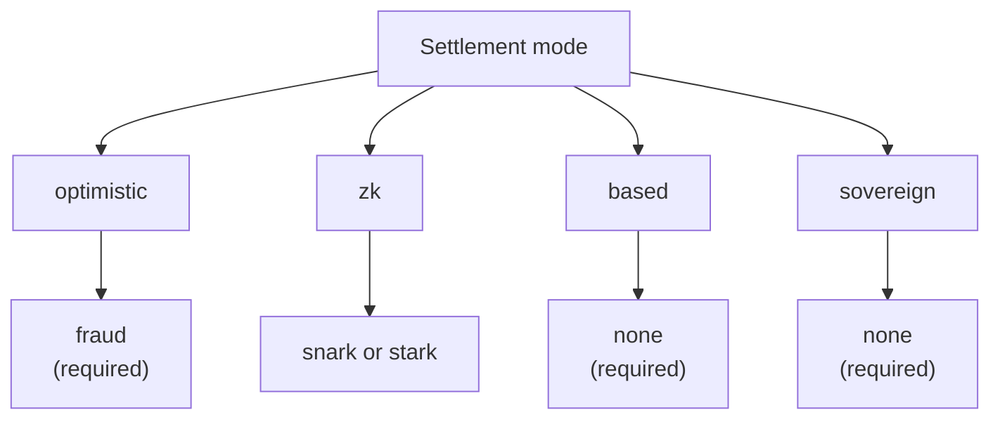

# نظرة عامة على الـ Rollups

تتيح **مجموعة تطوير الـ Rollups (RDK)** في QoreChain — وحدة `x/rdk` — للمطورين إطلاق rollups مخصّصة للتطبيقات تُسوّى على QoreChain. كل rollup هو بيئة تنفيذ مستقلة لها وقت كتلة خاص بها، وجهاز افتراضي، ونموذج رسوم، وآلية ترتيب، بينما يرث ضمانات الأمان والتشفير المقاوم للكم وتوفّر البيانات الخاصة بـ QoreChain.

:::caution
الـ RDK وطبقة تسوية الـ rollup هما قدرة قيد التطوير النشط. عامِل أوضاع التسوية وأنظمة الإثبات والإعدادات المسبقة ومستوى نضج كل ميزة الموصوفة في هذا القسم على أنها نية تصميمية قابلة للتغيير، وتحقّق من أي عملية نشر على شبكة الاختبار **`qorechain-diana`** قبل استهداف الشبكة الرئيسية (**`qorechain-vladi`**، معرّف سلسلة EVM **9801**، إصدار السلسلة **v3.1.80**).
:::

للاطلاع على المرجع الأدنى مستوى للوحدة — معاملات الوحدة، وتفاصيل دورة الحياة الداخلية، وتكامل الحرق، والترسيخ متعدد الطبقات — راجع صفحة **[مجموعة تطوير الـ Rollups](/architecture/rollup-development-kit)** في قسم البنية المعمارية. يمثّل قسم الـ Rollups هذا الدليل الموجّه للمطورين: ما هو الـ RDK، وأي نموذج تختار، وكيف تنشر، وكيف يعمل توفّر البيانات، وكيف تُسوّى عمليات السحب من L2 رجوعًا إلى L1.

---

## ما الذي يمنحك إياه الـ RDK

يجمع الـ rollup المُنشأ عبر الـ RDK أربعة جوانب قابلة للتهيئة:

| الجانب | ما الذي يتحكم فيه | الخيارات |
| ------- | ---------------- | ------- |
| **وضع التسوية** | كيفية التحقق من انتقالات حالة الـ rollup وإنهائها على QoreChain | `optimistic`، `zk`، `based`، `sovereign` |
| **نظام الإثبات** | الآلية التشفيرية أو الاقتصادية التي تدعم التسوية | `fraud`، `snark`، `stark`، `none` |
| **وضع المرتِّب** | من يرتّب المعاملات قبل تسويتها | `dedicated`، `shared`، `based` |
| **توفّر البيانات** | أين تُنشر بيانات المعاملات حتى يتمكن أي شخص من إعادة بناء الحالة | `native`، `celestia`، `both` |

يُسجَّل كل rollup بمعرّف فريد `rollup-id`، مدعومًا بسند حصص (stake bond) بعملة QOR، ويُعيَّن له حالة في دورة الحياة (`pending`، `active`، `paused`، `stopped`). راجع **[نشر rollup](/rollups/deploying-a-rollup)** للاطلاع على تدفق الإنشاء ودورة الحياة الكامل.

---

## ما الذي يميّز RDK الخاص بـ QoreChain

إلى جانب الأساسيات المتوفرة في أي مجموعة rollup، يكشف RDK الخاص بـ QoreChain عن ثلاث قدرات تعتمد على الطبقة الأولى (Layer 1) لـ QoreChain ولا يمكن لأي مجموعة مبنية على طبقة أساسية غير مقاومة للكم وغير معتمدة على الذكاء الاصطناعي تقديمها — بالإضافة إلى مُتحدٍّ آلي من نوع watchtower. يأتي الـ RDK بخمس لغات (TypeScript، Python، Go، Rust، Java)، وكلها حاليًا عند **v0.4.0**.

| العنصر المميِّز | ماذا يفعل |
| -------------- | ------------ |
| **[إيصالات تسوية آمنة كموميًا](/rollups/settlement-receipts)** | تحويل مرساة تسوية إلى إيصال قابل للنقل يمكن التحقق منه **بالكامل دون اتصال** بموجب توقيع مقاوم للكم (ML-DSA-87 / Dilithium-5) — بايت ببايت عبر جميع العملاء الخمسة. |
| **[مساعد QCAI للـ Rollup](/rollups/qcai-copilot)** | تجميع خدمات الذكاء الاصطناعي/التعلم المعزّز على السلسلة في QoreChain (عميل سياسة الرسوم، والتوصيات، وتحقيقات الاحتيال، وقواطع الدارة) في استشارة للقراءة فقط بلغة بسيطة لـ rollup واحد. |
| **[الاستدعاءات عبر الأجهزة الافتراضية متعددة الأجهزة](/rollups/multi-vm)** | استدعاء عقد CosmWasm من عقد rollup من نوع EVM/Solidity عبر الـ precompile الخاص بالاستدعاءات عبر الأجهزة الافتراضية (`0x…0901`). |
| **[Watchtower](/rollups/watchtower)** | إطار عمل مُتحدٍّ آلي لـ rollups من النوع optimistic يُظهر الدُفعات الجديدة ومواعيد نوافذ التحدي النهائية ويتحدى الدُفعات غير الصالحة وفق مُسنَدة الصلاحية الخاصة بك. |

راجع **[لماذا RDK الخاص بـ QoreChain](/rollups/why)** للاطلاع على المبرر الكامل وعينات التعليمات البرمجية.

---

## نماذج التسوية الأربعة

يدعم RDK الخاص بـ QoreChain أربعة أوضاع تسوية متميزة، لكل منها افتراضات ثقة مختلفة، وخصائص نهائية، ومتطلبات إثبات. يُتحقَّق من المزج بين وضع التسوية ونظام الإثبات على السلسلة — ويُرفض أي اقتران غير متوافق عند الإنشاء. يربط المخطط أدناه كل وضع تسوية بنظام الإثبات الصالح له.

### Optimistic

تفترض rollups من النوع optimistic أن الدُفعات المُقدَّمة صالحة افتراضيًا وتعتمد على **إثباتات الاحتيال** لحل النزاعات.

* **نظام الإثبات**: `fraud` — إثباتات احتيال تفاعلية
* **المرتِّب**: `dedicated` أو `shared`
* **النهائية**: مؤجلة حتى انقضاء نافذة تحدٍّ قابلة للتهيئة دون تحدٍّ ناجح
* **النزاعات**: يجوز لأي شخص تقديم تحدّي إثبات احتيال ضد دُفعة مُقدَّمة ضمن النافذة؛ ويؤدي التحدي الناجح إلى رفض الدُفعة

### ZK (المعرفة الصفرية)

ترفق rollups من النوع ZK إثبات صلاحية تشفيري بكل دُفعة، مما يثبت صحة انتقال الحالة دون إعادة تنفيذ.

* **نظام الإثبات**: `snark` (إثباتات موجزة) أو `stark` (إثباتات شفافة، دون إعداد موثوق)
* **المرتِّب**: `dedicated` أو `shared`
* **النهائية**: عند التحقق من إثبات صالح — دون الحاجة إلى نافذة تحدٍّ
* **النضج**: لا يزال التحقق من ZK وSTARK في طور النضج. عامِل تسوية ZK على أنها غير مُصلّبة للإنتاج بعد وتحقّق منها على شبكة الاختبار. راجع **[ZK / STARK وعمليات السحب](/rollups/zk-stark-withdrawals)** للتفاصيل.

### Based

تفوّض rollups من النوع based ترتيب المعاملات إلى مقترِحي QoreChain (L1)، فترث حيوية السلسلة المضيفة ومقاومتها للرقابة.

* **نظام الإثبات**: `none` — مقترِحو L1 هم مصدر حقيقة الترتيب
* **المرتِّب**: `based` (مطلوب — مفروض بواسطة التحقق على السلسلة)
* **النهائية**: تتبع تأكيد السلسلة المضيفة
* **المقايضة**: أبسط نموذج تشغيلي، نظرًا لأن مدقّقي QoreChain يتولّون الترتيب، على حساب التحكم في زمن الوصول الخاص بالمرتِّب المخصص

### Sovereign

تشغّل rollups من النوع sovereign إجماعها الخاص وترتّب نفسها ذاتيًا. وهي ترسّخ الحالة إلى QoreChain لإمكانية التحقق لكنها لا تعتمد على السلسلة المضيفة للنهائية.

* **نظام الإثبات**: `none`
* **المرتِّب**: مُدار ذاتيًا بواسطة الـ rollup
* **النهائية**: مستقلة — تحدّدها آلية إجماع الـ rollup الخاصة
* **ترسيخ الحالة**: تُنشر جذور الحالة إلى QoreChain للشفافية، لكن السلسلة المضيفة لا تفرضها

---

## توافق نظام الإثبات

يقيّد وضع التسوية أنظمة الإثبات الصالحة. تُفرَض هذه الاقترانات عند إنشاء rollup.

| وضع التسوية | `fraud` | `snark` | `stark` | `none` |
| --------------- | :-----: | :-----: | :-----: | :----: |
| **optimistic**  | مطلوب | — | — | — |
| **zk**          | — | مدعوم | مدعوم | — |
| **based**       | — | — | — | مطلوب |
| **sovereign**   | — | — | — | مطلوب |

---

## أوضاع المرتِّب

يحدّد المرتِّب من يرتّب المعاملات داخل كتلة rollup قبل التسوية.

| الوضع | من يرتّب | ملاحظات |
| ---- | ------------- | ----- |
| **`dedicated`** | عنوان مشغّل واحد معيّن | أقل زمن وصول؛ يتطلب الثقة في المشغّل من أجل الحيوية والترتيب العادل |
| **`shared`** | مجموعة مرتِّبين مشتركة | الترتيب موزّع عبر المجموعة؛ عبء تنسيق أعلى قليلاً |
| **`based`** | مقترِحو QoreChain L1 | يرث أمان مدقّقي السلسلة المضيفة ومقاومتها للرقابة؛ مطلوب لتسوية `based` |

---

## اختيار النموذج

| إذا كنت تريد... | فكّر في |
| -------------- | -------- |
| أبسط إعداد تشغيلي، مع تولّي مدقّقي QoreChain للترتيب | **based** |
| نهائية سريعة مع ضمانات تشفيرية (في طور النضج) | **zk** (`snark` / `stark`) |
| نموذجًا مفهومًا جيدًا مع حل اقتصادي للنزاعات | **optimistic** (`fraud`) |
| استقلالية كاملة مع إجماعك الخاص، مرسّخًا لإمكانية التحقق | **sovereign** |

لست متأكدًا من أين تبدأ؟ يأتي الـ RDK بـ **إعدادات مسبقة** تجمع هذه الخيارات لفئات التطبيقات الشائعة — راجع **[الإعدادات المسبقة](/rollups/preset-profiles)** — واستعلام `suggest-profile` الذي يوصي بأحدها انطلاقًا من وصف بلغة بسيطة لحالة الاستخدام لديك.

وبالنسبة للمطورين، يأتي الـ RDK أيضًا بصيغة SDK العام بلغة TypeScript **`@qorechain/rdk`** بالإضافة إلى أداة الإنشاء الهيكلي **`create-qorechain-rollup`**، وهما يشغّلان الوحدة نفسها على السلسلة من خلال التعليمات البرمجية — راجع **[نشر rollup](/rollups/deploying-a-rollup#deploy-with-the-typescript-rdk-qorechainrdk)**.

## ذات صلة

* [نشر rollup](/rollups/deploying-a-rollup) — أطلِق rollup من واجهة سطر الأوامر أو من RDK بلغة TypeScript.
* [الإعدادات المسبقة](/rollups/preset-profiles) — حزم بنقرة واحدة لفئات التطبيقات الشائعة.
* [توفّر البيانات](/rollups/data-availability) — موجّه DA الأصلي وتخزين الـ blob.
* [عمليات سحب ZK / STARK](/rollups/zk-stark-withdrawals) — تدفقات سحب مدعومة بالإثبات.
