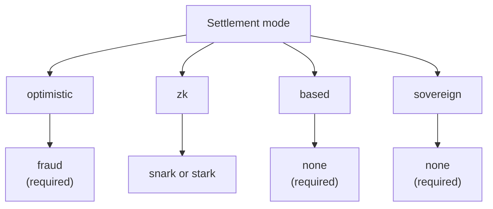

# نظرة عامة على التجميعات

تتيح **مجموعة تطوير التجميعات (Rollup Development Kit - RDK)** الخاصة بـ QoreChain — وحدة `x/rdk` — للمطورين إطلاق تجميعات (rollups) خاصة بتطبيقاتهم تتم تسويتها على QoreChain. كل تجميع هو بيئة تنفيذ مستقلة لها زمن كتلة خاص بها، وآلة افتراضية، ونموذج رسوم، وترتيب معاملات خاص بها، بينما ترث ضمانات الأمان والتشفير ما بعد الكمي وتوافر البيانات الخاصة بـ QoreChain.

:::caution
إن RDK وطبقة تسوية التجميعات هي قدرة في تطور مستمر. تعامل مع أوضاع التسوية، وأنظمة الإثبات، والإعدادات المسبقة (presets)، ومستوى نضج كل ميزة كما هو موضح في هذا القسم على أنها نية تصميم قابلة للتغيير، وتحقق من أي عملية نشر على شبكة الاختبار **`qorechain-diana`** قبل الاستهداف على الشبكة الرئيسية (**`qorechain-vladi`**، معرّف سلسلة EVM **9801**، إصدار السلسلة **v3.1.92**).
:::

للحصول على مرجع الوحدة على المستوى الأدنى — معاملات الوحدة، وتفاصيل دورة الحياة الداخلية، وتكامل الحرق (burn)، والترسيخ متعدد الطبقات — راجع صفحة **[مجموعة تطوير التجميعات](/architecture/rollup-development-kit)** في قسم البنية المعمارية. هذا القسم الخاص بالتجميعات هو الدليل الإرشادي الموجّه للمطورين: ما هي RDK، وأي نموذج (paradigm) يجب اختياره، وكيفية النشر، وكيفية عمل توافر البيانات، وكيفية تسوية عمليات السحب من الطبقة الثانية (L2) عودةً إلى الطبقة الأولى (L1).

---

## ما الذي تقدمه لك RDK

يجمع التجميع الذي يتم إنشاؤه عبر RDK بين أربعة جوانب قابلة للتهيئة:

| الجانب | ما الذي يتحكم فيه | الخيارات |
| ------- | ---------------- | ------- |
| **وضع التسوية** | كيفية التحقق من انتقالات حالة التجميع وإنهائها على QoreChain | `optimistic`, `zk`, `based`, `sovereign` |
| **نظام الإثبات** | الآلية التشفيرية أو الاقتصادية الداعمة للتسوية | `fraud`, `snark`, `stark`, `none` |
| **وضع المرتِّب (Sequencer)** | من يتولى ترتيب المعاملات قبل تسويتها | `dedicated`, `shared`, `based` |
| **توافر البيانات** | أين يتم نشر بيانات المعاملات بحيث يمكن لأي شخص إعادة بناء الحالة | `native`, `celestia`, `both` |

يُسجَّل كل تجميع بمعرّف فريد `rollup-id`، مدعوم بسند حصة (stake bond) بعملة QOR، ويُخصَّص له حالة دورة حياة (`pending`، `active`، `paused`، `stopped`). راجع **[نشر تجميع](/rollups/deploying-a-rollup)** للاطلاع على تدفق الإنشاء ودورة الحياة الكاملة.

---

## ما الذي يميز RDK الخاصة بـ QoreChain

بالإضافة إلى الحد الأدنى المشترك بين أي مجموعة أدوات تجميعات، تكشف RDK الخاصة بـ QoreChain عن ثلاث قدرات تعتمد على الطبقة الأولى (Layer 1) الخاصة بـ QoreChain ولا يمكن لأي مجموعة أدوات مبنية على طبقة أساس غير مقاومة للحوسبة الكمية وغير مزودة بالذكاء الاصطناعي أن تقدمها — إضافة إلى نظام تحدٍّ تلقائي (watchtower auto-challenger). تُشحن RDK بخمس لغات (TypeScript، Python، Go، Rust، Java)، متوافقة الإصدار عند **v0.4.4** على npm وPyPI وMaven Central (على crates.io، ثبّت أحدث إصدار منشور أو ابنِ من المستودع مباشرة). منذ الإصدار v0.4.2، تأتي الإعدادات المسبقة `mainnet` و`testnet` مع نقاط النهاية العامة `qore.host` مضمّنة مسبقًا، بحيث تصل `createRdkClient({ network })` إلى السلسلة دون الحاجة إلى أي تهيئة يدوية لنقطة النهاية.

| العامل المميز | ما الذي يقوم به |
| -------------- | ------------ |
| **[إيصالات تسوية آمنة كموميًا](/rollups/settlement-receipts)** | تحويل مرساة التسوية إلى إيصال قابل للنقل يمكن التحقق منه **بشكل كامل دون اتصال بالإنترنت** بتوقيع ما بعد الكمي (ML-DSA-87 / Dilithium-5) — متطابق بايتًا بايت عبر جميع العملاء الخمسة. |
| **[مساعد QCAI للتجميعات](/rollups/qcai-copilot)** | تجميع خدمات الذكاء الاصطناعي/التعلم المعزز (AI/RL) على السلسلة الخاصة بـ QoreChain (وكيل سياسة الرسوم، والتوصيات، وتحقيقات الاحتيال، وقواطع الدارة) في استشارة للقراءة فقط بلغة واضحة لتجميع واحد. |
| **[استدعاءات متعددة الآلات الافتراضية عبر VM](/rollups/multi-vm)** | استدعاء عقد CosmWasm من عقد تجميع EVM/Solidity عبر العقد المُصرَّف مسبقًا العابر للآلات الافتراضية (`0x…0901`). |
| **[Watchtower](/rollups/watchtower)** | إطار عمل للتحدي التلقائي (auto-challenger) للتجميعات المتفائلة (optimistic) يعرض الدفعات الجديدة والمواعيد النهائية لنافذة التحدي ويطعن في الدفعات غير الصالحة استنادًا إلى محمول الصلاحية (validity predicate) الخاص بك. |

راجع **[لماذا RDK الخاصة بـ QoreChain](/rollups/why)** للاطلاع على الأساس المنطقي الكامل وأمثلة الشيفرة.

---

## نماذج التسوية الأربعة

تدعم RDK الخاصة بـ QoreChain أربعة أوضاع تسوية مميزة، لكل منها افتراضات ثقة مختلفة، وخصائص نهائية مختلفة، ومتطلبات إثبات مختلفة. يتم التحقق من صحة الجمع بين وضع التسوية ونظام الإثبات على السلسلة — ويتم رفض أي إقران غير متوافق عند الإنشاء. يوضح المخطط أدناه كيفية ربط كل وضع تسوية بنظام الإثبات الصالح له.

```mermaid
flowchart TD
    S["Settlement mode"]
    S --> O["optimistic"]
    S --> Z["zk"]
    S --> BA["based"]
    S --> SV["sovereign"]
    O --> OF["fraud<br/>(required)"]
    Z --> ZS["snark or stark"]
    BA --> BN["none<br/>(required)"]
    SV --> SN["none<br/>(required)"]
```

### متفائل (Optimistic)

تفترض التجميعات المتفائلة (Optimistic) أن الدفعات المُرسلة صالحة افتراضيًا وتعتمد على **إثباتات الاحتيال (fraud proofs)** لحل النزاعات.

* **نظام الإثبات**: `fraud` — إثباتات احتيال تفاعلية
* **المرتِّب (Sequencer)**: `dedicated` أو `shared`
* **النهائية (Finality)**: تتأخر حتى تنتهي نافذة تحدٍّ قابلة للتهيئة دون أي تحدٍّ ناجح
* **النزاعات**: يمكن لأي شخص تقديم تحدٍّ بإثبات احتيال ضد دفعة مُرسلة خلال هذه النافذة؛ وأي تحدٍّ ناجح يؤدي إلى رفض الدفعة

### ZK (المعرفة الصفرية)

ترفق تجميعات ZK إثبات صلاحية تشفيري بكل دفعة، مما يثبت صحة انتقال الحالة دون الحاجة إلى إعادة التنفيذ.

* **نظام الإثبات**: `snark` (إثباتات موجزة) أو `stark` (إثباتات شفافة، دون إعداد موثوق)
* **المرتِّب (Sequencer)**: `dedicated` أو `shared`
* **النهائية (Finality)**: عند التحقق من صحة الإثبات — دون الحاجة إلى نافذة تحدٍّ
* **مستوى النضج**: لا يزال التحقق من ZK وSTARK في طور النضج. تعامل مع تسوية ZK على أنها غير مُحصَّنة بعد للإنتاج، وتحقق منها على شبكة الاختبار. راجع **[ZK / STARK وعمليات السحب](/rollups/zk-stark-withdrawals)** للتفاصيل.

### Based (المستند إلى L1)

تُفوِّض تجميعات Based ترتيب المعاملات إلى مقترحي (proposers) QoreChain (L1)، لترث بذلك حيوية السلسلة المضيفة ومقاومتها للرقابة.

* **نظام الإثبات**: `none` — مقترحو L1 هم مصدر حقيقة الترتيب
* **المرتِّب (Sequencer)**: `based` (مطلوب — يُفرض عبر التحقق على السلسلة)
* **النهائية (Finality)**: تتبع تأكيد السلسلة المضيفة
* **المفاضلة**: أبسط نموذج تشغيلي، بما أن مدققي QoreChain يتولون الترتيب، وذلك على حساب التحكم في زمن الاستجابة الذي يوفره المرتِّب المخصص

### Sovereign (السيادي)

تُشغِّل تجميعات Sovereign إجماعها الخاص وتُرتِّب معاملاتها ذاتيًا. وهي تُرسِّخ حالتها في QoreChain لغرض إمكانية التحقق، لكنها لا تعتمد على السلسلة المضيفة لتحقيق النهائية.

* **نظام الإثبات**: `none`
* **المرتِّب (Sequencer)**: يُدار ذاتيًا بواسطة التجميع
* **النهائية (Finality)**: مستقلة — يحددها إجماع التجميع الخاص به
* **ترسيخ الحالة**: تُنشر جذور الحالة (state roots) في QoreChain من أجل الشفافية، لكن السلسلة المضيفة لا تفرضها

---

## توافق أنظمة الإثبات

يحدد وضع التسوية أنظمة الإثبات الصالحة. تُفرض هذه الإقرانات عند إنشاء التجميع.

| وضع التسوية | `fraud` | `snark` | `stark` | `none` |
| --------------- | :-----: | :-----: | :-----: | :----: |
| **optimistic**  | مطلوب | — | — | — |
| **zk**          | — | مدعوم | مدعوم | — |
| **based**       | — | — | — | مطلوب |
| **sovereign**   | — | — | — | مطلوب |

---

## أوضاع المرتِّب (Sequencer)

يحدد المرتِّب (Sequencer) الجهة التي ترتب المعاملات داخل كتلة التجميع قبل التسوية.

| الوضع | من يقوم بالترتيب | ملاحظات |
| ---- | ------------- | ----- |
| **`dedicated`** | عنوان مشغّل واحد مُعيَّن | أقل زمن استجابة؛ يتطلب الثقة بالمشغّل لضمان الحيوية والترتيب العادل |
| **`shared`** | مجموعة مرتِّبين مشتركة | يُوزَّع الترتيب عبر المجموعة؛ عبء تنسيق أعلى قليلًا |
| **`based`** | مقترحو (proposers) QoreChain L1 | يرث أمان مدققي السلسلة المضيفة ومقاومتها للرقابة؛ مطلوب لتسوية `based` |

---

## اختيار النموذج (Paradigm)

| إذا كنت تريد... | ففكّر في |
| -------------- | -------- |
| أبسط إعداد تشغيلي، مع قيام مدققي QoreChain بالترتيب | **based** |
| نهائية سريعة بضمانات تشفيرية (قيد النضج) | **zk** (`snark` / `stark`) |
| نموذج مفهوم جيدًا مع حل نزاعات اقتصادي | **optimistic** (`fraud`) |
| استقلالية كاملة بإجماعك الخاص، مُرسَّخة لإمكانية التحقق | **sovereign** |

لست متأكدًا من أين تبدأ؟ تُشحن RDK مع **ملفات تعريف مسبقة (preset profiles)** تجمع هذه الخيارات لفئات التطبيقات الشائعة — راجع **[ملفات التعريف المسبقة](/rollups/preset-profiles)** — واستعلام `suggest-profile` الذي يوصي بواحد منها بناءً على وصف بلغة واضحة لحالة استخدامك.

بالنسبة للمطورين، تُشحن RDK أيضًا كحزمة SDK عامة بلغة TypeScript باسم **`@qorechain/rdk`** إضافة إلى أداة البناء الأولي **`create-qorechain-rollup`**، واللتان تُشغِّلان نفس الوحدة على السلسلة انطلاقًا من الشيفرة — راجع **[نشر تجميع](/rollups/deploying-a-rollup#deploy-with-the-typescript-rdk-qorechainrdk)**.

## ذات صلة

* [نشر تجميع](/rollups/deploying-a-rollup) — إطلاق تجميع من واجهة سطر الأوامر (CLI) أو RDK الخاصة بـ TypeScript.
* [ملفات التعريف المسبقة](/rollups/preset-profiles) — حزم بنقرة واحدة لفئات التطبيقات الشائعة.
* [توافر البيانات](/rollups/data-availability) — موجّه توافر البيانات الأصلي (native DA) وتخزين الـ blob.
* [عمليات سحب ZK / STARK](/rollups/zk-stark-withdrawals) — تدفقات سحب مدعومة بالإثبات.
