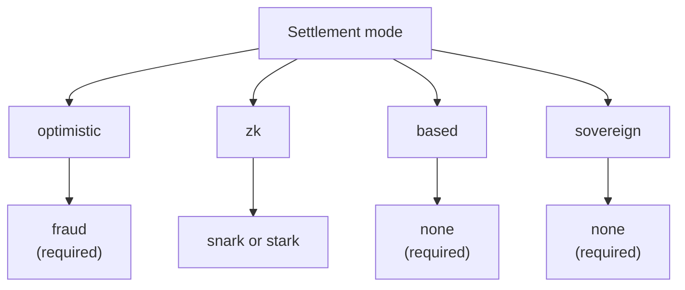

# نظرة عامة على الـ Rollups

تتيح **حزمة تطوير الـ Rollup (RDK)** في QoreChain — وهي الوحدة `x/rdk` — للمطورين إطلاق rollups مخصصة للتطبيقات تتم تسويتها على QoreChain. كل rollup هو بيئة تنفيذ مستقلة لها زمن الكتلة الخاص بها، وآلتها الافتراضية، ونموذج رسومها، وترتيب معاملاتها (sequencing)، بينما ترث ضمانات QoreChain في الأمان، والتشفير ما بعد الكمومي، وتوافر البيانات.

:::caution
تُعد RDK وطبقة تسوية الـ rollup قدرةً في تطور نشط. تعامل مع أوضاع التسوية وأنظمة الإثبات والملفات المسبقة الإعداد ومستوى نضج كل ميزة الموصوفة في هذا القسم على أنها نية تصميمية قابلة للتغيير، وتحقق من أي نشر على شبكة الاختبار **`qorechain-diana`** قبل استهداف الشبكة الرئيسية (**`qorechain-vladi`**، معرّف سلسلة EVM هو **9801**، إصدار السلسلة **v3.1.85**).
:::

للاطلاع على المرجع الأدنى مستوى للوحدة — معاملات الوحدة، والتفاصيل الداخلية لدورة الحياة، وتكامل الحرق، والإرساء متعدد الطبقات — راجع صفحة **[Rollup Development Kit](/architecture/rollup-development-kit)** في قسم البنية المعمارية. أما قسم الـ Rollups هذا فهو الدليل العملي الموجّه للمطورين: ما هي RDK، وأي نموذج تختار، وكيف تنشر، وكيف يعمل توافر البيانات، وكيف تتم تسوية عمليات السحب من L2 عائدةً إلى L1.

---

## ما الذي تمنحك إياه RDK

يجمع الـ rollup المُنشأ عبر RDK أربعة جوانب قابلة للتهيئة:

| الجانب | ما الذي يتحكم فيه | الخيارات |
| ------- | ---------------- | ------- |
| **وضع التسوية** | كيفية التحقق من انتقالات حالة الـ rollup وإنهائها على QoreChain | `optimistic`، `zk`، `based`، `sovereign` |
| **نظام الإثبات** | الآلية التشفيرية أو الاقتصادية الداعمة للتسوية | `fraud`، `snark`، `stark`، `none` |
| **وضع المُرتِّب (sequencer)** | من يرتّب المعاملات قبل تسويتها | `dedicated`، `shared`، `based` |
| **توافر البيانات** | أين تُنشر بيانات المعاملات بحيث يمكن لأي شخص إعادة بناء الحالة | `native`، `celestia`، `both` |

يُسجَّل كل rollup بمعرّف فريد `rollup-id`، ويُدعَم بسند حصة (stake bond) بعملة QOR، وتُسنَد إليه حالة دورة حياة (`pending`، `active`، `paused`، `stopped`). راجع **[نشر Rollup](/rollups/deploying-a-rollup)** للاطلاع على التدفق الكامل للإنشاء ودورة الحياة.

---

## ما الذي يميّز QoreChain RDK

بعيدًا عن الأساسيات المتوفرة في أي حزمة rollup، تقدّم QoreChain RDK ثلاث قدرات تعتمد على الطبقة الأولى (Layer 1) من QoreChain ولا يمكن لأي حزمة مبنية على طبقة أساس غير مقاومة للكم وغير مدعومة بالذكاء الاصطناعي أن تقدّمها — بالإضافة إلى مُتحدٍّ تلقائي من نوع watchtower. تتوفر RDK بخمس لغات (TypeScript وPython وGo وRust وJava)، بإصدار موحّد **v0.4.4** على npm وPyPI وMaven Central (على crates.io، ثبّت أحدث إصدار منشور أو ابنِ من المستودع). ومنذ الإصدار v0.4.2، يأتي الملفان المسبقا الإعداد `mainnet` و`testnet` مزوَّدين بنقاط النهاية العامة `qore.host` مدمجةً فيهما، بحيث يصل `createRdkClient({ network })` إلى السلسلة دون أي تهيئة يدوية لنقاط النهاية.

| الميزة المميِّزة | ما الذي تفعله |
| -------------- | ------------ |
| **[إيصالات تسوية آمنة كموميًا](/rollups/settlement-receipts)** | تحويل مرساة تسوية إلى إيصال قابل للنقل يمكن التحقق منه **دون اتصال بالكامل** بتوقيع ما بعد كمومي (ML-DSA-87 / Dilithium-5) — متطابق بايتًا ببايت عبر العملاء الخمسة جميعًا. |
| **[QCAI Rollup Copilot](/rollups/qcai-copilot)** | تجميع خدمات الذكاء الاصطناعي/التعلم المعزز على سلسلة QoreChain (وكيل سياسة الرسوم، والتوصيات، وتحقيقات الاحتيال، وقواطع الدائرة) في استشارة قرائية فقط بلغة واضحة لـ rollup واحد. |
| **[استدعاءات عبر الآلات الافتراضية متعددة الـ VM](/rollups/multi-vm)** | استدعاء عقد CosmWasm من عقد rollup على EVM/Solidity عبر الـ precompile الخاص بالاستدعاءات عبر الآلات الافتراضية (`0x…0901`). |
| **[Watchtower](/rollups/watchtower)** | إطار مُتحدٍّ تلقائي للـ rollups التفاؤلية يُظهر الدفعات الجديدة ومواعيد انتهاء نافذة التحدي، ويتحدى الدفعات غير الصالحة وفق مُسنَد الصلاحية الخاص بك. |

راجع **[لماذا QoreChain RDK](/rollups/why)** للاطلاع على المبررات الكاملة وعينات الشيفرة.

---

## نماذج التسوية الأربعة

تدعم QoreChain RDK أربعة أوضاع تسوية متمايزة، لكل منها افتراضات ثقة وخصائص نهائية ومتطلبات إثبات مختلفة. يتم التحقق على السلسلة من توليفة وضع التسوية ونظام الإثبات — ويُرفض الاقتران غير المتوافق عند الإنشاء. يوضّح المخطط أدناه ربط كل وضع تسوية بنظام الإثبات الصالح له.

```mermaid
flowchart TD
    S["Settlement mode"]
    S --> O["optimistic"]
    S --> Z["zk"]
    S --> BA["based"]
    S --> SV["sovereign"]
    O --> OF["fraud<br/>(required)"]
    Z --> ZS["snark or stark"]
    BA --> BN["none<br/>(required)"]
    SV --> SN["none<br/>(required)"]
```

### التفاؤلي (Optimistic)

تفترض الـ rollups التفاؤلية أن الدفعات المُقدَّمة صالحة افتراضيًا، وتعتمد على **إثباتات الاحتيال** لحل النزاعات.

* **نظام الإثبات**: `fraud` — إثباتات احتيال تفاعلية
* **المُرتِّب**: `dedicated` أو `shared`
* **النهائية**: مؤجَّلة حتى انقضاء نافذة تحدٍّ قابلة للتهيئة دون تحدٍّ ناجح
* **النزاعات**: يجوز لأي شخص تقديم تحدي إثبات احتيال ضد دفعة مُقدَّمة خلال النافذة؛ والتحدي الناجح يؤدي إلى رفض الدفعة

### المعرفة الصفرية ZK (Zero-Knowledge)

تُرفق rollups المعرفة الصفرية إثبات صلاحية تشفيريًا بكل دفعة، مما يثبت صحة انتقال الحالة دون إعادة التنفيذ.

* **نظام الإثبات**: `snark` (إثباتات موجزة) أو `stark` (إثباتات شفافة، دون إعداد موثوق)
* **المُرتِّب**: `dedicated` أو `shared`
* **النهائية**: عند التحقق من إثبات صالح — لا حاجة إلى نافذة تحدٍّ
* **النضج**: لا يزال التحقق من ZK وSTARK في طور النضج. تعامل مع تسوية ZK على أنها ليست جاهزة للإنتاج بعد وتحقق منها على شبكة الاختبار. راجع **[ZK / STARK والسحوبات](/rollups/zk-stark-withdrawals)** للتفاصيل.

### المُستنِد (Based)

تفوّض الـ rollups المُستنِدة ترتيب المعاملات إلى مقترحي QoreChain (الطبقة الأولى L1)، فترث حيوية السلسلة المضيفة ومقاومتها للرقابة.

* **نظام الإثبات**: `none` — مقترحو L1 هم مصدر حقيقة الترتيب
* **المُرتِّب**: `based` (إلزامي — يُفرَض عبر التحقق على السلسلة)
* **النهائية**: تتبع تأكيد السلسلة المضيفة
* **المفاضلة**: أبسط نموذج تشغيلي، إذ يتولى مدقّقو QoreChain الترتيب، على حساب التحكم في زمن الاستجابة الذي يوفره المُرتِّب المخصص

### السيادي (Sovereign)

تُشغّل الـ rollups السيادية إجماعها الخاص وترتّب معاملاتها بنفسها. وهي ترسي حالتها على QoreChain لأغراض قابلية التحقق لكنها لا تعتمد على السلسلة المضيفة في النهائية.

* **نظام الإثبات**: `none`
* **المُرتِّب**: يُدار ذاتيًا من قبل الـ rollup
* **النهائية**: مستقلة — يحددها إجماع الـ rollup الخاص
* **إرساء الحالة**: تُنشر جذور الحالة على QoreChain للشفافية، لكن السلسلة المضيفة لا تفرضها

---

## توافق أنظمة الإثبات

يقيّد وضع التسوية أنظمة الإثبات الصالحة. تُفرَض هذه الاقترانات عند إنشاء الـ rollup.

| وضع التسوية | `fraud` | `snark` | `stark` | `none` |
| --------------- | :-----: | :-----: | :-----: | :----: |
| **optimistic**  | إلزامي | — | — | — |
| **zk**          | — | مدعوم | مدعوم | — |
| **based**       | — | — | — | إلزامي |
| **sovereign**   | — | — | — | إلزامي |

---

## أوضاع المُرتِّب

يحدد المُرتِّب من يرتّب المعاملات داخل كتلة الـ rollup قبل التسوية.

| الوضع | من يرتّب | ملاحظات |
| ---- | ------------- | ----- |
| **`dedicated`** | عنوان مشغّل واحد معيَّن | أقل زمن استجابة؛ يتطلب الثقة في المشغّل للحيوية وعدالة الترتيب |
| **`shared`** | مجموعة مُرتِّبين مشتركة | يتوزع الترتيب عبر المجموعة؛ عبء تنسيق أعلى قليلًا |
| **`based`** | مقترحو الطبقة الأولى في QoreChain | يرث أمان مدقّقي السلسلة المضيفة ومقاومتها للرقابة؛ إلزامي لتسوية `based` |

---

## اختيار النموذج

| إذا كنت تريد... | ففكّر في |
| -------------- | -------- |
| أبسط إعداد تشغيلي، حيث يتولى مدقّقو QoreChain الترتيب | **based** |
| نهائية سريعة بضمانات تشفيرية (في طور النضج) | **zk** (`snark` / `stark`) |
| نموذجًا مفهومًا جيدًا مع حل نزاعات اقتصادي | **optimistic** (`fraud`) |
| استقلالًا كاملًا بإجماعك الخاص، مع إرساء لقابلية التحقق | **sovereign** |

لست متأكدًا من أين تبدأ؟ توفر RDK **ملفات تعريف مسبقة الإعداد** تجمع هذه الخيارات لفئات التطبيقات الشائعة — راجع **[الملفات التعريفية المسبقة الإعداد](/rollups/preset-profiles)** — بالإضافة إلى استعلام `suggest-profile` الذي يوصي بأحدها انطلاقًا من وصف بلغة واضحة لحالة استخدامك.

وللمطورين، تتوفر RDK أيضًا في صورة حزمة TypeScript SDK العامة **`@qorechain/rdk`** بالإضافة إلى أداة التهيئة **`create-qorechain-rollup`**، وكلتاهما تقودان وحدة السلسلة نفسها برمجيًا — راجع **[نشر Rollup](/rollups/deploying-a-rollup#deploy-with-the-typescript-rdk-qorechainrdk)**.

## ذات صلة

* [نشر Rollup](/rollups/deploying-a-rollup) — إطلاق rollup من سطر الأوامر أو TypeScript RDK.
* [الملفات التعريفية المسبقة الإعداد](/rollups/preset-profiles) — حزم جاهزة بنقرة واحدة لفئات التطبيقات الشائعة.
* [توافر البيانات](/rollups/data-availability) — موجّه توافر البيانات الأصلي وتخزين الـ blobs.
* [سحوبات ZK / STARK](/rollups/zk-stark-withdrawals) — تدفقات سحب مدعومة بالإثباتات.
