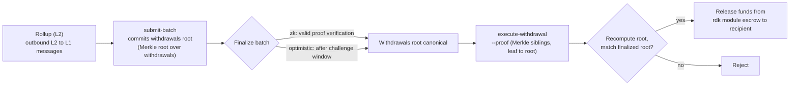

# ZK / STARK وعمليات السحب

تغطي هذه الصفحة موضوعين مترابطين: **أنظمة إثبات ZK** (`snark` و`stark`) المستخدمة من قبل رول-أب المُسوّاة بـ ZK، و**تدفّق السحب من L2 إلى L1** الذي ينقل الأموال من رول-أب عائدةً إلى QoreChain بمجرد أن تُنهى دُفعة ما.

:::caution
يُعدّ التحقق من ZK وSTARK جزءًا قيد النضج النشط من RDK. تعامل مع أنظمة الإثبات وتدفّق السحب الموصوفين هنا بوصفهما نيّة تصميمية، وتحقّق منهما على الشبكة التجريبية **`qorechain-diana`**، ولا تفترض ضمانات تشفيرية مُصلّبة للإنتاج على الشبكة الرئيسية بعد.
:::

---

## أنظمة إثبات ZK

تُرفق رول-أب المُسوّاة بـ ZK (وضع التسوية `zk`) إثبات صلاحية بكل دُفعة تسوية، مُثبتةً صحة انتقال الحالة دون إعادة تنفيذ معاملات رول-أب. تدعم تسوية ZK نظامي إثبات:

| نظام الإثبات | الخصائص |
| ------------ | --------------- |
| **`snark`** | إثباتات موجزة |
| **`stark`** | إثباتات شفافة — دون إعداد موثوق |

يتطلب وضع التسوية `zk` أحد النظامين `snark` أو `stark`؛ ويُفرَض الاقتران على السلسلة عند إنشاء رول-أب. في المقابل، تستخدم التسوية `optimistic` نظام إثبات `fraud`، وتستخدم التسويتان `based` و`sovereign` القيمة `none`. راجع **[نظرة عامة على الرول-أب](/rollups/overview)** للاطلاع على مصفوفة التوافق الكاملة.

### النهائية

بخلاف رول-أب التفاؤلية — التي تنتظر انقضاء نافذة الطعن بإثبات الاحتيال — يمكن لدُفعة ZK أن تُنهى عند **التحقق الصالح من الإثبات**، دون نافذة نزاع. هذه هي المقايضة الجوهرية لتسوية ZK: نهائية أقوى وأسرع مقابل تكلفة وتعقيد توليد الإثباتات.

### النضج

لا يزال التحقق من إثباتات ZK وSTARK في طور النضج. تعامل مع تسوية ZK بوصفها **غير مُصلّبة للإنتاج بعد**: قم بالنمذجة والتحقق على الشبكة التجريبية، وتتبّع ملاحظات إصدار RDK لمعرفة حالة التحقق الكامل من الإثبات قبل الاعتماد عليها لرول-أب حاملة للقيمة على الشبكة الرئيسية.

---

## كيف تحمل الدُفعات عمليات السحب

عندما تُسوّي رول-أب دُفعة ما، يمكن لتلك الدُفعة أيضًا أن تُلزم رسائل رول-أب الصادرة عبر الطبقات — أي **عمليات السحب من L2 إلى L1** الخاصة بها. مفهوميًا:

* يمكن لدُفعة مُنهاة أن تحمل التزامًا بمجموعة عمليات السحب الخاصة بها (جذر Merkle فوق رسائل السحب الخاصة بالدُفعة).
* كل عملية سحب فردية هي ورقة (leaf) تحت ذلك الجذر، مُعرَّفة بفهرس دُفعتها وفهرس سحب.
* بمجرد إنهاء الدُفعة، يمكن لأي طرف أن يُثبت أن ورقة سحب محددة مُدرجة تحت الجذر المُلتزَم به، وأن يُطلق صرف الأموال.

لهذا السبب تعتمد عمليات السحب على التسوية: لا يمكن تنفيذ عملية سحب إلا مقابل دُفعة **مُنهاة**، لأن الإنهاء هو ما يجعل جذر عمليات السحب المُلتزَم به معياريًا.

للاطلاع على كيفية إرسال الدُفعات وإنهائها — بما في ذلك `submit-batch` ومسار النزاع `challenge-batch` لرول-أب التفاؤلية — راجع **[نشر رول-أب](/rollups/deploying-a-rollup)**.

---

## تنفيذ عملية سحب: `execute-withdrawal`

يُنهي الأمر `execute-withdrawal` عملية سحب من L2 إلى L1 مقابل جذر عمليات السحب الخاص بدُفعة مُنهاة. فهو يُثبت أن ورقة سحب مُلتزَم بها في ذلك الجذر ويدفع للمستلم من حساب ضمان وحدة rdk. هذا الإجراء **بلا أذونات (permissionless)** — يجوز لأي شخص إرسال إثبات صالح.

```bash
qorechaind tx rdk execute-withdrawal \
  [rollup-id] [batch-index] [withdrawal-index] [recipient] [denom] [amount] \
  --proof <sibling-hash-1>,<sibling-hash-2>,... \
  --from mykey \
  --chain-id qorechain-diana \
  --fees 500uqor
```

**الوسائط الموضعية:**

| الوسيط | الوصف |
| -------- | ----------- |
| `rollup-id` | الرول-أب التي تنتمي إليها عملية السحب |
| `batch-index` | الدُفعة المُنهاة التي يُلزم جذر عمليات السحب الخاص بها هذه العملية |
| `withdrawal-index` | فهرس ورقة السحب ضمن تلك الدُفعة |
| `recipient` | العنوان الذي سيُصرف له |
| `denom` | الفئة المراد دفعها |
| `amount` | المبلغ المراد دفعه |

**العَلَم (Flag):**

| العَلَم | الوصف |
| ---- | ----------- |
| `--proof` | تجزئات Merkle الشقيقة بصيغة hex مفصولة بفواصل، مرتّبة من الورقة إلى الجذر، تُثبت أن ورقة السحب مُلتزَم بها في جذر عمليات السحب الخاص بالدُفعة |

قيمة `--proof` هي إثبات الإدراج: التجزئات الشقيقة على طول المسار من ورقة السحب صعودًا إلى جذر عمليات السحب المُلتزَم به الخاص بالدُفعة. تُعيد الوحدة حساب الجذر من الورقة والأشقاء المُقدَّمين وتتحقق منه مقابل الجذر المُلتزَم به للدُفعة المُنهاة قبل تحرير الأموال المُودعة في الضمان.

---

## تدفّق السحب من البداية إلى النهاية

*المسار من L2 إلى L1: تُلزم دُفعة تسوية جذر عمليات سحب، ثم تُنهى الدُفعة، ثم يُحرّر إثبات إدراج بلا أذونات الأموالَ المُودعة في الضمان على QoreChain.*



1. **سوِّ دُفعة.** يُرسل مُشغّل رول-أب دُفعة تسوية باستخدام `submit-batch`. يمكن للدُفعة أن تُلزم جذر عمليات سحب فوق رسائلها الصادرة من L2 إلى L1.
2. **أنهِ.** تُنهى الدُفعة وفقًا لوضع تسوية رول-أب — عند التحقق الصالح من الإثبات بالنسبة لـ `zk`، أو بعد نافذة الطعن بالنسبة لـ `optimistic` (التي يمكن خلالها لـ `challenge-batch` الاعتراض عليها).
3. **أثبِت ونفّذ.** بمجرد الإنهاء، يُرسل أي شخص `execute-withdrawal` مع إثبات إدراج Merkle (`--proof`) لورقة السحب المحددة. تتحقق الوحدة من الإدراج مقابل جذر عمليات السحب الخاص بالدُفعة المُنهاة وتدفع للمستلم من الضمان.

ولأن الخطوة 3 بلا أذونات وقائمة على الإثبات، فإن عملية السحب لا تعتمد على تعاون مُشغّل رول-أب بمجرد إنهاء الدُفعة الحاملة لها.

---

## ذات صلة

* **[نظرة عامة على الرول-أب](/rollups/overview)** — نماذج التسوية ومصفوفة توافق نظام الإثبات.
* **[نشر رول-أب](/rollups/deploying-a-rollup)** — أوامر المُشغّل `submit-batch` و`challenge-batch`.
* **[مجموعة تطوير الرول-أب](/architecture/rollup-development-kit)** — المرجع منخفض المستوى للوحدة.
