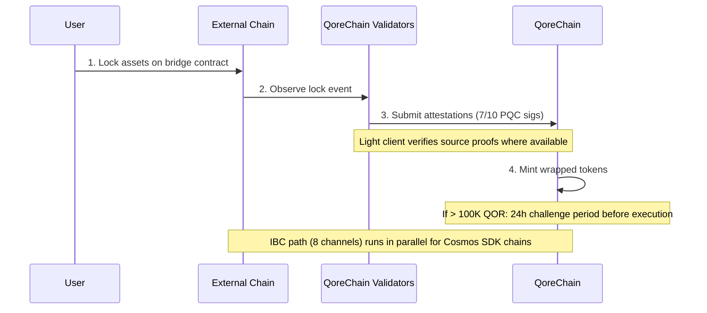

# Bridge-Architektur

Das `x/bridge`-Modul ist darauf ausgelegt, QoreChain über **37 QCB-Chain-Konfigurationen (QoreChain Bridge) und 8 IBC-Kanäle (Inter-Blockchain Communication)** mit dem breiteren Blockchain-Ökosystem zu verbinden. Jede Bridge-Operation wird durch Post-Quanten-Kryptografie abgesichert.

:::caution
Die Cross-Chain-Bridge befindet sich **derzeit im Testnet und ist ausstehend — sie ist noch kein Produktionssystem**. Die unten beschriebenen Chain-Konfigurationen, Light Clients und Abläufe spiegeln die Bridge wider, wie sie konzipiert und im Testnet erprobt wurde. Die externe Konnektivität wird schrittweise ausgerollt; betrachten Sie alle Ziele als Designabsicht und nicht als garantierte Live-Mainnet-Funktionalität.
:::

## Verbindungsüberblick

QoreChain ist darauf ausgelegt, zwei parallel betriebene Bridge-Protokolle zu unterstützen:

| Protokoll | Verbindungen          | Sicherheitsmodell                    | Anwendungsfall                          |
| --------- | --------------------- | ------------------------------------ | --------------------------------------- |
| **IBC**   | 8 Kanäle              | Standard-IBC + PQC-Paketsignaturen   | Cosmos SDK-kompatible Chains            |
| **QCB**   | 37 Chain-Konfigs      | 7-von-10-Dilithium-5-Multisig        | Nicht-IBC-Chains (EVM, Solana, TON usw.) |

Die **37 QCB-Chain-Konfigurationen** umfassen **36 externe Chains** plus **QoreChain selbst** als native/Loopback-Konfiguration (für internes Routing und selbstreferenzielles Settlement). Die 8 IBC-Kanäle verbinden sich mit Cosmos SDK-kompatiblen Chains.

## IBC-Kanäle

QoreChain ist darauf ausgelegt, IBC-Verbindungen zu den folgenden 8 Chains zu unterhalten, die über Hermes v1.x relayed werden:

| Chain      | Beschreibung                   |
| ---------- | ------------------------------ |
| Cosmos Hub | Primäre Hub-Verbindung         |
| Osmosis    | DEX-Liquiditäts-Routing        |
| Noble      | Native USDC-Ausgabe            |
| Celestia   | Datenverfügbarkeitsschicht     |
| Stride     | Liquid Staking                 |
| Akash      | Dezentrales Computing          |
| Babylon    | BTC-Restaking-Protokoll        |
| Injective  | DeFi- / Orderbuch-Interoperabilität |

### IBC-Relayer-Konfiguration

* **Relayer-Software**: Hermes v1.x
* **Client-Updates**: Automatische Aktualisierung des Light Clients
* **Fehlverhaltenserkennung**: Aktiviert — der Relayer überwacht auf Equivocation
* **Paketbereinigung**: Alle 100 Blöcke werden ausstehende IBC-Pakete bereinigt
* **PQC-Erweiterung**: Jedes von QoreChain stammende IBC-Paket enthält eine optionale Dilithium-5-Signatur für vorwärtsgerichtete Quantensicherheit. PQC-fähige empfangende Chains können diese Signatur zusätzlich zur standardmäßigen IBC-Verifizierung prüfen.

## QCB-Protokoll (QoreChain Bridge)

Das QCB-Protokoll verwendet eine Hub-and-Spoke-Architektur, die durch Post-Quanten-Kryptografie abgesichert ist. QoreChain fungiert als Hub, mit Spoke-Konfigurationen für jede externe Chain plus einer nativen/Loopback-Konfiguration für QoreChain selbst.

### Konfigurationen externer Chains (36)

Das QCB-Protokoll ist darauf ausgelegt, die folgenden 36 externen Chains anzusprechen. Kombiniert mit QoreChains eigener nativer/Loopback-Konfiguration ergibt dies **insgesamt 37 QCB-Chain-Konfigs (einschließlich QoreChain selbst)**.

**Baseline-Chains (10)**

Ethereum, Solana, TON, BSC, Avalanche, Polygon, Arbitrum, Optimism, Base, Sui.

**Chains der EVM-Familie (14)**

zkSync Era, Linea, Scroll, Blast, Mantle, Hyperliquid, Berachain, Sonic, Sei, Monad, Plasma, Filecoin FVM, Cronos, Kaia.

**Nicht-EVM-Chains (5)**

Starknet, XRP Ledger, Stellar, Hedera, Algorand.

**Ausstehende Chains (7)**

NEAR, Bitcoin, Cardano, Polkadot, Tezos, Tron, Aptos.

:::note
Zählprüfung: 10 Baseline + 14 EVM-Familie + 5 Nicht-EVM + 7 ausstehend = **36 externe Chains**. Hinzu kommt QoreChains eigene native/Loopback-Konfiguration, was **37 QCB-Chain-Konfigs** ergibt.
:::

### Adressformate

Das QCB-Protokoll klassifiziert Chains nach Typ, um Zieladressen zu validieren:

| Chain-Typ    | Beispiel-Chains                                                         | Adressformat                                       |
| ------------ | ----------------------------------------------------------------------- | -------------------------------------------------- |
| `evm`        | Ethereum, BSC, Avalanche, Polygon, Arbitrum, Optimism, Base             | `0x` + 40 Hex-Zeichen                              |
| `solana`     | Solana                                                                  | Base58, 32-44 Zeichen                              |
| `ton`        | TON                                                                     | `EQ` + base64-codiert                              |
| `sui_move`   | Sui                                                                     | `0x` + 64 Hex-Zeichen                              |
| `aptos_move` | Aptos                                                                   | `0x` + 64 Hex-Zeichen                              |
| `bitcoin`    | Bitcoin                                                                 | Bech32 (`bc1`), P2SH (`3...`) oder Legacy (`1...`) |
| `near`       | NEAR Protocol                                                           | `.near`-Suffix oder implizit                       |
| `cardano`    | Cardano                                                                 | `addr1` (Zahlung) oder `stake1` (Staking)          |
| `polkadot`   | Polkadot                                                                | SS58-codiert                                       |
| `tezos`      | Tezos                                                                   | `tz1`/`tz2`/`tz3` (implizit) oder `KT1` (originated) |
| `tron`       | TRON                                                                    | `T` + base58, 34 Zeichen                           |

## Light Clients

Um Ereignisse externer Chains vertrauenslos zu verifizieren, ist die Bridge darauf ausgelegt, On-Chain-Light-Clients zu betreiben, die auf das Konsens- und Beweissystem jeder Quell-Chain zugeschnitten sind. Diese Light Clients ermöglichen es QoreChain, Ein- und Auszahlungen zu validieren, ohne sich ausschließlich auf Validator-Attestierungen zu verlassen.

| Light Client            | Quell-Chain         | Verifizierungsprimitive                                              |
| ----------------------- | ------------------- | ------------------------------------------------------------------- |
| **Ethereum Light Client** | Ethereum / EVM L1 | BLS12-381-Signaturverifizierung, SSZ-Serialisierung, MPT-State-Proofs |
| **Bitcoin SPV**         | Bitcoin             | Simplified Payment Verification gegen Block-Header                   |
| **Starknet STARK**      | Starknet            | STARK-Beweisverifizierung von Starknet-Zustandsübergängen           |
| **Sui BLS**             | Sui                 | BLS-Aggregatsignaturverifizierung von Sui-Checkpoints               |
| **Wormhole / Solana VAA** | Solana (über Wormhole) | Verified Action Approval (VAA) Guardian-Signaturverifizierung     |

## Einzahlungsablauf (Extern zu QoreChain)

Die folgende Sequenz zeigt eine QCB-Einzahlung: Assets werden auf einer externen Chain gesperrt, QoreChain-Validatoren reichen PQC-signierte Attestierungen ein (7-von-10-Dilithium-5), und Wrapped-Token werden geprägt. Cosmos SDK-kompatible Chains verwenden stattdessen den parallelen IBC-Pfad (8 Kanäle, mit optionalen Dilithium-5-Paketsignaturen). Beide Pfade befinden sich im Testnet/ausstehend.



```
External Chain          QoreChain Validators           QoreChain
     |                         |                          |
     | 1. Lock assets on       |                          |
     |    bridge contract      |                          |
     |------------------------>|                          |
     |                         | 2. Observe & attest      |
     |                         |    (7/10 PQC sigs)       |
     |                         |------------------------->|
     |                         |                          | 3. Mint wrapped
     |                         |                          |    tokens
     |                         |                          |
     |                         |    [If > 100K QOR]       |
     |                         |    24h challenge period   |
     |                         |    before execution       |
```

1. **Lock** — Der Nutzer sperrt Assets im Bridge-Vertrag auf der externen Chain.
2. **Attest** — Bridge-Validatoren beobachten die Sperrtransaktion und reichen Dilithium-5-signierte Attestierungen ein. Es sind mindestens **7 von 10** Validator-Attestierungen erforderlich. Sofern ein Light Client für die Quell-Chain verfügbar ist, wird das gesperrte Ereignis zusätzlich gegen die chaineigenen Beweise verifiziert.
3. **Mint** — Sobald der Attestierungsschwellenwert erreicht ist, werden Wrapped-Token auf QoreChain geprägt.
4. **Challenge-Periode** — Für Transfers, die den Gegenwert von 100.000 QOR überschreiten, gilt vor der Ausführung eine **24-stündige Challenge-Periode**. Während dieses Zeitfensters können Validatoren verdächtige Aktivitäten melden.

## Auszahlungsablauf (QoreChain zu Extern)

```
QoreChain               QoreChain Validators           External Chain
     |                         |                          |
     | 1. Burn wrapped tokens  |                          |
     |------------------------>|                          |
     |                         | 2. Attest burn           |
     |                         |    (7/10 PQC sigs)       |
     |                         |------------------------->|
     |                         |                          | 3. Unlock original
     |                         |                          |    assets
```

1. **Burn** — Der Nutzer verbrennt Wrapped-Token auf QoreChain.
2. **Attest** — Validatoren attestieren das Burn-Ereignis mit Dilithium-5-Signaturen (Schwellenwert 7/10).
3. **Unlock** — Sobald der Schwellenwert erreicht ist, werden die ursprünglichen Assets auf der externen Chain freigegeben.

Alle bei Auszahlungen erhobenen Bridge-Gebühren werden über den `bridge_fee`-Burn-Kanal an das `x/burn`-Modul weitergeleitet (100 % der Bridge-Gebühren werden verbrannt).

### L2 → L1-Auszahlungsablauf (Rollup-Settlement)

Die Bridge ist außerdem darauf ausgelegt, **Rollup-(L2-)Auszahlungen zurück zu ihrer Host-Chain (L1)** abzuwickeln. Über das [Rollup Development Kit](/architecture/rollup-development-kit) bereitgestellte Rollups verankern ihren Zustand periodisch in QoreChain; die Bridge verarbeitet diese finalisierten Anker, um Auszahlungen vom Rollup zur Host-Chain zu autorisieren:

1. Ein Nutzer initiiert eine Auszahlung auf dem Rollup (L2), die in einen Settlement-Batch aufgenommen wird.
2. Der Batch wird in QoreChain verankert und gemäß dem Settlement-Modus des Rollups bewiesen/finalisiert (zum Beispiel nach Ablauf des optimistischen Challenge-Fensters oder bei gültiger Beweisverifizierung).
3. Sobald der Anker finalisiert ist, wird die Auszahlung beanspruchbar und die entsprechenden Assets werden auf der Host-Chain (L1) über den standardmäßigen Burn-and-Attest-Pfad freigegeben.

Dies koppelt die Rollup-Finalität direkt an die Settlement-Garantien der Host-Chain, sodass L2-Auszahlungen nicht freigegeben werden können, bevor der entsprechende L2-Zustand unwiderruflich abgewickelt ist.

## Sicherheitsarchitektur

### PQC-Multisig

Alle QCB-Bridge-Operationen erfordern einen **Schwellenwert von 7 von 10** Dilithium-5-Post-Quanten-Signaturen von registrierten Bridge-Validatoren. Jeder Bridge-Validator registriert sich mit:

* Einer QoreChain-Validator-Adresse
* Einem Dilithium-5-Public-Key (2.592 Bytes)
* Einer Liste unterstützter Chains
* Einem Reputationsscore (gepflegt durch `x/reputation`)

### Circuit Breaker

Jede verbundene Chain verfügt über unabhängige Circuit-Breaker-Schutzmechanismen:

| Schutz                    | Beschreibung                                                                          |
| ------------------------- | ------------------------------------------------------------------------------------ |
| **Einzeltransferlimit**   | Maximalbetrag für jede einzelne Bridge-Operation pro Chain                            |
| **Tägliches Aggregatlimit** | Gesamtvolumenobergrenze pro Chain pro 24-Stunden-Fenster                            |
| **Manuelle Pause**        | Von Governance oder Validator ausgelöster Notstopp pro Chain                          |
| **Anomalieerkennung**     | Automatische Pause, wenn >50 Operationen in einem kurzen Fenster auftreten oder das Volumen das 5-fache Tageslimit überschreitet |

Der Circuit-Breaker-Zustand wird pro Chain verfolgt und umfasst: maximalen Einzeltransfer, Tageslimit, aktuelle Tagesnutzung, letzte Reset-Höhe sowie Pausenstatus mit Begründung.

### Challenge-Periode

Für große Transfers (>100.000 QOR-Gegenwert, konfigurierbar über `large_transfer_threshold`):

* Eine **24-stündige Challenge-Periode** (86.400 Sekunden) gilt, nachdem der Attestierungsschwellenwert erreicht wurde.
* Während dieses Zeitfensters kann jeder Validator die Operation melden.
* Bleibt sie unangefochten, wird die Operation nach Ablauf der Periode automatisch ausgeführt.
* Angefochtene Operationen werden zur Governance-Prüfung eingefroren.

### KI-Pfadoptimierung

Das Bridge-Modul integriert sich für die Routenoptimierung mit dem KI-Subsystem. Für Transfers, die mehrere Pfade durchlaufen können (z. B. Chain A zu Chain B über einen Zwischenschritt), bewertet der Pfadoptimierer:

* Geschätzte Gebühren über die Routen hinweg
* Geschätzte Abschlusszeit
* Sicherheitsscore pro Pfad
* Konfidenzniveau der Schätzung

## REST-API-Endpunkte

Ab der Chain-Version **v3.1.77** ist der Bridge-Zustand zudem **schreibgeschützt über REST** via grpc-gateway unter dem Präfix `/qorechain/bridge/v1/...` abfragbar (`config`, `chains`, `chains/{chain_id}`, `validators`, `validators/{address}`, `operations`, `operations/{id}`) — zuvor nur über gRPC. Diese liefern echtes On-Chain-JSON über HTTP für Explorer und Light-Node-Telemetrie. Die vollständige Liste finden Sie unter [REST- / gRPC-Endpunkte](/api-reference/rest-grpc-endpoints#bridge-module).

| Methode | Endpunkt                                           | Beschreibung                                      |
| ------- | -------------------------------------------------- | ------------------------------------------------- |
| GET     | `/bridge/v1/chains`                                | Alle unterstützten Chain-Konfigurationen auflisten |
| GET     | `/bridge/v1/chains/{chain_id}`                     | Konfiguration für eine bestimmte Chain abrufen     |
| GET     | `/bridge/v1/validators`                            | Alle registrierten Bridge-Validatoren auflisten    |
| GET     | `/bridge/v1/operations`                            | Alle Bridge-Operationen auflisten (neueste zuerst) |
| GET     | `/bridge/v1/operations/{operation_id}`             | Details einer bestimmten Operation abrufen         |
| GET     | `/bridge/v1/locked/{chain}/{asset}`                | Gesperrte/geprägte Beträge für ein Chain/Asset-Paar abrufen |
| GET     | `/bridge/v1/circuit-breakers`                      | Alle Circuit-Breaker-Zustände auflisten            |
| GET     | `/bridge/v1/estimate/{from}/{to}/{asset}/{amount}` | KI-optimierte Routenschätzung abrufen              |

## Bridge-Ereignisse

Das Bridge-Modul gibt die folgenden On-Chain-Ereignisse aus:

| Ereignistyp                   | Beschreibung                                    |
| ----------------------------- | ----------------------------------------------- |
| `bridge_deposit`              | Neue Einzahlungsoperation erstellt              |
| `bridge_withdraw`             | Neue Auszahlungsoperation erstellt              |
| `bridge_attestation`          | Validator-Attestierung eingereicht              |
| `bridge_operation_executed`   | Operation finalisiert und ausgeführt            |
| `bridge_circuit_breaker_trip` | Circuit Breaker aktiviert oder deaktiviert      |
| `bridge_validator_registered` | Neuer Bridge-Validator registriert              |
| `bridge_pqc_verification`     | Ergebnis der PQC-Signaturverifizierung (IBC-Pakete) |

## Verwandte Themen

* [Assets überbrücken](/user-guide/bridging-assets) — Assets Schritt für Schritt zwischen Chains verschieben.
* [Dashboard-Bridge](/dashboard/bridge) — die Bridge-Oberfläche für alltägliche Nutzer.
* [BTC-Restaking über Babylon](/architecture/btc-restaking-babylon) — Bitcoin-gestützte Sicherheit.
* [Post-Quanten-Sicherheit](/architecture/post-quantum-security) — PQC-Verifizierung bei IBC-Paketen.
