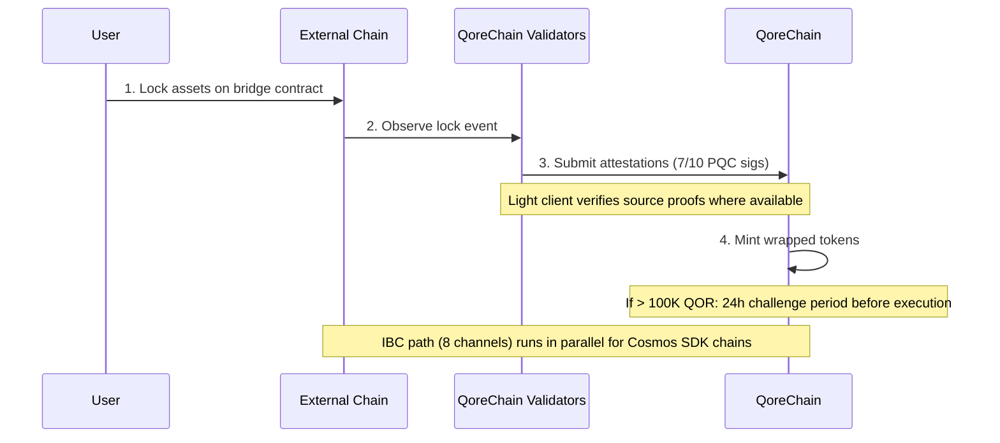

# Bridge-Architektur

Das `x/bridge`-Modul ist darauf ausgelegt, QoreChain über **37 QCB-(QoreChain Bridge-)Chain-Konfigurationen und 8 IBC-(Inter-Blockchain Communication-)Kanäle** mit dem breiteren Blockchain-Ökosystem zu verbinden. Jede Bridge-Operation wird durch Post-Quanten-Kryptografie abgesichert.

:::caution
Die Cross-Chain-Bridge befindet sich **derzeit im Testnet und ist ausstehend — sie ist noch kein Produktivsystem**. Die nachfolgend beschriebenen Chain-Konfigurationen, Light Clients und Abläufe spiegeln die Bridge so wider, wie sie konzipiert und im Testnet erprobt wurde. Die externe Konnektivität wird schrittweise eingeführt; behandeln Sie alle Ziele als Designabsicht und nicht als Live-Mainnet-Garantien.
:::

## Verbindungsübersicht

QoreChain ist darauf ausgelegt, zwei parallel arbeitende Bridge-Protokolle zu unterstützen:

| Protokoll | Verbindungen          | Sicherheitsmodell                    | Anwendungsfall                          |
| --------- | --------------------- | ------------------------------------ | --------------------------------------- |
| **IBC**   | 8 Kanäle              | Standard-IBC + PQC-Paketsignaturen   | Cosmos SDK-kompatible Chains            |
| **QCB**   | 37 Chain-Konfigs      | 7-aus-10 Dilithium-5-Multisig        | Nicht-IBC-Chains (EVM, Solana, TON usw.) |

Die **37 QCB-Chain-Konfigurationen** umfassen **36 externe Chains** plus **QoreChain selbst** als native/Loopback-Konfiguration (verwendet für internes Routing und selbstreferenzielles Settlement). Die 8 IBC-Kanäle verbinden sich mit Cosmos SDK-kompatiblen Chains.

## IBC-Kanäle

QoreChain ist darauf ausgelegt, IBC-Verbindungen zu den folgenden 8 Chains zu unterhalten, weitergeleitet über Hermes v1.x:

| Chain      | Beschreibung                    |
| ---------- | ------------------------------- |
| Cosmos Hub | Primäre Hub-Verbindung          |
| Osmosis    | DEX-Liquiditäts-Routing         |
| Noble      | Native USDC-Emission            |
| Celestia   | Data-Availability-Layer         |
| Stride     | Liquid Staking                  |
| Akash      | Dezentralisiertes Computing     |
| Babylon    | BTC-Restaking-Protokoll         |
| Injective  | DeFi-/Orderbuch-Interoperabilität |

### IBC-Relayer-Konfiguration

* **Relayer-Software**: Hermes v1.x
* **Client-Updates**: Automatische Light-Client-Aktualisierung
* **Fehlverhaltenserkennung**: Aktiviert — der Relayer überwacht auf Equivocation
* **Paketbereinigung**: Alle 100 Blöcke werden ausstehende IBC-Pakete bereinigt
* **PQC-Erweiterung**: Jedes von QoreChain stammende IBC-Paket enthält eine optionale Dilithium-5-Signatur für vorausschauende Quantensicherheit. PQC-fähige empfangende Chains können diese Signatur zusätzlich zur Standard-IBC-Verifizierung prüfen.

## QCB-(QoreChain Bridge-)Protokoll

Das QCB-Protokoll verwendet eine Hub-and-Spoke-Architektur, die durch Post-Quanten-Kryptografie abgesichert ist. QoreChain fungiert als Hub, mit Spoke-Konfigurationen für jede externe Chain plus einer nativen/Loopback-Konfiguration für QoreChain selbst.

### Externe Chain-Konfigurationen (36)

Das QCB-Protokoll ist darauf ausgelegt, die folgenden 36 externen Chains anzusprechen. Zusammen mit QoreChains eigener nativer/Loopback-Konfiguration ergeben sich **insgesamt 37 QCB-Chain-Konfigs (einschließlich QoreChain selbst)**.

**Baseline-Chains (10)**

Ethereum, Solana, TON, BSC, Avalanche, Polygon, Arbitrum, Optimism, Base, Sui.

**EVM-Familien-Chains (14)**

zkSync Era, Linea, Scroll, Blast, Mantle, Hyperliquid, Berachain, Sonic, Sei, Monad, Plasma, Filecoin FVM, Cronos, Kaia.

**Nicht-EVM-Chains (5)**

Starknet, XRP Ledger, Stellar, Hedera, Algorand.

**Ausstehende Chains (7)**

NEAR, Bitcoin, Cardano, Polkadot, Tezos, Tron, Aptos.

:::note
Zählkontrolle: 10 Baseline + 14 EVM-Familie + 5 Nicht-EVM + 7 ausstehend = **36 externe Chains**. Mit QoreChains eigener nativer/Loopback-Konfiguration ergeben sich **37 QCB-Chain-Konfigs**.
:::

### Adressformate

Das QCB-Protokoll klassifiziert Chains nach Typ, um Zieladressen zu validieren:

| Chain-Typ    | Beispiel-Chains                                                         | Adressformat                                       |
| ------------ | ----------------------------------------------------------------------- | -------------------------------------------------- |
| `evm`        | Ethereum, BSC, Avalanche, Polygon, Arbitrum, Optimism, Base             | `0x` + 40 Hex-Zeichen                              |
| `solana`     | Solana                                                                  | Base58, 32–44 Zeichen                              |
| `ton`        | TON                                                                     | `EQ` + base64-kodiert                              |
| `sui_move`   | Sui                                                                     | `0x` + 64 Hex-Zeichen                              |
| `aptos_move` | Aptos                                                                   | `0x` + 64 Hex-Zeichen                              |
| `bitcoin`    | Bitcoin                                                                 | Bech32 (`bc1`), P2SH (`3...`) oder Legacy (`1...`) |
| `near`       | NEAR Protocol                                                           | `.near`-Suffix oder implizit                       |
| `cardano`    | Cardano                                                                 | `addr1` (Zahlung) oder `stake1` (Staking)          |
| `polkadot`   | Polkadot                                                                | SS58-kodiert                                       |
| `tezos`      | Tezos                                                                   | `tz1`/`tz2`/`tz3` (implizit) oder `KT1` (originated) |
| `tron`       | TRON                                                                    | `T` + base58, 34 Zeichen                           |

## Light Clients

Um externe Chain-Ereignisse vertrauenslos zu verifizieren, ist die Bridge darauf ausgelegt, On-Chain-Light-Clients auszuführen, die auf den Konsens und das Beweissystem jeder Quell-Chain zugeschnitten sind. Diese Light Clients ermöglichen es QoreChain, Einzahlungen und Auszahlungen zu validieren, ohne sich ausschließlich auf Validator-Attestierungen zu verlassen.

| Light Client            | Quell-Chain         | Verifizierungsprimitive                                             |
| ----------------------- | ------------------- | ------------------------------------------------------------------- |
| **Ethereum Light Client** | Ethereum / EVM L1 | BLS12-381-Signaturverifizierung, SSZ-Serialisierung, MPT-State-Proofs |
| **Bitcoin SPV**         | Bitcoin             | Simplified Payment Verification anhand von Block-Headern            |
| **Starknet STARK**      | Starknet            | STARK-Beweisverifizierung von Starknet-Zustandsübergängen          |
| **Sui BLS**             | Sui                 | BLS-Aggregat-Signaturverifizierung von Sui-Checkpoints             |
| **Wormhole / Solana VAA** | Solana (via Wormhole) | Verified Action Approval (VAA) Guardian-Signaturverifizierung    |

## Einzahlungsablauf (Extern zu QoreChain)

Die nachfolgende Sequenz zeigt eine QCB-Einzahlung: Assets werden auf einer externen Chain gesperrt, QoreChain-Validatoren reichen PQC-signierte Attestierungen ein (7-aus-10 Dilithium-5), und Wrapped Tokens werden geprägt. Cosmos SDK-kompatible Chains verwenden stattdessen den parallelen IBC-Pfad (8 Kanäle, mit optionalen Dilithium-5-Paketsignaturen). Beide Pfade sind Testnet/ausstehend.



```
External Chain          QoreChain Validators           QoreChain
     |                         |                          |
     | 1. Lock assets on       |                          |
     |    bridge contract      |                          |
     |------------------------>|                          |
     |                         | 2. Observe & attest      |
     |                         |    (7/10 PQC sigs)       |
     |                         |------------------------->|
     |                         |                          | 3. Mint wrapped
     |                         |                          |    tokens
     |                         |                          |
     |                         |    [If > 100K QOR]       |
     |                         |    24h challenge period   |
     |                         |    before execution       |
```

1. **Lock** — Der Nutzer sperrt Assets im Bridge-Contract auf der externen Chain.
2. **Attestieren** — Bridge-Validatoren beobachten die Lock-Transaktion und reichen Dilithium-5-signierte Attestierungen ein. Es sind mindestens **7 von 10** Validator-Attestierungen erforderlich. Wo ein Light Client für die Quell-Chain verfügbar ist, wird das Lock-Ereignis zusätzlich anhand der chaineigenen Beweise verifiziert.
3. **Mint** — Sobald der Attestierungsschwellenwert erreicht ist, werden Wrapped Tokens auf QoreChain geprägt.
4. **Challenge-Periode** — Für Transfers, die den Gegenwert von 100.000 QOR überschreiten, gilt vor der Ausführung eine **24-stündige Challenge-Periode**. Während dieses Zeitfensters können Validatoren verdächtige Aktivitäten kennzeichnen.

## Auszahlungsablauf (QoreChain zu Extern)

```
QoreChain               QoreChain Validators           External Chain
     |                         |                          |
     | 1. Burn wrapped tokens  |                          |
     |------------------------>|                          |
     |                         | 2. Attest burn           |
     |                         |    (7/10 PQC sigs)       |
     |                         |------------------------->|
     |                         |                          | 3. Unlock original
     |                         |                          |    assets
```

1. **Burn** — Der Nutzer verbrennt Wrapped Tokens auf QoreChain.
2. **Attestieren** — Validatoren attestieren das Burn-Ereignis mit Dilithium-5-Signaturen (7/10-Schwellenwert).
3. **Unlock** — Sobald der Schwellenwert erreicht ist, werden die ursprünglichen Assets auf der externen Chain freigegeben.

Alle während Auszahlungen erhobenen Bridge-Gebühren werden über den `bridge_fee`-Burn-Kanal an das `x/burn`-Modul geleitet (100 % der Bridge-Gebühren werden verbrannt).

### L2 → L1 Auszahlungsablauf (Rollup-Settlement)

Die Bridge ist außerdem darauf ausgelegt, **Rollup-(L2-)Auszahlungen zurück zu ihrer Host-Chain (L1) abzuwickeln**. Rollups, die über das [Rollup Development Kit](/architecture/rollup-development-kit) bereitgestellt werden, verankern ihren Zustand periodisch in QoreChain; die Bridge konsumiert diese finalisierten Anker, um Auszahlungen vom Rollup an die Host-Chain zu autorisieren:

1. Ein Nutzer initiiert eine Auszahlung auf dem Rollup (L2), die in einen Settlement-Batch aufgenommen wird.
2. Der Batch wird in QoreChain verankert und gemäß dem Settlement-Modus des Rollups bewiesen/finalisiert (zum Beispiel nach Ablauf des optimistischen Challenge-Fensters oder bei erfolgreicher Beweisverifizierung).
3. Sobald der Anker finalisiert ist, wird die Auszahlung beanspruchbar und die entsprechenden Assets werden über den Standard-Burn-and-Attest-Pfad auf der Host-Chain (L1) freigegeben.

Dies koppelt die Rollup-Finalität direkt an die Settlement-Garantien der Host-Chain, sodass L2-Auszahlungen nicht freigegeben werden können, bevor der entsprechende L2-Zustand unwiderruflich abgewickelt ist.

## Sicherheitsarchitektur

### PQC-Multisig

Alle QCB-Bridge-Operationen erfordern einen **7-aus-10-Schwellenwert** von Dilithium-5-Post-Quanten-Signaturen registrierter Bridge-Validatoren. Jeder Bridge-Validator registriert sich mit:

* Einer QoreChain-Validator-Adresse
* Einem Dilithium-5-Public-Key (2.592 Bytes)
* Einer Liste unterstützter Chains
* Einem Reputationswert (verwaltet von `x/reputation`)

### Circuit Breaker

Jede verbundene Chain verfügt über unabhängige Circuit-Breaker-Schutzmechanismen:

| Schutzmechanismus         | Beschreibung                                                                          |
| ------------------------- | ------------------------------------------------------------------------------------ |
| **Einzeltransferlimit**   | Maximalbetrag für jede einzelne Bridge-Operation pro Chain                            |
| **Tägliches Gesamtlimit** | Gesamtvolumenobergrenze pro Chain pro 24-Stunden-Fenster                              |
| **Manuelle Pause**        | Durch Governance oder Validatoren ausgelöster Notfallstopp pro Chain                  |
| **Anomalieerkennung**     | Automatische Pause bei >50 Operationen in einem kurzen Fenster oder wenn das Volumen das 5-fache des Tageslimits überschreitet |

Der Circuit-Breaker-Zustand wird pro Chain verfolgt und umfasst: maximaler Einzeltransfer, Tageslimit, aktuelle Tagesnutzung, letzte Reset-Höhe sowie Pausenstatus mit Begründung.

### Challenge-Periode

Für große Transfers (>100.000 QOR-Gegenwert, konfigurierbar über `large_transfer_threshold`):

* Nach Erreichen des Attestierungsschwellenwerts gilt eine **24-stündige Challenge-Periode** (86.400 Sekunden).
* Während dieses Zeitfensters kann jeder Validator die Operation kennzeichnen.
* Wird sie nicht angefochten, führt sich die Operation nach Ablauf der Periode automatisch aus.
* Angefochtene Operationen werden für eine Governance-Überprüfung eingefroren.

### KI-Pfadoptimierung

Das Bridge-Modul integriert sich mit dem KI-Subsystem für die Routenoptimierung. Für Transfers, die mehrere Pfade durchlaufen können (z. B. Chain A zu Chain B über einen Vermittler), bewertet der Pfadoptimierer:

* Geschätzte Gebühren über die Routen hinweg
* Geschätzte Abschlusszeit
* Sicherheitswert pro Pfad
* Konfidenzniveau der Schätzung

## Bridge-Administration

### Chain-Aktivierung nach dem Deployment (keine Governance)

Ab Chain-Version **v3.1.78** kann eine Bridge-Chain nach dem Deployment mit einer einzigen signierten Transaktion aktiviert und neu konfiguriert werden — ohne Governance-Vorschlag und ohne Chain-Upgrade. Ein `bridge_admin`-Key (gesetzt in `BridgeConfig.BridgeAdmin` zum Genesis-Zeitpunkt) oder ein Inhaber der `qcb_bridge`-Lizenz kann:

* **`tx bridge update-chain-config`** — die Contract-Adresse, Bestätigungsanzahl, Architektur und den Status einer Chain festlegen (`MsgUpdateChainConfig`).
* **`tx bridge set-verifier-bootstrap`** — den aktiven Verifier für eine Chain auswählen und dessen Trust Root installieren (`MsgSetVerifierBootstrap`).

Dadurch kann ein Betreiber die Bridge einer verbundenen Chain direkt online bringen — oder deren Verifier rotieren —, wobei die Autorisierung gegen den Bridge-Admin-Key geprüft wird.

### Validierung verbundener Netzwerke

Ab Chain-Version **v3.1.79** kann ein Validator, der die passende `validator_<chain>`-(oder `qcb_bridge`-)Lizenz hält, den Client des externen Netzwerks auf demselben Node ausführen, automatisch unter QoreChains Orchestrierung bereitgestellt, sobald die Lizenz aktiviert ist. Für alle 37 Bridge-Netzwerke werden Treiber ausgeliefert, klassifiziert nach Teilnahmemodell (permissionless Validator, gedeckelt/gewählt/Zulassung, L2-Full-Node und Non-Staking/Trust-List). Stake und Signaturschlüssel des externen Netzwerks werden vom Betreiber pro Netzwerk bereitgestellt. Siehe [Einen Validator betreiben](/developer-guide/running-a-validator#connected-networks) für die Betreiberschritte.

## REST-API-Endpunkte

Ab Chain-Version **v3.1.77** ist der Bridge-Zustand auch **schreibgeschützt über REST** via grpc-gateway unter dem Präfix `/qorechain/bridge/v1/...` abfragbar (`config`, `chains`, `chains/{chain_id}`, `validators`, `validators/{address}`, `operations`, `operations/{id}`) — zuvor nur per gRPC. Diese liefern echtes On-Chain-JSON über HTTP für Explorer und Light-Node-Telemetrie. Siehe [REST-/gRPC-Endpunkte](/api-reference/rest-grpc-endpoints#bridge-module) für die vollständige Liste.

| Methode | Endpunkt                                           | Beschreibung                                      |
| ------- | -------------------------------------------------- | ------------------------------------------------- |
| GET     | `/bridge/v1/chains`                                | Alle unterstützten Chain-Konfigurationen auflisten |
| GET     | `/bridge/v1/chains/{chain_id}`                     | Konfiguration für eine bestimmte Chain abrufen    |
| GET     | `/bridge/v1/validators`                            | Alle registrierten Bridge-Validatoren auflisten   |
| GET     | `/bridge/v1/operations`                            | Alle Bridge-Operationen auflisten (neueste zuerst) |
| GET     | `/bridge/v1/operations/{operation_id}`             | Details einer bestimmten Operation abrufen        |
| GET     | `/bridge/v1/locked/{chain}/{asset}`                | Gesperrte/geprägte Beträge für ein Chain-/Asset-Paar abrufen |
| GET     | `/bridge/v1/circuit-breakers`                      | Alle Circuit-Breaker-Zustände auflisten           |
| GET     | `/bridge/v1/estimate/{from}/{to}/{asset}/{amount}` | KI-optimierte Routenschätzung abrufen             |

## Bridge-Ereignisse

Das Bridge-Modul emittiert die folgenden On-Chain-Ereignisse:

| Ereignistyp                   | Beschreibung                                    |
| ----------------------------- | ----------------------------------------------- |
| `bridge_deposit`              | Neue Einzahlungsoperation erstellt              |
| `bridge_withdraw`             | Neue Auszahlungsoperation erstellt              |
| `bridge_attestation`          | Validator-Attestierung eingereicht              |
| `bridge_operation_executed`   | Operation finalisiert und ausgeführt            |
| `bridge_circuit_breaker_trip` | Circuit Breaker aktiviert oder deaktiviert      |
| `bridge_validator_registered` | Neuer Bridge-Validator registriert              |
| `bridge_pqc_verification`     | PQC-Signaturverifizierungsergebnis (IBC-Pakete) |

## Verwandt

* [Assets bridgen](/user-guide/bridging-assets) — Assets Schritt für Schritt chainübergreifend bewegen.
* [Dashboard-Bridge](/dashboard/bridge) — die Bridge-Schnittstelle für alltägliche Nutzer.
* [BTC-Restaking via Babylon](/architecture/btc-restaking-babylon) — Bitcoin-gestützte Sicherheit.
* [Post-Quanten-Sicherheit](/architecture/post-quantum-security) — PQC-Verifizierung bei IBC-Paketen.
