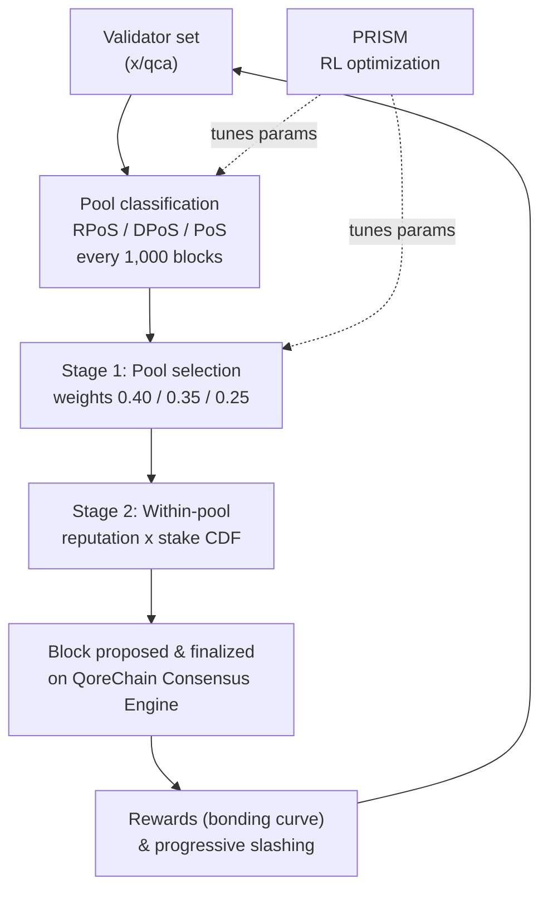

# Konsensmechanismus

QoreChain implementiert **Triple-Pool Composite Proof-of-Stake (CPoS)**, einen Konsensmechanismus, der Validatoren in drei spezialisierte Pools einteilt und eine reputationsgewichtete Auswahl verwendet, um Sicherheit, Dezentralisierung und Leistung auszubalancieren. CPoS ist im Modul `x/qca` implementiert und arbeitet auf der **QoreChain Consensus Engine**.

Die Optimierungsschicht auf Basis von Reinforcement Learning, die Konsensparameter zur Laufzeit anpasst, trägt die Bezeichnung **PRISM** (Policy-driven Reinforcement-learning for Intelligent State Machines). Siehe [PRISM Consensus Engine](/architecture/prism-consensus-engine) für Details.

Das folgende Diagramm fasst einen Block-/Konsenszyklus von Triple-Pool CPoS auf der QoreChain Consensus Engine zusammen und zeigt, wo PRISM in die einstellbaren `x/qca`-Parameter zurückgespeist wird.



---

## Triple-Pool-Architektur

CPoS teilt die aktive Validatorenmenge anhand von Reputation, Stake und Delegations-Metriken in drei Pools auf. Jeder Pool erfüllt eine eigene Rolle im Konsensprozess.

### Pool-Klassifizierung

| Pool                                 | Kriterien                                                                | Auswahlgewicht |
| ------------------------------------ | ----------------------------------------------------------------------- | ---------------- |
| **RPoS** (Reputation Proof-of-Stake) | Reputationswert >= 70. Perzentil **UND** selbst gebondeter Stake >= Median | 40%              |
| **DPoS** (Delegated Proof-of-Stake)  | Gesamtdelegation >= 10,000 QOR                                          | 35%              |
| **PoS** (Standard Proof-of-Stake)    | Alle übrigen aktiven Validatoren                                         | 25%              |

Die Klassifizierung wird mit folgender Priorität ausgewertet: **RPoS > DPoS > PoS**. Ein Validator, der sich für RPoS und DPoS qualifiziert, wird RPoS zugewiesen.

Eine Neuklassifizierung erfolgt alle **1.000 Blöcke**. Bei jeder Neuklassifizierungs-Epoche:

1. **Reputationswerte erfassen** — Reputationswerte werden für alle aktiven Validatoren aus dem Modul `x/reputation` erfasst.
2. **Reputationsschwelle berechnen** — Die Reputationsschwelle des 70. Perzentils wird aus der sortierten Werteverteilung berechnet.
3. **Median des selbst gebondeten Stakes berechnen** — Der Median des selbst gebondeten Stakes wird aus der sortierten Stake-Verteilung berechnet.
4. **Validatoren neu zuweisen** — Jeder aktive Validator wird dem Pool mit der höchsten Priorität zugewiesen, für den er sich qualifiziert.
5. **Standardzuweisung** — Nicht klassifizierte Validatoren (die noch nicht ausgewertet wurden) werden standardmäßig dem PoS-Pool zugewiesen.

---

## Pool-gewichtete Proposer-Auswahl

Die Auswahl des Block-Proposers folgt einem zweistufigen deterministischen Prozess.

### Stufe 1: Pool-Auswahl

Ein deterministischer Zufallswert wählt aus, welcher Pool den nächsten Block vorschlägt:

```
seed = SHA256(lastBlockHash || height || "pool")
randVal = uint64(seed[:8]) / MaxUint64    // uniform in [0, 1)
```

Der Pool wird durch Vergleich von `randVal` mit kumulativen Gewichtsschwellen ausgewählt:

* `randVal < 0.40` → RPoS-Pool
* `0.40 <= randVal < 0.75` → DPoS-Pool
* `randVal >= 0.75` → PoS-Pool

### Stufe 2: Auswahl innerhalb des Pools

Innerhalb des gewählten Pools wird der Proposer über eine **reputations- × stakegewichtete CDF** ausgewählt. Für jeden Validator im Pool:

1. Der Reputationswert `r` wird aus `x/reputation` abgerufen.
2. Das zusammengesetzte Gewicht ist `w = r * tokens`.
3. Aus allen zusammengesetzten Gewichten wird eine kumulative Verteilungsfunktion (CDF) erstellt.
4. Der Proposer wird über eine deterministische Zufallsziehung gegen die CDF ausgewählt, geseedet durch Block-Hash und Blockhöhe.

### Fallback-Verhalten

Ist der gewählte Pool leer, greift das System auf den PoS-Pool zurück. Ist auch der PoS-Pool leer, fällt die Auswahl auf eine reputationsgewichtete Auswahl über die gesamte aktive Validatorenmenge zurück.

---

## Individuelle Bonding-Kurve

Validator-Belohnungen werden über eine multifaktorielle Bonding-Kurve berechnet, die langfristige Teilnahme, hohe Reputation und Ausrichtung an den Wachstumsphasen des Protokolls anreizt.

### Formel

```
R(v, t) = beta * S_v * (1 + alpha * ln(1 + L_v)) * Q(r_v) * P(t)
```

### Faktordefinitionen

| Faktor                 | Symbol   | Beschreibung                                                 | Standard   |
| ---------------------- | -------- | ----------------------------------------------------------- | --------- |
| Basis-Belohnungsmultiplikator | `beta`   | Skaliert die Gesamtgröße der Belohnung                         | 1.0       |
| Selbst gebondeter Stake      | `S_v`    | Die selbst gebondeten Tokens des Validators (uqor)                   | --        |
| Loyalitätssensitivität    | `alpha`  | Steuert, wie stark die Loyalitätsdauer Belohnungen verstärkt        | 0.1       |
| Loyalitätsdauer       | `L_v`    | Anzahl aufeinanderfolgender Blöcke, in denen der Validator aktiv war  | --        |
| Reputationsqualität     | `Q(r_v)` | Bildet die Reputation `r` auf einen Belohnungsmultiplikator in \[0.75, 1.25] ab | --        |
| Protokollphase         | `P(t)`   | Phasenabhängiger Multiplikator zum Bootstrappen oder Moderieren von Belohnungen | Siehe unten |

### Reputationsqualitätsfunktion

```
Q(r) = 1 + 0.5 * (r - 0.5)
```

Das Ergebnis wird auf den Bereich **\[0.75, 1.25]** begrenzt:

| Reputationswert | Q(r)  |
| ---------------- | ----- |
| 0.0              | 0.75  |
| 0.25             | 0.875 |
| 0.5              | 1.0   |
| 0.75             | 1.125 |
| 1.0              | 1.25  |

### Protokollphasen-Multiplikatoren

| Phase   | P(t) | Beschreibung                                   |
| ------- | ---- | --------------------------------------------- |
| Genesis | 1.5  | Höhere Belohnungen zum Bootstrappen der Validatorenmenge |
| Growth  | 1.0  | Standardbelohnungen während der Netzwerkexpansion     |
| Mature  | 0.8  | Reduzierte Emission, sobald sich das Netzwerk stabilisiert    |

### Deterministische Mathematik

Die Berechnung von `ln(1 + L_v)` verwendet eine Taylor-Reihen-Approximation mit Argumentreduktion (`TaylorLn1PlusX`) und arbeitet vollständig mit `LegacyDec`-Dezimalzahlen fester Präzision. In konsenskritischen Belohnungsberechnungen wird keine Gleitkommaarithmetik verwendet.

---

## Progressives Slashing

QoreChain ersetzt pauschale Slashing-Raten durch ein **progressives Strafmodell**, das die Konsequenzen für Wiederholungstäter eskaliert und gleichzeitig zulässt, dass Verstöße im Laufe der Zeit abklingen.

### Formel

```
penalty = base_rate * escalation_factor^effective_count * severity_factor
```

### Zeitlicher Verfall

Vergangene Verstöße tragen ein abklingendes Gewicht zur effektiven Anzahl bei:

```
effective_count = SUM( 0.5^(blocks_since_i / decay_halflife) )
```

Für jeden vergangenen Verstoß `i` halbiert sich der Beitrag alle `decay_halflife` Blöcke (Standard: 100.000). Das bedeutet, dass ein einzelner alter Verstoß, der vor 200.000 Blöcken auftrat, nur 0,25 zur effektiven Anzahl beiträgt.

### Schweregrad-Faktoren

| Verstoßtyp     | Schweregrad-Faktor |
| ------------------- | --------------- |
| Downtime            | 1.0             |
| Double Sign         | 2.0             |
| Light Client Attack | 3.0             |

### Maximale Strafe

Die Strafe ist pro Slash-Ereignis auf **33%** begrenzt, unabhängig davon, wie viele vergangene Verstöße ein Validator angesammelt hat.

### Beispielrechnung

Ein Validator mit 2 vorherigen Verstößen (einer vor 50.000 Blöcken, einer vor 150.000 Blöcken) begeht ein Double-Sign:

1. **Verfallsbeiträge**:
   * Verstoß 1: `0.5^(50000 / 100000) = 0.5^0.5 = 0.707`
   * Verstoß 2: `0.5^(150000 / 100000) = 0.5^1.5 = 0.354`
   * `effective_count = 0.707 + 0.354 = 1.061`
2. **Eskalation**: `1.5^1.061 = 1.516`
3. **Strafe**: `0.01 * 1.516 * 2.0 = 0.0303` (3,03%)

Zum Vergleich ein Ersttäter: `0.01 * 1.5^0 * 2.0 = 0.02` (2,0%).

---

## QDRW-Governance

Die QoreChain-Governance verwendet **Quadratic Delegation with Reputation Weighting (QDRW)**, um plutokratische Übernahmen zu verhindern und gleichzeitig langfristige Netzwerkteilnehmer zu belohnen.

### Formel für die Stimmkraft

```
VP(v) = sqrt(staked + 2 * xQORE) * ReputationMultiplier(r)
```

Dabei gilt:

* `staked` = die gebondeten QOR-Tokens des Wählers
* `xQORE` = der xQORE-Bestand des Wählers (Derivat aus langfristigem Staking)
* `2` = der xQORE-Gewichtsmultiplikator (per Governance konfigurierbar)
* `r` = der Reputationswert des Wählers aus `x/reputation`

### Reputationsmultiplikator

Der Reputationsmultiplikator bildet `r` in \[0, 1] über eine Sigmoidkurve auf einen Multiplikator in \[0.5, 2.0] ab:

```
ReputationMultiplier(r) = 0.5 + 1.5 * sigmoid(6 * (r - 0.5))
```

| Reputationswert | Multiplikator |
| ---------------- | ---------- |
| 0.0              | 0.50       |
| 0.1              | 0.52       |
| 0.2              | 0.58       |
| 0.3              | 0.71       |
| 0.4              | 0.93       |
| 0.5              | 1.25       |
| 0.6              | 1.57       |
| 0.7              | 1.79       |
| 0.8              | 1.92       |
| 0.9              | 1.98       |
| 1.0              | 2.00       |

### Quadratische Skalierung

Die Quadratwurzelfunktion stellt sicher, dass die Stimmkraft unterlinear mit dem Stake skaliert. Ein Wähler mit dem 4-fachen Stake eines anderen Wählers erhält nur die 2-fache Stimmkraft, nicht die 4-fache. Dies verhindert, dass große Token-Inhaber Governance-Entscheidungen dominieren.

### Deterministische Mathematik

`IntegerSqrt` verwendet das Newton-Verfahren mit `LegacyDec`-Präzision. `SigmoidApprox` nutzt eine Taylor-Reihe `ExpApprox` mit 12 Termen. Die gesamte Governance-Mathematik ist über alle Validatorenknoten hinweg vollständig deterministisch.

---

## QCA-Parameter

Die folgende Tabelle listet alle per Governance konfigurierbaren Parameter im Modul `x/qca` auf:

### Kernparameter

| Parameter                  | Typ    | Standard | Beschreibung                                       |
| -------------------------- | ------- | ------- | ------------------------------------------------- |
| `use_reputation_weighting` | bool    | `true`  | Reputationsgewichtete Proposer-Auswahl aktivieren     |
| `min_reputation_score`     | float64 | `0.1`   | Mindest-Reputationswert für aktive Teilnahme |

### Pool-Konfiguration

| Parameter                 | Typ      | Standard          | Beschreibung                                      |
| ------------------------- | --------- | ---------------- | ------------------------------------------------ |
| `classification_interval` | uint64    | `1000`           | Blöcke zwischen Pool-Neuklassifizierungen             |
| `weight_rpos`             | LegacyDec | `0.40`           | Auswahlgewicht des RPoS-Pools                       |
| `weight_dpos`             | LegacyDec | `0.35`           | Auswahlgewicht des DPoS-Pools                       |
| `min_delegation_dpos`     | uint64    | `10,000,000,000` | Mindestdelegation für DPoS (10,000 QOR in uqor) |
| `rep_percentile_rpos`     | uint64    | `70`             | Reputationsperzentil-Schwelle für RPoS         |

### Konfiguration der Bonding-Kurve

| Parameter          | Typ      | Standard | Beschreibung                                      |
| ------------------ | --------- | ------- | ------------------------------------------------ |
| `alpha`            | LegacyDec | `0.1`   | Loyalitätssensitivitätskoeffizient                  |
| `beta`             | LegacyDec | `1.0`   | Basis-Belohnungsmultiplikator                           |
| `phase_multiplier` | LegacyDec | `1.5`   | Belohnungsmultiplikator der Protokollphase (Genesis-Phase) |

### Slashing-Konfiguration

| Parameter           | Typ      | Standard   | Beschreibung                            |
| ------------------- | --------- | --------- | -------------------------------------- |
| `base_rate`         | LegacyDec | `0.01`    | Basis-Slash-Rate (1%)                   |
| `escalation_factor` | LegacyDec | `1.5`     | Basis der progressiven Eskalation            |
| `max_penalty`       | LegacyDec | `0.33`    | Maximale Strafe pro Ereignis (33%)        |
| `decay_halflife`    | uint64    | `100,000` | Blöcke für die Halbwertszeit des Verstoßgewichts |

### QDRW-Governance-Konfiguration

| Parameter            | Typ      | Standard | Beschreibung                            |
| -------------------- | --------- | ------- | -------------------------------------- |
| `enabled`            | bool      | `false` | QDRW-Governance-Auszählung aktivieren           |
| `xqore_multiplier`   | LegacyDec | `2.0`   | xQORE-Gewicht relativ zu gebondeten Tokens |
| `rep_min_multiplier` | LegacyDec | `0.5`   | Minimaler Reputationsmultiplikator          |
| `rep_max_multiplier` | LegacyDec | `2.0`   | Maximaler Reputationsmultiplikator          |

## Verwandt

* [PRISM Consensus Engine](/architecture/prism-consensus-engine) — KI-Schicht, die Konsensparameter anpasst.
* [Multilayer Architecture](/architecture/multilayer-architecture) — wie Sidechains an die Basisschicht verankert werden.
* [Running a Validator](/developer-guide/running-a-validator) — betreiben Sie einen Validator, der die Chain absichert.
* [Tokenomics](/architecture/tokenomics) — Staking-Belohnungen, Inflation und Slashing-Ökonomie.
