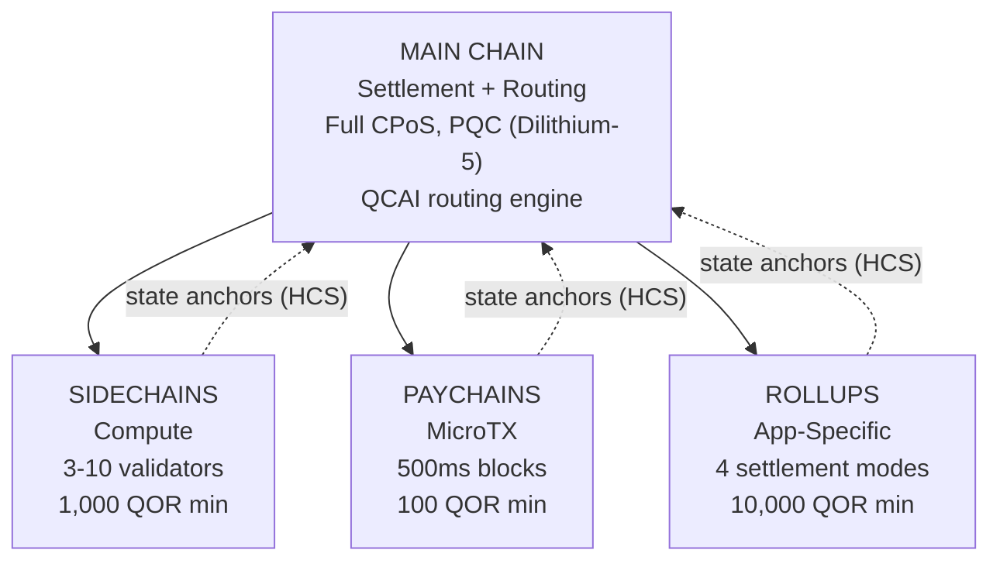

# Mehrschichtige Architektur

QoreChain implementiert über das Modul `x/multilayer` eine **hierarchische 4-Ebenen-Chain-Architektur**. Die Hauptchain dient als Settlement- und Vertrauensanker (Trust Root), während untergeordnete Ebenen (Sidechains, Paychains und Rollups) spezialisierte Workloads mit unterschiedlichen Leistungs- und Sicherheitskompromissen abwickeln.

---

## Systemüberblick

Die folgende 4-Ebenen-Hierarchie zeigt die Hauptchain als Settlement- und Vertrauensanker, wobei drei untergeordnete Ebenentypen ihre State Roots über Hierarchical Commitment Schemes (HCS) an sie verankern.



```
                    +---------------------------+
                    |       MAIN CHAIN          |
                    |  (Settlement + Routing)   |
                    |  Full CPoS consensus      |
                    |  PQC-secured (Dilithium-5)|
                    |  QCAI routing engine       |
                    +------+------+------+------+
                           |      |      |
              +------------+      |      +------------+
              |                   |                    |
    +---------v--------+ +-------v--------+ +---------v---------+
    |   SIDECHAINS     | |   PAYCHAINS    | |     ROLLUPS       |
    |  (Compute)       | |  (MicroTX)     | |  (App-Specific)   |
    |  3-10 validators | |  500ms blocks  | |  4 settlement     |
    |  1,000 QOR min   | |  100 QOR min   | |    modes          |
    |  Max: 10         | |  Max: 50       | |  10,000 QOR min   |
    +------------------+ +----------------+ |  Max: 100         |
                                            +-------------------+
```

---

## Ebenentypen

### Hauptchain

Die Hauptchain ist der Vertrauensanker für das gesamte QoreChain-Ökosystem.

| Eigenschaft   | Wert                                                                          |
| ---------- | ------------------------------------------------------------------------------ |
| Konsens  | Vollständiger Triple-Pool CPoS (siehe [Konsensmechanismus](/architecture/consensus-mechanism)) |
| Sicherheit   | PQC-gesichert mit Dilithium-5-Signaturen                                        |
| Rolle       | Settlement-Schicht, Speicher für State Anchors, QCAI-Routing-Engine, Vertrauensanker        |
| Blockzeit | \~5 Sekunden                                                                    |

Alle untergeordneten Ebenen verankern ihre State Roots regelmäßig über Hierarchical Commitment Schemes (HCS) an die Hauptchain.

### Sidechains

Sidechains wickeln **rechenintensive Operationen** wie DeFi-Protokolle, Gaming-Engines und IoT-Datenverarbeitung ab.

| Parameter                 | Wert             |
| ------------------------- | ----------------- |
| Mindestanzahl Validatoren        | 3                 |
| Maximalanzahl Validatoren        | 10                |
| Mindest-Erstellerstake     | 1,000 QOR         |
| Maximal aktive Sidechains | 10                |
| Zieldomänen            | DeFi, Gaming, IoT |

### Paychains

Paychains sind für **hochfrequente Mikrotransaktionen** mit minimaler Latenz optimiert.

| Parameter                | Wert                                   |
| ------------------------ | --------------------------------------- |
| Ziel-Blockzeit        | 500 ms                                  |
| Maximal aktive Paychains | 50                                      |
| Mindest-Erstellerstake    | 100 QOR                                 |
| Zieldomänen           | Zahlungen, Streaming, Mikrotransaktionen |

### Rollups

Rollups sind **anwendungsspezifische Chains**, die über das Rollup Development Kit (`x/rdk`) bereitgestellt werden. Sie werden innerhalb des Multilayer-Moduls als Ebenentyp Rollup registriert.

| Parameter              | Wert                                       |
| ---------------------- | ------------------------------------------- |
| Settlement-Modi       | 4 (optimistic, zk, based, sovereign)        |
| Maximal aktive Rollups | 100                                         |
| Mindest-Erstellerstake  | 10,000 QOR                                  |
| Ebenentyp             | `rollup`                                    |
| Zieldomänen         | DeFi, Gaming, NFT, Enterprise               |

Die Bereitstellung und Konfiguration von Rollups wird ausführlich im [Rollup Development Kit](/architecture/rollup-development-kit) behandelt.

---

## QCAI-Transaktionsrouting

Der QCAI-Router bewertet für jede eingehende Transaktion alle aktiven Ebenen und wählt das optimale Ziel über ein gewichtetes 4-Faktoren-Bewertungsmodell aus.

### Bewertungsformel

Jede in Frage kommende Ebene erhält einen zusammengesetzten Wert (höher ist besser):

```
Score = w_congestion * (1 - Congestion) + w_capability * Capability + w_cost * (1 - Cost) + w_latency * (1 - Latency)
```

| Faktor     | Gewicht | Beschreibung                                                                 |
| ---------- | ------ | --------------------------------------------------------------------------- |
| Congestion | 0.30   | Aktuelle Auslastung (invertiert: geringere Auslastung = höherer Wert)              |
| Capability | 0.40   | Wie gut die Ebene zu den Transaktionsanforderungen passt                     |
| Cost       | 0.20   | Gebührenmultiplikator relativ zur Hauptchain (invertiert: geringere Kosten = höherer Wert) |
| Latency    | 0.10   | Erwartete Zeit bis zur Finalität (invertiert: geringere Latenz = höherer Wert)          |

### Konfidenzschwelle

Der Router benötigt einen Mindestkonfidenzwert von **0,6**, bevor er eine Transaktion an eine untergeordnete Ebene leitet. Erfüllt keine Ebene diese Schwelle, wird die Transaktion standardmäßig an die Hauptchain geleitet.

Der Transaktionsabsender kann einen Hinweis auf eine bevorzugte Ebene angeben. Erreicht die bevorzugte Ebene mindestens 80% der Konfidenzschwelle (d. h. 0,48), wird sie als Routing-Ziel akzeptiert.

### Payload-Heuristiken

Wenn detaillierte Transaktionsmetadaten nicht verfügbar sind, verwendet der Router die Payload-Größe als Klassifizierungssignal:

| Payload-Größe      | Bevorzugte Ebene | Begründung                                    |
| ----------------- | --------------- | -------------------------------------------- |
| &lt; 256 bytes    | Paychain        | Wahrscheinlich ein einfacher Transfer oder eine Mikrotransaktion |
| 256 - 1,024 bytes | Hauptchain      | Standard-Transaktionskomplexität              |
| > 1,024 bytes     | Sidechain       | Wahrscheinlich eine komplexe Vertragsinteraktion        |

---

## Hierarchical Commitment Schemes (HCS)

Untergeordnete Ebenen übergeben ihren Zustand regelmäßig über **State Anchors** an die Hauptchain. Jeder Anchor enthält einen kryptografischen Nachweis des Zustands der untergeordneten Chain auf einer bestimmten Höhe.

### Anchor-Inhalt

| Feld                     | Beschreibung                                          |
| ------------------------- | ---------------------------------------------------- |
| `layer_id`                | Kennung der untergeordneten Ebene                   |
| `layer_height`            | Blockhöhe auf der untergeordneten Chain                 |
| `state_root`              | Merkle-Root des State Trees der untergeordneten Chain     |
| `validator_set_hash`      | Hash der Validatorenmenge, die das Commitment signiert hat |
| `pqc_aggregate_signature` | Dilithium-5-Aggregatsignatur über die Anchor-Daten |
| `transaction_count`       | Anzahl der Transaktionen seit dem letzten Anchor         |
| `compressed_state_proof`  | Komprimierter State-Transition-Proof                   |

### Anchor-Übermittlung

Anchors werden über `MsgAnchorState` an die Hauptchain übermittelt. Der Keeper validiert den Anchor nach folgenden Schritten:

1. **Ebene existiert und ist aktiv** — Der Keeper überprüft, dass die Ebene im Zustand existiert und derzeit den Status `active` hat.
2. **Mindest-Anchor-Intervall verstrichen** — Der Keeper prüft, dass seit dem letzten Anchor dieser Ebene mindestens `min_anchor_interval` Blöcke (Standard: 100) verstrichen sind.
3. **PQC-Aggregatsignatur** — Der Keeper stellt sicher, dass die PQC-Aggregatsignatur vorhanden und für die Anchor-Daten gültig ist.

### Challenge-Periode

Jeder Anchor durchläuft eine **Challenge-Periode** von **24 Stunden** (86.400 Sekunden, pro Ebene konfigurierbar). Während dieser Periode kann jede Partei den Anchor anfechten, indem sie über `MsgChallengeAnchor` einen Fraud Proof einreicht. Ist der Fraud Proof gültig, wird der Anchor ungültig gemacht und der Zustand der untergeordneten Chain auf den vorherigen Anchor zurückgesetzt.

Läuft die Challenge-Periode ohne erfolgreiche Anfechtung ab, gilt der Anchor als finalisiert.

---

## Cross-Layer Fee Bundling (CLFB)

CLFB ermöglicht es, mit einer einzelnen Gebührenzahlung auf der Ursprungsebene die Ausführung über mehrere Ebenen in einem ebenenübergreifenden Transaktionspfad abzudecken.

### Gebührenberechnung

```
avgMultiplier = sum(layer_multiplier_i) / num_layers
bundledFee = (totalGas / 1000) * avgMultiplier
```

Dabei gilt:

* `layer_multiplier_i` ist der Basisgebührenmultiplikator für jede Ebene im Transaktionspfad (Hauptchain = 1.0).
* `totalGas` ist der geschätzte Gesamt-Gasverbrauch über alle Ebenen.
* Das Ergebnis wird in **uqor** angegeben, mit einer Mindestgebühr von 1 uqor.

### Beispiel

Eine ebenenübergreifende Transaktion berührt drei Ebenen: Hauptchain (Multiplikator 1.0), eine Sidechain (Multiplikator 0.5) und eine Paychain (Multiplikator 0.1).

```
avgMultiplier = (1.0 + 0.5 + 0.1) / 3 = 0.533
bundledFee = (150,000 / 1000) * 0.533 = 80 uqor
```

CLFB kann global über den Parameter `cross_layer_fee_bundling` aktiviert oder deaktiviert werden, und einzelne Ebenen können sich über ihr Konfigurationsflag `cross_layer_fee_bundling_enabled` davon abmelden.

---

## Ebenen-Lebenszyklus

Jede untergeordnete Ebene durchläuft einen klar definierten Lebenszyklus:

```
Proposed --> Active --> Suspended --> Decommissioned
                  \                /
                   +-- Active <--+
```

| Status             | Beschreibung                                                                     | Erlaubte Übergänge       |
| ------------------ | ------------------------------------------------------------------------------- | ------------------------- |
| **Proposed**       | Ebene wurde registriert, aber noch nicht aktiviert                                 | Active, Decommissioned    |
| **Active**         | Ebene ist betriebsbereit und nimmt Transaktionen an                                 | Suspended, Decommissioned |
| **Suspended**      | Ebene ist vorübergehend pausiert (z. B. für Wartung oder aus Sicherheitsgründen) | Active, Decommissioned    |
| **Decommissioned** | Ebene ist dauerhaft abgeschaltet (Endzustand)                                 | Keine                      |

Statusübergänge werden vom Keeper durchgesetzt. Ungültige Übergänge (z. B. von Decommissioned zu Active) werden abgelehnt.

---

## Parameter

| Parameter                      | Typ   | Standard         | Beschreibung                                             |
| ------------------------------ | ------ | --------------- | ------------------------------------------------------- |
| `max_sidechains`               | uint64 | `10`            | Maximale Anzahl aktiver Sidechains                     |
| `max_paychains`                | uint64 | `50`            | Maximale Anzahl aktiver Paychains                     |
| `min_anchor_interval`          | uint64 | `100`           | Mindestanzahl Blöcke zwischen State Anchors                    |
| `max_anchor_interval`          | uint64 | `1,000`         | Maximalanzahl Blöcke zwischen State Anchors (erzwungener Anchor)    |
| `default_challenge_period`     | uint64 | `86,400`        | Standard-Challenge-Periode in Sekunden (24 Stunden)          |
| `min_sidechain_stake`          | string | `1,000,000,000` | Mindeststake zum Erstellen einer Sidechain (1,000 QOR in uqor) |
| `min_paychain_stake`           | string | `100,000,000`   | Mindeststake zum Erstellen einer Paychain (100 QOR in uqor)    |
| `routing_enabled`              | bool   | `true`          | QCAI-basiertes Transaktionsrouting aktivieren                   |
| `routing_confidence_threshold` | string | `0.6`           | Mindestkonfidenz für QCAI-Routing-Entscheidungen           |
| `cross_layer_fee_bundling`     | bool   | `true`          | Globales Cross-Layer Fee Bundling aktivieren                  |
