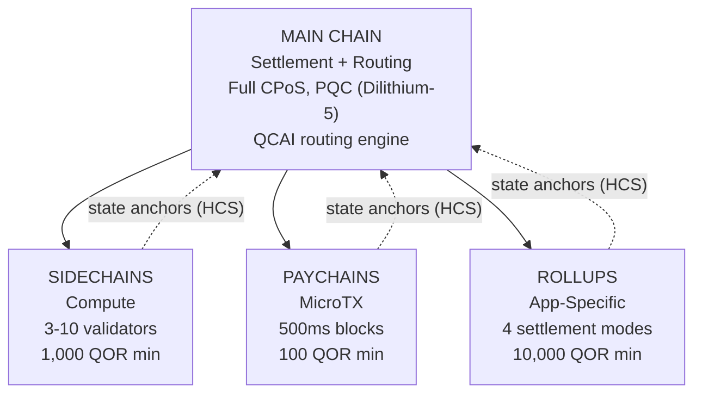

# Multilayer-Architektur

QoreChain implementiert über das Modul `x/multilayer` eine **hierarchische 4-Schichten-Chain-Architektur**. Die Hauptchain dient als Settlement- und Trust-Root, während die untergeordneten Schichten (Sidechains, Paychains und Rollups) spezialisierte Workloads mit unterschiedlichen Kompromissen zwischen Performance und Sicherheit verarbeiten.

---

## Systemüberblick

Die nachfolgende 4-Schichten-Hierarchie zeigt die Hauptchain als Settlement- und Trust-Root, wobei drei untergeordnete Schichttypen ihre State-Roots über Hierarchical Commitment Schemes (HCS) an sie zurück verankern.



```
                    +---------------------------+
                    |       MAIN CHAIN          |
                    |  (Settlement + Routing)   |
                    |  Full CPoS consensus      |
                    |  PQC-secured (Dilithium-5)|
                    |  QCAI routing engine       |
                    +------+------+------+------+
                           |      |      |
              +------------+      |      +------------+
              |                   |                    |
    +---------v--------+ +-------v--------+ +---------v---------+
    |   SIDECHAINS     | |   PAYCHAINS    | |     ROLLUPS       |
    |  (Compute)       | |  (MicroTX)     | |  (App-Specific)   |
    |  3-10 validators | |  500ms blocks  | |  4 settlement     |
    |  1,000 QOR min   | |  100 QOR min   | |    modes          |
    |  Max: 10         | |  Max: 50       | |  10,000 QOR min   |
    +------------------+ +----------------+ |  Max: 100         |
                                            +-------------------+
```

---

## Schichttypen

### Hauptchain

Die Hauptchain ist der Trust-Root für das gesamte QoreChain-Ökosystem.

| Eigenschaft | Wert                                                                          |
| ---------- | ------------------------------------------------------------------------------ |
| Konsens    | Full Triple-Pool CPoS (siehe [Konsensmechanismus](/architecture/consensus-mechanism)) |
| Sicherheit | PQC-gesichert mit Dilithium-5-Signaturen                                        |
| Rolle      | Settlement-Schicht, Speicherung von State-Anchors, QCAI-Routing-Engine, Trust-Root |
| Blockzeit  | \~5 Sekunden                                                                    |

Alle untergeordneten Schichten verankern ihre State-Roots periodisch über Hierarchical Commitment Schemes (HCS) an der Hauptchain.

### Sidechains

Sidechains verarbeiten **rechenintensive Operationen** wie DeFi-Protokolle, Gaming-Engines und IoT-Datenverarbeitung.

| Parameter                 | Wert              |
| ------------------------- | ----------------- |
| Mindestanzahl Validatoren | 3                 |
| Maximalanzahl Validatoren | 10                |
| Mindest-Stake des Erstellers | 1,000 QOR      |
| Maximal aktive Sidechains | 10                |
| Zieldomänen               | DeFi, Gaming, IoT |

### Paychains

Paychains sind für **hochfrequente Mikrotransaktionen** mit minimaler Latenz optimiert.

| Parameter                | Wert                                    |
| ------------------------ | --------------------------------------- |
| Ziel-Blockzeit           | 500 ms                                  |
| Maximal aktive Paychains | 50                                      |
| Mindest-Stake des Erstellers | 100 QOR                             |
| Zieldomänen              | Zahlungen, Streaming, Mikrotransaktionen |

### Rollups

Rollups sind **anwendungsspezifische Chains**, die über das Rollup Development Kit (`x/rdk`) bereitgestellt werden. Sie registrieren sich innerhalb des Multilayer-Moduls als Schichttyp Rollup.

| Parameter              | Wert                                        |
| ---------------------- | ------------------------------------------- |
| Settlement-Modi        | 4 (optimistic, zk, based, sovereign)        |
| Maximal aktive Rollups | 100                                         |
| Mindest-Stake des Erstellers | 10,000 QOR                            |
| Schichttyp             | `rollup`                                    |
| Zieldomänen            | DeFi, Gaming, NFT, Enterprise               |

Die Bereitstellung und Konfiguration von Rollups wird ausführlich im [Rollup Development Kit](/architecture/rollup-development-kit) behandelt.

---

## QCAI-Transaktions-Routing

Der QCAI-Router bewertet für jede eingehende Transaktion alle aktiven Schichten und wählt das optimale Ziel anhand eines gewichteten Bewertungsmodells mit 4 Faktoren aus.

### Bewertungsformel

Jede Kandidatenschicht erhält einen zusammengesetzten Score (höher ist besser):

```
Score = w_congestion * (1 - Congestion) + w_capability * Capability + w_cost * (1 - Cost) + w_latency * (1 - Latency)
```

| Faktor     | Gewicht | Beschreibung                                                                |
| ---------- | ------ | --------------------------------------------------------------------------- |
| Congestion | 0.30   | Aktuelles Lastniveau (invertiert: geringere Auslastung = höherer Score)     |
| Capability | 0.40   | Wie gut die Schicht zu den Transaktionsanforderungen passt                  |
| Cost       | 0.20   | Gebührenmultiplikator relativ zur Hauptchain (invertiert: geringere Kosten = höherer Score) |
| Latency    | 0.10   | Erwartete Zeit bis zur Finalität (invertiert: geringere Latenz = höherer Score) |

### Konfidenzschwelle

Der Router benötigt einen Mindestkonfidenz-Score von **0.6**, bevor er eine Transaktion an eine untergeordnete Schicht weiterleitet. Erfüllt keine Schicht diese Schwelle, wird die Transaktion standardmäßig an die Hauptchain geleitet.

Der Transaktionssender kann einen Hinweis auf eine bevorzugte Schicht angeben. Erreicht die bevorzugte Schicht mindestens 80 % der Konfidenzschwelle (d. h. 0.48), wird sie als Routing-Ziel akzeptiert.

### Payload-Heuristiken

Wenn keine detaillierten Transaktionsmetadaten verfügbar sind, verwendet der Router die Payload-Größe als Klassifizierungssignal:

| Payload-Größe     | Bevorzugte Schicht | Begründung                                  |
| ----------------- | --------------- | -------------------------------------------- |
| &lt; 256 bytes    | Paychain        | Wahrscheinlich ein einfacher Transfer oder eine Mikrotransaktion |
| 256 - 1,024 bytes | Main Chain      | Standardmäßige Transaktionskomplexität       |
| > 1,024 bytes     | Sidechain       | Wahrscheinlich eine komplexe Contract-Interaktion |

---

## Hierarchical Commitment Schemes (HCS)

Untergeordnete Schichten committen ihren State periodisch über **State-Anchors** an die Hauptchain. Jeder Anchor enthält einen kryptografischen Nachweis des States der untergeordneten Chain auf einer bestimmten Höhe.

### Inhalt eines Anchors

| Feld                      | Beschreibung                                         |
| ------------------------- | ---------------------------------------------------- |
| `layer_id`                | Identifier der untergeordneten Schicht               |
| `layer_height`            | Blockhöhe auf der untergeordneten Chain              |
| `state_root`              | Merkle-Root des State-Baums der untergeordneten Chain |
| `validator_set_hash`      | Hash des Validator-Sets, das das Commitment signiert hat |
| `pqc_aggregate_signature` | Dilithium-5-Aggregatsignatur über die Anchor-Daten   |
| `transaction_count`       | Anzahl der Transaktionen seit dem letzten Anchor     |
| `compressed_state_proof`  | Komprimierter State-Transition-Proof                 |

### Übermittlung von Anchors

Anchors werden über `MsgAnchorState` an die Hauptchain übermittelt. Der Keeper validiert den Anchor anhand der folgenden Schritte:

1. **Schicht existiert und ist aktiv** — Der Keeper prüft, dass die Schicht im State existiert und aktuell den Status `active` hat.
2. **Mindest-Anchor-Intervall verstrichen** — Der Keeper prüft, dass seit dem letzten Anchor dieser Schicht mindestens `min_anchor_interval` Blöcke (Standard: 100) verstrichen sind.
3. **PQC-Aggregatsignatur** — Der Keeper stellt sicher, dass die PQC-Aggregatsignatur vorhanden und für die Anchor-Daten gültig ist.

### Challenge-Periode

Jeder Anchor durchläuft eine **Challenge-Periode** von **24 Stunden** (86,400 Sekunden, pro Schicht konfigurierbar). Während dieser Periode kann jede Partei den Anchor anfechten, indem sie über `MsgChallengeAnchor` einen Fraud-Proof einreicht. Ist der Fraud-Proof gültig, wird der Anchor für ungültig erklärt und der State der untergeordneten Chain auf den vorherigen Anchor zurückgesetzt.

Läuft die Challenge-Periode ohne erfolgreiche Anfechtung ab, gilt der Anchor als finalisiert.

### Lesen von Anchors

Seit der Chain-Version **v3.1.80** sind Anchors auch über den Multilayer-Query-Service **lesbar**. Zwei Queries stellen den Anchor-State sowohl über gRPC als auch über REST bereit:

* **`Anchor`** (`/qorechain/multilayer/v1/anchor/{layer_id}`) — gibt den neuesten finalisierten State-Anchor einer Schicht zurück.
* **`Anchors`** (`/qorechain/multilayer/v1/anchors/{layer_id}`) — gibt die Anchor-Historie einer Schicht zurück.

Da jeder Anchor eine Dilithium-5-Signatur über die kanonische Nachricht `layer_id || layer_height || state_root || validator_set_hash` trägt (verifiziert gegen den registrierten PQC-Schlüssel des Schicht-Erstellers), kann ein Client einen Anchor abrufen und ihn **offline** verifizieren, ohne dem ausliefernden Node vertrauen zu müssen. Dies ist das On-Chain-Primitiv hinter den [quantensicheren Settlement-Receipts](/rollups/settlement-receipts) des Rollup Development Kits.

---

## Cross-Layer Fee Bundling (CLFB)

CLFB ermöglicht es, mit einer einzigen Gebührenzahlung auf der Quellschicht die Ausführung über mehrere Schichten in einem schichtübergreifenden Transaktionspfad abzudecken.

### Gebührenberechnung

```
avgMultiplier = sum(layer_multiplier_i) / num_layers
bundledFee = (totalGas / 1000) * avgMultiplier
```

Dabei gilt:

* `layer_multiplier_i` ist der Basis-Gebührenmultiplikator für jede Schicht im Transaktionspfad (Hauptchain = 1.0).
* `totalGas` ist der geschätzte Gesamt-Gasverbrauch über alle Schichten.
* Das Ergebnis wird in **uqor** angegeben, mit einer Mindestgebühr von 1 uqor.

### Beispiel

Eine schichtübergreifende Transaktion berührt drei Schichten: Hauptchain (Multiplikator 1.0), eine Sidechain (Multiplikator 0.5) und eine Paychain (Multiplikator 0.1).

```
avgMultiplier = (1.0 + 0.5 + 0.1) / 3 = 0.533
bundledFee = (150,000 / 1000) * 0.533 = 80 uqor
```

CLFB kann global über den Parameter `cross_layer_fee_bundling` aktiviert oder deaktiviert werden, und einzelne Schichten können sich über ihr Konfigurations-Flag `cross_layer_fee_bundling_enabled` davon abmelden.

---

## Lebenszyklus einer Schicht

Jede untergeordnete Schicht durchläuft einen klar definierten Lebenszyklus:

```
Proposed --> Active --> Suspended --> Decommissioned
                  \                /
                   +-- Active <--+
```

| Status             | Beschreibung                                                                    | Erlaubte Übergänge        |
| ------------------ | ------------------------------------------------------------------------------- | ------------------------- |
| **Proposed**       | Schicht wurde registriert, aber noch nicht aktiviert                            | Active, Decommissioned    |
| **Active**         | Schicht ist betriebsbereit und nimmt Transaktionen an                           | Suspended, Decommissioned |
| **Suspended**      | Schicht ist vorübergehend pausiert (z. B. für Wartung oder aus Sicherheitsgründen) | Active, Decommissioned |
| **Decommissioned** | Schicht ist dauerhaft abgeschaltet (Endzustand)                                 | Keine                     |

Statusübergänge werden vom Keeper durchgesetzt. Ungültige Übergänge (z. B. von Decommissioned zu Active) werden abgelehnt.

---

## Parameter

| Parameter                      | Typ    | Standard        | Beschreibung                                           |
| ------------------------------ | ------ | --------------- | ------------------------------------------------------- |
| `max_sidechains`               | uint64 | `10`            | Maximale Anzahl aktiver Sidechains                      |
| `max_paychains`                | uint64 | `50`            | Maximale Anzahl aktiver Paychains                       |
| `min_anchor_interval`          | uint64 | `100`           | Mindestanzahl Blöcke zwischen State-Anchors             |
| `max_anchor_interval`          | uint64 | `1,000`         | Maximalanzahl Blöcke zwischen State-Anchors (erzwungener Anchor) |
| `default_challenge_period`     | uint64 | `86,400`        | Standard-Challenge-Periode in Sekunden (24 Stunden)     |
| `min_sidechain_stake`          | string | `1,000,000,000` | Mindest-Stake zur Erstellung einer Sidechain (1,000 QOR in uqor) |
| `min_paychain_stake`           | string | `100,000,000`   | Mindest-Stake zur Erstellung einer Paychain (100 QOR in uqor) |
| `routing_enabled`              | bool   | `true`          | QCAI-basiertes Transaktions-Routing aktivieren          |
| `routing_confidence_threshold` | string | `0.6`           | Mindestkonfidenz für QCAI-Routing-Entscheidungen        |
| `cross_layer_fee_bundling`     | bool   | `true`          | Globales Cross-Layer Fee Bundling aktivieren            |
