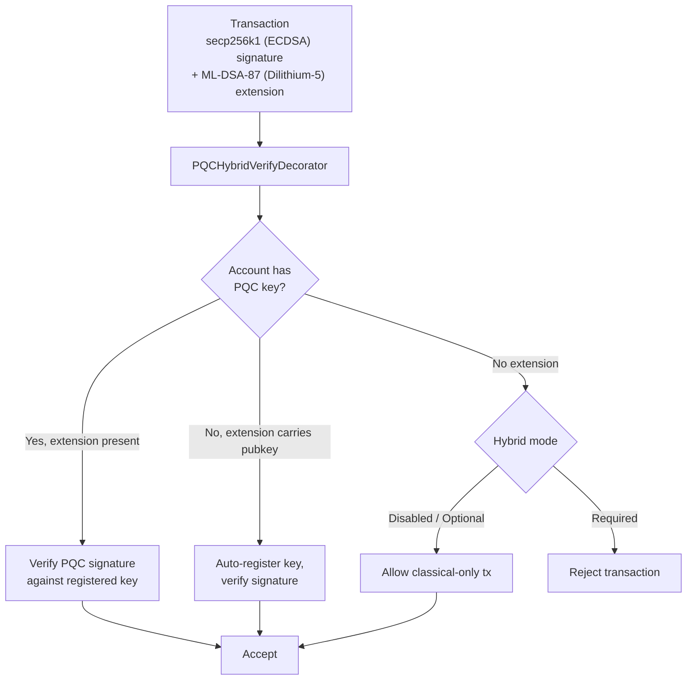

# Post-Quantum-Sicherheit

QoreChain ist **von Anfang an (at genesis) mit Post-Quantum-Kryptografie (PQC) gebaut** — nicht nachträglich als Upgrade ergänzt. Das Modul `x/pqc` stellt gitterbasierte digitale Signaturen und Schlüsselkapselung als primäre kryptografische Primitive bereit, ergänzt um ein per Governance gesteuertes Framework für Algorithmusagilität zur langfristigen Resilienz.

Die vollständige PQC-Baseline — **Dilithium-5 (Signaturen) + ML-KEM-1024 (KEM) + SHAKE-256 (Hash)** — ist nun vollständig und der Netzwerkstandard. Ab der aktuellen Chain-Version (**v3.1.80**) sind Hybridsignaturen auf dem Cosmos-Transaktionspfad **standardmäßig erforderlich**: `hybrid_signature_mode = required` und `allow_classical_fallback = false`. Jede Transaktion auf dem Cosmos-Pfad muss eine Dilithium-5-Signatur zusätzlich zu ihrer klassischen secp256k1-Signatur tragen; rein klassische Transaktionen von einem PQC-Konto werden abgelehnt, und der klassische Downgrade-Pfad ist geschlossen.

## Designprinzipien

* **PQC standardmäßig erforderlich**: Post-Quantum-Signaturen sind auf dem Cosmos-Pfad verpflichtend. Klassische secp256k1-Signaturen allein genügen nicht mehr — `allow_classical_fallback = false`.
* **Hybrid als Standard**: Cosmos-Transaktionen tragen gleichzeitig sowohl eine klassische secp256k1-Signatur als auch eine Dilithium-5-PQC-Signatur. Der rein klassische Fallback ist geschlossen.
* **Algorithmusagilität**: Das Register der kryptografischen Algorithmen wird per Governance gesteuert, sodass das Netzwerk neue Algorithmen einführen oder kompromittierte ohne Hard Forks ausmustern kann.
* **Deterministische Verifizierung**: Die gesamte Signaturverifizierung ist deterministisch und über alle Validatorenknoten hinweg reproduzierbar.

## Unterstützte Algorithmen

| Algorithmus       | Standard             | Kategorie          | NIST-Level | Öffentlicher Schlüssel  | Privater Schlüssel | Signatur / Chiffrat | Geteiltes Geheimnis |
| --------------- | -------------------- | ----------------- | ---------- | ----------- | ----------- | ---------------------- | ------------- |
| **Dilithium-5** | ML-DSA-87 (FIPS 204) | Signatur         | 5          | 2,592 bytes | 4,896 bytes | 4,627 bytes            | --            |
| **ML-KEM-1024** | FIPS 203             | Schlüsselkapselung | 5          | 1,568 bytes | 3,168 bytes | 1,568 bytes            | 32 bytes      |

Beide Algorithmen arbeiten auf **NIST-Sicherheitslevel 5**, der höchsten standardisierten Sicherheitskategorie, und bieten einen Schutz, der gegen sowohl klassische als auch Quantenangreifer dem von AES-256 entspricht.

## Kryptografisches Backend

PQC-Operationen sind in einem performanten, speichersicheren kryptografischen Backend implementiert, das gitterbasiertes Signieren, Verifizieren und Schlüsselkapselung für die QoreChain-Laufzeitumgebung bereitstellt. Das Backend bietet:

Algorithmus-spezifische Operationen:

* Dilithium-5-Schlüsselerzeugung, -Signierung und -Verifizierung
* ML-KEM-1024-Schlüsselerzeugung, -Kapselung und -Entkapselung
* Deterministische Random-Beacon-Generierung (`seed`, `epoch`)

Algorithmus-bewusste Operationen:

* `Keygen(algorithmID)` — Schlüsselpaar für jeden registrierten Algorithmus erzeugen
* `Sign(algorithmID, privkey, message)` — Signatur erstellen
* `Verify(algorithmID, pubkey, message, signature)` — Signatur verifizieren
* `AlgorithmInfo(algorithmID)` — Schlüssel-/Ausgabegrößen abfragen
* `ListAlgorithms()` — Alle unterstützten Algorithmen auflisten

Alle Signier- und Verifizierungsoperationen sind deterministisch und erzeugen über jeden Validatorknoten und jede unterstützte Plattform hinweg identische Ergebnisse.

Dieselben Primitive — ML-DSA (FIPS-204), ML-KEM (FIPS-203) und SHAKE-256 (FIPS-202) — stehen Wallets und Integratoren über die quelloffene Bibliothek [**qorechain-pqc**](https://github.com/qorechain/qorechain-pqc) zur Verfügung, die eine konsistente, byte-kompatible API über sechs Sprachen (JavaScript/TypeScript, Rust, Go, C, Python, Java) bereitstellt. Siehe [Post-Quantum Signing](/developer-guide/post-quantum-signing).

## Schlüsselregistrierung

Konten registrieren PQC-Schlüssel über `MsgRegisterPQCKey` (Legacy, standardmäßig Dilithium-5) oder `MsgRegisterPQCKeyV2` (algorithmus-bewusst). Jede Nachricht enthält:

* **Sender**: Die Kontoadresse, die den Schlüssel registriert.
* **PublicKey**: Die Bytes des öffentlichen PQC-Schlüssels.
* **AlgorithmID**: Die Kennung des PQC-Algorithmus (nur v2).
* **KeyType**: Einer von drei Registrierungsmodi:

| Schlüsseltyp         | Beschreibung                                                              |
| ---------------- | ------------------------------------------------------------------------ |
| `hybrid`         | Sowohl klassischer (ECDSA) als auch PQC-Schlüssel. Transaktionen tragen Doppelsignaturen. |
| `pqc_only`       | Nur PQC-Schlüssel. Eine klassische Signatur ist nicht erforderlich.                       |
| `classical_only` | Nur klassischer Schlüssel. Kein PQC-Schutz (nicht empfohlen).                 |

## Hybridsignaturen

Das Hybridsignatursystem verlangt, dass Cosmos-Pfad-Transaktionen gleichzeitig **sowohl** eine klassische Signatur als auch eine PQC-Signatur tragen. Dies bietet Defense-in-Depth: Selbst wenn ein Verfahren gebrochen wird, schützt das andere die Transaktion.

Mit dem Netzwerkstandard `hybrid_signature_mode = required` muss jede Cosmos-Pfad-Transaktion die Dilithium-5-Erweiterung zusätzlich zur secp256k1-Signatur enthalten. Die einzigen Ausnahmen (für das Bootstrapping) sind **Genesis-Gentxs (Höhe 0)** und **Transaktionen zur PQC-Schlüsselregistrierung/-migration** (`MsgRegisterPQCKey`, `MsgRegisterPQCKeyV2`, `MsgMigratePQCKey`), die rein klassisch sein dürfen, damit Konten ihren ersten PQC-Schlüssel registrieren können.

**EVM-Transaktionen sind nicht betroffen.** EVM-Transaktionen werden auf einem separaten `eth_secp256k1`-Ante-Pfad (dem Pfad der QoreChain EVM Engine) authentifiziert und benötigen niemals die Hybrid-PQC-Erweiterung. Die Hybrid-Anforderung gilt nur für den Cosmos-Transaktionspfad.

### Cosign-Ablauf

Um eine konforme Cosmos-Transaktion zu erzeugen, wird die klassische secp256k1-Signatur über die Standard-Sign-Bytes berechnet (die die PQC-Erweiterung ausschließen), und eine Dilithium-5-Signatur wird berechnet und als Erweiterung `PQCHybridSignature` angehängt. Standardmäßiges CosmJS-/Relayer-Tooling muss diese Erweiterung erzeugen, um auf dem Cosmos-Pfad zu transagieren. Heute geschieht dies über:

* `qorechaind tx pqc gen-key` — einen Dilithium-5-Schlüssel erzeugen.
* `qorechaind tx pqc cosign` — die Dilithium-5-Cosignatur an eine Transaktion anhängen.
* Das Hybrid-Signing des QoreChain SDK — `buildHybridTx` mit `includePqcPublicKey` (bettet den öffentlichen PQC-Schlüssel zur automatischen Registrierung bei der ersten Verwendung ein).

*Eine Transaktion, die mit secp256k1 (ECDSA) plus ML-DSA-87 (Dilithium-5) signiert und vom Ante-Handler im chainweiten Durchsetzungsmodus verifiziert wird.*



### Format der TX-Erweiterung

PQC-Signaturen werden Transaktionen als **TX-Erweiterung** mit der Type-URL `/qorechain.pqc.v1.PQCHybridSignature` angehängt:

```text
{
  "algorithm_id": 1,
  "pqc_signature": "<4627 bytes for Dilithium-5>",
  "pqc_public_key": "<2592 bytes, optional>"
}
```

Das Feld `pqc_public_key` ist optional. Ist es vorhanden und hat das Konto keinen registrierten PQC-Schlüssel, **registriert** der Ante-Handler den Schlüssel bei der ersten Verwendung **automatisch**.

### PQCHybridVerifyDecorator

Der Ante-Handler `PQCHybridVerifyDecorator` verarbeitet Hybridsignaturen mit einer dreifachen Verifizierungslogik:

| Szenario | Konto hat PQC-Schlüssel | Erweiterung vorhanden | Öffentlicher Schlüssel in Erweiterung | Ergebnis                                              |
| -------- | ------------------- | ----------------- | ----------------------- | --------------------------------------------------- |
| Pfad 1   | Ja                 | Ja               | --                      | PQC-Signatur gegen registrierten Schlüssel verifizieren         |
| Pfad 2   | Nein                  | Ja               | Ja                     | Schlüssel automatisch registrieren, Signatur verifizieren                 |
| Pfad 3a  | Nein                  | Nein                | --                      | **Optional-Modus**: Rein klassische Transaktion zulassen |
| Pfad 3b  | Nein                  | Nein                | --                      | **Required-Modus**: Transaktion ablehnen               |
| Pfad 4   | Ja                 | Nein                | --                      | Wird vom Standard-PQCVerifyDecorator behandelt          |

### Hybridsignatur-Modi

Das chainweite Hybrid-Durchsetzungslevel ist per Governance konfigurierbar. Der **aktuelle Netzwerkstandard ist `required`**:

| Modus         | ID | Standard | Verhalten                                                                                                          |
| ------------ | -- | ------- | ----------------------------------------------------------------------------------------------------------------- |
| **Disabled** | 0  | Nein      | Nur klassische Signaturen. PQC-Erweiterungen werden ignoriert.                                            |
| **Optional** | 1  | Nein      | PQC-Erweiterungen werden verifiziert, sofern vorhanden. Konten ohne PQC-Schlüssel dürfen nur mit klassischen Signaturen transagieren.    |
| **Required** | 2  | **Ja** | Alle Cosmos-Pfad-Transaktionen müssen sowohl klassische als auch PQC-Signaturen tragen. Transaktionen ohne PQC-Erweiterung werden abgelehnt. |

Das Netzwerk hat seine Migration abgeschlossen: **Optional** (Genesis) → **Required** (der aktuelle Standard seit v3.1.71, mit `allow_classical_fallback = false`). Die drei Modi bleiben per Governance gesteuert und können per Proposal angepasst werden.

## Framework für Algorithmusagilität

Das Framework für Algorithmusagilität stellt ein per Governance gesteuertes Register für PQC-Algorithmen bereit, das es dem Netzwerk ermöglicht, neue Algorithmen hinzuzufügen, anfällige auszumustern und Konten zu migrieren — alles ohne Hard Forks.

### Algorithmus-Lebenszyklus

Jeder registrierte Algorithmus hat einen Lebenszyklusstatus:

```
active --> migrating --> deprecated --> disabled
```

| Status         | Beschreibung                                                                                                                                 |
| -------------- | ------------------------------------------------------------------------------------------------------------------------------------------- |
| **Active**     | Voll funktionsfähig. Neue Schlüsselregistrierungen und Verifizierungen werden akzeptiert.                                                                    |
| **Migrating**  | Die Doppelsignaturphase ist aktiv. Konten werden ermutigt, zum Ersatzalgorithmus zu migrieren. Sowohl alte als auch neue Signaturen werden akzeptiert. |
| **Deprecated** | Bestehende Signaturen können weiterhin verifiziert werden, aber keine neuen Schlüsselregistrierungen werden akzeptiert.                                                       |
| **Disabled**   | Notfall-Kill-Switch. Der Algorithmus kann keine Signaturen verifizieren. Wird verwendet, wenn eine Schwachstelle entdeckt wird.                                 |

### Doppelsignatur-Migration

Wenn ein Algorithmus ausgemustert wird, beginnt eine **Migrationsperiode** (Standard: 1.000.000 Blöcke, etwa 69 Tage bei 6 s/Block). Während dieser Periode:

1. Konten mit Schlüsseln, die den ausgemusterten Algorithmus verwenden, müssen zum Ersatz migrieren.
2. Die Migration erfordert Doppelsignaturen (`MsgMigratePQCKey`): eine vom alten und eine vom neuen Schlüssel, die den Besitz beider nachweisen.
3. Während der gesamten Migrationsperiode werden beide Algorithmen zur Verifizierung akzeptiert.

### Governance-Nachrichten

| Nachricht                 | Beschreibung                                                                                                                                                       |
| ----------------------- | ----------------------------------------------------------------------------------------------------------------------------------------------------------------- |
| `MsgAddAlgorithm`       | Schlägt vor, dem Register einen neuen PQC-Algorithmus hinzuzufügen. Enthält vollständige `AlgorithmInfo` (Name, Kategorie, NIST-Level, Schlüsselgrößen). Muss über Governance eingereicht werden. |
| `MsgDeprecateAlgorithm` | Startet den Ausmusterungsprozess für einen Algorithmus. Gibt den Ersatzalgorithmus und die Migrationsperiode in Blöcken an.                                              |
| `MsgDisableAlgorithm`   | Deaktiviert einen Algorithmus sofort im Notfall. Erfordert einen Begründungsstring. Wird verwendet, wenn eine kryptografische Schwachstelle entdeckt wird.                                     |

### Erweiterbarkeit

Das Hinzufügen eines neuen Algorithmus erfordert:

1. Implementierung des Algorithmus im kryptografischen Backend hinter der einheitlichen Signier- und Verifizierungsschnittstelle.
2. Einreichung eines `MsgAddAlgorithm`-Governance-Proposals mit den Algorithmus-Metadaten.
3. Nach der Genehmigung steht der Algorithmus für Schlüsselregistrierung und Verifizierung zur Verfügung.

## SHAKE-256-Hash

Ab v3.1.73 ist **SHAKE-256** (Extendable-Output-Funktion von SHA-3) der **Standard-Anwendungs-Hash** in QoreChain — bereitgestellt durch das Paket `qorehash` — und vervollständigt die quantenresistente kryptografische Baseline neben den Dilithium-5-Signaturen und der ML-KEM-1024-Schlüsselkapselung. Das Modul `x/pqc` stellt reine Go-SHAKE-256-Utilities bereit:

| Funktion                           | Beschreibung                       | Ausgabe           |
| ---------------------------------- | --------------------------------- | ---------------- |
| `SHAKE256Hash(data, outputLen)`    | SHAKE-256-Digest variabler Länge  | Beliebige Länge |
| `SHAKE256Hash32(data)`             | Standard-256-Bit-SHAKE-256-Digest | 32 bytes         |
| `SHAKE256ConcatHash(left, right)`  | Hash verketteter Eingaben       | 32 bytes         |
| `SHAKE256DomainHash(domain, data)` | Domänenseparierter Hash             | 32 bytes         |

Diese Utilities bilden die Grundlage des Standard-Anwendungs-Hashes und werden verwendet für:

* Hashing von Merkle-Tree-Knoten
* Hash-Commitments in ebenenübergreifenden Attestierungen
* Domänenseparierung für verschiedene Hash-Kontexte (z. B. `"leaf:"` vs. `"node:"`)

## Bridge-PQC

Alle Cross-Chain-Bridge-Attestierungen und State-Commitments verwenden **Dilithium-5**-Signaturen. Das Modul `x/multilayer` verlangt PQC-Aggregatsignaturen bei jeder `MsgAnchorState`-Übermittlung, und ML-KEM-Commitments sichern die Schlüsselaustauschkanäle zwischen Bridge-Relayern ab.

Dies stellt sicher, dass die Cross-Chain-Sicherheit nicht durch die Verwendung klassischer Kryptografie in der Bridge-Infrastruktur beeinträchtigt wird, und erhält die Quantenresistenz über den gesamten Protokoll-Stack hinweg.

## Modulparameter

| Parameter                  | Typ                | Standard           | Beschreibung                                           |
| -------------------------- | ------------------- | ----------------- | ----------------------------------------------------- |
| `pqc_primary`              | bool                | `true`            | PQC ist das primäre Signaturverfahren                   |
| `allow_classical_fallback` | bool                | `false`           | Rein klassischer Fallback ist geschlossen; Cosmos-Txs müssen hybrid sein |
| `min_security_level`       | int32               | `5`               | Minimales NIST-Sicherheitslevel für akzeptierte Algorithmen   |
| `default_migration_blocks` | int64               | `1,000,000`       | Standard-Doppelsignatur-Migrationsperiode in Blöcken     |
| `default_signature_algo`   | AlgorithmID         | `1` (Dilithium-5) | Standard-Signaturalgorithmus für neue Schlüsselregistrierungen |
| `hybrid_signature_mode`    | HybridSignatureMode | `2` (Required)    | Chainweites Durchsetzungslevel für Hybridsignaturen         |

## Verwandt

* [Post-Quantum Signing](/developer-guide/post-quantum-signing) — die quelloffene Bibliothek `qorechain-pqc` (sechs Sprachen) für diese Primitive und das Hybrid-Signing.
* [Wallet Setup](/getting-started/wallet-setup) — PQC-gestützte Konten erstellen und verwalten.
* [SDK Accounts & PQC signing](/sdk/concepts/accounts-pqc) — Schlüssel und Post-Quantum-Signing aus dem Code.
* [Chain Parameters](/appendix/chain-parameters) — Standardalgorithmen und Migrationseinstellungen.
* [Bridge Architecture](/architecture/bridge-architecture) — PQC-Verifizierung auf Cross-Chain-Paketen.
