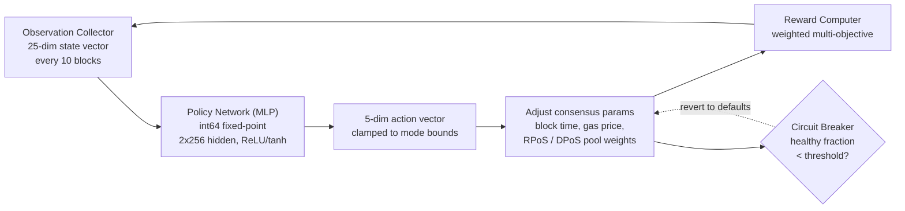

# PRISM Consensus Engine

QoreChain bettet **PRISM** (Policy-driven Reinforcement-learning for Intelligent State Machines), eine Optimierungsschicht auf Basis von Reinforcement Learning, über das Modul `x/rlconsensus` direkt in die Konsensschicht ein. PRISM beobachtet alle N Blöcke Chain-Metriken, führt die Inferenz durch ein neuronales Netz mit Festkomma-Arithmetik aus und schlägt Anpassungen der Konsensparameter vor — alles deterministisch, ohne Gleitkommaarithmetik in konsenskritischen Pfaden.

*Die PRISM-Optimierungsschleife: Chain-Zustand beobachten, Policy-Inferenz ausführen, Parameteränderungen begrenzen und anwenden, dann das Ergebnis zurückspeisen.*



---

## Architekturüberblick

PRISM besteht aus vier Komponenten:

1. **Observation Collector** — Erfasst 25-dimensionale Chain-Zustandsvektoren in konfigurierbaren Intervallen.
2. **Policy Network (MLP)** — Ein Go-natives Multi-Layer-Perceptron, das Beobachtungen auf Aktionen abbildet.
3. **Reward Computer** — Bewertet die Qualität von Parameteränderungen über eine gewichtete Multi-Ziel-Funktion.
4. **Circuit Breaker** — Überwacht die Chain-Gesundheit und setzt alle von PRISM angepassten Parameter zurück, falls Instabilität erkannt wird.

Alle Komponenten arbeiten innerhalb des ABCI-Lebenszyklus und erzeugen deterministische, verifizierbare Ausgaben über alle Validatorenknoten hinweg.

---

## Policy Network

Das Policy Network ist ein Feedforward-Multi-Layer-Perceptron (MLP), das vollständig in Go mit **int64-Festkomma-Arithmetik** (skaliert mit 10^8) implementiert ist.

### Netzarchitektur

| Eigenschaft            | Wert                              |
| ------------------- | ---------------------------------- |
| Eingabedimensionen    | 25                                 |
| Versteckte Schichten       | 2                                  |
| Größen der versteckten Schichten  | 256, 256                           |
| Ausgabedimensionen   | 5                                  |
| Aktivierung (versteckt) | ReLU                               |
| Aktivierung (Ausgabe) | tanh                               |
| Parameter insgesamt    | 73,733                             |
| Präzision           | int64-Festkomma (skaliert mit 10^8) |

### Aufschlüsselung der Parameteranzahl

```
Layer 1: 25 * 256 + 256   =  6,656  (input -> hidden_1)
Layer 2: 256 * 256 + 256   = 65,792  (hidden_1 -> hidden_2)
Layer 3: 256 * 5 + 5       =  1,285  (hidden_2 -> output)
Total:                       73,733
```

### Festkomma-Arithmetik

Alle MLP-Berechnungen verwenden `int64`-Werte, skaliert mit `FixedPointScale = 10^8`. Dies eliminiert Nichtdeterminismus durch IEEE-754-Gleitkommarundungsunterschiede über verschiedene Hardwareplattformen hinweg.

* **Multiplikation**: `fixMul(a, b) = (a / SCALE) * b + (a % SCALE) * b / SCALE` (aufgeteilt, um Überlauf zu verhindern)
* **ReLU**: `relu(x) = max(0, x)`
* **tanh**: Padé-Approximant `tanh(x) ~ x * (3*S - x^2) / (3*S + x^2)` für `|x| <= 2.5*SCALE`, andernfalls auf +/- SCALE begrenzt

Die Policy-Gewichte werden on-chain als abgeflachter `[]int64`-Vektor gespeichert und können per Governance-Proposal aktualisiert werden.

---

## Beobachtungsvektor

PRISM erfasst bei jedem Beobachtungsintervall (Standard: alle 10 Blöcke) einen 25-dimensionalen Beobachtungsvektor.

| Index | Dimension              | Beschreibung                                      |
| ----- | ---------------------- | ------------------------------------------------ |
| 0     | `block_utilization`    | Verbrauchtes Block-Gas / Block-Gas-Limit                 |
| 1     | `tx_count`             | Anzahl der Transaktionen im Block              |
| 2     | `avg_tx_size`          | Mittlere Transaktionsgröße in Bytes              |
| 3     | `block_time`           | Zeit seit dem vorherigen Block (ms)                   |
| 4     | `block_time_delta`     | Blockzeit minus Ziel-Blockzeit (ms)          |
| 5     | `gas_price_50th`       | Median-Gaspreis                                 |
| 6     | `gas_price_95th`       | Gaspreis im 95. Perzentil                        |
| 7     | `mempool_size`         | Anzahl der ausstehenden Transaktionen                   |
| 8     | `mempool_bytes`        | Gesamtbytes der ausstehenden Transaktionen              |
| 9     | `validator_count`      | Anzahl aktiver Validatoren                           |
| 10    | `validator_gini`       | Gini-Koeffizient der Verteilung der Validator-Power |
| 11    | `missed_block_ratio`   | Anteil der Validatoren, die das Signieren verpasst haben       |
| 12    | `avg_commit_latency`   | Durchschnittliche Latenz der Commit-Runde (ms)                |
| 13    | `max_commit_latency`   | Maximale Latenz der Commit-Runde (ms)                |
| 14    | `precommit_ratio`      | Anteil der empfangenen Precommits                    |
| 15    | `failed_tx_ratio`      | Anteil der fehlgeschlagenen Transaktionen                   |
| 16    | `avg_gas_per_tx`       | Mittleres verbrauchtes Gas pro Transaktion                 |
| 17    | `reward_per_validator` | Mittlere Belohnung pro Validator (uqor)                 |
| 18    | `slash_count`          | Anzahl der Slashing-Ereignisse im Beobachtungsfenster  |
| 19    | `jail_count`           | Anzahl der Jail-Ereignisse im Beobachtungsfenster     |
| 20    | `inflation_rate`       | Aktuelle Emissionsrate                            |
| 21    | `bonded_ratio`         | Gebondete Tokens / Gesamtangebot                    |
| 22    | `reputation_mean`      | Mittlerer Reputationswert über aktive Validatoren   |
| 23    | `reputation_stddev`    | Standardabweichung der Reputationswerte             |
| 24    | `mev_estimate`         | Geschätztes extrahiertes MEV (Heuristik)              |

Alle Werte werden als `LegacyDec`-String-Repräsentationen gespeichert und vor der Inferenz in int64-Festkomma umgewandelt.

---

## Aktionsraum

Die MLP-Ausgabe ist ein 5-dimensionaler Aktionsvektor, bei dem jede Dimension eine vorgeschlagene Änderung eines Konsensparameters darstellt. Die tanh-Aktivierung begrenzt die Rohausgaben auf \[-1, 1], die dann mit modusspezifischen Grenzen skaliert werden.

| Index | Aktionsdimension           | Beschreibung                                                             |
| ----- | -------------------------- | ----------------------------------------------------------------------- |
| 0     | `block_time_delta`         | Vorgeschlagene Änderung der Ziel-Blockzeit (ms)                               |
| 1     | `gas_price_delta`          | Vorgeschlagene Änderung des Basis-Gaspreises                                       |
| 2     | `validator_set_size_delta` | Vorgeschlagene Änderung der Ziel-Validatorenmengengröße (nur protokolliert, nicht angewendet) |
| 3     | `pool_weight_rpos_delta`   | Vorgeschlagene Änderung des Prioritätsgewichts des RPoS-Pools                            |
| 4     | `pool_weight_dpos_delta`   | Vorgeschlagene Änderung des Prioritätsgewichts des DPoS-Pools                            |

Aktionen werden vor der Anwendung auf die durch den aktuellen PRISM-Modus definierten maximalen Änderungsgrenzen **begrenzt**.

---

## Belohnungsfunktion

Das Belohnungssignal bewertet, wie gut die jüngsten Parameteränderungen die Chain-Leistung verbessert haben. Es wird als gewichtete Summe von fünf Zielen berechnet:

```
R = 0.30 * delta_throughput
  + 0.25 * delta_finality
  + 0.20 * delta_decentralization
  - 0.15 * mev_estimate
  - 0.10 * failed_tx_ratio
```

| Komponente           | Gewicht | Richtung | Quellmetrik                                 |
| ------------------- | ------ | --------- | --------------------------------------------- |
| Throughput          | +0.30  | Maximieren  | Änderung der Block-Auslastung                   |
| Finality            | +0.25  | Maximieren  | Änderung des Precommit-Anteils                     |
| Dezentralisierung    | +0.20  | Maximieren  | Negative Änderung des Validator-Gini-Koeffizienten |
| MEV                 | -0.15  | Minimieren  | Aktuelle MEV-Schätzung                          |
| Fehlgeschlagene Transaktionen | -0.10  | Minimieren  | Aktueller Anteil fehlgeschlagener Transaktionen              |

Die Belohnungsgewichte sind per Governance konfigurierbar und müssen sich auf genau 1,0 summieren.

---

## PRISM-Modi

PRISM arbeitet in einem von vier Modi, die per Governance gesteuert werden:

| Modus             | ID | Max. Änderung | Verhalten                                                                                   |
| ---------------- | -- | ---------- | ------------------------------------------------------------------------------------------ |
| **Shadow**       | 0  | 0%         | Nur Empfehlungen beobachten und protokollieren. Es werden keine Parameter geändert. Dies ist der Standardmodus. |
| **Conservative** | 1  | +/- 10%    | Parameteränderungen innerhalb enger Grenzen anwenden. Geeignet für den anfänglichen Live-Einsatz.         |
| **Autonomous**   | 2  | +/- 25%    | Parameteränderungen innerhalb weiterer Grenzen anwenden. Für ausgereifte Netzwerke mit validierten Policies.  |
| **Paused**       | 3  | 0%         | PRISM ist vollständig im Leerlauf. Es werden keine Beobachtungen erfasst und keine Inferenz ausgeführt.             |

Modusübergänge erfordern ein Governance-Proposal. Der empfohlene Einsatzpfad ist: Shadow → Conservative → Autonomous.

---

## Circuit Breaker

Der Circuit Breaker ist ein Sicherheitsmechanismus, der die Chain-Gesundheit überwacht und alle von PRISM angepassten Parameter automatisch zurücksetzt, falls Instabilität erkannt wird.

### Erkennungslogik

Der Circuit Breaker wertet die letzten **50 Blöcke** aus (konfigurierbar über `circuit_breaker_window`):

1. **Blockzeit-Deltas berechnen** — Für jedes aufeinanderfolgende Paar von Block-Zeitstempeln das Blockzeit-Delta berechnen.
2. **Gesunde Blöcke klassifizieren** — Ein Block gilt als **gesund**, wenn sein Delta positiv und innerhalb des 2-fachen der Ziel-Blockzeit liegt.
3. **Gesunden Anteil berechnen** — Den **gesunden Anteil** = gesunde Blöcke / Gesamtzahl der Deltas berechnen.

### Auslösebedingung

Fällt der gesunde Anteil unter die Schwelle (Standard: **50%**), löst der Circuit Breaker aus.

### Reaktion

Bei Auslösung führt der Circuit Breaker Folgendes aus:

1. **Setzt** alle von PRISM angewendeten Parameter (Blockzeit, Gaspreis, Pool-Gewichte) auf ihre Standardwerte **zurück**.
2. **Pausiert** PRISM (setzt `CircuitBreakerActive = true`).
3. **Löscht** die In-Memory-Policy, um ein erneutes Laden zu erzwingen.
4. **Emittiert** ein `circuit_breaker_triggered`-Event.

Der Circuit Breaker wird automatisch aufgehoben, wenn sich der gesunde Anteil bei nachfolgenden Auswertungen wieder über die Schwelle erholt.

---

## Rollup-Beratungsfunktionen

PRISM stellt Beratungsfunktionen zur Optimierung von Rollup-Parametern bereit:

* **`SuggestRollupProfile`** — Analysiert die aktuellen Chain-Bedingungen und schlägt optimale Rollup-Konfigurationsparameter vor (Blockzeit, Gas-Limit, Settlement-Frequenz).
* **`OptimizeRollupGas`** — Empfiehlt Anpassungen der Gaspreisgestaltung für Rollup-Settlement-Transaktionen auf Basis der Überlastungsmuster der Hauptchain.

Diese Funktionen sind rein informativ und ändern den Chain-Zustand nicht.

---

## Bibliothek für deterministische Mathematik

Alle PRISM-Berechnungen verwenden das Paket `mathutil`, das deterministische Alternativen zur Standard-Gleitkommamathematik bereitstellt:

| Funktion                  | Beschreibung                 | Methode                                                    |
| ------------------------- | --------------------------- | --------------------------------------------------------- |
| `IntegerSqrt(x)`          | Quadratwurzel                 | Newton-Verfahren auf `LegacyDec`, Konvergenz nach 100 Iterationen |
| `TaylorLn1PlusX(x)`       | Natürlicher Logarithmus `ln(1+x)` | Argumentreduktion + 15-Term-Taylor-Reihe                |
| `ExpApprox(x)`            | Exponential `e^x`           | 12-Term-Taylor-Reihe                                     |
| `SigmoidApprox(x)`        | Sigmoid `1/(1+e^-x)`        | `ExpApprox` mit Symmetrie für negative Eingaben             |
| `ReputationMultiplier(r)` | Bildet \[0,1] auf \[0.5,2.0] ab   | Sigmoid mit Skalierung und Offset                         |

Alle Funktionen arbeiten mit `cosmossdk.io/math.LegacyDec`-Werten und stellen identische Ergebnisse über alle Hardwareplattformen und Go-Compiler-Versionen hinweg sicher.

---

## Parameter

| Parameter                        | Typ      | Standard      | Beschreibung                                          |
| -------------------------------- | --------- | ------------ | ---------------------------------------------------- |
| `enabled`                        | bool      | `true`       | PRISM aktivieren                                          |
| `observation_interval`           | uint64    | `10`         | Blöcke zwischen Beobachtungserfassungen               |
| `agent_mode`                     | PrismMode | `0` (Shadow) | Aktueller Betriebsmodus                               |
| `max_change_conservative`        | LegacyDec | `0.10`       | Maximale Parameteränderung im Conservative-Modus        |
| `max_change_autonomous`          | LegacyDec | `0.25`       | Maximale Parameteränderung im Autonomous-Modus          |
| `circuit_breaker_window`         | uint64    | `50`         | Anzahl der vom Circuit Breaker überwachten letzten Blöcke |
| `circuit_breaker_threshold`      | LegacyDec | `0.50`       | Minimaler gesunder Blockanteil vor Auslösung        |
| `default_block_time_ms`          | int64     | `5000`       | Standard-Ziel-Blockzeit (ms)                       |
| `default_base_gas_price`         | LegacyDec | `100`        | Standard-Basis-Gaspreis                             |
| `default_validator_set_size`     | uint64    | `100`        | Standard-Ziel-Validatorenmengengröße                    |
| `reward_weight_throughput`       | LegacyDec | `0.30`       | Belohnungsgewicht für Durchsatzverbesserung             |
| `reward_weight_finality`         | LegacyDec | `0.25`       | Belohnungsgewicht für Finalitätsverbesserung               |
| `reward_weight_decentralization` | LegacyDec | `0.20`       | Belohnungsgewicht für Dezentralisierungsverbesserung       |
| `reward_weight_mev`              | LegacyDec | `0.15`       | Strafgewicht für MEV-Extraktion                    |
| `reward_weight_failed_txs`       | LegacyDec | `0.10`       | Strafgewicht für fehlgeschlagene Transaktionen               |

## Verwandt

* [Consensus Mechanism](/architecture/consensus-mechanism) — die Konsensschicht, die PRISM optimiert.
* [AI Engine](/architecture/ai-engine) — die umfassenderen On-Chain-KI-Dienste und -Endpunkte.
* [Tokenomics](/architecture/tokenomics) — wie RL-Signale in Belohnungs- und Parameteranpassungen einfließen.
