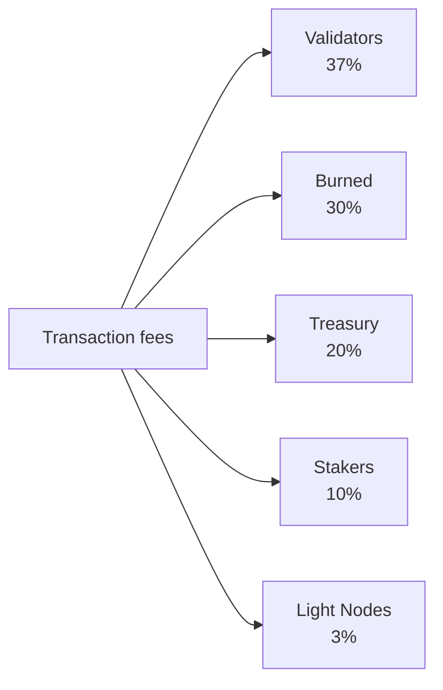

# Tokenomics

QoreChain verwendet ein Wirtschaftsmodell mit **fixem Angebot**, das auf dem nativen **QOR**-Token basiert. Anstatt das Angebot im Zeitverlauf zu inflationieren, finanziert das Netzwerk Staking-Belohnungen aus einem endlichen, vorab zugewiesenen Emissionsbudget, während eine mehrkanalige Burn-Engine anhaltenden deflationären Druck ausübt, wenn die Netzwerknutzung wächst.

---

## Token-Grundlagen

| Eigenschaft              | Wert                                                    |
| --------------------- | -------------------------------------------------------- |
| **Anzeige-Token**     | QOR                                                      |
| **Basis-Denomination** | uqor                                                     |
| **Dezimalpräzision** | 10^6 (1 QOR = 1.000.000 uqor)                            |
| **Gesamtangebot**      | 4.500.000.000 QOR (fix)                                |
| **Chain-ID**          | `qorechain-vladi` (Mainnet, EVM-Chain-ID 9801)          |
| **Bech32-Präfix**     | `qor` (Konten: `qor1...`, Validatoren: `qorvaloper...`) |

:::note
Die Angaben auf dieser Seite beschreiben das **Mainnet** (`qorechain-vladi`, EVM-Chain-ID **9801**), live seit dem 7. Juni 2026 auf Chain-Version **v3.1.77**. Das **`qorechain-diana`**-Testnet (EVM-Chain-ID **9800**) teilt sich dasselbe Wirtschaftsmodell.
:::

---

## Angebots- und Emissionsmodell

QoreChain hat ein **fixes Gesamtangebot von 4.500.000.000 QOR**. Es wird niemals neues QOR geprägt, um das Angebot zu inflationieren. Stattdessen:

* **80.000.000 QOR (1,78 % des Angebots)** wurden beim Token Generation Event (TGE) verbrannt.
* Staking-Belohnungen werden aus einem **endlichen Emissionsbudget von 590.000.000 QOR** ausgezahlt, das im Zeitverlauf nach einem abnehmenden Zeitplan abgebaut wird.

Dies ist ein **Modell mit fixem Angebot und einem endlichen Emissionsbudget**, kein Modell mit Angebotsinflation. Sobald das Emissionsbudget erschöpft ist, erfolgt keine weitere Belohnungsemission über das hinaus, was die Governance aus dem verbleibenden Budget zuweist.

### Staking-Belohnungszeitplan {#staking-reward-schedule}

Staking-Belohnungen werden aus dem Emissionsbudget von 590.000.000 QOR nach einem abnehmenden Zeitplan verteilt:

| Zeitraum      | Ziel-APY              | Emissionsbudget                  |
| ----------- | ----------------------- | -------------------------------- |
| Jahr 1      | 8–12 % APY               | 127.500.000 QOR                  |
| Jahr 2      | 6–10 % APY               | 106.250.000 QOR                  |
| Jahre 3–4   | 5–8 % APY                | 85.000.000 QOR pro Jahr          |
| Jahr 5+     | Governance-bestimmt   | ~186.000.000 QOR verbleibend       |

APY-Bereiche sind Zielwerte, die vom Bonded-Verhältnis abhängen; die Emissionsbudget-Zahlen sind die festen Obergrenzen für QOR, das in jedem Zeitraum an Staker ausgegeben wird. Ab Jahr 5 werden die verbleibenden ~186.000.000 QOR mit einer von der Governance festgelegten Rate freigegeben.

---

## x/burn — Mehrkanalige Burn-Engine

Das `x/burn`-Modul implementiert ein 10-Kanal-Token-Burn-System. Jeder verbrannte Token wird dauerhaft aus dem zirkulierenden Angebot entfernt, was anhaltenden deflationären Druck erzeugt, wenn die Netzwerknutzung wächst.

### Burn-Kanäle

| #  | Kanal            | Quelle                     | Beschreibung                                   |
| -- | ------------------ | -------------------------- | --------------------------------------------- |
| 1  | `gas_fee`          | Transaktionsgebühren           | 30 % aller Gas-Gebühren werden verbrannt                |
| 2  | `contract_create`  | Smart-Contract-Deployment  | Pauschale Gebühr von 100 QOR pro Contract-Erstellung verbrannt |
| 3  | `ai_service`       | Nutzungsgebühren des KI-Moduls       | 50 % der KI-Servicegebühren verbrannt                |
| 4  | `bridge_fee`       | Cross-Chain-Bridge-Gebühren    | 100 % der Bridge-Gebühren verbrannt                |
| 5  | `treasury_buyback` | Treasury-Operationen        | Periodischer Buyback-and-Burn aus der Treasury       |
| 6  | `failed_tx`        | Gas fehlgeschlagener Transaktionen     | 10 % des Gas fehlgeschlagener Transaktionen verbrannt    |
| 7  | `xqore_penalty`    | xQORE-Strafen bei vorzeitigem Ausstieg | Strafbeträge über Burn geleitet                 |
| 8  | `auto_buyback`     | Automatisiertes Buyback-Programm  | Burns auf Protokollebene         |
| 9  | `tge`              | Token Generation Event     | Einmalige Genesis-Burns (80.000.000 QOR)       |
| 10 | `rollup_create`    | Rollup-Deployment          | 1 % des Rollup-Erstellungs-Stakes verbrannt            |

### Gebührenverteilung

Alle vom Netzwerk eingenommenen Transaktionsgebühren werden auf fünf Empfänger aufgeteilt, wie unten dargestellt. Die Anteile werden on-chain erzwungen und ergeben immer exakt 100 %.



Alle vom Netzwerk eingenommenen Transaktionsgebühren werden auf fünf Empfänger aufgeteilt:

| Empfänger       | Anteil | Beschreibung                                                          |
| --------------- | ----- | -------------------------------------------------------------------- |
| **Validatoren**  | 37 %   | Verteilt an das aktive Validator-Set proportional zum Stake        |
| **Verbrannt**      | 30 %   | Über den `gas_fee`-Burn-Kanal dauerhaft aus dem Angebot entfernt       |
| **Treasury**    | 20 %   | Der Community-Treasury für governance-gesteuerte Ausgaben zugewiesen |
| **Staker**     | 10 %   | An alle QOR-Staker proportional zur Delegation verteilt                  |
| **Light Nodes** | 3 %    | An Light Nodes für die Bereitstellung von Netzwerkdaten verteilt                  |

Die Anteile werden on-chain erzwungen und müssen immer exakt 100 % ergeben.

### Burn-Parameter

| Parameter              | Standard                    | Beschreibung                              |
| ---------------------- | -------------------------- | ---------------------------------------- |
| `gas_burn_rate`        | 0.30                       | Anteil der verbrannten Gas-Gebühren (30 %)        |
| `contract_create_fee`  | 100.000.000 uqor (100 QOR) | Pauschale Burn-Gebühr für Contract-Erstellung      |
| `ai_service_burn_rate` | 0.50                       | Anteil der verbrannten KI-Servicegebühren (50 %) |
| `bridge_burn_rate`     | 1.00                       | Anteil der verbrannten Bridge-Gebühren (100 %)    |
| `failed_tx_burn_rate`  | 0.10                       | Anteil des verbrannten Gas fehlgeschlagener TX (10 %)   |

Jedes Burn-Ereignis wird on-chain mit seiner Quelle, dem Betrag, der Blockhöhe und dem zugehörigen Transaktions-Hash aufgezeichnet. Aggregierte Statistiken sind pro Kanal und insgesamt abfragbar.

---

## x/xqore — Gesperrtes Staking und Governance-Verstärkung

Das `x/xqore`-Modul führt **xQORE** ein, ein nicht übertragbares Derivat für gesperrtes Staking. Nutzer sperren QOR, um xQORE im Verhältnis 1:1 zu prägen. xQORE-Inhaber erhalten verstärkte Governance-Macht und einen Anteil an umverteilten Ausstiegsstrafen.

### Sperrmechanismus

* **Sperren**: Senden Sie QOR an das xQORE-Modul, um xQORE im Verhältnis 1:1 zu prägen.
* **Governance-Gewicht**: xQORE-Inhaber erhalten **2x Governance-Stimmrecht** im Vergleich zu Standard-QOR-Stakern.
* **Nicht übertragbar**: xQORE kann nicht zwischen Konten gesendet werden. Es ist an die sperrende Adresse gebunden.

### Strafenzeitplan bei Ausstieg

Eine vorzeitige Auszahlung aus xQORE verursacht eine Strafe, die mit der Sperrdauer abnimmt:

| Sperrdauer  | Strafsatz | Beschreibung                                |
| -------------- | ------------ | ------------------------------------------ |
| &lt; 30 Tage   | **50 %**      | Die Hälfte des gesperrten QOR verfällt            |
| 30 -- 90 Tage  | **35 %**      | Erhebliche Strafe für kurzfristige Sperren   |
| 90 -- 180 Tage | **15 %**      | Reduzierte Strafe für mittelfristiges Engagement |
| > 180 Tage     | **0 %**       | Vollständige Auszahlung ohne Strafe            |

### PvP-Rebase-Umverteilung

Bei vorzeitigem Ausstieg eingezogene Strafen werden nicht einfach vernichtet. Stattdessen folgen sie einem PvP-Rebase-Modell (Player-versus-Player):

1. **50 %** der Strafbeträge werden verbrannt (über `x/burn` über den `xqore_penalty`-Kanal geleitet).
2. **50 %** werden anteilig an alle verbleibenden xQORE-Inhaber umverteilt.

Dies erzeugt eine positiv-summige Dynamik für langfristige Inhaber: Jeder vorzeitige Ausstieg erhöht den effektiven Wert der verbleibenden xQORE-Positionen. Rebases erfolgen alle **100 Blöcke**.

### xQORE-Parameter

| Parameter               | Standard                | Beschreibung                               |
| ----------------------- | ---------------------- | ----------------------------------------- |
| `governance_multiplier` | 2.0                    | Stimmrecht-Multiplikator für xQORE-Inhaber |
| `min_lock_amount`       | 1.000.000 uqor (1 QOR) | Mindestmenge QOR zum Sperren              |
| `penalty_burn_rate`     | 0.50                   | Anteil der verbrannten Ausstiegsstrafen (50 %)   |
| `rebase_interval`       | 100 Blöcke             | Blöcke zwischen PvP-Rebase-Ereignissen          |
| `enabled`               | true                   | Flag zur Modulaktivierung                    |

---

## x/inflation — Emissionsbudget-Zeitplan

Trotz seines Modulnamens inflationiert das `x/inflation`-Modul das Gesamtangebot **nicht**. Es steuert die Freigabe von Staking-Belohnungen aus dem endlichen Emissionsbudget von **590.000.000 QOR** gemäß dem abnehmenden [Staking-Belohnungszeitplan](#staking-reward-schedule). Emissionen werden pro Epoche berechnet und an Staker und Validatoren verteilt, wobei das vorab zugewiesene Budget abgebaut wird, statt neues Angebot zu prägen.

### Epochen-Mechanik

* **Epochenlänge**: 17.280 Blöcke (\~1 Tag bei 5-Sekunden-Blockzeiten)
* **Blöcke pro Jahr**: \~6.311.520
* Zu Beginn jeder Epoche wird die geplante Emission für den aktuellen Zeitraum aus dem Emissionsbudget freigegeben und an Staker und Validatoren verteilt.
* Der Epochen-Tracker erfasst die aktuelle Epochennummer, das aktuelle Jahr, den Startblock, das kumulative aus dem Emissionsbudget freigegebene QOR und das verbleibende Budget.

### Inflation-Parameter

| Parameter      | Standard          | Beschreibung                                                |
| -------------- | ---------------- | ---------------------------------------------------------- |
| `schedule`     | abnehmend        | Zeitraum-indexiertes Emissionsbudget (siehe Staking-Belohnungszeitplan) |
| `epoch_length` | 17.280 Blöcke    | Blöcke pro Emissionsepoche                                  |
| `enabled`      | true             | Flag zur Modulaktivierung                                       |

---

## Deflationäre Dynamik

Da das Angebot fix ist und die Emission aus einem endlichen Budget gezogen wird, tendiert die Netto-Token-Dynamik von QoreChain mit wachsender Akzeptanz deflationär:

```
Years 1-2:  Larger scheduled emissions from the budget offset burns → near-neutral supply
Years 3-4:  Scheduled emissions decline; burn volume grows with usage → convergence
Year 5+:    Emission budget is largely drawn down; burn channels (gas, bridge,
            contracts, rollups) scale with transaction volume → net deflationary
```

Die 10 Burn-Kanäle stellen sicher, dass jede wichtige Netzwerkaktivität Tokens aus dem Angebot entfernt. Mit steigendem Transaktionsvolumen, steigender Bridge-Nutzung, KI-Serviceaufrufen und Rollup-Deployments beschleunigen sich die kumulativen Burns, während die geplanten Emissionen zum Ende des endlichen Budgets hin abnehmen.

---

## Reihenfolge des Modul-Lebenszyklus

Die Wirtschaftsmodule werden während des `EndBlocker` jedes Blocks in einer bestimmten Reihenfolge ausgeführt:

```
x/burn → x/xqore → x/inflation → x/rlconsensus
```

1. **x/burn** — Verarbeitet ausstehende Burn-Datensätze und aktualisiert aggregierte Statistiken.
2. **x/xqore** — Führt PvP-Rebases aus (alle `rebase_interval`-Blöcke) und leitet Strafen an Burn weiter.
3. **x/inflation** — Gibt geplante Staking-Belohnungs-Emissionen an den Epochengrenzen aus dem Budget frei.
4. **x/rlconsensus** — Passt Konsensparameter basierend auf den Reinforcement-Learning-Signalen von PRISM an.

Diese Reihenfolge stellt sicher, dass Burns vor Rebases finalisiert werden und Rebases abgeschlossen sind, bevor geplante Emissionen freigegeben werden, wodurch konsistente wirtschaftliche Zustandsübergänge gewahrt bleiben.

## Verwandte Themen

* [Chain-Parameter](/appendix/chain-parameters) — kanonische ökonomische und Konsens-Standardwerte.
* [Staking und Delegation](/user-guide/staking-and-delegation) — QOR delegieren und Belohnungen verdienen.
* [xQORE Staking](/user-guide/xqore-staking) — der PvP-Rebase-Staking-Mechanismus.
* [Light-Node-Belohnungen](/light-node/rewards-and-monitoring) — der Belohnungsanteil der Light Nodes.
