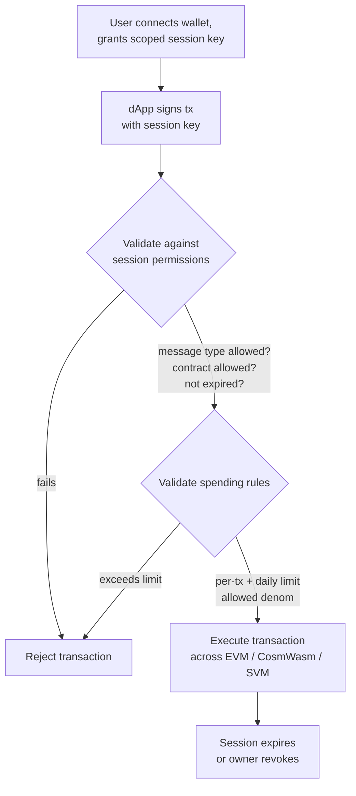

# Account Abstraction

QoreChain bietet **Account Abstraction auf Protokollebene** über das Modul `x/abstractaccount`. Dies ermöglicht programmierbare Konten mit flexiblen Authentifizierungsregeln, Session-Keys, Ausgabenlimits und Social Recovery — und das alles ohne externe Smart-Contract-Infrastruktur.

:::note
Die folgenden Befehle verwenden das **`qorechain-vladi`**-Mainnet, das seit dem 7. Juni 2026 mit der Chain-Version **v3.1.80** in Betrieb ist. Ersetzen Sie `--chain-id qorechain-diana` für das Testnet.
:::

## Überblick

Herkömmliche Blockchain-Konten werden von einem einzigen privaten Schlüssel kontrolliert. Account Abstraction entkoppelt das Konzept „wer eine Transaktion autorisieren kann" von einem einzelnen kryptografischen Schlüssel und ermöglicht:

* **Multisig-Konten** mit konfigurierbarem Schwellenwert für die Signierung
* **Social-Recovery-Konten** mit guardian-basierter Schlüsselwiederherstellung
* **Session-basierte Konten** mit granularen, zeitlich begrenzten Berechtigungen für dApps

Das Modul `x/abstractaccount` implementiert diese Fähigkeiten auf der Protokollebene, was bedeutet, dass sie über alle drei VMs (EVM, CosmWasm, SVM) hinweg funktionieren und von nativer Gas-Effizienz profitieren.

*Ein session-basierter dApp-Ablauf: ein scoped Session-Key signiert eine Transaktion, das Modul validiert sie gegen die Session- und Ausgabenregeln und führt sie anschließend aus.*



## Kontotypen

| Typ               | Beschreibung                            | Anwendungsfall                 |
| ----------------- | --------------------------------------- | ------------------------------ |
| `multisig`        | M-aus-N-Schwellenwert-Signierung        | DAO-Treasuries, gemeinsame Wallets |
| `social_recovery` | Guardian-gestützte Schlüsselwiederherstellung | Verbraucher-Wallets, Onboarding   |
| `session_based`   | Delegierte Session-Keys mit Beschränkungen | dApp-Sessions, mobile Wallets  |

## Erstellen eines abstrakten Kontos

### Session-basiertes Konto

```bash
qorechaind tx abstractaccount create \
  --account-type session_based \
  --from mykey \
  --gas auto \
  -y
```

### Multisig-Konto

```bash
qorechaind tx abstractaccount create \
  --account-type multisig \
  --signers qor1alice...,qor1bob...,qor1carol... \
  --threshold 2 \
  --from mykey \
  --gas auto \
  -y
```

### Social-Recovery-Konto

```bash
qorechaind tx abstractaccount create \
  --account-type social_recovery \
  --guardians qor1guardian1...,qor1guardian2...,qor1guardian3... \
  --recovery-threshold 2 \
  --from mykey \
  --gas auto \
  -y
```

## Session-Keys

Session-Keys sind der Grundpfeiler des Kontotyps `session_based`. Sie ermöglichen es Ihnen, einem sekundären Schlüssel **temporäre, scoped Berechtigungen** zu gewähren — perfekt für dApp-Interaktionen, bei denen Sie Ihren primären Schlüssel nicht offenlegen möchten.

### Schlüsseleigenschaften

| Eigenschaft           | Beschreibung                                         |
| --------------------- | ---------------------------------------------------- |
| **Berechtigungen**    | Welche Nachrichtentypen der Session-Key signieren kann |
| **Ablauf**            | Automatischer Ablauf nach einer konfigurierbaren Dauer |
| **Ausgabenlimits**    | Maximale Beträge, die der Session-Key ausgeben kann  |
| **Erlaubte Contracts** | Beschränkung der Interaktionen auf bestimmte Contract-Adressen |

### Einen Session-Key gewähren

```bash
qorechaind tx abstractaccount grant-session \
  --session-key qor1sessionkey... \
  --permissions "bank/MsgSend,wasm/MsgExecuteContract" \
  --expiry "2026-03-01T00:00:00Z" \
  --allowed-contracts qor1contract1...,0x1234...abcd \
  --from mykey \
  -y
```

### Einen Session-Key widerrufen

```bash
qorechaind tx abstractaccount revoke-session \
  --session-key qor1sessionkey... \
  --from mykey \
  -y
```

### Aktive Sessions auflisten

```bash
qorechaind query abstractaccount sessions <account-address>
```

## Ausgabenregeln

Ausgabenregeln fügen abstrakten Konten unabhängig vom Kontotyp finanzielle Schutzvorkehrungen hinzu:

| Regel            | Beschreibung                                    |
| ---------------- | ----------------------------------------------- |
| `daily_limit`    | Maximale Gesamtausgabe pro rollierendem 24-Stunden-Fenster |
| `per_tx_limit`   | Maximale Ausgabe pro einzelner Transaktion      |
| `allowed_denoms` | Beschränkung, welche Token-Denominationen ausgegeben werden können |

### Ausgabenregeln festlegen

```bash
qorechaind tx abstractaccount update-spending-rules \
  --daily-limit 1000000000uqor \
  --per-tx-limit 100000000uqor \
  --allowed-denoms uqor \
  --from mykey \
  -y
```

### Aktuelle Regeln abfragen

```bash
qorechaind query abstractaccount spending-rules <account-address>
```

### Beispielantwort

```json
{
  "daily_limit": {
    "denom": "uqor",
    "amount": "1000000000"
  },
  "per_tx_limit": {
    "denom": "uqor",
    "amount": "100000000"
  },
  "allowed_denoms": ["uqor"],
  "daily_spent": {
    "denom": "uqor",
    "amount": "250000000"
  },
  "window_reset": "2026-02-27T00:00:00Z"
}
```

## Abfragen abstrakter Konten

### CLI

```bash
# Get full account configuration
qorechaind query abstractaccount account <address>

# List all abstract accounts (paginated)
qorechaind query abstractaccount list --limit 10
```

### JSON-RPC

```bash
curl -X POST http://localhost:8545 \
  -H "Content-Type: application/json" \
  -d '{
    "jsonrpc": "2.0",
    "method": "qor_getAbstractAccount",
    "params": ["0xYourAddress"],
    "id": 1
  }'
```

### Beispiel einer Kontoantwort

```json
{
  "address": "qor1myaccount...",
  "account_type": "session_based",
  "owner": "qor1owner...",
  "active_sessions": 2,
  "spending_rules": {
    "daily_limit": "1000000000uqor",
    "per_tx_limit": "100000000uqor",
    "allowed_denoms": ["uqor"]
  },
  "created_at_height": 54321
}
```

## Social-Recovery-Ablauf

Wenn der Kontoinhaber den Zugriff auf seinen primären Schlüssel verliert, können Guardians eine Schlüsselrotation autorisieren.

1. **Inhaber meldet verlorenen Schlüssel (oder ein Guardian initiiert):**

   ```bash
   qorechaind tx abstractaccount initiate-recovery \
     --account <account-address> \
     --new-owner qor1newkey... \
     --from guardian1 \
     -y
   ```

2. **Weitere Guardians genehmigen** (müssen `recovery_threshold` erreichen):

   ```bash
   qorechaind tx abstractaccount approve-recovery \
     --account <account-address> \
     --recovery-id <recovery-id> \
     --from guardian2 \
     -y
   ```

3. **Die Wiederherstellung wird automatisch ausgeführt**, sobald der Schwellenwert erreicht ist. Eine **Time-Lock-Periode** (Standard: 48 Stunden) gibt dem ursprünglichen Inhaber die Möglichkeit, einen betrügerischen Wiederherstellungsversuch abzubrechen.

## Integration mit dApps

Session-Keys ermöglichen nahtlose dApp-Erlebnisse:

1. **Der Nutzer verbindet die Wallet** und erstellt einen Session-Key, der auf den Contract der dApp beschränkt ist
2. **Die dApp verwendet den Session-Key**, um Transaktionen im Namen des Nutzers einzureichen
3. **Kein wiederholtes Signieren** — der Session-Key übernimmt die Autorisierung innerhalb seiner Berechtigungen
4. **Die Session läuft** automatisch ab, oder der Nutzer widerruft sie jederzeit

Dieses Muster ist besonders nützlich für:

* Mobile Wallets, bei denen wiederholte biometrische Aufforderungen störend sind
* Gaming-dApps, die eine schnelle Transaktionssignierung benötigen
* DeFi-Protokolle, die mehrere aufeinanderfolgende Operationen ausführen

## Nächste Schritte

* [Einen Validator betreiben](/developer-guide/running-a-validator) — Einen Validator-Knoten einrichten und betreiben
* [EVM-Entwicklung](/developer-guide/evm-development) — Abstrakte Konten in Solidity-dApps integrieren
* [Cross-VM-Interoperabilität](/developer-guide/cross-vm-interoperability) — Cross-VM-Messaging mit abstrakten Konten
