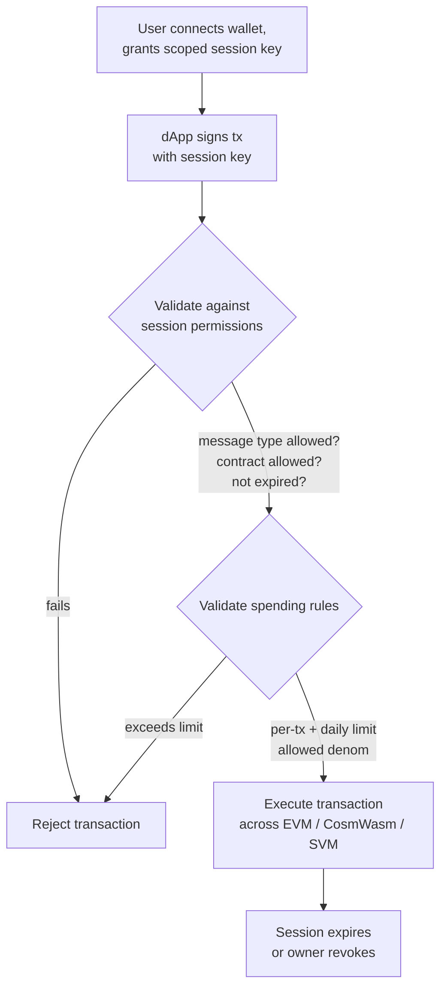

# Account Abstraction

QoreChain bietet **Account Abstraction auf Protokollebene** über das Modul `x/abstractaccount`. Dies ermöglicht programmierbare Konten mit flexiblen Authentifizierungsregeln, Session Keys, Ausgabenlimits und Social Recovery — ganz ohne externe Smart-Contract-Infrastruktur.

:::note
Die folgenden Befehle verwenden das **`qorechain-vladi`**-Mainnet, live seit dem 7. Juni 2026 mit der Chain-Version **v3.1.92**. Ersetzen Sie für das Testnet `--chain-id qorechain-diana`.
:::

## Überblick

Traditionelle Blockchain-Konten werden von einem einzigen privaten Schlüssel kontrolliert. Account Abstraction entkoppelt das Konzept „wer darf eine Transaktion autorisieren" von einem einzelnen kryptografischen Schlüssel und ermöglicht dadurch:

* **Multisig-Konten** mit konfigurierbarem Schwellenwert-Signieren
* **Social-Recovery-Konten** mit guardian-basierter Schlüsselwiederherstellung
* **Session-basierte Konten** mit granularen, zeitlich begrenzten Berechtigungen für dApps

Das Modul `x/abstractaccount` implementiert diese Fähigkeiten auf der Protokollebene, das heißt, sie funktionieren über alle drei VMs hinweg (EVM, CosmWasm, SVM) und profitieren von nativer Gas-Effizienz.

*Ein session-basierter dApp-Ablauf: Ein eingeschränkter Session Key signiert eine Transaktion, das Modul validiert sie gegen die Session- und Ausgaberegeln und führt sie anschließend aus.*


```mermaid
flowchart TD
    A["User connects wallet,<br/>grants scoped session key"] --> B["dApp signs tx<br/>with session key"]
    B --> C{"Validate against<br/>session permissions"}
    C -- "message type allowed?<br/>contract allowed?<br/>not expired?" --> D{"Validate spending rules"}
    C -- "fails" --> R["Reject transaction"]
    D -- "per-tx + daily limit<br/>allowed denom" --> E["Execute transaction<br/>across EVM / CosmWasm / SVM"]
    D -- "exceeds limit" --> R
    E --> F["Session expires<br/>or owner revokes"]
```

## Kontotypen

| Typ               | Beschreibung                                | Anwendungsfall                        |
| ----------------- | ------------------------------------------- | ------------------------------------- |
| `multisig`        | M-von-N-Schwellenwert-Signieren             | DAO-Treasuries, gemeinsame Wallets    |
| `social_recovery` | Guardian-gestützte Schlüsselwiederherstellung | Consumer-Wallets, Onboarding          |
| `session_based`   | Delegierte Session Keys mit Einschränkungen | dApp-Sessions, mobile Wallets         |

## Ein Abstract Account erstellen

### Session-basiertes Konto

```bash
qorechaind tx abstractaccount create \
  --account-type session_based \
  --from mykey \
  --gas auto \
  -y
```

### Multisig-Konto

```bash
qorechaind tx abstractaccount create \
  --account-type multisig \
  --signers qor1alice...,qor1bob...,qor1carol... \
  --threshold 2 \
  --from mykey \
  --gas auto \
  -y
```

### Social-Recovery-Konto

```bash
qorechaind tx abstractaccount create \
  --account-type social_recovery \
  --guardians qor1guardian1...,qor1guardian2...,qor1guardian3... \
  --recovery-threshold 2 \
  --from mykey \
  --gas auto \
  -y
```

## Session Keys

Session Keys sind der Grundpfeiler des Kontotyps `session_based`. Sie erlauben es, einem sekundären Schlüssel **temporäre, eingeschränkte Berechtigungen** zu erteilen — ideal für dApp-Interaktionen, bei denen Sie Ihren primären Schlüssel nicht exponieren möchten.

### Wichtige Eigenschaften

| Eigenschaft            | Beschreibung                                                    |
| ---------------------- | --------------------------------------------------------------- |
| **Berechtigungen**     | Welche Nachrichtentypen der Session Key signieren darf          |
| **Ablauf**             | Automatisches Ablaufen nach einer konfigurierbaren Dauer        |
| **Ausgabenlimits**     | Maximale Beträge, die der Session Key ausgeben kann             |
| **Erlaubte Contracts** | Interaktionen auf bestimmte Contract-Adressen beschränken       |

### Einen Session Key erteilen

```bash
qorechaind tx abstractaccount grant-session \
  --session-key qor1sessionkey... \
  --permissions "bank/MsgSend,wasm/MsgExecuteContract" \
  --expiry "2026-03-01T00:00:00Z" \
  --allowed-contracts qor1contract1...,0x1234...abcd \
  --from mykey \
  -y
```

### Einen Session Key widerrufen

```bash
qorechaind tx abstractaccount revoke-session \
  --session-key qor1sessionkey... \
  --from mykey \
  -y
```

### Aktive Sessions auflisten

```bash
qorechaind query abstractaccount sessions <account-address>
```

## Ausgaberegeln

Ausgaberegeln fügen Abstract Accounts finanzielle Leitplanken hinzu, unabhängig vom Kontotyp:

| Regel            | Beschreibung                                                     |
| ---------------- | ---------------------------------------------------------------- |
| `daily_limit`    | Maximale Gesamtausgaben pro rollierendem 24-Stunden-Fenster      |
| `per_tx_limit`   | Maximale Ausgaben pro einzelner Transaktion                      |
| `allowed_denoms` | Beschränkt, welche Token-Denominationen ausgegeben werden dürfen |

### Ausgaberegeln festlegen

```bash
qorechaind tx abstractaccount update-spending-rules \
  --daily-limit 1000000000uqor \
  --per-tx-limit 100000000uqor \
  --allowed-denoms uqor \
  --from mykey \
  -y
```

### Aktuelle Regeln abfragen

```bash
qorechaind query abstractaccount spending-rules <account-address>
```

### Beispielantwort

```json
{
  "daily_limit": {
    "denom": "uqor",
    "amount": "1000000000"
  },
  "per_tx_limit": {
    "denom": "uqor",
    "amount": "100000000"
  },
  "allowed_denoms": ["uqor"],
  "daily_spent": {
    "denom": "uqor",
    "amount": "250000000"
  },
  "window_reset": "2026-02-27T00:00:00Z"
}
```

## Authenticators für verknüpfte Wallets — Delegiertes Ausgeben {#authenticators}

Ab Chain-Version **v3.1.85** (aufbauend auf dem Berechtigungsmodell von v3.1.84) kann ein **verknüpfter externer Wallet-Schlüssel** — ein Phantom-Schlüssel (ed25519) oder ein MetaMask-Konto (secp256k1) — **aus dem kanonischen Post-Quantum-Konto ausgeben**, und zwar unter Least-Privilege-Bedingungen, mit Ausgabenlimits und jederzeit widerrufbar. Der externe Schlüssel erzeugt niemals eine ML-DSA-Signatur; ein **Relayer** reicht den Transaktions-Envelope ein und bezahlt ihn (die eigene hybride PQC-Signatur des Relayers erfüllt die Signaturanforderungen der Chain), während die Signatur des Authenticators über **domain-separierte, replay-gebundene Sign-Bytes** die eigentliche Autorisierung darstellt.

### Einen Authenticator registrieren {#register-authenticator}

Der Kontoinhaber registriert den externen Schlüssel mit `MsgRegisterAuthenticator` (eine gewöhnliche Root-Key-Transaktion) und weist ihm dabei ein Schema, Berechtigungen, ein Ablaufdatum und optionale Ausgabenlimits zu:

```js
import { registerEthAuthenticatorMsg } from "@qorechain/wallet-adapter";

// Link a MetaMask account by its 20-byte address (EIP-191 verification):
const msg = registerEthAuthenticatorMsg({
  account: "qor1owner...",            // the canonical account
  ethAddress: "0xAbC...123",          // the MetaMask address to link
  permissions: ["evm"],               // least privilege — see the taxonomy below
  expirySeconds: 30 * 24 * 3600,      // ≤ 30 days recommended
  spendingRule: { perTxLimit: "100000000uqor", dailyLimit: "1000000000uqor" },
});
// Sign & broadcast this msg with the OWNER's normal hybrid-PQC signer.
```

Ein Phantom-Schlüssel wird auf dieselbe Weise registriert, mit `scheme: "ed25519"` und dem öffentlichen Phantom-Schlüssel. Der Widerruf erfolgt sofort über `MsgRevokeAuthenticator`.

### Berechtigungstaxonomie {#permission-taxonomy}

Elf kanonische Berechtigungen steuern, was ein registrierter Authenticator tun darf. Die Zuordnung ist **fail-closed**: Ein Nachrichtentyp ohne Zuordnung wird abgelehnt.

| Berechtigung | Gewährt |
| --- | --- |
| `send` | Bank-Transfers auf der Native Lane |
| `delegate` / `withdraw` / `vote` | Staking, Auszahlung von Rewards, Governance |
| `evm` / `wasm` / `svm` | Ausführung auf der jeweiligen VM-Lane |
| `amm` / `ibc` / `deploy` | AMM-Operationen, IBC-Transfers, Contract-Deployment |
| `all` | Jede *delegierbare* Nachricht |

**Schlüsselverwaltungs-Nachrichten sind niemals delegierbar** — `MsgRegisterAuthenticator`, `MsgRevokeAuthenticator`, PQC-Schlüsselregistrierung/-migration und `MsgRotatePQCKey` erfordern immer den Root-Schlüssel; ein verknüpfter Schlüssel kann seine eigenen Privilegien also niemals erweitern.

Lesen Sie die Live-Taxonomie (mit `schema_version` zur Drift-Erkennung), statt sie fest zu codieren:

```bash
curl -s https://api.qore.host/qorechain/abstractaccount/v1/permission_schema | jq
# or: qorechaind query abstractaccount permission-schema
```

### Über einen verknüpften Schlüssel ausgeben {#execute-messages}

Zwei Nachrichten transportieren authenticator-autorisierte Aktionen. In beiden Fällen ist der Relayer der Signierer und Fee-Payer der Transaktion; die Signatur des Authenticators reist innerhalb der Nachricht mit.

**`MsgExecuteEVM`** — ein EVM-Aufruf oder Transfer **von der `0x…`-Adresse des kanonischen Kontos**. Der Authenticator signiert `sha256("qorechain-evm-auth-v1" ‖ chainId ‖ account ‖ pubkey ‖ to ‖ value ‖ data ‖ nonce)` (alle Felder mit Längenpräfix). Der Replay-Schutz ist die eigene EVM-Nonce des Kontos.

**`MsgExecuteCosmos`** — ein Bank-Send auf der Native Lane vom kanonischen Konto. Der Authenticator signiert `sha256("qorechain-cosmos-auth-v1" ‖ chainId ‖ account ‖ pubkey ‖ to ‖ amount ‖ nonce)`. Der Replay-Schutz ist eine **pro Authenticator geführte Sequenz**, die das Modul verwaltet (ein Bank-Send erhöht die Konto-Nonce nicht). Sends an sich selbst werden abgelehnt.

:::caution Nonce-Regeln
* `MsgExecuteEVM.nonce` = die **aktuelle** EVM-Nonce des Kontos (`eth_getTransactionCount(account0x, "latest")`). In Produktion ist der Relayer ein *anderes* Konto, addieren Sie also **kein** +1. Das Signieren einer veralteten Nonce liefert Code `11`.
* `MsgExecuteCosmos.nonce` = die Pro-Authenticator-Sequenz (fragen Sie den Authenticator-Zustand des Kontos ab), **nicht** die Cosmos-Sequenz des Kontos.
:::

**Phantom-Beispiel** (Browser: Phantom signiert, Ihr Backend relayt):

```js
import { buildPhantomExecuteCosmos } from "@qorechain/wallet-adapter";

// In the dApp: Phantom signs the digest with ed25519 signMessage.
const msg = await buildPhantomExecuteCosmos({
  provider: window.solana,            // Phantom
  chainId: "qorechain-vladi",
  account: "qor1owner...",            // canonical account being spent from
  to: "qor1recipient...",
  amount: { denom: "uqor", amount: "900000" },
  nonce: authSequence,                // per-authenticator sequence
});
// Send `msg` to your relayer; the relayer wraps it in a tx it signs
// (hybrid PQC) and broadcasts. The transfer moves the OWNER's funds.
```

**MetaMask-Beispiel** (EIP-191 `personal_sign` von der verknüpften 20-Byte-Adresse):

```js
import { buildMetaMaskExecuteEvm } from "@qorechain/wallet-adapter";

const msg = await buildMetaMaskExecuteEvm({
  provider: window.ethereum,          // MetaMask (EIP-1193)
  chainId: "qorechain-vladi",
  account: "qor1owner...",
  to: "0xRecipient...",
  valueWei: 10n ** 16n,               // 0.01 QOR (18-dec EVM view)
  nonce: currentEvmNonce,             // eth_getTransactionCount(owner0x, "latest")
});
// Relay as above. The chain verifies the signature via EIP-191 + ecrecover
// against the registered 20-byte address.
```

Dieselben Builder existieren im [QoreChain SDK](/sdk/guides/authenticators) für alle fünf Sprachen, dazu CLI-Äquivalente:

```bash
# Produce the exact sign bytes the chain verifies (for custom signers):
qorechaind query abstractaccount auth-sign-cosmos <account> <to> <amount> <nonce>
qorechaind query abstractaccount auth-sign-evm <account> <to> <value> <data-hex> <nonce>

# Relay a pre-signed authorization:
qorechaind tx abstractaccount execute-cosmos <account> <to> <amount> <auth-pubkey> <auth-sig> <nonce> --from relayer -y
qorechaind tx abstractaccount execute-evm    <account> <to> <value> <data-hex> <auth-pubkey> <auth-sig> <nonce> --from relayer -y
```

### Fehlercodes {#authenticator-errors}

Enforcement-Fehler liefern eindeutige Codes (Codespace `abstractaccount`), damit Wallets die richtige Meldung anzeigen können:

| Code | Bedeutung | Wallet-UX |
| --- | --- | --- |
| `5` | Ausgabenlimit überschritten (pro Transaktion oder täglich) | Verbleibendes Kontingent anzeigen |
| `6` | Authenticator abgelaufen | „Abgelaufen — Wallet erneut verknüpfen" |
| `10` | Berechtigung verweigert (Scope oder nicht delegierbare Nachricht) | Fehlende Berechtigung anzeigen |
| `11` | Replay abgelehnt (veraltete Nonce/Sequenz) | Nonce erneut abfragen und neu signieren |

(Codespace `pqc`, Code `21` = Verifikation der hybriden Signatur fehlgeschlagen — ein Signierproblem auf Relayer-Seite, kein Autorisierungsproblem.)

### REST-Abfragen {#abstractaccount-rest}

Ab **v3.1.85** werden die Leseabfragen des Moduls auch über REST bereitgestellt:

```
GET /qorechain/abstractaccount/v1/config
GET /qorechain/abstractaccount/v1/accounts
GET /qorechain/abstractaccount/v1/accounts/{address}
GET /qorechain/abstractaccount/v1/permission_schema
```

## Abstract Accounts abfragen

### CLI

```bash
# Get full account configuration
qorechaind query abstractaccount account <address>

# List all abstract accounts (paginated)
qorechaind query abstractaccount list --limit 10
```

### JSON-RPC

```bash
curl -X POST http://localhost:8545 \
  -H "Content-Type: application/json" \
  -d '{
    "jsonrpc": "2.0",
    "method": "qor_getAbstractAccount",
    "params": ["0xYourAddress"],
    "id": 1
  }'
```

### Beispiel einer Kontoantwort

```json
{
  "address": "qor1myaccount...",
  "account_type": "session_based",
  "owner": "qor1owner...",
  "active_sessions": 2,
  "spending_rules": {
    "daily_limit": "1000000000uqor",
    "per_tx_limit": "100000000uqor",
    "allowed_denoms": ["uqor"]
  },
  "created_at_height": 54321
}
```

## Social-Recovery-Ablauf

Verliert der Kontoinhaber den Zugriff auf seinen primären Schlüssel, können Guardians eine Schlüsselrotation autorisieren.

1. **Der Inhaber meldet den verlorenen Schlüssel (oder ein Guardian initiiert):**

   ```bash
   qorechaind tx abstractaccount initiate-recovery \
     --account <account-address> \
     --new-owner qor1newkey... \
     --from guardian1 \
     -y
   ```

2. **Weitere Guardians stimmen zu** (muss `recovery_threshold` erreichen):

   ```bash
   qorechaind tx abstractaccount approve-recovery \
     --account <account-address> \
     --recovery-id <recovery-id> \
     --from guardian2 \
     -y
   ```

3. **Die Wiederherstellung wird automatisch ausgeführt**, sobald der Schwellenwert erreicht ist. Eine **Time-Lock-Periode** (Standard: 48 Stunden) gibt dem ursprünglichen Inhaber die Möglichkeit, einen betrügerischen Wiederherstellungsversuch abzubrechen.

## Integration mit dApps

Session Keys ermöglichen nahtlose dApp-Erlebnisse:

1. **Der Nutzer verbindet sein Wallet** und erstellt einen Session Key, der auf den Contract der dApp beschränkt ist
2. **Die dApp verwendet den Session Key**, um Transaktionen im Namen des Nutzers einzureichen
3. **Kein wiederholtes Signieren** — der Session Key übernimmt die Autorisierung im Rahmen seiner Berechtigungen
4. **Die Session läuft automatisch ab**, oder der Nutzer widerruft sie jederzeit

Dieses Muster ist besonders nützlich für:

* Mobile Wallets, bei denen wiederholte biometrische Abfragen störend sind
* Gaming-dApps, die schnelles Transaktions-Signieren benötigen
* DeFi-Protokolle, die mehrere aufeinanderfolgende Operationen ausführen

## Nächste Schritte

* [Einen Validator betreiben](/developer-guide/running-a-validator) — Einen Validator-Node einrichten und betreiben
* [EVM-Entwicklung](/developer-guide/evm-development) — Abstract Accounts mit Solidity-dApps integrieren
* [Cross-VM-Interoperabilität](/developer-guide/cross-vm-interoperability) — Cross-VM-Messaging mit Abstract Accounts
