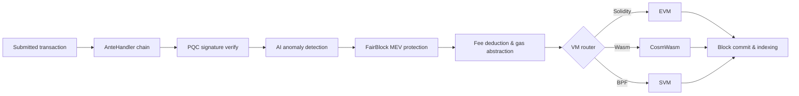

# Architekturüberblick

QoreChain ist ein modularer Blockchain-Knoten, der aus drei primären Prozessen besteht — dem Chain-Node, dem AI-Sidecar und dem Block-Indexer — gestützt durch eine Postgres-Datenbank und überwacht über Prometheus und Grafana. Das Mainnet (`qorechain-vladi`, EVM-Chain-ID **9801**) ist seit dem 7. Juni 2026 in Chain-Version **v3.1.80** live, mit einem parallelen Testnet (`qorechain-diana`, EVM-Chain-ID **9800**). Die Chain ist auf dem Cosmos SDK v0.53 aufgebaut. Das folgende Diagramm zeigt das übergeordnete Komponentenlayout.

Der nachstehende Transaktionslebenszyklus fasst zusammen, wie eine eingereichte Transaktion durch den Knoten fließt — von der AnteHandler-Decorator-Kette (Sicherheits- und Gebührenprüfungen) über die VM-Ausführung bis zur On-Chain-Abwicklung:



```
┌────────────────────────────────────────────────────────────────────────────┐
│                            QoreChain Node                                  │
│                                                                            │
│  ┌──────────────────── Virtual Machines ──────────────────────┐           │
│  │  ┌───────┐    ┌──────────┐    ┌───────┐                   │           │
│  │  │  EVM  │    │ CosmWasm │    │  SVM  │                   │           │
│  │  │(Sol.) │◄──►│ (Wasm)   │◄──►│ (BPF) │                   │           │
│  │  └───┬───┘    └────┬─────┘    └───┬───┘                   │           │
│  │      └─────────┬───┘──────────────┘                       │           │
│  │           x/crossvm (bridge)                               │           │
│  └────────────────────────────────────────────────────────────┘           │
│                                                                            │
│  ┌────────────────────── Tokenomics ─────────────────────────┐           │
│  │  ┌──────┐   ┌───────┐   ┌───────────┐                    │           │
│  │  │x/burn│   │x/xqore│   │x/inflation│                    │           │
│  │  │10 ch.│   │lock/  │   │finite     │                    │           │
│  │  │37/30/│   │unlock │   │emission   │                    │           │
│  │  │20/10/│   │PvP    │   │590M       │                    │           │
│  │  │3     │   │       │   │budget     │                    │           │
│  │  └──────┘   └───────┘   └───────────┘                    │           │
│  └────────────────────────────────────────────────────────────┘           │
│                                                                            │
│  ┌──────────── IBC / Bridges ────────────────────────────────┐           │
│  │  ┌──────────┐  ┌──────────┐  ┌───────────┐  ┌──────────┐ │           │
│  │  │x/bridge  │  │x/babylon │  │x/abstract │  │x/gas     │ │           │
│  │  │37 QCB +  │  │BTC re-   │  │ account   │  │abstract. │ │           │
│  │  │8 IBC     │  │staking   │  │session key│  │multi-tok │ │           │
│  │  └────┬─────┘  └────┬─────┘  └───────────┘  └──────────┘ │           │
│  │  QCB Bridge     Babylon IBC   ERC-4337-like   ibc/USDC    │           │
│  │  PQC-signed     BTC finality  social recov.   ibc/ATOM    │           │
│  │  36 ext chains  checkpoint    spending rules  fee convert  │           │
│  │  ┌──────────┐                                              │           │
│  │  │x/fair    │  5-Lane Prioritization: PQC|MEV|AI|Def|Free │           │
│  │  │ block    │  tIBE encrypted mempool framework           │           │
│  │  └──────────┘                                              │           │
│  └────────────────────────────────────────────────────────────┘           │
│                                                                            │
│  ┌──── Rollup Development Kit ───────────────────────────────┐           │
│  │  ┌──────────┐  ┌──────────┐  ┌───────────┐  ┌──────────┐ │           │
│  │  │ x/rdk    │  │Settlement│  │ DA Router │  │ Profiles │ │           │
│  │  │ 4 modes: │  │Optimistic│  │ Native    │  │ defi     │ │           │
│  │  │ opt/zk/  │  │ZK/Based/ │  │ Celestia* │  │ gaming   │ │           │
│  │  │ based/   │  │Sovereign │  │ Both      │  │ nft      │ │           │
│  │  │ sovereign│  │          │  │           │  │ social/  │ │           │
│  │  │          │  │          │  │           │  │ general  │ │           │
│  │  └────┬─────┘  └────┬─────┘  └───────────┘  └──────────┘ │           │
│  │  Bank escrow    Auto-finalize  SHA-256 commit  AI-assisted │           │
│  │  Burn on create EndBlocker     Blob pruning    PRISM sugg. │           │
│  │  → x/multilayer (RegisterSidechain + AnchorState)          │           │
│  └────────────────────────────────────────────────────────────┘           │
│                                                                            │
│  ┌──────────────┐ ┌──────┐ ┌────────────┐ ┌─────┐                       │
│  │x/rlconsensus │ │ x/ai │ │x/reputation│ │x/qca│                       │
│  │  PRISM (RL)  │ │      │ │            │ │     │                       │
│  └──────┬───────┘ └──┬───┘ └────┬──────┘ └──┬──┘                       │
│   PPO MLP         AI Engine   Scoring    CPoS Pools                      │
│   Obs/Action      Fraud Det.  Decay      Bonding                         │
│   Circuit Brk     Fee Opt.    Sigmoid    Slashing                        │
│   Rollup Adv.     TEE/FL                 QDRW Gov                        │
│                                                                            │
│  ┌──────┐ ┌──────────┐                                                   │
│  │x/pqc │ │ x/multi  │                                                   │
│  └──┬───┘ └────┬─────┘                                                   │
│  Dilithium    Layer Router                                                │
│  ML-KEM       Sidechains                                                  │
│  Hybrid Sig   + Rollups                                                   │
│  SHAKE-256                                                                │
│                                                                            │
│  ┌──────┐ ┌───────┐                                                      │
│  │x/svm │ │x/cross│                                                      │
│  └──┬───┘ └───┬───┘                                                      │
│  BPF Exec   CrossVM Msg                                                   │
└────────┬──────┬───────────────────────────────────────┬───────────────────┘
         │      │                                       │
   ┌─────┴─────┐│                              ┌───────┴──────┐
   │libqorepqc ││                              │  Indexer     │
   │(Rust PQC) ││                              │  (Postgres)  │
   └───────────┘│                              └──────────────┘
   ┌───────────┐│  ┌──────────┐
   │libqoresvm ││  │AI Sidecar│
   │(Rust BPF) │└──│ (gRPC)   │
   └───────────┘   └──────────┘
```

## Knotenkomponenten

QoreChain läuft als drei kooperierende Prozesse, jeder mit seinem eigenen Go-Modul und seiner eigenen Binärdatei:

| Komponente         | Beschreibung                                                                                                                                                                                                                                                                                                                  | Speicherort               |
| ------------------ | ---------------------------------------------------------------------------------------------------------------------------------------------------------------------------------------------------------------------------------------------------------------------------------------------------------------------------- | ------------------------- |
| **qorechain-node** | Der zentrale Blockchain-Knoten. Führt die QoreChain Consensus Engine aus, führt alle benutzerdefinierten Module aus, verwaltet alle drei VM-Laufzeitumgebungen und stellt RPC-, REST-, gRPC- und JSON-RPC-Endpunkte bereit.                                                                                                    | `qorechain-core/`         |
| **ai-sidecar**     | Ein gRPC-Dienst, der erweiterte KI-Inferenzfähigkeiten bereitstellt, gestützt durch das QCAI-Backend. Der Sidecar verarbeitet Inferenzanfragen, die den Umfang des On-Chain-RL-Agenten überschreiten, wie etwa Analyse natürlicher Sprache und komplexe Mustererkennung. Kommuniziert mit dem Knoten über gRPC auf Port 50051. | `qorechain-core/sidecar/` |
| **block-indexer**  | Ein WebSocket-Listener, der neue Blöcke und Transaktionen vom RPC-Endpunkt des Knotens abonniert, Ereignisse parst und strukturierte Daten in eine Postgres-Datenbank schreibt, um eine schnelle Abfrage durch Explorer und APIs zu ermöglichen.                                                                               | `qorechain-core/indexer/` |

## Ports

| Port  | Protokoll      | Dienst                                                                            |
| ----- | -------------- | --------------------------------------------------------------------------------- |
| 26657 | HTTP/WebSocket | QoreChain Consensus Engine RPC (Blöcke, Transaktionen, Konsenszustand)            |
| 1317  | HTTP           | REST API (Abfrage-Endpunkte, Transaktions-Broadcast)                              |
| 9090  | gRPC           | gRPC-Abfrage- und Transaktions-Endpunkte                                          |
| 8545  | HTTP           | EVM JSON-RPC (`eth_`-, `web3_`-, `net_`-, `txpool_`-, `qor_`-Namespaces)          |
| 8546  | WebSocket      | EVM JSON-RPC (WebSocket-Abonnements)                                              |
| 8899  | HTTP           | SVM JSON-RPC (Solana-kompatibel: `getAccountInfo`, `getBalance`, `getSlot`, usw.) |
| 50051 | gRPC           | AI-Sidecar (Inferenzanfragen vom Knoten)                                          |
| 5432  | TCP            | Postgres (Speicher des Block-Indexers)                                            |
| 9091  | HTTP           | Prometheus-Metriken                                                               |
| 3000  | HTTP           | Grafana-Dashboards                                                                |

## Modulübersicht

QoreChain registriert **mehr als 45 Genesis-Module einschließlich mehr als 20 benutzerdefinierter Module**, gruppiert nach Funktion:

**Sicherheit**

* `x/pqc` — Post-Quanten-Kryptografie: Dilithium-5, ML-KEM-1024, hybrides secp256k1 (ECDSA) + ML-DSA-87, SHAKE-256, Algorithmus-Agilität

**KI und maschinelles Lernen**

* `x/ai` — Transaktions-Routing, Anomalieerkennung, Betrugserkennung, Gebührenoptimierung, TEE-Attestierung, föderiertes Lernen
* `x/reputation` — Mehrfaktor-Reputationsbewertung von Validatoren mit zeitlichem Verfall
* `x/rlconsensus` — On-Chain-RL-Agent (PPO MLP), dynamisches Konsens-Tuning, Schutzschalter, Rollup-Beratung — die PRISM-Optimierungsschicht

**Konsens**

* `x/qca` — Triple-Pool Composite PoS (RPoS/DPoS/PoS) auf der QoreChain Consensus Engine, benutzerdefinierte Bonding-Kurve, progressives Slashing, QDRW-Governance

**Virtuelle Maschinen**

* `x/vm` — VM-Routing und Lebenszyklusverwaltung
* `x/svm` — SVM-Laufzeitumgebung: BPF-Bereitstellung/-Ausführung, Mieteinzug, Solana-kompatibles RPC
* `x/crossvm` — Cross-VM-Kommunikation: EVM-CosmWasm-Precompile + SVM-Async-Ereignisse

**Tokenomics und Liquidität**

* `x/burn` — 10 Burn-Kanäle, EndBlocker-Gebührenverteilung (Aufteilung 37/30/20/10/3)
* `x/xqore` — Governance-verstärktes Staking: Lock/Unlock, gestaffelte Ausstiegsstrafen, PvP-Rebase
* `x/inflation` — Emission mit festem Angebot aus einem endlichen Staking-Belohnungsbudget nach einem mehrjährigen Zeitplan
* `x/amm` — On-Chain-Liquidität / automatisierter Market Maker

**Bridges und Interoperabilität**

* `x/bridge` — 37 QCB-Konfigurationen (36 externe Chains + QoreChain-Loopback) über jeden wichtigen Chain-Typ hinweg, PQC-signierte Attestierungen, Schutzschalter
* `x/babylon` — BTC-Restaking über Babylon Protocol, Epochen-Checkpoints
* `x/multilayer` — Verwaltung von Sidechain-/Paychain-/Rollup-Schichten, Zustandsverankerung

**Governance- und Lizenzierungserweiterungen**

* `x/abstractaccount` — Smart Accounts: Multisig, soziale Wiederherstellung, Session-Keys, Ausgaberegeln
* `x/fairblock` — MEV-Schutz: Threshold-IBE-Framework für verschlüsselten Mempool
* `x/gasabstraction` — Gaszahlung mit mehreren Token: ibc/USDC-, ibc/ATOM-Gebührenkonvertierung
* `x/license` — Chain-Lizenzierung

**Rollups**

* `x/rdk` — Rollup Development Kit: 4 Settlement-Modi (optimistic, zk, based, sovereign), voreingestellte Profile, native DA, Bank-Escrow

## AnteHandler-Kette

Jede Transaktion durchläuft vor der Ausführung die folgende Decorator-Kette. Die Decorators laufen in Reihenfolge ab; jeder Decorator kann die Transaktion ablehnen.

```
SetUpContext
  → CircuitBreaker
    → PQCVerify
      → PQCHybridVerify
        → AIAnomaly
          → FairBlock
            → SVMComputeBudget
              → SVMDeductFee
                → Extension
                  → ValidateBasic
                    → TxTimeout
                      → Memo
                        → MinGasPrice
                          → ConsumeTxSize
                            → GasAbstraction
                              → DeductFee
                                → SetPubKey
                                  → ValidateSigCount
                                    → SigGasConsume
                                      → SigVerify
                                        → IncrementSequence
```

Die wichtigsten Decorators laufen in folgender Reihenfolge ab (jeder Decorator läuft der Reihe nach und kann eine Transaktion ablehnen):

1. **PQCVerify** — Modul `x/pqc`. Verifiziert Dilithium-5-Signaturen bei PQC-markierten Transaktionen.
2. **PQCHybridVerify** — Modul `x/pqc`. Verifiziert duale hybride Signaturen aus secp256k1 (ECDSA) + ML-DSA-87.
3. **AIAnomaly** — Modul `x/ai`. Führt Isolation-Forest-Anomalieerkennung und Risikobewertung durch.
4. **FairBlock** — Modul `x/fairblock`. Verarbeitet tIBE-verschlüsselte Transaktionen zum MEV-Schutz.
5. **SVMComputeBudget** — Modul `x/svm`. Validiert und weist Recheneinheiten für SVM-Programme zu.
6. **SVMDeductFee** — Modul `x/svm`. Zieht SVM-spezifische Ausführungsgebühren ab.
7. **GasAbstraction** — Modul `x/gasabstraction`. Konvertiert nicht-native Gebührentoken (USDC, ATOM) vor dem Abzug.

## Docker-Compose-Stack

Der vollständige Entwicklungs-Stack läuft als Docker-Compose-Bereitstellung mit sechs Diensten in einem gemeinsamen Bridge-Netzwerk (`qorechain-net`):

| Dienst           | Image                      | Zweck                                                       |
| ---------------- | -------------------------- | ---------------------------------------------------------- |
| `qorechain-node` | `qorechain-core:latest`    | Chain-Knoten mit allen Modulen, VMs und RPC-Endpunkten     |
| `ai-sidecar`     | `qorechain-sidecar:latest` | KI-Inferenzdienst (gRPC + QCAI-Backend)                    |
| `block-indexer`  | `qorechain-indexer:latest` | Block-/Transaktions-Indexer (WebSocket + Postgres)         |
| `postgres`       | `postgres:16-alpine`       | Datenbank für den Block-Indexer                            |
| `prometheus`     | `prom/prometheus:latest`   | Metrikerfassung und -speicherung                           |
| `grafana`        | `grafana/grafana:latest`   | Überwachungs-Dashboards und Alarmierung                    |

Den vollständigen Stack starten:

```bash
docker compose up -d
```

Alle persistenten Daten werden in benannten Docker-Volumes gespeichert: `node-data`, `postgres-data`, `prometheus-data` und `grafana-data`.

## Verwandt

* [Multilayer-Architektur](/architecture/multilayer-architecture) — Sidechain-Registrierung und Zustandsverankerung.
* [Konsensmechanismus](/architecture/consensus-mechanism) — Blockerzeugung, Finalität und Slashing.
* [PRISM Consensus Engine](/architecture/prism-consensus-engine) — KI-gesteuerte Parameteroptimierung.
* [Post-Quanten-Sicherheit](/architecture/post-quantum-security) — Dilithium-5-Signaturen über den gesamten Stack.
