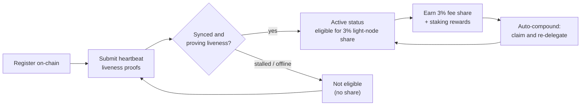

# Belohnungen und Überwachung

Ein Light Node **verdient Belohnungen** und **muss gesund bleiben**, um sie weiter zu verdienen. Diese Seite behandelt den 3%-Belohnungsanteil für Light Nodes, wie delegiertes Staking und Auto-Compounding funktionieren und wie man den Node überwacht.

## Der 3%-Anteil an den Blockbelohnungen

Die Gebührenverteilung von QoreChain reserviert einen festen **3%-Anteil für Light Nodes**, die Netzwerkdaten bereitstellen. Dies ist eines der fünf Ziele in der Belohnungsaufteilung des Protokolls — Validatoren (37%), verbrannt (30%), Treasury (20%), Staker (10%) und **Light Nodes (3%)** — on-chain erzwungen. Siehe [Tokenomics](/architecture/tokenomics) für die vollständige Aufschlüsselung.

Um für diesen Anteil berechtigt zu sein, muss ein Node **on-chain registriert sein und seine Aktivität aktiv nachweisen** über Heartbeat-Nachweise. Ein Node, der registriert, aber offline ist, verdient den Anteil nicht. Siehe [Registrierung und Lizenzierung](/light-node/registration-and-licensing) dazu, wie Registrierung und Heartbeats funktionieren.

*Belohnungsberechtigung: on-chain registrieren, Aktivität über Heartbeats nachweisen, um den Aktiv-Status zu erreichen, den 3%-Anteil verdienen und ihn dann automatisch in Stake reinvestieren.*



## Wie Belohnungen funktionieren

Über den Light-Node-Anteil hinaus verwaltet der Node den delegierten Stake und die daraus entstehenden Staking-Belohnungen. Das Verhalten wird durch den Abschnitt `[delegation]` von `config.toml` gesteuert.

### Delegiertes Staking mit Multi-Validator-Aufteilung

Du kannst über **mehrere Validatoren** delegieren, statt den Stake auf einen zu konzentrieren. Der Node verfolgt jede Delegation und den jedem Validator zugewiesenen Stake-Anteil mithilfe konfigurierbarer **Aufteilungsgewichte (Split Weights)**, sodass du das Risiko über die Menge verteilen kannst.

### Auto-Compound-Belohnungen

Der Node kann **Belohnungen automatisch einfordern und neu delegieren**, in einem konfigurierbaren Intervall. Standardmäßig ist Auto-Compound mit einem Intervall von `1h` aktiviert, mit einer minimalen Belohnungsschwelle (in `uqor`), die sich ansammeln muss, bevor ein Einfordern ausgelöst wird. Compounding wandelt verdiente Belohnungen ohne manuelles Eingreifen in zusätzlichen Stake um.

### Reputationsbewusstes Rebalancing

Wenn Rebalancing aktiviert ist, kann der Node die **Delegation automatisch zu Validatoren mit höherer Reputation verschieben**, vorbehaltlich eines konfigurierbaren Mindest-Reputationswerts. So bleibt der Stake bei Validatoren im Einsatz, die gut performen, statt bei solchen zu verbleiben, deren Leistung nachgelassen hat.

### Belohnungen und Delegationen einsehen

Die SX-Edition stellt Befehle bereit, um diesen Zustand einzusehen:

```bash
lightnode-sx delegation   # current delegations and their split
lightnode-sx rewards      # pending staking rewards (uqor)
lightnode-sx validators   # the bonded validator set
```

In der UX-Edition zeigt die Ansicht **Delegation** dieselben Delegations- und Belohnungsinformationen im Browser.

## Überwachung

Den Node gesund zu halten, ist das, was ihn für Belohnungen berechtigt hält. Es gibt drei Dinge, die es wert sind, beobachtet zu werden.

### Telemetrie

Die Echtzeit-Telemetrie umfasst Validatoren, Konsens/Netzwerk, die Bridge und Tokenomics, jeweils in einem eigenen Intervall aktualisiert (konfiguriert unter `[telemetry]` in `config.toml`). Über die CLI:

```bash
lightnode-sx status    # node and light-client sync status
lightnode-sx network   # recent synced headers and latest height
```

Die UX-Edition zeigt dieselben Daten live über ihre Ansichten **Overview**, **Network**, **Bridge** und **Tokenomics** — siehe [UX-Edition](/light-node/ux-edition).

### Sync- und Heartbeat-Zustand

Der Befehl `status` meldet die Chain-ID, die neueste Blockhöhe, ob die Chain aufholt (catching up) und die synchronisierte Höhe sowie den Sync-Zustand des Light Clients. Ein Node, der registriert, synchronisiert ist und läuft, reicht weiterhin **Heartbeat-Liveness-Nachweise** ein und bleibt so für den Belohnungsanteil berechtigt. Diese Heartbeats werden über eine **PQC-mitsignierte Transaktions-Pipeline** (hybrid Dilithium-5 / ML-DSA-87) erzeugt, konsistent mit dem standardmäßig PQC-erforderlichen Verhalten der Chain — siehe [Registrierung und Lizenzierung](/light-node/registration-and-licensing#pqc-cosigned-heartbeat-pipeline) dazu, wie die Pipeline funktioniert und wie man On-Chain-Heartbeats aktiviert. Wenn `status` anzeigt, dass der Node hängt oder nicht synchronisiert, könnte er seine Aktivität nicht nachweisen — untersuche dies, bevor die Berechtigung beeinträchtigt wird.

### Selbsttest-Zustand

Wenn du ein Problem mit dem kryptografischen Stack vermutest, führe den PQC-Selbsttest jederzeit aus:

```bash
lightnode-sx selftest
```

Er führt Keygen → Sign → Verify → Manipulationserkennung aus (fünf Prüfungen) und beendet sich bei jedem Fehler mit einem Exit-Code ungleich null. Dies ist der schnellste Weg, eine defekte oder fehlende `libqorepqc`-Bibliothek bei der Diagnose von Node-Problemen auszuschließen. Siehe [SX-Edition](/light-node/sx-edition) für die vollständige Aufschlüsselung des Selbsttests.

## Wie es weitergeht

- [Registrierung und Lizenzierung](/light-node/registration-and-licensing) — registrieren lassen und aktiv bleiben.
- [Tokenomics](/architecture/tokenomics) — das vollständige Belohnungs- und Burn-Modell.
