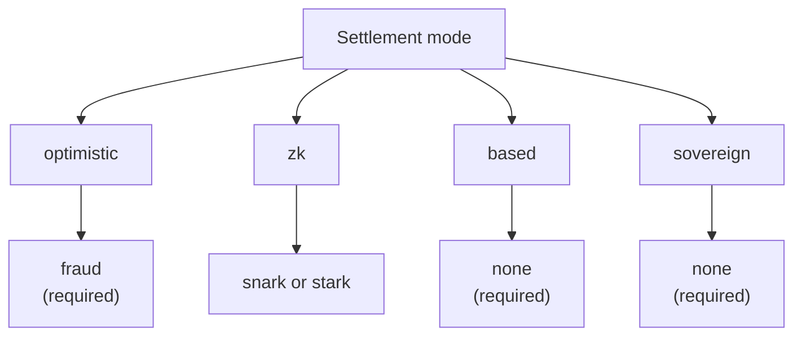

# Rollups – Überblick

Das **Rollup Development Kit (RDK)** von QoreChain — das Modul `x/rdk` — ermöglicht Entwicklern, anwendungsspezifische Rollups zu starten, die auf QoreChain abgewickelt werden. Jedes Rollup ist eine eigenständige Ausführungsumgebung mit eigener Blockzeit, virtueller Maschine, Gebührenmodell und Sequenzierung, während es zugleich die Sicherheits-, Post-Quanten-Kryptografie- und Datenverfügbarkeitsgarantien von QoreChain erbt.

:::caution
Das RDK und die Rollup-Abwicklungsschicht sind eine sich aktiv weiterentwickelnde Funktion. Behandeln Sie die in diesem Abschnitt beschriebenen Abwicklungsmodi, Beweissysteme, Presets und den Reifegrad einzelner Funktionen als Designabsicht, die Änderungen unterliegt, und validieren Sie jede Bereitstellung auf dem **`qorechain-diana`**-Testnet, bevor Sie das Mainnet anvisieren (**`qorechain-vladi`**, EVM-Chain-ID **9801**, Chain-Version **v3.1.82**).
:::

Für die tiefer liegende Modulreferenz — Modulparameter, Lebenszyklus-Interna, Burn-Integration und mehrschichtige Verankerung — siehe die Seite **[Rollup Development Kit](/architecture/rollup-development-kit)** im Abschnitt Architektur. Dieser Rollups-Abschnitt ist die entwicklerorientierte Anleitung: was das RDK ist, welches Paradigma zu wählen ist, wie bereitgestellt wird, wie Datenverfügbarkeit funktioniert und wie Auszahlungen von L2 zurück nach L1 abgewickelt werden.

---

## Was Ihnen das RDK bietet

Ein über das RDK erstelltes Rollup bündelt vier konfigurierbare Aspekte:

| Aspekt | Was es steuert | Optionen |
| ------- | ---------------- | ------- |
| **Abwicklungsmodus** | Wie die Zustandsübergänge des Rollups auf QoreChain verifiziert und finalisiert werden | `optimistic`, `zk`, `based`, `sovereign` |
| **Beweissystem** | Der kryptografische oder ökonomische Mechanismus, der die Abwicklung absichert | `fraud`, `snark`, `stark`, `none` |
| **Sequencer-Modus** | Wer Transaktionen ordnet, bevor sie abgewickelt werden | `dedicated`, `shared`, `based` |
| **Datenverfügbarkeit** | Wo Transaktionsdaten veröffentlicht werden, damit jeder den Zustand rekonstruieren kann | `native`, `celestia`, `both` |

Jedes Rollup wird mit einer eindeutigen `rollup-id` registriert, durch eine Stake-Bond in QOR abgesichert und erhält einen Lebenszyklusstatus (`pending`, `active`, `paused`, `stopped`). Siehe **[Ein Rollup bereitstellen](/rollups/deploying-a-rollup)** für den vollständigen Erstellungs- und Lebenszyklusablauf.

---

## Was das QoreChain-RDK auszeichnet

Über das Standardrepertoire eines jeden Rollup-Kits hinaus stellt das QoreChain-RDK drei Fähigkeiten bereit, die von der Layer 1 von QoreChain abhängen und die kein Kit auf Basis einer nicht post-quantensicheren, nicht KI-fähigen Basisschicht bieten kann — plus einen Watchtower-Auto-Challenger. Das RDK wird in fünf Sprachen ausgeliefert (TypeScript, Python, Go, Rust, Java), alle derzeit in **v0.4.0**.

| Alleinstellungsmerkmal | Was es leistet |
| -------------- | ------------ |
| **[Quantensichere Abwicklungsbelege](/rollups/settlement-receipts)** | Verwandeln Sie einen Abwicklungsanker in einen portablen Beleg, der **vollständig offline** unter einer Post-Quanten-Signatur (ML-DSA-87 / Dilithium-5) verifizierbar ist — Byte für Byte über alle fünf Clients hinweg. |
| **[QCAI Rollup Copilot](/rollups/qcai-copilot)** | Bündeln Sie die On-Chain-KI/RL-Dienste von QoreChain (Gebührenrichtlinien-Agent, Empfehlungen, Betrugsuntersuchungen, Circuit Breaker) zu einer schreibgeschützten Beratung in einfacher Sprache für ein Rollup. |
| **[Multi-VM-übergreifende Aufrufe](/rollups/multi-vm)** | Rufen Sie einen CosmWasm-Contract aus einem EVM-/Solidity-Rollup-Contract über das VM-übergreifende Precompile (`0x…0901`) auf. |
| **[Watchtower](/rollups/watchtower)** | Ein Auto-Challenger-Framework für optimistische Rollups, das neue Batches und Fristen von Challenge-Fenstern aufzeigt und ungültige Batches gegen Ihr Gültigkeitsprädikat anficht. |

Siehe **[Warum QoreChain-RDK](/rollups/why)** für die vollständige Begründung und Code-Beispiele.

---

## Die vier Abwicklungsparadigmen

QoreChain-RDK unterstützt vier verschiedene Abwicklungsmodi, jeder mit unterschiedlichen Vertrauensannahmen, Finalitätseigenschaften und Beweisanforderungen. Die Kombination aus Abwicklungsmodus und Beweissystem wird On-Chain validiert — eine inkompatible Paarung wird bei der Erstellung abgelehnt. Das nachstehende Diagramm ordnet jeden Abwicklungsmodus seinem gültigen Beweissystem zu.

### Optimistic

Optimistische Rollups gehen davon aus, dass eingereichte Batches standardmäßig gültig sind, und verlassen sich für die Streitbeilegung auf **Fraud Proofs**.

* **Beweissystem**: `fraud` — interaktive Fraud Proofs
* **Sequencer**: `dedicated` oder `shared`
* **Finalität**: Verzögert, bis ein konfigurierbares Challenge-Fenster ohne erfolgreiche Anfechtung abläuft
* **Streitfälle**: Jeder kann innerhalb des Fensters eine Fraud-Proof-Anfechtung gegen einen eingereichten Batch einreichen; eine erfolgreiche Anfechtung lehnt den Batch ab

### ZK (Zero-Knowledge)

ZK-Rollups hängen an jeden Batch einen kryptografischen Gültigkeitsbeweis an, der die Korrektheit des Zustandsübergangs ohne erneute Ausführung nachweist.

* **Beweissystem**: `snark` (prägnante Beweise) oder `stark` (transparente Beweise, kein Trusted Setup)
* **Sequencer**: `dedicated` oder `shared`
* **Finalität**: Bei erfolgreicher Verifizierung eines gültigen Beweises — kein Challenge-Fenster erforderlich
* **Reifegrad**: ZK- und STARK-Verifizierung reifen noch. Behandeln Sie die ZK-Abwicklung als noch nicht produktionsreif und validieren Sie auf dem Testnet. Siehe **[ZK / STARK & Auszahlungen](/rollups/zk-stark-withdrawals)** für Details.

### Based

Based-Rollups delegieren die Transaktionssequenzierung an die Proposer von QoreChain (L1) und erben dadurch die Liveness und Zensurresistenz der Host-Chain.

* **Beweissystem**: `none` — L1-Proposer sind die Quelle der Ordnungswahrheit
* **Sequencer**: `based` (erforderlich — durch On-Chain-Validierung erzwungen)
* **Finalität**: Folgt der Bestätigung der Host-Chain
* **Kompromiss**: Einfachstes Betriebsmodell, da die QoreChain-Validatoren die Sequenzierung übernehmen, auf Kosten der Latenzkontrolle eines dedizierten Sequencers

### Sovereign

Sovereign-Rollups betreiben ihren eigenen Konsens und sequenzieren selbst. Sie verankern ihren Zustand zur Überprüfbarkeit auf QoreChain, hängen für die Finalität jedoch nicht von der Host-Chain ab.

* **Beweissystem**: `none`
* **Sequencer**: vom Rollup selbst verwaltet
* **Finalität**: Unabhängig — durch den eigenen Konsens des Rollups bestimmt
* **Zustandsverankerung**: State Roots werden zur Transparenz auf QoreChain veröffentlicht, aber die Host-Chain erzwingt sie nicht

---

## Beweissystem-Kompatibilität

Der Abwicklungsmodus schränkt ein, welche Beweissysteme gültig sind. Diese Paarungen werden beim Erstellen eines Rollups erzwungen.

| Abwicklungsmodus | `fraud` | `snark` | `stark` | `none` |
| --------------- | :-----: | :-----: | :-----: | :----: |
| **optimistic**  | Erforderlich | — | — | — |
| **zk**          | — | Unterstützt | Unterstützt | — |
| **based**       | — | — | — | Erforderlich |
| **sovereign**   | — | — | — | Erforderlich |

---

## Sequencer-Modi

Der Sequencer bestimmt, wer Transaktionen innerhalb eines Rollup-Blocks vor der Abwicklung ordnet.

| Modus | Wer sequenziert | Hinweise |
| ---- | ------------- | ----- |
| **`dedicated`** | Eine einzelne benannte Betreiberadresse | Niedrigste Latenz; erfordert Vertrauen in den Betreiber für Liveness und faire Ordnung |
| **`shared`** | Ein gemeinsamer Sequencer-Satz | Ordnung über den Satz verteilt; leicht höherer Koordinationsaufwand |
| **`based`** | QoreChain-L1-Proposer | Erbt die Validatorensicherheit und Zensurresistenz der Host-Chain; erforderlich für `based`-Abwicklung |

---

## Wahl eines Paradigmas

| Wenn Sie ... möchten | Erwägen Sie |
| -------------- | -------- |
| Den einfachsten Betriebsaufbau, bei dem QoreChain-Validatoren sequenzieren | **based** |
| Schnelle Finalität mit kryptografischen Garantien (in Reifung) | **zk** (`snark` / `stark`) |
| Ein gut verstandenes Modell mit ökonomischer Streitbeilegung | **optimistic** (`fraud`) |
| Vollständige Unabhängigkeit mit eigenem Konsens, verankert zur Überprüfbarkeit | **sovereign** |

Nicht sicher, wo Sie anfangen sollen? Das RDK liefert **Preset-Profile**, die diese Entscheidungen für gängige Anwendungskategorien bündeln — siehe **[Preset-Profile](/rollups/preset-profiles)** — sowie eine `suggest-profile`-Abfrage, die aus einer Beschreibung Ihres Anwendungsfalls in einfacher Sprache eines empfiehlt.

Für Entwickler wird das RDK außerdem als öffentliches TypeScript-SDK **`@qorechain/rdk`** plus dem Scaffolder **`create-qorechain-rollup`** ausgeliefert, die dasselbe On-Chain-Modul aus dem Code heraus ansteuern — siehe **[Ein Rollup bereitstellen](/rollups/deploying-a-rollup#deploy-with-the-typescript-rdk-qorechainrdk)**.

## Verwandt

* [Ein Rollup bereitstellen](/rollups/deploying-a-rollup) — ein Rollup über die CLI oder das TypeScript-RDK starten.
* [Preset-Profile](/rollups/preset-profiles) — Ein-Klick-Bündel für gängige Anwendungskategorien.
* [Datenverfügbarkeit](/rollups/data-availability) — der native DA-Router und Blob-Speicher.
* [ZK / STARK-Auszahlungen](/rollups/zk-stark-withdrawals) — beweisgestützte Auszahlungsabläufe.
