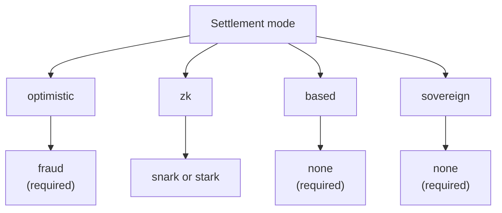

# Rollups – Überblick

Das QoreChain **Rollup Development Kit (RDK)** — das Modul `x/rdk` — ermöglicht es Entwicklern, anwendungsspezifische Rollups zu starten, die auf QoreChain abgewickelt werden. Jedes Rollup ist eine unabhängige Ausführungsumgebung mit eigener Blockzeit, eigener virtueller Maschine, eigenem Gebührenmodell und eigener Sequenzierung, erbt dabei jedoch die Sicherheits-, Post-Quanten-Kryptographie- und Datenverfügbarkeitsgarantien von QoreChain.

:::caution
Das RDK und die Rollup-Settlement-Schicht sind eine sich aktiv weiterentwickelnde Funktionalität. Betrachten Sie die in diesem Abschnitt beschriebenen Settlement-Modi, Beweissysteme, Presets und den Reifegrad einzelner Features als Designabsicht, die sich ändern kann, und validieren Sie jedes Deployment im Testnet **`qorechain-diana`**, bevor Sie das Mainnet anvisieren (**`qorechain-vladi`**, EVM-Chain-ID **9801**, Chain-Version **v3.1.92**).
:::

Für die tiefergehende Modulreferenz — Modulparameter, Lifecycle-Interna, Burn-Integration und Multilayer-Verankerung — siehe die Seite **[Rollup Development Kit](/architecture/rollup-development-kit)** im Architektur-Abschnitt. Dieser Rollups-Abschnitt ist die entwicklerorientierte Anleitung: was das RDK ist, welches Paradigma zu wählen ist, wie man deployt, wie Datenverfügbarkeit funktioniert und wie Abhebungen von L2 zurück auf L1 abgewickelt werden.

---

## Was das RDK Ihnen bietet

Ein über das RDK erstelltes Rollup bündelt vier konfigurierbare Aspekte:

| Aspekt | Was er steuert | Optionen |
| ------- | ---------------- | ------- |
| **Settlement-Modus** | Wie die Zustandsübergänge des Rollups auf QoreChain verifiziert und finalisiert werden | `optimistic`, `zk`, `based`, `sovereign` |
| **Beweissystem** | Der kryptographische oder ökonomische Mechanismus, der das Settlement absichert | `fraud`, `snark`, `stark`, `none` |
| **Sequencer-Modus** | Wer Transaktionen ordnet, bevor sie abgewickelt werden | `dedicated`, `shared`, `based` |
| **Datenverfügbarkeit** | Wo Transaktionsdaten veröffentlicht werden, damit jeder den Zustand rekonstruieren kann | `native`, `celestia`, `both` |

Jedes Rollup wird mit einer eindeutigen `rollup-id` registriert, durch einen Stake-Bond in QOR abgesichert und erhält einen Lifecycle-Status (`pending`, `active`, `paused`, `stopped`). Siehe **[Ein Rollup deployen](/rollups/deploying-a-rollup)** für den vollständigen Erstellungs- und Lifecycle-Ablauf.

---

## Was das QoreChain RDK anders macht

Über die Grundausstattung jedes Rollup-Kits hinaus bietet das QoreChain RDK drei Fähigkeiten, die auf der Layer 1 von QoreChain aufbauen und die kein Kit auf einer nicht-post-quanten, nicht-KI-fähigen Basisschicht bieten kann — plus einen Watchtower-Auto-Challenger. Das RDK erscheint in fünf Sprachen (TypeScript, Python, Go, Rust, Java), versionsgleich auf **v0.4.4** auf npm, PyPI und Maven Central (auf crates.io installieren Sie das zuletzt veröffentlichte Release oder bauen aus dem Repo). Seit v0.4.2 bringen die Presets `mainnet` und `testnet` die öffentlichen `qore.host`-Endpunkte fest eingebaut mit, sodass `createRdkClient({ network })` die Chain ohne manuelle Endpunkt-Konfiguration erreicht.

| Unterscheidungsmerkmal | Was es tut |
| -------------- | ------------ |
| **[Quantensichere Settlement-Quittungen](/rollups/settlement-receipts)** | Verwandeln Sie einen Settlement-Anker in eine portable Quittung, die **vollständig offline** unter einer Post-Quanten-Signatur (ML-DSA-87 / Dilithium-5) verifizierbar ist — Byte für Byte identisch über alle fünf Clients. |
| **[QCAI Rollup Copilot](/rollups/qcai-copilot)** | Aggregiert QoreChains On-Chain-KI/RL-Dienste (Fee-Policy-Agent, Empfehlungen, Betrugsuntersuchungen, Circuit Breaker) zu einer schreibgeschützten Beratung in Klartext für ein einzelnes Rollup. |
| **[Multi-VM Cross-VM-Aufrufe](/rollups/multi-vm)** | Rufen Sie einen CosmWasm-Contract aus einem EVM/Solidity-Rollup-Contract über das Cross-VM-Precompile (`0x…0901`) auf. |
| **[Watchtower](/rollups/watchtower)** | Ein Auto-Challenger-Framework für optimistische Rollups, das neue Batches und Fristen des Challenge-Fensters sichtbar macht und ungültige Batches gegen Ihr Gültigkeitsprädikat anficht. |

Siehe **[Warum das QoreChain RDK](/rollups/why)** für die vollständige Begründung samt Codebeispielen.

---

## Die vier Settlement-Paradigmen

Das QoreChain RDK unterstützt vier verschiedene Settlement-Modi, jeweils mit unterschiedlichen Vertrauensannahmen, Finalitätsmerkmalen und Beweisanforderungen. Die Kombination aus Settlement-Modus und Beweissystem wird on-chain validiert — eine inkompatible Paarung wird bei der Erstellung abgelehnt. Das folgende Diagramm ordnet jedem Settlement-Modus sein gültiges Beweissystem zu.

```mermaid
flowchart TD
    S["Settlement mode"]
    S --> O["optimistic"]
    S --> Z["zk"]
    S --> BA["based"]
    S --> SV["sovereign"]
    O --> OF["fraud<br/>(required)"]
    Z --> ZS["snark or stark"]
    BA --> BN["none<br/>(required)"]
    SV --> SN["none<br/>(required)"]
```

### Optimistic

Optimistische Rollups gehen standardmäßig davon aus, dass eingereichte Batches gültig sind, und stützen sich zur Streitbeilegung auf **Fraud Proofs**.

* **Beweissystem**: `fraud` — interaktive Fraud Proofs
* **Sequencer**: `dedicated` oder `shared`
* **Finalität**: Verzögert, bis ein konfigurierbares Challenge-Fenster ohne erfolgreiche Anfechtung abläuft
* **Anfechtungen**: Jeder kann innerhalb des Fensters eine Fraud-Proof-Anfechtung gegen einen eingereichten Batch einreichen; eine erfolgreiche Anfechtung verwirft den Batch

### ZK (Zero-Knowledge)

ZK-Rollups fügen jedem Batch einen kryptographischen Gültigkeitsbeweis bei, der die Korrektheit des Zustandsübergangs ohne erneute Ausführung belegt.

* **Beweissystem**: `snark` (kompakte Beweise) oder `stark` (transparente Beweise, kein Trusted Setup)
* **Sequencer**: `dedicated` oder `shared`
* **Finalität**: Bei erfolgreicher Beweisverifikation — kein Challenge-Fenster erforderlich
* **Reifegrad**: ZK- und STARK-Verifikation reifen noch. Betrachten Sie ZK-Settlement als noch nicht produktionsgehärtet und validieren Sie im Testnet. Siehe **[ZK / STARK & Abhebungen](/rollups/zk-stark-withdrawals)** für Details.

### Based

Based-Rollups delegieren die Transaktionssequenzierung an die Proposer von QoreChain (L1) und erben so die Liveness und Zensurresistenz der Host-Chain.

* **Beweissystem**: `none` — L1-Proposer sind die maßgebliche Quelle der Reihenfolge
* **Sequencer**: `based` (erforderlich — durch On-Chain-Validierung erzwungen)
* **Finalität**: Folgt der Bestätigung der Host-Chain
* **Kompromiss**: Einfachstes Betriebsmodell, da die QoreChain-Validatoren die Sequenzierung übernehmen — um den Preis der Latenzkontrolle eines dedizierten Sequencers

### Sovereign

Sovereign-Rollups betreiben ihren eigenen Konsens und sequenzieren selbst. Sie verankern ihren Zustand zur Verifizierbarkeit auf QoreChain, sind für die Finalität jedoch nicht von der Host-Chain abhängig.

* **Beweissystem**: `none`
* **Sequencer**: vom Rollup selbst verwaltet
* **Finalität**: Unabhängig — bestimmt durch den eigenen Konsens des Rollups
* **Zustandsverankerung**: State Roots werden zur Transparenz auf QoreChain veröffentlicht, aber die Host-Chain erzwingt sie nicht

---

## Beweissystem-Kompatibilität

Der Settlement-Modus schränkt ein, welche Beweissysteme gültig sind. Diese Paarungen werden bei der Erstellung eines Rollups erzwungen.

| Settlement-Modus | `fraud` | `snark` | `stark` | `none` |
| --------------- | :-----: | :-----: | :-----: | :----: |
| **optimistic**  | Erforderlich | — | — | — |
| **zk**          | — | Unterstützt | Unterstützt | — |
| **based**       | — | — | — | Erforderlich |
| **sovereign**   | — | — | — | Erforderlich |

---

## Sequencer-Modi

Der Sequencer bestimmt, wer Transaktionen innerhalb eines Rollup-Blocks vor dem Settlement ordnet.

| Modus | Wer sequenziert | Hinweise |
| ---- | ------------- | ----- |
| **`dedicated`** | Eine einzelne designierte Operator-Adresse | Geringste Latenz; erfordert Vertrauen in den Operator hinsichtlich Liveness und fairer Reihenfolge |
| **`shared`** | Ein gemeinsam genutztes Sequencer-Set | Reihenfolge über das Set verteilt; etwas höherer Koordinationsaufwand |
| **`based`** | QoreChain-L1-Proposer | Erbt die Validator-Sicherheit und Zensurresistenz der Host-Chain; erforderlich für `based`-Settlement |

---

## Ein Paradigma wählen

| Wenn Sie ... möchten | Erwägen Sie |
| -------------- | -------- |
| Das einfachste Betriebsmodell, bei dem QoreChain-Validatoren sequenzieren | **based** |
| Schnelle Finalität mit kryptographischen Garantien (noch reifend) | **zk** (`snark` / `stark`) |
| Ein bewährtes Modell mit ökonomischer Streitbeilegung | **optimistic** (`fraud`) |
| Volle Unabhängigkeit mit eigenem Konsens, verankert zur Verifizierbarkeit | **sovereign** |

Nicht sicher, wo Sie anfangen sollen? Das RDK liefert **Preset-Profile** mit, die diese Entscheidungen für gängige Anwendungskategorien bündeln — siehe **[Preset-Profile](/rollups/preset-profiles)** — sowie eine `suggest-profile`-Abfrage, die anhand einer Beschreibung Ihres Anwendungsfalls in Klartext ein Profil empfiehlt.

Für Entwickler erscheint das RDK außerdem als öffentliches TypeScript-SDK **`@qorechain/rdk`** plus dem Scaffolder **`create-qorechain-rollup`**, die dasselbe On-Chain-Modul aus Code heraus ansteuern — siehe **[Ein Rollup deployen](/rollups/deploying-a-rollup#deploy-with-the-typescript-rdk-qorechainrdk)**.

## Verwandte Themen

* [Ein Rollup deployen](/rollups/deploying-a-rollup) — ein Rollup über die CLI oder das TypeScript-RDK starten.
* [Preset-Profile](/rollups/preset-profiles) — Ein-Klick-Bundles für gängige Anwendungskategorien.
* [Datenverfügbarkeit](/rollups/data-availability) — der native DA-Router und Blob-Speicher.
* [ZK / STARK Abhebungen](/rollups/zk-stark-withdrawals) — beweisgestützte Abhebungsabläufe.
