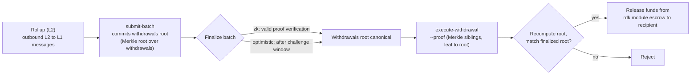

# ZK / STARK & Auszahlungen

Diese Seite behandelt zwei verwandte Themen: die **ZK-Beweissysteme** (`snark` und `stark`), die von ZK-gesettelten Rollups verwendet werden, und den **L2 → L1-Auszahlungsablauf**, der Gelder von einem Rollup zurück auf QoreChain bewegt, sobald ein Batch finalisiert ist.

:::caution
Die ZK- und STARK-Verifikation ist ein sich aktiv weiterentwickelnder Teil des RDK. Behandle die hier beschriebenen Beweissysteme und den Auszahlungsablauf als Designabsicht, validiere im **`qorechain-diana`**-Testnet und gehe noch nicht von produktionsgehärteten kryptografischen Garantien im Mainnet aus.
:::

---

## ZK-Beweissysteme

Ein ZK-gesetteltes Rollup (Settlement-Modus `zk`) hängt an jeden Settlement-Batch einen Gültigkeitsbeweis an, der die Korrektheit des State-Übergangs nachweist, ohne die Transaktionen des Rollups erneut auszuführen. ZK-Settlement unterstützt zwei Beweissysteme:

| Beweissystem | Eigenschaften |
| ------------ | --------------- |
| **`snark`** | Prägnante Beweise |
| **`stark`** | Transparente Beweise — kein Trusted Setup |

Der Settlement-Modus `zk` erfordert eines von `snark` oder `stark`; die Paarung wird on-chain erzwungen, wenn das Rollup erstellt wird. Im Gegensatz dazu nutzt `optimistic`-Settlement das Beweissystem `fraud`, und `based`- sowie `sovereign`-Settlement nutzen `none`. Siehe **[Rollups-Überblick](/rollups/overview)** für die vollständige Kompatibilitätsmatrix.

### Finalität

Anders als Optimistic Rollups — die ein Fraud-Proof-Challenge-Window abwarten — kann ein ZK-Batch bei **erfolgreicher Beweisverifikation** finalisieren, ohne ein Disput-Fenster. Das ist der zentrale Trade-off von ZK-Settlement: stärkere, schnellere Finalität im Tausch gegen die Kosten und Komplexität der Beweiserzeugung.

### Reifegrad

Die ZK- und STARK-Beweisverifikation befindet sich noch in der Reifung. Behandle ZK-Settlement als **noch nicht produktionsgehärtet**: Prototypisiere und validiere im Testnet und verfolge die Release Notes des RDK zum Status der vollständigen Beweisverifikation, bevor du dich für wertbehaftete Mainnet-Rollups darauf verlässt.

---

## Wie Batches Auszahlungen tragen

Wenn ein Rollup einen Batch settlet, kann dieser Batch auch die ausgehenden Cross-Layer-Nachrichten des Rollups committen — seine **L2 → L1-Auszahlungen**. Konzeptionell:

* Ein finalisierter Batch kann ein Commitment zu seiner Menge an Auszahlungen tragen (eine Merkle-Root über die Auszahlungsnachrichten des Batches).
* Jede einzelne Auszahlung ist ein Blatt unter dieser Root, identifiziert durch ihren Batch-Index und einen Auszahlungs-Index.
* Sobald der Batch finalisiert ist, kann jede Partei beweisen, dass ein bestimmtes Auszahlungs-Blatt unter der committeten Root enthalten ist, und die Auszahlung auslösen.

Deshalb hängen Auszahlungen vom Settlement ab: Eine Auszahlung kann nur gegen einen **finalisierten** Batch ausgeführt werden, denn erst die Finalisierung macht die committete Auszahlungs-Root kanonisch.

Wie Batches eingereicht und finalisiert werden — einschließlich `submit-batch` und des `challenge-batch`-Disputpfads für Optimistic Rollups — siehe **[Ein Rollup bereitstellen](/rollups/deploying-a-rollup)**.

---

## Eine Auszahlung ausführen: `execute-withdrawal`

Der Befehl `execute-withdrawal` finalisiert eine L2 → L1-Auszahlung gegen die Auszahlungs-Root eines finalisierten Batches. Er beweist, dass ein Auszahlungs-Blatt in dieser Root committet ist, und zahlt den Empfänger aus dem Escrow des rdk-Moduls aus. Die Aktion ist **permissionless** — jeder kann einen gültigen Beweis einreichen.

```bash
qorechaind tx rdk execute-withdrawal \
  [rollup-id] [batch-index] [withdrawal-index] [recipient] [denom] [amount] \
  --proof <sibling-hash-1>,<sibling-hash-2>,... \
  --from mykey \
  --chain-id qorechain-diana \
  --fees 500uqor
```

**Positionsargumente:**

| Argument | Beschreibung |
| -------- | ----------- |
| `rollup-id` | Das Rollup, zu dem die Auszahlung gehört |
| `batch-index` | Der finalisierte Batch, dessen Auszahlungs-Root diese Auszahlung committet |
| `withdrawal-index` | Der Index des Auszahlungs-Blatts innerhalb dieses Batches |
| `recipient` | Die Adresse, an die ausgezahlt wird |
| `denom` | Die auszuzahlende Denomination |
| `amount` | Der auszuzahlende Betrag |

**Flag:**

| Flag | Beschreibung |
| ---- | ----------- |
| `--proof` | Kommagetrennte Hex-Merkle-Geschwister-Hashes, geordnet von Blatt zu Root, die beweisen, dass das Auszahlungs-Blatt in der Auszahlungs-Root des Batches committet ist |

Der `--proof`-Wert ist der Inklusionsbeweis: die Geschwister-Hashes entlang des Pfades vom Auszahlungs-Blatt hinauf zur committeten Auszahlungs-Root des Batches. Das Modul berechnet die Root aus dem Blatt und den gelieferten Geschwistern neu und prüft sie gegen die committete Root des finalisierten Batches, bevor es die hinterlegten Gelder freigibt.

---

## End-to-End-Auszahlungsablauf

*Der Weg von L2 nach L1: Ein Settlement-Batch committet eine Auszahlungs-Root, der Batch finalisiert, dann gibt ein permissionless Inklusionsbeweis die hinterlegten Gelder auf QoreChain frei.*



1. **Einen Batch settlen.** Der Rollup-Operator reicht mit `submit-batch` einen Settlement-Batch ein. Der Batch kann eine Auszahlungs-Root über seine ausgehenden L2 → L1-Nachrichten committen.
2. **Finalisieren.** Der Batch finalisiert gemäß dem Settlement-Modus des Rollups — bei erfolgreicher Beweisverifikation für `zk` oder nach dem Challenge-Window für `optimistic` (während dessen `challenge-batch` ihn bestreiten kann).
3. **Beweisen und ausführen.** Sobald finalisiert, reicht jeder `execute-withdrawal` mit dem Merkle-Inklusionsbeweis (`--proof`) für das bestimmte Auszahlungs-Blatt ein. Das Modul verifiziert die Inklusion gegen die Auszahlungs-Root des finalisierten Batches und zahlt den Empfänger aus dem Escrow aus.

Da Schritt 3 permissionless und beweisbasiert ist, hängt eine Auszahlung nicht von der Kooperation des Rollup-Operators ab, sobald der sie tragende Batch finalisiert ist.

---

## Verwandt

* **[Rollups-Überblick](/rollups/overview)** — Settlement-Paradigmen und die Kompatibilitätsmatrix der Beweissysteme.
* **[Ein Rollup bereitstellen](/rollups/deploying-a-rollup)** — `submit-batch`- und `challenge-batch`-Operator-Befehle.
* **[Rollup Development Kit](/architecture/rollup-development-kit)** — die Modulreferenz auf niedrigerer Ebene.
