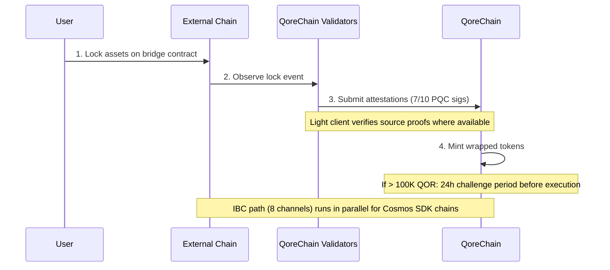

# Arquitectura del puente

El módulo `x/bridge` está diseñado para conectar QoreChain con el ecosistema blockchain más amplio a través de **37 configuraciones de cadena QCB (QoreChain Bridge) y 8 canales IBC (Inter-Blockchain Communication)**. Cada operación del puente está protegida por criptografía poscuántica.

:::caution
El puente entre cadenas se encuentra **actualmente en testnet y pendiente: aún no es un sistema de producción**. Las configuraciones de cadena, los clientes ligeros y los flujos descritos a continuación reflejan el puente tal como está diseñado y como se ha probado en testnet. La conectividad externa se está implementando de forma progresiva; trata todos los objetivos como intención de diseño y no como garantías en vivo de mainnet.
:::

## Visión general de las conexiones

QoreChain está diseñado para admitir dos protocolos de puente que operan en paralelo:

| Protocolo | Conexiones          | Modelo de seguridad                       | Caso de uso                                |
| -------- | -------------------- | ------------------------------------ | --------------------------------------- |
| **IBC**  | 8 canales           | IBC estándar + firmas PQC de paquetes | Cadenas compatibles con Cosmos SDK            |
| **QCB**  | 37 configuraciones de cadena     | Multifirma 7-de-10 Dilithium-5         | Cadenas no IBC (EVM, Solana, TON, etc.) |

Las **37 configuraciones de cadena QCB** incluyen **36 cadenas externas** más **la propia QoreChain** como configuración nativa/loopback (utilizada para el enrutamiento interno y la liquidación autorreferencial). Los 8 canales IBC se conectan a cadenas compatibles con Cosmos SDK.

## Canales IBC

QoreChain está diseñado para mantener conexiones IBC con las siguientes 8 cadenas, retransmitidas a través de Hermes v1.x:

| Cadena      | Descripción                    |
| ---------- | ------------------------------ |
| Cosmos Hub | Conexión principal de hub         |
| Osmosis    | Enrutamiento de liquidez de DEX          |
| Noble      | Emisión nativa de USDC            |
| Celestia   | Capa de disponibilidad de datos        |
| Stride     | Staking líquido                 |
| Akash      | Cómputo descentralizado          |
| Babylon    | Protocolo de restaking de BTC         |
| Injective  | Interoperabilidad de DeFi / libro de órdenes |

### Configuración del relayer IBC

* **Software del relayer**: Hermes v1.x
* **Actualizaciones de cliente**: Actualización automática del cliente ligero
* **Detección de comportamiento indebido**: Habilitada — el relayer monitorea la equivocación
* **Limpieza de paquetes**: Cada 100 bloques, se limpian los paquetes IBC pendientes
* **Mejora PQC**: Cada paquete IBC originado en QoreChain incluye una firma Dilithium-5 opcional para seguridad cuántica futura. Las cadenas receptoras compatibles con PQC pueden verificar esta firma junto con la verificación IBC estándar.

## Protocolo QCB (QoreChain Bridge)

El protocolo QCB utiliza una arquitectura de hub y radios protegida por criptografía poscuántica. QoreChain actúa como el hub, con configuraciones de radio para cada cadena externa más una configuración nativa/loopback para la propia QoreChain.

### Configuraciones de cadenas externas (36)

El protocolo QCB está diseñado para apuntar a las siguientes 36 cadenas externas. Combinadas con la propia configuración nativa/loopback de QoreChain, esto da **37 configuraciones de cadena QCB en total (incluida la propia QoreChain)**.

**Cadenas de referencia (10)**

Ethereum, Solana, TON, BSC, Avalanche, Polygon, Arbitrum, Optimism, Base, Sui.

**Cadenas de la familia EVM (14)**

zkSync Era, Linea, Scroll, Blast, Mantle, Hyperliquid, Berachain, Sonic, Sei, Monad, Plasma, Filecoin FVM, Cronos, Kaia.

**Cadenas no EVM (5)**

Starknet, XRP Ledger, Stellar, Hedera, Algorand.

**Cadenas pendientes (7)**

NEAR, Bitcoin, Cardano, Polkadot, Tezos, Tron, Aptos.

:::note
Verificación del conteo: 10 de referencia + 14 de la familia EVM + 5 no EVM + 7 pendientes = **36 cadenas externas**. Al añadir la propia configuración nativa/loopback de QoreChain se obtienen **37 configuraciones de cadena QCB**.
:::

### Formatos de dirección

El protocolo QCB clasifica las cadenas por tipo para validar las direcciones de destino:

| Tipo de cadena   | Cadenas de ejemplo                                                          | Formato de dirección                                     |
| ------------ | ----------------------------------------------------------------------- | -------------------------------------------------- |
| `evm`        | Ethereum, BSC, Avalanche, Polygon, Arbitrum, Optimism, Base             | `0x` + 40 caracteres hexadecimales                           |
| `solana`     | Solana                                                                  | Base58, 32-44 caracteres                           |
| `ton`        | TON                                                                     | `EQ` + codificado en base64                              |
| `sui_move`   | Sui                                                                     | `0x` + 64 caracteres hexadecimales                           |
| `aptos_move` | Aptos                                                                   | `0x` + 64 caracteres hexadecimales                           |
| `bitcoin`    | Bitcoin                                                                 | Bech32 (`bc1`), P2SH (`3...`) o heredado (`1...`)  |
| `near`       | NEAR Protocol                                                           | Sufijo `.near` o implícito                         |
| `cardano`    | Cardano                                                                 | `addr1` (pago) o `stake1` (staking)            |
| `polkadot`   | Polkadot                                                                | Codificado en SS58                                       |
| `tezos`      | Tezos                                                                   | `tz1`/`tz2`/`tz3` (implícito) o `KT1` (originado) |
| `tron`       | TRON                                                                    | `T` + base58, 34 caracteres                       |

## Clientes ligeros

Para verificar los eventos de cadenas externas sin necesidad de confianza, el puente está diseñado para ejecutar clientes ligeros on-chain adaptados al consenso y al sistema de pruebas de cada cadena de origen. Estos clientes ligeros permiten a QoreChain validar depósitos y retiros sin depender únicamente de las atestaciones de los validadores.

| Cliente ligero            | Cadena de origen        | Primitivas de verificación                                              |
| ----------------------- | ------------------- | ------------------------------------------------------------------- |
| **Cliente ligero de Ethereum** | Ethereum / EVM L1 | Verificación de firmas BLS12-381, serialización SSZ, pruebas de estado MPT |
| **Bitcoin SPV**         | Bitcoin             | Simplified Payment Verification frente a las cabeceras de bloque                |
| **Starknet STARK**      | Starknet            | Verificación de pruebas STARK de las transiciones de estado de Starknet              |
| **Sui BLS**             | Sui                 | Verificación de firmas agregadas BLS de los checkpoints de Sui             |
| **Wormhole / Solana VAA** | Solana (vía Wormhole) | Verificación de la firma de los guardianes de Verified Action Approval (VAA)     |

## Flujo de depósito (de externa a QoreChain)

La secuencia a continuación muestra un depósito QCB: los activos se bloquean en una cadena externa, los validadores de QoreChain envían atestaciones firmadas con PQC (7-de-10 Dilithium-5) y se acuñan tokens envueltos. En cambio, las cadenas compatibles con Cosmos SDK utilizan la ruta IBC paralela (8 canales, con firmas de paquetes Dilithium-5 opcionales). Ambas rutas están en testnet/pendientes.



```
External Chain          QoreChain Validators           QoreChain
     |                         |                          |
     | 1. Lock assets on       |                          |
     |    bridge contract      |                          |
     |------------------------>|                          |
     |                         | 2. Observe & attest      |
     |                         |    (7/10 PQC sigs)       |
     |                         |------------------------->|
     |                         |                          | 3. Mint wrapped
     |                         |                          |    tokens
     |                         |                          |
     |                         |    [If > 100K QOR]       |
     |                         |    24h challenge period   |
     |                         |    before execution       |
```

1. **Bloqueo** — El usuario bloquea los activos en el contrato del puente en la cadena externa.
2. **Atestación** — Los validadores del puente observan la transacción de bloqueo y envían atestaciones firmadas con Dilithium-5. Se requiere un mínimo de **7 de 10** atestaciones de validadores. Cuando hay un cliente ligero disponible para la cadena de origen, el evento de bloqueo se verifica además frente a las propias pruebas de la cadena.
3. **Acuñación** — Una vez alcanzado el umbral de atestación, se acuñan tokens envueltos en QoreChain.
4. **Periodo de impugnación** — Para las transferencias que superan el equivalente a 100.000 QOR, se aplica un **periodo de impugnación de 24 horas** antes de la ejecución. Durante esta ventana, los validadores pueden señalar actividad sospechosa.

## Flujo de retiro (de QoreChain a externa)

```
QoreChain               QoreChain Validators           External Chain
     |                         |                          |
     | 1. Burn wrapped tokens  |                          |
     |------------------------>|                          |
     |                         | 2. Attest burn           |
     |                         |    (7/10 PQC sigs)       |
     |                         |------------------------->|
     |                         |                          | 3. Unlock original
     |                         |                          |    assets
```

1. **Quema** — El usuario quema los tokens envueltos en QoreChain.
2. **Atestación** — Los validadores atestiguan el evento de quema con firmas Dilithium-5 (umbral 7/10).
3. **Desbloqueo** — Una vez alcanzado el umbral, los activos originales se desbloquean en la cadena externa.

Todas las comisiones del puente recaudadas durante los retiros se enrutan al módulo `x/burn` a través del canal de quema `bridge_fee` (el 100% de las comisiones del puente se quema).

### Flujo de retiro L2 → L1 (liquidación de rollups)

El puente también está diseñado para liquidar **retiros de rollups (L2) de vuelta a su cadena anfitriona (L1)**. Los rollups desplegados a través del [Kit de desarrollo de rollups](/architecture/rollup-development-kit) anclan periódicamente su estado a QoreChain; el puente consume esos anclajes finalizados para autorizar retiros del rollup a la cadena anfitriona:

1. Un usuario inicia un retiro en el rollup (L2), que se incluye en un lote de liquidación.
2. El lote se ancla a QoreChain y se prueba/finaliza según el modo de liquidación del rollup (por ejemplo, tras la expiración de la ventana de impugnación optimista o tras la verificación de una prueba válida).
3. Una vez finalizado el anclaje, el retiro pasa a ser reclamable y los activos correspondientes se liberan en la cadena anfitriona (L1) a través de la ruta estándar de quema y atestación.

Esto vincula la finalidad del rollup directamente a las garantías de liquidación de la cadena anfitriona, de modo que los retiros de L2 no pueden liberarse antes de que el estado correspondiente de L2 se haya liquidado de forma irreversible.

## Arquitectura de seguridad

### Multifirma PQC

Todas las operaciones del puente QCB requieren un **umbral de 7 de 10** firmas poscuánticas Dilithium-5 de validadores de puente registrados. Cada validador de puente se registra con:

* Una dirección de validador de QoreChain
* Una clave pública Dilithium-5 (2.592 bytes)
* Una lista de cadenas compatibles
* Una puntuación de reputación (mantenida por `x/reputation`)

### Interruptores de circuito

Cada cadena conectada tiene protecciones de interruptor de circuito independientes:

| Protección                | Descripción                                                                          |
| ------------------------- | ------------------------------------------------------------------------------------ |
| **Límite por transferencia única** | Monto máximo para cualquier operación individual del puente por cadena                         |
| **Límite agregado diario** | Tope de volumen total por cadena por ventana de 24 horas                                        |
| **Pausa manual**          | Detención de emergencia por cadena activada por gobernanza o por un validador                           |
| **Detección de anomalías**     | Pausa automática si hay >50 operaciones en una ventana corta o si el volumen supera 5x el límite diario |

El estado del interruptor de circuito se rastrea por cadena e incluye: transferencia única máxima, límite diario, uso diario actual, última altura de reinicio y estado de pausa con motivo.

### Periodo de impugnación

Para transferencias grandes (>100.000 QOR equivalente, configurable mediante `large_transfer_threshold`):

* Se aplica un **periodo de impugnación de 24 horas** (86.400 segundos) después de alcanzar el umbral de atestación.
* Durante esta ventana, cualquier validador puede señalar la operación.
* Si no se impugna, la operación se ejecuta automáticamente una vez expirado el periodo.
* Las operaciones impugnadas se congelan para revisión por gobernanza.

### Optimización de rutas con IA

El módulo del puente se integra con el subsistema de IA para la optimización de rutas. Para las transferencias que pueden atravesar múltiples rutas (por ejemplo, de la cadena A a la cadena B a través de un intermediario), el optimizador de rutas evalúa:

* Comisiones estimadas a lo largo de las rutas
* Tiempo de finalización estimado
* Puntuación de seguridad por ruta
* Nivel de confianza de la estimación

## Endpoints de la API REST

A partir de la versión de cadena **v3.1.77**, el estado del puente también es consultable **de solo lectura a través de REST** mediante grpc-gateway bajo el prefijo `/qorechain/bridge/v1/...` (`config`, `chains`, `chains/{chain_id}`, `validators`, `validators/{address}`, `operations`, `operations/{id}`) — anteriormente solo gRPC. Estos sirven JSON on-chain real sobre HTTP para exploradores y telemetría de nodos ligeros. Consulta [Endpoints REST / gRPC](/api-reference/rest-grpc-endpoints#bridge-module) para ver la lista completa.

| Método | Endpoint                                           | Descripción                                      |
| ------ | -------------------------------------------------- | ------------------------------------------------ |
| GET    | `/bridge/v1/chains`                                | Listar todas las configuraciones de cadena compatibles          |
| GET    | `/bridge/v1/chains/{chain_id}`                     | Obtener la configuración de una cadena específica           |
| GET    | `/bridge/v1/validators`                            | Listar todos los validadores de puente registrados            |
| GET    | `/bridge/v1/operations`                            | Listar todas las operaciones del puente (las más recientes primero)   |
| GET    | `/bridge/v1/operations/{operation_id}`             | Obtener los detalles de una operación específica              |
| GET    | `/bridge/v1/locked/{chain}/{asset}`                | Obtener los montos bloqueados/acuñados para un par cadena/activo |
| GET    | `/bridge/v1/circuit-breakers`                      | Listar todos los estados de los interruptores de circuito            |
| GET    | `/bridge/v1/estimate/{from}/{to}/{asset}/{amount}` | Obtener una estimación de ruta optimizada por IA                  |

## Eventos del puente

El módulo del puente emite los siguientes eventos on-chain:

| Tipo de evento                    | Descripción                                     |
| ----------------------------- | ----------------------------------------------- |
| `bridge_deposit`              | Nueva operación de depósito creada                   |
| `bridge_withdraw`             | Nueva operación de retiro creada                |
| `bridge_attestation`          | Atestación de validador enviada                 |
| `bridge_operation_executed`   | Operación finalizada y ejecutada                |
| `bridge_circuit_breaker_trip` | Interruptor de circuito activado o desactivado        |
| `bridge_validator_registered` | Nuevo validador de puente registrado                 |
| `bridge_pqc_verification`     | Resultado de la verificación de firma PQC (paquetes IBC) |

## Relacionado

* [Puentear activos](/user-guide/bridging-assets) — mueve activos entre cadenas paso a paso.
* [Puente del Dashboard](/dashboard/bridge) — la interfaz del puente para usuarios cotidianos.
* [Restaking de BTC vía Babylon](/architecture/btc-restaking-babylon) — seguridad respaldada por Bitcoin.
* [Seguridad poscuántica](/architecture/post-quantum-security) — verificación PQC en paquetes IBC.
