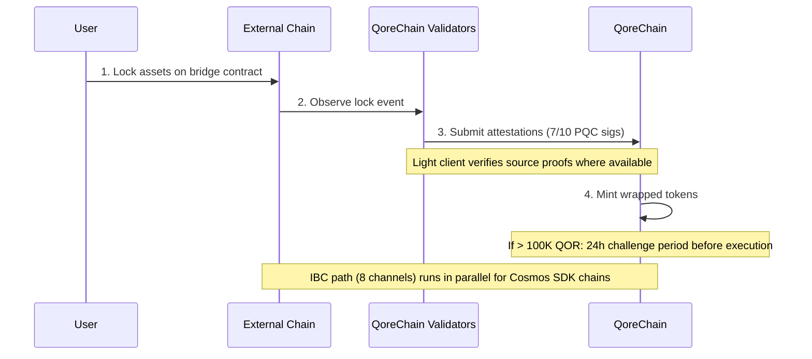

# Arquitectura del Puente

El módulo `x/bridge` está diseñado para conectar QoreChain con el ecosistema blockchain más amplio mediante **37 configuraciones de cadena QCB (QoreChain Bridge) y 8 canales IBC (Inter-Blockchain Communication)**. Cada operación del puente está asegurada con criptografía poscuántica.

:::caution
El puente entre cadenas se encuentra **actualmente en testnet y pendiente — todavía no es un sistema de producción**. Las configuraciones de cadena, los light clients y los flujos descritos a continuación reflejan el puente tal como está diseñado y tal como se ejercita en testnet. La conectividad externa se está implementando de forma progresiva; trate todos los objetivos como intención de diseño y no como garantías en vivo de mainnet.
:::

## Resumen de Conexiones

QoreChain está diseñado para admitir dos protocolos de puente operando en paralelo:

| Protocolo | Conexiones           | Modelo de Seguridad                  | Caso de Uso                             |
| -------- | -------------------- | ------------------------------------ | --------------------------------------- |
| **IBC**  | 8 canales            | IBC estándar + firmas PQC de paquetes | Cadenas compatibles con Cosmos SDK      |
| **QCB**  | 37 configs de cadena | multifirma Dilithium-5 7-de-10        | Cadenas no IBC (EVM, Solana, TON, etc.) |

Las **37 configuraciones de cadena QCB** incluyen **36 cadenas externas** más **la propia QoreChain** como configuración nativa/loopback (usada para el enrutamiento interno y la liquidación autorreferencial). Los 8 canales IBC conectan con cadenas compatibles con Cosmos SDK.

## Canales IBC

QoreChain está diseñado para mantener conexiones IBC con las siguientes 8 cadenas, retransmitidas vía Hermes v1.x:

| Cadena     | Descripción                    |
| ---------- | ------------------------------ |
| Cosmos Hub | Conexión principal del hub     |
| Osmosis    | Enrutamiento de liquidez DEX   |
| Noble      | Emisión nativa de USDC         |
| Celestia   | Capa de disponibilidad de datos |
| Stride     | Liquid staking                 |
| Akash      | Cómputo descentralizado        |
| Babylon    | Protocolo de restaking de BTC  |
| Injective  | Interoperabilidad DeFi / libro de órdenes |

### Configuración del Relayer IBC

* **Software de relayer**: Hermes v1.x
* **Actualizaciones de cliente**: Refresco automático del light client
* **Detección de comportamiento indebido**: Habilitada — el relayer monitorea la equivocación
* **Limpieza de paquetes**: Cada 100 bloques se limpian los paquetes IBC pendientes
* **Mejora PQC**: Cada paquete IBC originado en QoreChain incluye una firma Dilithium-5 opcional para seguridad cuántica a futuro. Las cadenas receptoras compatibles con PQC pueden verificar esta firma junto con la verificación IBC estándar.

## Protocolo QCB (QoreChain Bridge)

El protocolo QCB usa una arquitectura hub-and-spoke asegurada con criptografía poscuántica. QoreChain actúa como el hub, con configuraciones spoke para cada cadena externa más una configuración nativa/loopback para la propia QoreChain.

### Configuraciones de Cadenas Externas (36)

El protocolo QCB está diseñado para apuntar a las siguientes 36 cadenas externas. Combinadas con la propia configuración nativa/loopback de QoreChain, esto da **37 configs de cadena QCB en total (incluyendo la propia QoreChain)**.

**Cadenas base (10)**

Ethereum, Solana, TON, BSC, Avalanche, Polygon, Arbitrum, Optimism, Base, Sui.

**Cadenas de la familia EVM (14)**

zkSync Era, Linea, Scroll, Blast, Mantle, Hyperliquid, Berachain, Sonic, Sei, Monad, Plasma, Filecoin FVM, Cronos, Kaia.

**Cadenas no EVM (5)**

Starknet, XRP Ledger, Stellar, Hedera, Algorand.

**Cadenas pendientes (7)**

NEAR, Bitcoin, Cardano, Polkadot, Tezos, Tron, Aptos.

:::note
Verificación de conteo: 10 base + 14 familia EVM + 5 no EVM + 7 pendientes = **36 cadenas externas**. Sumando la propia configuración nativa/loopback de QoreChain se obtienen **37 configs de cadena QCB**.
:::

### Formatos de Dirección

El protocolo QCB clasifica las cadenas por tipo para validar las direcciones de destino:

| Tipo de Cadena | Cadenas de Ejemplo                                                     | Formato de Dirección                               |
| ------------ | ----------------------------------------------------------------------- | -------------------------------------------------- |
| `evm`        | Ethereum, BSC, Avalanche, Polygon, Arbitrum, Optimism, Base             | `0x` + 40 caracteres hex                           |
| `solana`     | Solana                                                                  | Base58, 32-44 caracteres                           |
| `ton`        | TON                                                                     | `EQ` + codificado en base64                        |
| `sui_move`   | Sui                                                                     | `0x` + 64 caracteres hex                           |
| `aptos_move` | Aptos                                                                   | `0x` + 64 caracteres hex                           |
| `bitcoin`    | Bitcoin                                                                 | Bech32 (`bc1`), P2SH (`3...`), o legado (`1...`)   |
| `near`       | NEAR Protocol                                                           | sufijo `.near` o implícita                         |
| `cardano`    | Cardano                                                                 | `addr1` (pago) o `stake1` (staking)                |
| `polkadot`   | Polkadot                                                                | codificada en SS58                                 |
| `tezos`      | Tezos                                                                   | `tz1`/`tz2`/`tz3` (implícita) o `KT1` (originada)  |
| `tron`       | TRON                                                                    | `T` + base58, 34 caracteres                        |

## Light Clients

Para verificar eventos de cadenas externas sin necesidad de confianza, el puente está diseñado para ejecutar light clients on-chain adaptados al sistema de consenso y de pruebas de cada cadena de origen. Estos light clients permiten a QoreChain validar depósitos y retiros sin depender únicamente de las atestaciones de los validadores.

| Light Client            | Cadena de Origen    | Primitivas de Verificación                                          |
| ----------------------- | ------------------- | ------------------------------------------------------------------- |
| **Ethereum light client** | Ethereum / EVM L1 | Verificación de firma BLS12-381, serialización SSZ, pruebas de estado MPT |
| **Bitcoin SPV**         | Bitcoin             | Simplified Payment Verification contra las cabeceras de bloque      |
| **Starknet STARK**      | Starknet            | Verificación de pruebas STARK de las transiciones de estado de Starknet |
| **Sui BLS**             | Sui                 | Verificación de firma agregada BLS de los checkpoints de Sui        |
| **Wormhole / Solana VAA** | Solana (vía Wormhole) | Verificación de firma de guardián Verified Action Approval (VAA)  |

## Flujo de Depósito (Externo a QoreChain)

La secuencia siguiente muestra un depósito QCB: los activos se bloquean en una cadena externa, los validadores de QoreChain envían atestaciones firmadas con PQC (7-de-10 Dilithium-5) y se acuñan tokens envueltos. Las cadenas compatibles con Cosmos SDK usan en su lugar la ruta IBC paralela (8 canales, con firmas Dilithium-5 opcionales de paquetes). Ambas rutas están en testnet/pendientes.



```
External Chain          QoreChain Validators           QoreChain
     |                         |                          |
     | 1. Lock assets on       |                          |
     |    bridge contract      |                          |
     |------------------------>|                          |
     |                         | 2. Observe & attest      |
     |                         |    (7/10 PQC sigs)       |
     |                         |------------------------->|
     |                         |                          | 3. Mint wrapped
     |                         |                          |    tokens
     |                         |                          |
     |                         |    [If > 100K QOR]       |
     |                         |    24h challenge period   |
     |                         |    before execution       |
```

1. **Bloqueo (Lock)** — El usuario bloquea los activos en el contrato del puente en la cadena externa.
2. **Atestación (Attest)** — Los validadores del puente observan la transacción de bloqueo y envían atestaciones firmadas con Dilithium-5. Se requiere un mínimo de **7 de 10** atestaciones de validadores. Cuando hay un light client disponible para la cadena de origen, el evento de bloqueo se verifica adicionalmente contra las propias pruebas de la cadena.
3. **Acuñación (Mint)** — Una vez alcanzado el umbral de atestaciones, se acuñan tokens envueltos en QoreChain.
4. **Período de impugnación** — Para transferencias que superan el equivalente a 100.000 QOR, se aplica un **período de impugnación de 24 horas** antes de la ejecución. Durante esta ventana, los validadores pueden marcar actividad sospechosa.

## Flujo de Retiro (QoreChain a Externo)

```
QoreChain               QoreChain Validators           External Chain
     |                         |                          |
     | 1. Burn wrapped tokens  |                          |
     |------------------------>|                          |
     |                         | 2. Attest burn           |
     |                         |    (7/10 PQC sigs)       |
     |                         |------------------------->|
     |                         |                          | 3. Unlock original
     |                         |                          |    assets
```

1. **Quema (Burn)** — El usuario quema los tokens envueltos en QoreChain.
2. **Atestación (Attest)** — Los validadores atestiguan el evento de quema con firmas Dilithium-5 (umbral 7/10).
3. **Desbloqueo (Unlock)** — Una vez alcanzado el umbral, los activos originales se desbloquean en la cadena externa.

Todas las comisiones del puente recaudadas durante los retiros se enrutan al módulo `x/burn` mediante el canal de quema `bridge_fee` (el 100% de las comisiones del puente se queman).

### Flujo de Retiro L2 → L1 (Liquidación de Rollup)

El puente también está diseñado para liquidar **retiros de rollup (L2) de vuelta a su cadena anfitriona (L1)**. Los rollups desplegados mediante el [Rollup Development Kit](/architecture/rollup-development-kit) anclan periódicamente su estado a QoreChain; el puente consume esos anclajes finalizados para autorizar retiros desde el rollup hacia la cadena anfitriona:

1. Un usuario inicia un retiro en el rollup (L2), que se incluye en un lote de liquidación.
2. El lote se ancla a QoreChain y se prueba/finaliza según el modo de liquidación del rollup (por ejemplo, tras expirar la ventana de impugnación optimista, o al verificarse una prueba válida).
3. Una vez finalizado el anclaje, el retiro pasa a ser reclamable y los activos correspondientes se liberan en la cadena anfitriona (L1) mediante la ruta estándar de quema y atestación.

Esto vincula la finalidad del rollup directamente con las garantías de liquidación de la cadena anfitriona, de modo que los retiros de L2 no puedan liberarse antes de que el estado de L2 correspondiente quede liquidado de forma irreversible.

## Arquitectura de Seguridad

### Multifirma PQC

Todas las operaciones del puente QCB requieren un **umbral de 7 de 10** firmas poscuánticas Dilithium-5 de validadores de puente registrados. Cada validador de puente se registra con:

* Una dirección de validador de QoreChain
* Una clave pública Dilithium-5 (2.592 bytes)
* Una lista de cadenas admitidas
* Una puntuación de reputación (mantenida por `x/reputation`)

### Disyuntores (Circuit Breakers)

Cada cadena conectada dispone de protecciones de disyuntor independientes:

| Protección                | Descripción                                                                          |
| ------------------------- | ------------------------------------------------------------------------------------ |
| **Límite por transferencia única** | Monto máximo para cualquier operación individual del puente por cadena      |
| **Límite agregado diario** | Tope de volumen total por cadena por ventana de 24 horas                            |
| **Pausa manual**          | Detención de emergencia por cadena activada por gobernanza o validador               |
| **Detección de anomalías** | Pausa automática si hay >50 operaciones en una ventana corta o el volumen supera 5x el límite diario |

El estado del disyuntor se rastrea por cadena e incluye: máximo por transferencia única, límite diario, uso diario actual, altura del último reinicio y estado de pausa con motivo.

### Período de Impugnación

Para transferencias grandes (>100.000 equivalente en QOR, configurable mediante `large_transfer_threshold`):

* Se aplica un **período de impugnación de 24 horas** (86.400 segundos) tras alcanzarse el umbral de atestaciones.
* Durante esta ventana, cualquier validador puede marcar la operación.
* Si no se impugna, la operación se ejecuta automáticamente tras expirar el período.
* Las operaciones impugnadas se congelan para revisión de gobernanza.

### Optimización de Rutas con IA

El módulo del puente se integra con el subsistema de IA para la optimización de rutas. Para transferencias que pueden recorrer múltiples rutas (p. ej., de la cadena A a la cadena B vía un intermediario), el optimizador de rutas evalúa:

* Comisiones estimadas entre rutas
* Tiempo estimado de finalización
* Puntuación de seguridad por ruta
* Nivel de confianza de la estimación

## Administración del Puente

### Activación de cadena posdespliegue (sin gobernanza)

A partir de la versión de cadena **v3.1.78**, una cadena del puente puede activarse y reconfigurarse después del despliegue con una única transacción firmada — sin propuesta de gobernanza y sin actualización de cadena. Una clave `bridge_admin` (establecida en `BridgeConfig.BridgeAdmin` en el génesis) o un titular de la licencia `qcb_bridge` puede:

* **`tx bridge update-chain-config`** — establecer la dirección de contrato, el conteo de confirmaciones, la arquitectura y el estado de una cadena (`MsgUpdateChainConfig`).
* **`tx bridge set-verifier-bootstrap`** — seleccionar el verificador activo de una cadena e instalar su raíz de confianza (`MsgSetVerifierBootstrap`).

Esto permite a un operador poner en línea el puente de una cadena conectada — o rotar su verificador — directamente, con la autorización verificada contra la clave de administrador del puente.

### Validación de redes conectadas

A partir de la versión de cadena **v3.1.79**, un validador que posea la licencia `validator_<chain>` (o `qcb_bridge`) correspondiente puede ejecutar el cliente de la red externa en el mismo nodo, aprovisionado automáticamente bajo la orquestación de QoreChain una vez activada la licencia. Se incluyen drivers para las 37 redes del puente, clasificados por modelo de participación (validador sin permisos, limitado/electo/admisión, full-node de L2, y sin staking/lista de confianza). El stake y las claves de firma de la red externa los proporciona el operador por cada red. Consulte [Ejecutar un Validador](/developer-guide/running-a-validator#connected-networks) para conocer los pasos del operador.

## Endpoints de la API REST

A partir de la versión de cadena **v3.1.77**, el estado del puente también puede consultarse **en modo solo lectura vía REST** a través de grpc-gateway bajo el prefijo `/qorechain/bridge/v1/...` (`config`, `chains`, `chains/{chain_id}`, `validators`, `validators/{address}`, `operations`, `operations/{id}`) — anteriormente solo gRPC. Estos sirven JSON on-chain real sobre HTTP para exploradores y telemetría de nodos ligeros. Consulte [Endpoints REST / gRPC](/api-reference/rest-grpc-endpoints#bridge-module) para la lista completa.

| Método | Endpoint                                           | Descripción                                      |
| ------ | -------------------------------------------------- | ------------------------------------------------ |
| GET    | `/bridge/v1/chains`                                | Listar todas las configuraciones de cadena admitidas |
| GET    | `/bridge/v1/chains/{chain_id}`                     | Obtener la configuración de una cadena específica |
| GET    | `/bridge/v1/validators`                            | Listar todos los validadores de puente registrados |
| GET    | `/bridge/v1/operations`                            | Listar todas las operaciones del puente (más recientes primero) |
| GET    | `/bridge/v1/operations/{operation_id}`             | Obtener los detalles de una operación específica |
| GET    | `/bridge/v1/locked/{chain}/{asset}`                | Obtener los montos bloqueados/acuñados para un par cadena/activo |
| GET    | `/bridge/v1/circuit-breakers`                      | Listar todos los estados de los disyuntores      |
| GET    | `/bridge/v1/estimate/{from}/{to}/{asset}/{amount}` | Obtener una estimación de ruta optimizada con IA |

## Eventos del Puente

El módulo del puente emite los siguientes eventos on-chain:

| Tipo de Evento                | Descripción                                     |
| ----------------------------- | ----------------------------------------------- |
| `bridge_deposit`              | Nueva operación de depósito creada              |
| `bridge_withdraw`             | Nueva operación de retiro creada                |
| `bridge_attestation`          | Atestación de validador enviada                 |
| `bridge_operation_executed`   | Operación finalizada y ejecutada                |
| `bridge_circuit_breaker_trip` | Disyuntor activado o desactivado                |
| `bridge_validator_registered` | Nuevo validador de puente registrado            |
| `bridge_pqc_verification`     | Resultado de verificación de firma PQC (paquetes IBC) |

## Relacionado

* [Transferir Activos por Puente](/user-guide/bridging-assets) — mover activos entre cadenas paso a paso.
* [Puente del Dashboard](/dashboard/bridge) — la interfaz del puente para usuarios cotidianos.
* [Restaking de BTC vía Babylon](/architecture/btc-restaking-babylon) — seguridad respaldada por Bitcoin.
* [Seguridad Poscuántica](/architecture/post-quantum-security) — verificación PQC en paquetes IBC.
