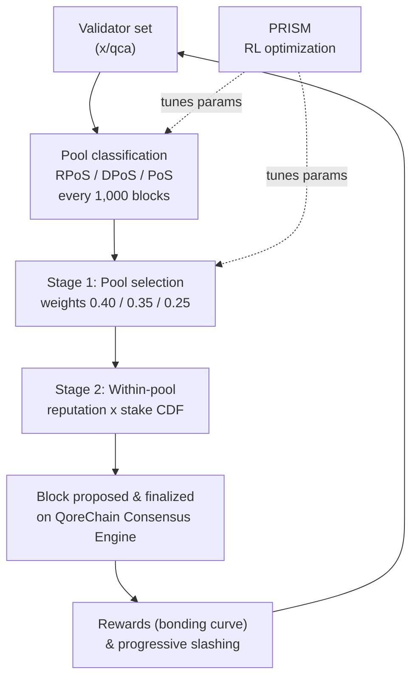

# Mecanismo de Consenso

QoreChain implementa **Triple-Pool Composite Proof-of-Stake (CPoS)**, un mecanismo de consenso que clasifica a los validadores en tres pools especializados y utiliza una selección ponderada por reputación para equilibrar seguridad, descentralización y rendimiento. CPoS está implementado en el módulo `x/qca` y opera sobre el **QoreChain Consensus Engine**.

La capa de optimización por aprendizaje por refuerzo que ajusta los parámetros de consenso en tiempo de ejecución se denomina **PRISM** (Policy-driven Reinforcement-learning for Intelligent State Machines). Consulta el [Motor de Consenso PRISM](/architecture/prism-consensus-engine) para más detalles.

El diagrama siguiente resume un ciclo de bloque/consenso de Triple-Pool CPoS sobre el QoreChain Consensus Engine, y muestra dónde PRISM retroalimenta los parámetros ajustables de `x/qca`.



---

## Arquitectura Triple-Pool

CPoS divide el conjunto activo de validadores en tres pools según métricas de reputación, stake y delegación. Cada pool desempeña un rol diferenciado en el proceso de consenso.

### Clasificación de Pools

| Pool                                 | Criterios                                                                | Peso de Selección |
| ------------------------------------ | ----------------------------------------------------------------------- | ---------------- |
| **RPoS** (Reputation Proof-of-Stake) | Puntuación de reputación >= percentil 70 **Y** stake auto-vinculado >= mediana | 40%              |
| **DPoS** (Delegated Proof-of-Stake)  | Delegación total >= 10,000 QOR                                          | 35%              |
| **PoS** (Standard Proof-of-Stake)    | Todos los validadores activos restantes                                 | 25%              |

La clasificación se evalúa con la siguiente prioridad: **RPoS > DPoS > PoS**. Un validador que cumple los requisitos tanto de RPoS como de DPoS se asigna a RPoS.

La reclasificación ocurre cada **1,000 bloques**. En cada época de reclasificación:

1. **Recopilar puntuaciones de reputación** — Las puntuaciones de reputación se recopilan del módulo `x/reputation` para todos los validadores activos.
2. **Calcular el umbral de reputación** — El umbral de reputación del percentil 70 se calcula a partir de la distribución ordenada de puntuaciones.
3. **Calcular la mediana del stake auto-vinculado** — La mediana del stake auto-vinculado se calcula a partir de la distribución ordenada de stake.
4. **Reasignar validadores** — Cada validador activo se reasigna al pool de mayor prioridad para el que cumple los requisitos.
5. **Asignación por defecto** — Los validadores sin clasificar (aquellos aún no evaluados) se asignan por defecto al pool PoS.

---

## Selección de Proponente Ponderada por Pool

La selección del proponente de bloque sigue un proceso determinista de dos etapas.

### Etapa 1: Selección de Pool

Un valor aleatorio determinista selecciona qué pool propone el siguiente bloque:

```
seed = SHA256(lastBlockHash || height || "pool")
randVal = uint64(seed[:8]) / MaxUint64    // uniform in [0, 1)
```

El pool se elige comparando `randVal` con los umbrales de peso acumulado:

* `randVal < 0.40` → pool RPoS
* `0.40 <= randVal < 0.75` → pool DPoS
* `randVal >= 0.75` → pool PoS

### Etapa 2: Selección Dentro del Pool

Dentro del pool seleccionado, el proponente se elige mediante una **CDF ponderada por reputación × stake**. Para cada validador del pool:

1. La puntuación de reputación `r` se obtiene de `x/reputation`.
2. El peso compuesto es `w = r * tokens`.
3. Se construye una función de distribución acumulada (CDF) a partir de todos los pesos compuestos.
4. El proponente se selecciona mediante un sorteo aleatorio determinista contra la CDF, sembrado por el hash y la altura del bloque.

### Comportamiento de Respaldo

Si el pool seleccionado está vacío, el sistema recurre al pool PoS. Si el pool PoS también está vacío, la selección recurre a la selección ponderada por reputación sobre todo el conjunto activo de validadores.

---

## Curva de Vinculación Personalizada

Las recompensas de los validadores se calculan mediante una curva de vinculación multifactorial que incentiva la participación a largo plazo, la alta reputación y la alineación con las fases de crecimiento del protocolo.

### Fórmula

```
R(v, t) = beta * S_v * (1 + alpha * ln(1 + L_v)) * Q(r_v) * P(t)
```

### Definiciones de Factores

| Factor                 | Símbolo  | Descripción                                                 | Por Defecto |
| ---------------------- | -------- | ----------------------------------------------------------- | --------- |
| Multiplicador de Recompensa Base | `beta`   | Escala la magnitud global de la recompensa                  | 1.0       |
| Stake Auto-vinculado      | `S_v`    | Los tokens auto-vinculados del validador (uqor)             | --        |
| Sensibilidad de Lealtad    | `alpha`  | Controla cuánto amplifica la duración de lealtad las recompensas | 0.1       |
| Duración de Lealtad       | `L_v`    | Número de bloques consecutivos en que el validador ha estado activo | --        |
| Calidad de Reputación     | `Q(r_v)` | Mapea la reputación `r` a un multiplicador de recompensa en \[0.75, 1.25] | --        |
| Fase del Protocolo        | `P(t)`   | Multiplicador dependiente de la fase para impulsar o moderar recompensas | Ver abajo |

### Función de Calidad de Reputación

```
Q(r) = 1 + 0.5 * (r - 0.5)
```

El resultado se restringe al rango **\[0.75, 1.25]**:

| Puntuación de Reputación | Q(r)  |
| ---------------- | ----- |
| 0.0              | 0.75  |
| 0.25             | 0.875 |
| 0.5              | 1.0   |
| 0.75             | 1.125 |
| 1.0              | 1.25  |

### Multiplicadores de Fase del Protocolo

| Fase    | P(t) | Descripción                                   |
| ------- | ---- | --------------------------------------------- |
| Genesis | 1.5  | Recompensas más altas para impulsar el conjunto de validadores |
| Growth  | 1.0  | Recompensas estándar durante la expansión de la red |
| Mature  | 0.8  | Emisión reducida a medida que la red se estabiliza |

### Matemática Determinista

El cálculo de `ln(1 + L_v)` utiliza una aproximación por serie de Taylor con reducción de argumento (`TaylorLn1PlusX`), operando enteramente sobre decimales de precisión fija `LegacyDec`. No se utiliza aritmética de punto flotante en los cálculos de recompensa críticos para el consenso.

---

## Slashing Progresivo

QoreChain reemplaza las tasas de slashing fijas por un **modelo de penalización progresiva** que escala las consecuencias para los reincidentes a la vez que permite que las infracciones decaigan con el tiempo.

### Fórmula

```
penalty = base_rate * escalation_factor^effective_count * severity_factor
```

### Decaimiento Temporal

Las infracciones pasadas contribuyen un peso decreciente al recuento efectivo:

```
effective_count = SUM( 0.5^(blocks_since_i / decay_halflife) )
```

Para cada infracción pasada `i`, la contribución se reduce a la mitad cada `decay_halflife` bloques (por defecto: 100,000). Esto significa que una sola infracción antigua de hace 200,000 bloques contribuye solo 0.25 al recuento efectivo.

### Factores de Severidad

| Tipo de Infracción  | Factor de Severidad |
| ------------------- | --------------- |
| Downtime            | 1.0             |
| Double Sign         | 2.0             |
| Light Client Attack | 3.0             |

### Penalización Máxima

La penalización está limitada al **33%** por evento de slash, independientemente de cuántas infracciones pasadas haya acumulado un validador.

### Ejemplo de Cálculo

Un validador con 2 infracciones previas (una de hace 50,000 bloques, otra de hace 150,000 bloques) comete un double-sign:

1. **Contribuciones de decaimiento**:
   * Infracción 1: `0.5^(50000 / 100000) = 0.5^0.5 = 0.707`
   * Infracción 2: `0.5^(150000 / 100000) = 0.5^1.5 = 0.354`
   * `effective_count = 0.707 + 0.354 = 1.061`
2. **Escalado**: `1.5^1.061 = 1.516`
3. **Penalización**: `0.01 * 1.516 * 2.0 = 0.0303` (3.03%)

Compáralo con un infractor primerizo: `0.01 * 1.5^0 * 2.0 = 0.02` (2.0%).

---

## Gobernanza QDRW

La gobernanza de QoreChain utiliza **Quadratic Delegation with Reputation Weighting (QDRW)** para prevenir la captura plutocrática a la vez que recompensa a los participantes de la red a largo plazo.

### Fórmula de Poder de Voto

```
VP(v) = sqrt(staked + 2 * xQORE) * ReputationMultiplier(r)
```

Donde:

* `staked` = los tokens QOR vinculados del votante
* `xQORE` = el saldo de xQORE del votante (derivado de staking a largo plazo)
* `2` = el multiplicador de peso de xQORE (configurable por gobernanza)
* `r` = la puntuación de reputación del votante de `x/reputation`

### Multiplicador de Reputación

El multiplicador de reputación mapea `r` en \[0, 1] a un multiplicador en \[0.5, 2.0] mediante una curva sigmoide:

```
ReputationMultiplier(r) = 0.5 + 1.5 * sigmoid(6 * (r - 0.5))
```

| Puntuación de Reputación | Multiplicador |
| ---------------- | ---------- |
| 0.0              | 0.50       |
| 0.1              | 0.52       |
| 0.2              | 0.58       |
| 0.3              | 0.71       |
| 0.4              | 0.93       |
| 0.5              | 1.25       |
| 0.6              | 1.57       |
| 0.7              | 1.79       |
| 0.8              | 1.92       |
| 0.9              | 1.98       |
| 1.0              | 2.00       |

### Escalado Cuadrático

La función raíz cuadrada garantiza que el poder de voto escale de forma sublineal con el stake. Un votante con 4x el stake de otro votante recibe solo 2x el poder de voto, no 4x. Esto evita que los grandes poseedores de tokens dominen las decisiones de gobernanza.

### Matemática Determinista

`IntegerSqrt` utiliza el método de Newton con precisión `LegacyDec`. `SigmoidApprox` utiliza una `ExpApprox` por serie de Taylor con 12 términos. Toda la matemática de gobernanza es completamente determinista en todos los nodos validadores.

---

## Parámetros de QCA

La siguiente tabla enumera todos los parámetros configurables por gobernanza en el módulo `x/qca`:

### Parámetros Centrales

| Parámetro                  | Tipo    | Por Defecto | Descripción                                       |
| -------------------------- | ------- | ------- | ------------------------------------------------- |
| `use_reputation_weighting` | bool    | `true`  | Habilita la selección de proponente ponderada por reputación |
| `min_reputation_score`     | float64 | `0.1`   | Puntuación mínima de reputación para participación activa |

### Configuración de Pools

| Parámetro                 | Tipo      | Por Defecto      | Descripción                                      |
| ------------------------- | --------- | ---------------- | ------------------------------------------------ |
| `classification_interval` | uint64    | `1000`           | Bloques entre reclasificaciones de pool          |
| `weight_rpos`             | LegacyDec | `0.40`           | Peso de selección del pool RPoS                  |
| `weight_dpos`             | LegacyDec | `0.35`           | Peso de selección del pool DPoS                  |
| `min_delegation_dpos`     | uint64    | `10,000,000,000` | Delegación mínima para DPoS (10,000 QOR en uqor) |
| `rep_percentile_rpos`     | uint64    | `70`             | Umbral de percentil de reputación para RPoS      |

### Configuración de la Curva de Vinculación

| Parámetro          | Tipo      | Por Defecto | Descripción                                      |
| ------------------ | --------- | ------- | ------------------------------------------------ |
| `alpha`            | LegacyDec | `0.1`   | Coeficiente de sensibilidad de lealtad           |
| `beta`             | LegacyDec | `1.0`   | Multiplicador de recompensa base                 |
| `phase_multiplier` | LegacyDec | `1.5`   | Multiplicador de recompensa por fase del protocolo (fase Genesis) |

### Configuración de Slashing

| Parámetro           | Tipo      | Por Defecto   | Descripción                            |
| ------------------- | --------- | --------- | -------------------------------------- |
| `base_rate`         | LegacyDec | `0.01`    | Tasa de slash base (1%)                |
| `escalation_factor` | LegacyDec | `1.5`     | Base de escalado progresivo            |
| `max_penalty`       | LegacyDec | `0.33`    | Penalización máxima por evento (33%)   |
| `decay_halflife`    | uint64    | `100,000` | Bloques para la vida media del peso de infracción |

### Configuración de Gobernanza QDRW

| Parámetro            | Tipo      | Por Defecto | Descripción                            |
| -------------------- | --------- | ------- | -------------------------------------- |
| `enabled`            | bool      | `false` | Habilita el conteo de gobernanza QDRW  |
| `xqore_multiplier`   | LegacyDec | `2.0`   | Peso de xQORE relativo a los tokens en stake |
| `rep_min_multiplier` | LegacyDec | `0.5`   | Multiplicador de reputación mínimo     |
| `rep_max_multiplier` | LegacyDec | `2.0`   | Multiplicador de reputación máximo     |

## Relacionado

* [Motor de Consenso PRISM](/architecture/prism-consensus-engine) — capa de IA que ajusta los parámetros de consenso.
* [Arquitectura Multicapa](/architecture/multilayer-architecture) — cómo las sidechains se anclan a la capa base.
* [Ejecutar un Validador](/developer-guide/running-a-validator) — opera un validador que asegura la cadena.
* [Tokenómica](/architecture/tokenomics) — recompensas de staking, inflación y economía del slashing.
