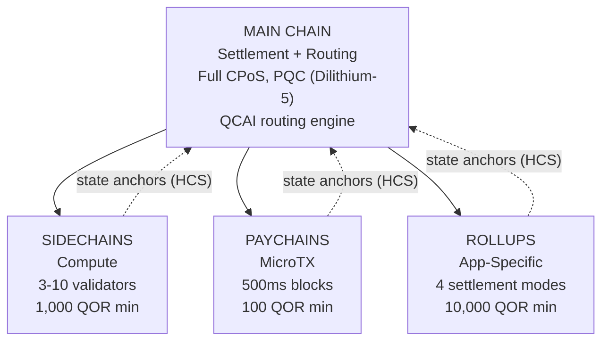

# Arquitectura Multicapa

QoreChain implementa una **arquitectura jerárquica de cadenas de 4 niveles** a través del módulo `x/multilayer`. La cadena principal actúa como la raíz de liquidación y de confianza, mientras que las capas subsidiarias (sidechains, paychains y rollups) gestionan cargas de trabajo especializadas con diferentes compromisos de rendimiento y seguridad.

---

## Visión General del Sistema

La jerarquía de 4 niveles que se muestra a continuación presenta la cadena principal como la raíz de liquidación y de confianza, con tres tipos de capas subsidiarias que anclan sus raíces de estado de vuelta a ella mediante Esquemas de Compromiso Jerárquico (HCS).



```
                    +---------------------------+
                    |       MAIN CHAIN          |
                    |  (Settlement + Routing)   |
                    |  Full CPoS consensus      |
                    |  PQC-secured (Dilithium-5)|
                    |  QCAI routing engine       |
                    +------+------+------+------+
                           |      |      |
              +------------+      |      +------------+
              |                   |                    |
    +---------v--------+ +-------v--------+ +---------v---------+
    |   SIDECHAINS     | |   PAYCHAINS    | |     ROLLUPS       |
    |  (Compute)       | |  (MicroTX)     | |  (App-Specific)   |
    |  3-10 validators | |  500ms blocks  | |  4 settlement     |
    |  1,000 QOR min   | |  100 QOR min   | |    modes          |
    |  Max: 10         | |  Max: 50       | |  10,000 QOR min   |
    +------------------+ +----------------+ |  Max: 100         |
                                            +-------------------+
```

---

## Tipos de Capa

### Cadena Principal

La cadena principal es la raíz de confianza para todo el ecosistema de QoreChain.

| Propiedad           | Valor                                                                          |
| ------------------- | ------------------------------------------------------------------------------ |
| Consenso            | Triple-Pool CPoS completo (ver [Mecanismo de Consenso](/architecture/consensus-mechanism)) |
| Seguridad           | Protegida con PQC mediante firmas Dilithium-5                                  |
| Función             | Capa de liquidación, almacenamiento de anclas de estado, motor de enrutamiento QCAI, raíz de confianza |
| Tiempo de bloque    | \~5 segundos                                                                   |

Todas las capas subsidiarias anclan periódicamente sus raíces de estado a la cadena principal mediante Esquemas de Compromiso Jerárquico (HCS).

### Sidechains

Las sidechains gestionan **operaciones de cómputo intensivo** como protocolos DeFi, motores de videojuegos y procesamiento de datos IoT.

| Parámetro                   | Valor             |
| --------------------------- | ----------------- |
| Validadores mínimos         | 3                 |
| Validadores máximos         | 10                |
| Stake mínimo del creador    | 1,000 QOR         |
| Sidechains activas máximas  | 10                |
| Dominios objetivo           | DeFi, Gaming, IoT |

### Paychains

Las paychains están optimizadas para **microtransacciones de alta frecuencia** con latencia mínima.

| Parámetro                   | Valor                                   |
| --------------------------- | --------------------------------------- |
| Tiempo de bloque objetivo   | 500 ms                                  |
| Paychains activas máximas   | 50                                      |
| Stake mínimo del creador    | 100 QOR                                 |
| Dominios objetivo           | Pagos, streaming, microtransacciones    |

### Rollups

Los rollups son **cadenas específicas de aplicación** desplegadas mediante el Rollup Development Kit (`x/rdk`). Se registran como un tipo de capa rollup dentro del módulo multilayer.

| Parámetro                | Valor                                       |
| ------------------------ | ------------------------------------------- |
| Modos de liquidación     | 4 (optimistic, zk, based, sovereign)        |
| Rollups activos máximos  | 100                                         |
| Stake mínimo del creador | 10,000 QOR                                  |
| Tipo de capa             | `rollup`                                    |
| Dominios objetivo        | DeFi, Gaming, NFT, Enterprise               |

El despliegue y la configuración de rollups se tratan en detalle en el [Rollup Development Kit](/architecture/rollup-development-kit).

---

## Enrutamiento de Transacciones QCAI

El enrutador QCAI evalúa todas las capas activas para cada transacción entrante y selecciona el destino óptimo utilizando un modelo de puntuación ponderada de 4 factores.

### Fórmula de Puntuación

Cada capa candidata recibe una puntuación compuesta (cuanto más alta, mejor):

```
Score = w_congestion * (1 - Congestion) + w_capability * Capability + w_cost * (1 - Cost) + w_latency * (1 - Latency)
```

| Factor     | Peso   | Descripción                                                                 |
| ---------- | ------ | --------------------------------------------------------------------------- |
| Congestion | 0.30   | Nivel de carga actual (invertido: menor congestión = mayor puntuación)      |
| Capability | 0.40   | Qué tan bien se ajusta la capa a los requisitos de la transacción           |
| Cost       | 0.20   | Multiplicador de comisiones respecto a la cadena principal (invertido: menor coste = mayor puntuación) |
| Latency    | 0.10   | Tiempo esperado hasta la finalidad (invertido: menor latencia = mayor puntuación) |

### Umbral de Confianza

El enrutador requiere una puntuación de confianza mínima de **0.6** antes de enrutar una transacción a una capa subsidiaria. Si ninguna capa alcanza este umbral, la transacción se dirige por defecto a la cadena principal.

El remitente de la transacción puede proporcionar una sugerencia de capa preferida. Si la capa preferida obtiene al menos el 80% del umbral de confianza (es decir, 0.48), se acepta como el destino de enrutamiento.

### Heurísticas de Carga Útil

Cuando los metadatos detallados de la transacción no están disponibles, el enrutador utiliza el tamaño de la carga útil como señal de clasificación:

| Tamaño de Carga Útil | Capa Preferida  | Justificación                                |
| -------------------- | --------------- | -------------------------------------------- |
| &lt; 256 bytes       | Paychain        | Probablemente una transferencia simple o microtransacción |
| 256 - 1,024 bytes    | Main Chain      | Complejidad de transacción estándar          |
| > 1,024 bytes        | Sidechain       | Probablemente una interacción de contrato compleja |

---

## Esquemas de Compromiso Jerárquico (HCS)

Las capas subsidiarias comprometen periódicamente su estado a la cadena principal mediante **anclas de estado**. Cada ancla contiene una prueba criptográfica del estado de la cadena subsidiaria a una altura dada.

### Contenido del Ancla

| Campo                     | Descripción                                          |
| ------------------------- | ---------------------------------------------------- |
| `layer_id`                | Identificador de la capa subsidiaria                 |
| `layer_height`            | Altura de bloque en la cadena subsidiaria            |
| `state_root`              | Raíz Merkle del árbol de estado de la cadena subsidiaria |
| `validator_set_hash`      | Hash del conjunto de validadores que firmó el compromiso |
| `pqc_aggregate_signature` | Firma agregada Dilithium-5 sobre los datos del ancla |
| `transaction_count`       | Número de transacciones desde el último ancla        |
| `compressed_state_proof`  | Prueba comprimida de transición de estado            |

### Envío de Anclas

Las anclas se envían a la cadena principal mediante `MsgAnchorState`. El keeper valida el ancla según los siguientes pasos:

1. **La capa existe y está activa** — El keeper verifica que la capa existe en el estado y actualmente tiene el estado `active`.
2. **Intervalo mínimo de anclaje transcurrido** — El keeper comprueba que han transcurrido al menos `min_anchor_interval` bloques (por defecto: 100) desde el último ancla de esta capa.
3. **Firma agregada PQC** — El keeper garantiza que la firma agregada PQC está presente y es válida para los datos del ancla.

### Período de Impugnación

Cada ancla entra en un **período de impugnación** de **24 horas** (86,400 segundos, configurable por capa). Durante este período, cualquier parte puede disputar el ancla enviando una prueba de fraude mediante `MsgChallengeAnchor`. Si la prueba de fraude es válida, el ancla se invalida y el estado de la cadena subsidiaria se revierte al ancla anterior.

Una vez que el período de impugnación expira sin una disputa exitosa, el ancla se considera finalizada.

### Lectura de Anclas

A partir de la versión de cadena **v3.1.80**, las anclas también son **legibles** a través del servicio de consulta de multilayer. Dos consultas exponen el estado del ancla tanto sobre gRPC como sobre REST:

* **`Anchor`** (`/qorechain/multilayer/v1/anchor/{layer_id}`) — devuelve el último ancla de estado finalizada para una capa.
* **`Anchors`** (`/qorechain/multilayer/v1/anchors/{layer_id}`) — devuelve el historial de anclas para una capa.

Dado que cada ancla lleva una firma Dilithium-5 sobre el mensaje canónico `layer_id || layer_height || state_root || validator_set_hash` (verificado contra la clave PQC registrada del creador de la capa), un cliente puede obtener un ancla y verificarla **sin conexión**, sin necesidad de confiar en el nodo que la sirve. Este es el primitivo on-chain detrás de los [recibos de liquidación cuántico-seguros](/rollups/settlement-receipts) del Rollup Development Kit.

---

## Agrupación de Comisiones Entre Capas (CLFB)

CLFB permite que un único pago de comisión en la capa de origen cubra la ejecución a través de múltiples capas en una ruta de transacción entre capas.

### Cálculo de Comisiones

```
avgMultiplier = sum(layer_multiplier_i) / num_layers
bundledFee = (totalGas / 1000) * avgMultiplier
```

Donde:

* `layer_multiplier_i` es el multiplicador de comisión base para cada capa en la ruta de la transacción (cadena principal = 1.0).
* `totalGas` es el consumo total estimado de gas a través de todas las capas.
* El resultado se expresa en **uqor** con una comisión mínima de 1 uqor.

### Ejemplo

Una transacción entre capas toca tres capas: cadena principal (multiplicador 1.0), una sidechain (multiplicador 0.5) y una paychain (multiplicador 0.1).

```
avgMultiplier = (1.0 + 0.5 + 0.1) / 3 = 0.533
bundledFee = (150,000 / 1000) * 0.533 = 80 uqor
```

CLFB puede habilitarse o deshabilitarse globalmente mediante el parámetro `cross_layer_fee_bundling`, y las capas individuales pueden optar por excluirse mediante su indicador de configuración `cross_layer_fee_bundling_enabled`.

---

## Ciclo de Vida de la Capa

Cada capa subsidiaria avanza a través de un ciclo de vida bien definido:

```
Proposed --> Active --> Suspended --> Decommissioned
                  \                /
                   +-- Active <--+
```

| Estado             | Descripción                                                                     | Transiciones Permitidas   |
| ------------------ | ------------------------------------------------------------------------------- | ------------------------- |
| **Proposed**       | La capa ha sido registrada pero aún no activada                                 | Active, Decommissioned    |
| **Active**         | La capa está operativa y aceptando transacciones                                | Suspended, Decommissioned |
| **Suspended**      | La capa está pausada temporalmente (p. ej., por mantenimiento o por motivos de seguridad) | Active, Decommissioned    |
| **Decommissioned** | La capa está apagada permanentemente (estado terminal)                          | Ninguna                   |

Las transiciones de estado son aplicadas por el keeper. Las transiciones inválidas (p. ej., de Decommissioned a Active) son rechazadas.

---

## Parámetros

| Parámetro                      | Tipo   | Por Defecto     | Descripción                                            |
| ------------------------------ | ------ | --------------- | ------------------------------------------------------ |
| `max_sidechains`               | uint64 | `10`            | Número máximo de sidechains activas                    |
| `max_paychains`                | uint64 | `50`            | Número máximo de paychains activas                     |
| `min_anchor_interval`          | uint64 | `100`           | Bloques mínimos entre anclas de estado                 |
| `max_anchor_interval`          | uint64 | `1,000`         | Bloques máximos entre anclas de estado (ancla forzada) |
| `default_challenge_period`     | uint64 | `86,400`        | Período de impugnación por defecto en segundos (24 horas) |
| `min_sidechain_stake`          | string | `1,000,000,000` | Stake mínimo para crear una sidechain (1,000 QOR en uqor) |
| `min_paychain_stake`           | string | `100,000,000`   | Stake mínimo para crear una paychain (100 QOR en uqor) |
| `routing_enabled`              | bool   | `true`          | Habilitar el enrutamiento de transacciones basado en QCAI |
| `routing_confidence_threshold` | string | `0.6`           | Confianza mínima para las decisiones de enrutamiento QCAI |
| `cross_layer_fee_bundling`     | bool   | `true`          | Habilitar la Agrupación de Comisiones Entre Capas global |
