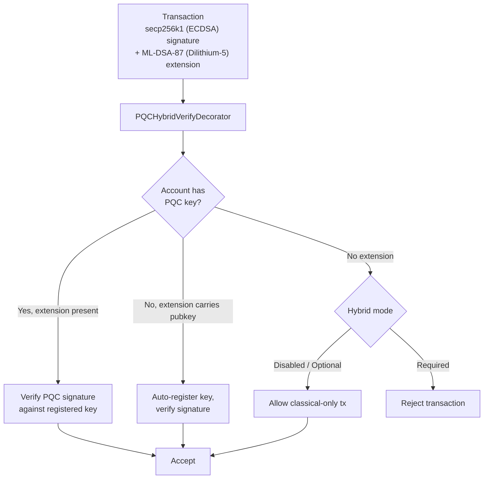

# Seguridad Post-Cuántica

QoreChain está construida con **criptografía post-cuántica (PQC) desde el génesis** — no añadida posteriormente como una actualización. El módulo `x/pqc` proporciona firmas digitales basadas en retículos y encapsulamiento de claves como primitivas criptográficas principales, con un marco de agilidad de algoritmos controlado por gobernanza para una resiliencia a largo plazo.

La base completa de PQC — **Dilithium-5 (firmas) + ML-KEM-1024 (KEM) + SHAKE-256 (hash)** — está ahora completa y es el valor por defecto de la red. A partir de la versión actual de la cadena (**v3.1.80**), las firmas híbridas son **requeridas por defecto** en la ruta de transacción cosmos: `hybrid_signature_mode = required` y `allow_classical_fallback = false`. Cada transacción de la ruta cosmos debe llevar una firma Dilithium-5 junto a su firma clásica secp256k1; las transacciones solo clásicas desde una cuenta PQC se rechazan, y la ruta de degradación clásica está cerrada.

## Principios de Diseño

* **PQC requerida por defecto**: Las firmas post-cuánticas son obligatorias en la ruta cosmos. Las firmas clásicas secp256k1 por sí solas ya no son suficientes — `allow_classical_fallback = false`.
* **Híbrida por defecto**: Las transacciones cosmos llevan simultáneamente tanto una firma clásica secp256k1 como una firma PQC Dilithium-5. El respaldo solo clásico está cerrado.
* **Agilidad de algoritmos**: El registro de algoritmos criptográficos está controlado por gobernanza, lo que permite a la red adoptar nuevos algoritmos o desaprobar los comprometidos sin hard forks.
* **Verificación determinista**: Toda la verificación de firmas es determinista y reproducible en todos los nodos validadores.

## Algoritmos Soportados

| Algoritmo       | Estándar             | Categoría          | Nivel NIST | Clave Pública  | Clave Privada | Firma / Texto Cifrado | Secreto Compartido |
| --------------- | -------------------- | ----------------- | ---------- | ----------- | ----------- | ---------------------- | ------------- |
| **Dilithium-5** | ML-DSA-87 (FIPS 204) | Firma         | 5          | 2,592 bytes | 4,896 bytes | 4,627 bytes            | --            |
| **ML-KEM-1024** | FIPS 203             | Encapsulamiento de Claves | 5          | 1,568 bytes | 3,168 bytes | 1,568 bytes            | 32 bytes      |

Ambos algoritmos operan en el **Nivel de Seguridad NIST 5**, la categoría de seguridad estandarizada más alta, proporcionando una protección equivalente a AES-256 frente a adversarios tanto clásicos como cuánticos.

## Backend Criptográfico

Las operaciones PQC se implementan en un backend criptográfico de alto rendimiento y seguro en memoria que expone la firma basada en retículos, la verificación y el encapsulamiento de claves al runtime de QoreChain. El backend proporciona:

Operaciones específicas de algoritmo:

* Generación de claves, firma y verificación de Dilithium-5
* Generación de claves, encapsulamiento y desencapsulamiento de ML-KEM-1024
* Generación de baliza aleatoria determinista (`seed`, `epoch`)

Operaciones conscientes del algoritmo:

* `Keygen(algorithmID)` — Genera un par de claves para cualquier algoritmo registrado
* `Sign(algorithmID, privkey, message)` — Crea una firma
* `Verify(algorithmID, pubkey, message, signature)` — Verifica una firma
* `AlgorithmInfo(algorithmID)` — Consulta los tamaños de clave/salida
* `ListAlgorithms()` — Enumera todos los algoritmos soportados

Todas las operaciones de firma y verificación son deterministas y producen resultados idénticos en todos los nodos validadores y plataformas soportadas.

Estas mismas primitivas — ML-DSA (FIPS-204), ML-KEM (FIPS-203) y SHAKE-256 (FIPS-202) — están disponibles para wallets e integradores a través de la biblioteca de código abierto [**qorechain-pqc**](https://github.com/qorechain/qorechain-pqc), que proporciona una API consistente y compatible byte a byte en seis lenguajes (JavaScript/TypeScript, Rust, Go, C, Python, Java). Consulta [Firma Post-Cuántica](/developer-guide/post-quantum-signing).

## Registro de Claves

Las cuentas registran claves PQC mediante `MsgRegisterPQCKey` (legacy, por defecto Dilithium-5) o `MsgRegisterPQCKeyV2` (consciente del algoritmo). Cada mensaje incluye:

* **Sender**: La dirección de la cuenta que registra la clave.
* **PublicKey**: Los bytes de la clave pública PQC.
* **AlgorithmID**: El identificador del algoritmo PQC (solo v2).
* **KeyType**: Uno de tres modos de registro:

| Tipo de Clave    | Descripción                                                              |
| ---------------- | ------------------------------------------------------------------------ |
| `hybrid`         | Claves tanto clásica (ECDSA) como PQC. Las transacciones llevan firmas duales. |
| `pqc_only`       | Solo clave PQC. No se requiere firma clásica.                            |
| `classical_only` | Solo clave clásica. Sin protección PQC (no recomendado).                 |

## Firmas Híbridas

El sistema de firmas híbridas requiere que las transacciones de la ruta cosmos lleven **tanto** una firma clásica como una firma PQC simultáneamente. Esto proporciona defensa en profundidad: incluso si un esquema se rompe, el otro protege la transacción.

Con el valor por defecto de la red `hybrid_signature_mode = required`, cada transacción de la ruta cosmos debe incluir la extensión Dilithium-5 junto a la firma secp256k1. Las únicas exenciones (para el arranque) son los **gentxs de génesis (altura 0)** y las **transacciones de registro/migración de clave PQC** (`MsgRegisterPQCKey`, `MsgRegisterPQCKeyV2`, `MsgMigratePQCKey`), a las que se les permite ser solo clásicas para que las cuentas puedan registrar su primera clave PQC.

**Las transacciones EVM no se ven afectadas.** Las transacciones EVM se autentican en una ruta ante `eth_secp256k1` separada (la ruta del QoreChain EVM Engine) y nunca requieren la extensión híbrida PQC. El requisito híbrido se aplica únicamente a la ruta de transacción cosmos.

### Flujo de Cofirma

Para producir una transacción cosmos conforme, la firma clásica secp256k1 se calcula sobre los sign bytes estándar (que excluyen la extensión PQC), y una firma Dilithium-5 se calcula y se adjunta como la extensión `PQCHybridSignature`. Las herramientas estándar de CosmJS / relayer deben producir esta extensión para transaccionar en la ruta cosmos. Hoy esto se hace mediante:

* `qorechaind tx pqc gen-key` — genera una clave Dilithium-5.
* `qorechaind tx pqc cosign` — adjunta la cofirma Dilithium-5 a una transacción.
* La firma híbrida del SDK de QoreChain — `buildHybridTx` con `includePqcPublicKey` (incrusta la clave pública PQC para el autorregistro en el primer uso).

*Una transacción firmada con secp256k1 (ECDSA) más ML-DSA-87 (Dilithium-5), verificada por el ante handler bajo el modo de aplicación de toda la cadena.*



### Formato de la Extensión de TX

Las firmas PQC se adjuntan a las transacciones como una **extensión de TX** con la URL de tipo `/qorechain.pqc.v1.PQCHybridSignature`:

```text
{
  "algorithm_id": 1,
  "pqc_signature": "<4627 bytes for Dilithium-5>",
  "pqc_public_key": "<2592 bytes, optional>"
}
```

El campo `pqc_public_key` es opcional. Si está presente y la cuenta no tiene una clave PQC registrada, el ante handler **autorregistrará** la clave en el primer uso.

### PQCHybridVerifyDecorator

El ante handler `PQCHybridVerifyDecorator` procesa las firmas híbridas con una lógica de verificación de tres vías:

| Escenario | La Cuenta Tiene Clave PQC | Extensión Presente | Clave Pública en la Extensión | Resultado                                              |
| -------- | ------------------- | ----------------- | ----------------------- | --------------------------------------------------- |
| Path 1   | Sí                 | Sí               | --                      | Verifica la firma PQC contra la clave registrada    |
| Path 2   | No                 | Sí               | Sí                     | Autorregistra la clave, verifica la firma           |
| Path 3a  | No                 | No               | --                      | **Modo opcional**: Permite transacción solo clásica |
| Path 3b  | No                 | No               | --                      | **Modo requerido**: Rechaza la transacción          |
| Path 4   | Sí                 | No               | --                      | Gestionado por el PQCVerifyDecorator estándar       |

### Modos de Firma Híbrida

El nivel de aplicación híbrida de toda la cadena es configurable por gobernanza. El **valor por defecto actual de la red es `required`**:

| Modo         | ID | Por Defecto | Comportamiento                                                                                                   |
| ------------ | -- | ------- | ----------------------------------------------------------------------------------------------------------------- |
| **Disabled** | 0  | No      | Solo firmas clásicas. Las extensiones PQC se ignoran.                                                            |
| **Optional** | 1  | No      | Las extensiones PQC se verifican si están presentes. Las cuentas sin claves PQC pueden transaccionar solo con firmas clásicas. |
| **Required** | 2  | **Sí** | Todas las transacciones de la ruta cosmos deben llevar firmas tanto clásicas como PQC. Las transacciones sin extensión PQC se rechazan. |

La red ha completado su migración: **Optional** (génesis) → **Required** (el valor por defecto actual desde v3.1.71, con `allow_classical_fallback = false`). Los tres modos siguen estando controlados por gobernanza y pueden ajustarse mediante propuesta.

## Marco de Agilidad de Algoritmos

El marco de agilidad de algoritmos proporciona un registro controlado por gobernanza para los algoritmos PQC, permitiendo a la red añadir nuevos algoritmos, desaprobar los vulnerables y migrar cuentas — todo sin hard forks.

### Ciclo de Vida del Algoritmo

Cada algoritmo registrado tiene un estado de ciclo de vida:

```
active --> migrating --> deprecated --> disabled
```

| Estado         | Descripción                                                                                                                                 |
| -------------- | ------------------------------------------------------------------------------------------------------------------------------------------- |
| **Active**     | Totalmente operativo. Se aceptan nuevos registros de claves y verificaciones.                                                               |
| **Migrating**  | El período de doble firma está activo. Se anima a las cuentas a migrar al algoritmo de reemplazo. Se aceptan tanto las firmas antiguas como las nuevas. |
| **Deprecated** | Las firmas existentes todavía pueden verificarse, pero no se aceptan nuevos registros de claves.                                            |
| **Disabled**   | Interruptor de emergencia. El algoritmo no puede verificar ninguna firma. Se usa cuando se descubre una vulnerabilidad.                     |

### Migración por Doble Firma

Cuando un algoritmo se desaprueba, comienza un **período de migración** (por defecto: 1,000,000 bloques, aproximadamente 69 días a 6s/bloque). Durante este período:

1. Las cuentas con claves que usan el algoritmo desaprobado deben migrar al reemplazo.
2. La migración requiere firmas duales (`MsgMigratePQCKey`): una de la clave antigua y una de la clave nueva, probando la propiedad de ambas.
3. Ambos algoritmos se aceptan para la verificación durante todo el período de migración.

### Mensajes de Gobernanza

| Mensaje                 | Descripción                                                                                                                                                       |
| ----------------------- | ----------------------------------------------------------------------------------------------------------------------------------------------------------------- |
| `MsgAddAlgorithm`       | Propone añadir un nuevo algoritmo PQC al registro. Incluye la `AlgorithmInfo` completa (nombre, categoría, nivel NIST, tamaños de clave). Debe enviarse a través de gobernanza. |
| `MsgDeprecateAlgorithm` | Inicia el proceso de desaprobación de un algoritmo. Especifica el algoritmo de reemplazo y el período de migración en bloques.                                    |
| `MsgDisableAlgorithm`   | Desactiva de emergencia un algoritmo inmediatamente. Requiere una cadena de motivo. Se usa cuando se descubre una vulnerabilidad criptográfica.                  |

### Extensibilidad

Añadir un nuevo algoritmo requiere:

1. Implementar el algoritmo en el backend criptográfico detrás de la interfaz unificada de firma y verificación.
2. Enviar una propuesta de gobernanza `MsgAddAlgorithm` con los metadatos del algoritmo.
3. Una vez aprobado, el algoritmo queda disponible para el registro de claves y la verificación.

## Hash SHAKE-256

A partir de v3.1.73, **SHAKE-256** (función de salida extensible SHA-3) es el **hash de aplicación por defecto** en todo QoreChain — proporcionado por el paquete `qorehash` — completando la base criptográfica resistente a la computación cuántica junto a las firmas Dilithium-5 y el encapsulamiento de claves ML-KEM-1024. El módulo `x/pqc` proporciona utilidades SHAKE-256 en Go puro:

| Función                            | Descripción                       | Salida           |
| ---------------------------------- | --------------------------------- | ---------------- |
| `SHAKE256Hash(data, outputLen)`    | Resumen SHAKE-256 de longitud variable | Longitud arbitraria |
| `SHAKE256Hash32(data)`             | Resumen SHAKE-256 estándar de 256 bits | 32 bytes         |
| `SHAKE256ConcatHash(left, right)`  | Hash de entradas concatenadas     | 32 bytes         |
| `SHAKE256DomainHash(domain, data)` | Hash con separación de dominio    | 32 bytes         |

Estas utilidades respaldan el hash de aplicación por defecto y se utilizan para:

* Hashing de nodos del árbol Merkle
* Compromisos hash en atestaciones entre capas
* Separación de dominios para diferentes contextos de hash (p. ej., `"leaf:"` vs `"node:"`)

## PQC del Puente

Todas las atestaciones de puente entre cadenas y los compromisos de estado utilizan firmas **Dilithium-5**. El módulo `x/multilayer` requiere firmas agregadas PQC en cada envío de `MsgAnchorState`, y los compromisos ML-KEM aseguran los canales de intercambio de claves entre los relayers del puente.

Esto garantiza que la seguridad entre cadenas no se degrade por el uso de criptografía clásica en la infraestructura del puente, manteniendo la resistencia a la computación cuántica en toda la pila del protocolo.

## Parámetros del Módulo

| Parámetro                  | Tipo                | Por Defecto       | Descripción                                           |
| -------------------------- | ------------------- | ----------------- | ----------------------------------------------------- |
| `pqc_primary`              | bool                | `true`            | PQC es el esquema de firma principal                  |
| `allow_classical_fallback` | bool                | `false`           | El respaldo solo clásico está cerrado; las txs cosmos deben ser híbridas |
| `min_security_level`       | int32               | `5`               | Nivel de seguridad NIST mínimo para algoritmos aceptados |
| `default_migration_blocks` | int64               | `1,000,000`       | Período de migración por doble firma por defecto en bloques |
| `default_signature_algo`   | AlgorithmID         | `1` (Dilithium-5) | Algoritmo de firma por defecto para nuevos registros de claves |
| `hybrid_signature_mode`    | HybridSignatureMode | `2` (Required)    | Nivel de aplicación de firma híbrida de toda la cadena |

## Relacionado

* [Firma Post-Cuántica](/developer-guide/post-quantum-signing) — la biblioteca de código abierto `qorechain-pqc` (seis lenguajes) para estas primitivas y la firma híbrida.
* [Configuración de Wallet](/getting-started/wallet-setup) — crea y gestiona cuentas respaldadas por PQC.
* [Cuentas y firma PQC del SDK](/sdk/concepts/accounts-pqc) — claves y firma post-cuántica desde código.
* [Parámetros de la Cadena](/appendix/chain-parameters) — algoritmos por defecto y configuración de migración.
* [Arquitectura del Puente](/architecture/bridge-architecture) — verificación PQC en paquetes entre cadenas.
