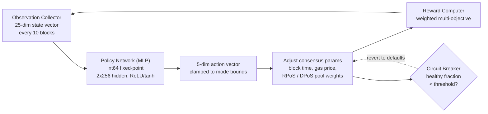

# Motor de Consenso PRISM

QoreChain integra **PRISM** (Policy-driven Reinforcement-learning for Intelligent State Machines), una capa de optimización por aprendizaje por refuerzo, directamente en la capa de consenso a través del módulo `x/rlconsensus`. PRISM observa las métricas de la cadena cada N bloques, ejecuta inferencia mediante una red neuronal de punto fijo y propone ajustes de parámetros de consenso — todo de forma determinista, sin aritmética de punto flotante en las rutas críticas para el consenso.

*El bucle de optimización de PRISM: observa el estado de la cadena, ejecuta la inferencia de la política, restringe y aplica los cambios de parámetros, y luego retroalimenta el resultado.*



---

## Descripción General de la Arquitectura

PRISM consta de cuatro componentes:

1. **Observation Collector** — Recopila vectores de estado de la cadena de 25 dimensiones a intervalos configurables.
2. **Policy Network (MLP)** — Un perceptrón multicapa nativo de Go que mapea observaciones a acciones.
3. **Reward Computer** — Evalúa la calidad de los cambios de parámetros mediante una función multiobjetivo ponderada.
4. **Circuit Breaker** — Supervisa la salud de la cadena y revierte todos los parámetros ajustados por PRISM si se detecta inestabilidad.

Todos los componentes operan dentro del ciclo de vida ABCI y producen salidas deterministas y verificables en todos los nodos validadores.

---

## Red de Política

La red de política es un perceptrón multicapa (MLP) feedforward implementado enteramente en Go con **aritmética de punto fijo int64** (escalada por 10^8).

### Arquitectura de la Red

| Propiedad           | Valor                              |
| ------------------- | ---------------------------------- |
| Dimensiones de entrada    | 25                                 |
| Capas ocultas       | 2                                  |
| Tamaños de capas ocultas  | 256, 256                           |
| Dimensiones de salida   | 5                                  |
| Activación (oculta) | ReLU                               |
| Activación (salida) | tanh                               |
| Parámetros totales    | 73,733                             |
| Precisión           | punto fijo int64 (escalada por 10^8) |

### Desglose del Recuento de Parámetros

```
Layer 1: 25 * 256 + 256   =  6,656  (input -> hidden_1)
Layer 2: 256 * 256 + 256   = 65,792  (hidden_1 -> hidden_2)
Layer 3: 256 * 5 + 5       =  1,285  (hidden_2 -> output)
Total:                       73,733
```

### Aritmética de Punto Fijo

Todos los cálculos del MLP usan valores `int64` escalados por `FixedPointScale = 10^8`. Esto elimina el no determinismo derivado de las diferencias de redondeo de punto flotante IEEE 754 entre plataformas de hardware.

* **Multiplicación**: `fixMul(a, b) = (a / SCALE) * b + (a % SCALE) * b / SCALE` (dividido para evitar el desbordamiento)
* **ReLU**: `relu(x) = max(0, x)`
* **tanh**: Aproximante de Padé `tanh(x) ~ x * (3*S - x^2) / (3*S + x^2)` para `|x| <= 2.5*SCALE`, restringido a +/- SCALE en caso contrario

Los pesos de la política se almacenan on-chain como un vector `[]int64` aplanado y pueden actualizarse mediante propuesta de gobernanza.

---

## Vector de Observación

PRISM recopila un vector de observación de 25 dimensiones en cada intervalo de observación (por defecto: cada 10 bloques).

| Índice | Dimensión              | Descripción                                      |
| ----- | ---------------------- | ------------------------------------------------ |
| 0     | `block_utilization`    | Gas de bloque usado / límite de gas de bloque    |
| 1     | `tx_count`             | Número de transacciones en el bloque             |
| 2     | `avg_tx_size`          | Tamaño medio de transacción en bytes             |
| 3     | `block_time`           | Tiempo desde el bloque anterior (ms)             |
| 4     | `block_time_delta`     | Tiempo de bloque menos tiempo de bloque objetivo (ms) |
| 5     | `gas_price_50th`       | Precio de gas mediano                            |
| 6     | `gas_price_95th`       | Precio de gas del percentil 95                   |
| 7     | `mempool_size`         | Número de transacciones pendientes               |
| 8     | `mempool_bytes`        | Total de bytes de transacciones pendientes       |
| 9     | `validator_count`      | Recuento de validadores activos                  |
| 10    | `validator_gini`       | Coeficiente de Gini de la distribución de poder de los validadores |
| 11    | `missed_block_ratio`   | Fracción de validadores que no firmaron          |
| 12    | `avg_commit_latency`   | Latencia media de la ronda de commit (ms)        |
| 13    | `max_commit_latency`   | Latencia máxima de la ronda de commit (ms)       |
| 14    | `precommit_ratio`      | Fracción de precommits recibidos                 |
| 15    | `failed_tx_ratio`      | Fracción de transacciones fallidas               |
| 16    | `avg_gas_per_tx`       | Gas medio consumido por transacción              |
| 17    | `reward_per_validator` | Recompensa media por validador (uqor)            |
| 18    | `slash_count`          | Número de eventos de slashing en la ventana de observación |
| 19    | `jail_count`           | Número de eventos de jail en la ventana de observación |
| 20    | `inflation_rate`       | Tasa de emisión actual                           |
| 21    | `bonded_ratio`         | Tokens vinculados / suministro total             |
| 22    | `reputation_mean`      | Puntuación de reputación media entre los validadores activos |
| 23    | `reputation_stddev`    | Desviación estándar de las puntuaciones de reputación |
| 24    | `mev_estimate`         | MEV extraído estimado (heurístico)               |

Todos los valores se almacenan como representaciones de cadena `LegacyDec` y se convierten a punto fijo int64 antes de la inferencia.

---

## Espacio de Acción

La salida del MLP es un vector de acción de 5 dimensiones, donde cada dimensión representa un cambio propuesto a un parámetro de consenso. La activación tanh restringe las salidas en bruto a \[-1, 1], que luego se escalan por límites específicos del modo.

| Índice | Dimensión de Acción        | Descripción                                                             |
| ----- | -------------------------- | ----------------------------------------------------------------------- |
| 0     | `block_time_delta`         | Cambio propuesto al tiempo de bloque objetivo (ms)                      |
| 1     | `gas_price_delta`          | Cambio propuesto al precio de gas base                                  |
| 2     | `validator_set_size_delta` | Cambio propuesto al tamaño objetivo del conjunto de validadores (solo registrado, no aplicado) |
| 3     | `pool_weight_rpos_delta`   | Cambio propuesto al peso de prioridad del pool RPoS                     |
| 4     | `pool_weight_dpos_delta`   | Cambio propuesto al peso de prioridad del pool DPoS                     |

Las acciones se **restringen** a los límites máximos de cambio definidos por el modo PRISM actual antes de su aplicación.

---

## Función de Recompensa

La señal de recompensa evalúa qué tan bien los cambios recientes de parámetros mejoraron el rendimiento de la cadena. Se calcula como una suma ponderada de cinco objetivos:

```
R = 0.30 * delta_throughput
  + 0.25 * delta_finality
  + 0.20 * delta_decentralization
  - 0.15 * mev_estimate
  - 0.10 * failed_tx_ratio
```

| Componente          | Peso | Dirección | Métrica de Origen                             |
| ------------------- | ------ | --------- | --------------------------------------------- |
| Rendimiento          | +0.30  | Maximizar  | Cambio en la utilización del bloque           |
| Finalidad            | +0.25  | Maximizar  | Cambio en el ratio de precommit               |
| Descentralización    | +0.20  | Maximizar  | Cambio negativo en el coeficiente de Gini de los validadores |
| MEV                 | -0.15  | Minimizar  | Estimación de MEV actual                       |
| Transacciones Fallidas | -0.10  | Minimizar  | Ratio de transacciones fallidas actual         |

Los pesos de recompensa son configurables por gobernanza y deben sumar exactamente 1.0.

---

## Modos de PRISM

PRISM opera en uno de cuatro modos, controlables mediante gobernanza:

| Modo             | ID | Cambio Máx. | Comportamiento                                                                             |
| ---------------- | -- | ---------- | ------------------------------------------------------------------------------------------ |
| **Shadow**       | 0  | 0%         | Solo observa y registra recomendaciones. No se cambian parámetros. Este es el modo por defecto. |
| **Conservative** | 1  | +/- 10%    | Aplica cambios de parámetros dentro de límites estrictos. Adecuado para el despliegue inicial en vivo. |
| **Autonomous**   | 2  | +/- 25%    | Aplica cambios de parámetros dentro de límites más amplios. Para redes maduras con políticas validadas. |
| **Paused**       | 3  | 0%         | PRISM está completamente inactivo. No se recopilan observaciones ni se ejecuta inferencia. |

Las transiciones de modo requieren una propuesta de gobernanza. La ruta de despliegue recomendada es: Shadow → Conservative → Autonomous.

---

## Circuit Breaker

El circuit breaker es un mecanismo de seguridad que supervisa la salud de la cadena y revierte automáticamente todos los parámetros ajustados por PRISM si se detecta inestabilidad.

### Lógica de Detección

El circuit breaker evalúa los últimos **50 bloques** (configurable mediante `circuit_breaker_window`):

1. **Calcular deltas de tiempo de bloque** — Para cada par consecutivo de marcas de tiempo de bloque, calcula el delta de tiempo de bloque.
2. **Clasificar bloques sanos** — Un bloque se considera **sano** si su delta es positivo y está dentro de 2x el tiempo de bloque objetivo.
3. **Calcular la fracción sana** — Calcula la **fracción sana** = bloques sanos / deltas totales.

### Condición de Activación

Si la fracción sana cae por debajo del umbral (por defecto: **50%**), el circuit breaker se activa.

### Respuesta

Cuando se activa, el circuit breaker:

1. **Revierte** todos los parámetros aplicados por PRISM (tiempo de bloque, precio de gas, pesos de pool) a sus valores por defecto.
2. **Pausa** PRISM (establece `CircuitBreakerActive = true`).
3. **Limpia** la política en memoria para forzar una recarga nueva.
4. **Emite** un evento `circuit_breaker_triggered`.

El circuit breaker se restablece automáticamente cuando la fracción sana se recupera por encima del umbral en evaluaciones posteriores.

---

## Funciones de Asesoramiento de Rollup

PRISM proporciona funciones de asesoramiento para la optimización de parámetros de rollup:

* **`SuggestRollupProfile`** — Analiza las condiciones actuales de la cadena y sugiere parámetros óptimos de configuración de rollup (tiempo de bloque, límite de gas, frecuencia de liquidación).
* **`OptimizeRollupGas`** — Recomienda ajustes de precios de gas para las transacciones de liquidación de rollup según los patrones de congestión de la cadena principal.

Estas funciones son solo informativas y no modifican el estado de la cadena.

---

## Biblioteca de Matemática Determinista

Todos los cálculos de PRISM usan el paquete `mathutil`, que proporciona alternativas deterministas a la matemática estándar de punto flotante:

| Función                   | Descripción                 | Método                                                    |
| ------------------------- | --------------------------- | --------------------------------------------------------- |
| `IntegerSqrt(x)`          | Raíz cuadrada                | Método de Newton sobre `LegacyDec`, convergencia de 100 iteraciones |
| `TaylorLn1PlusX(x)`       | Logaritmo natural `ln(1+x)` | Reducción de argumento + serie de Taylor de 15 términos   |
| `ExpApprox(x)`            | Exponencial `e^x`           | Serie de Taylor de 12 términos                            |
| `SigmoidApprox(x)`        | Sigmoide `1/(1+e^-x)`       | `ExpApprox` con simetría para entradas negativas          |
| `ReputationMultiplier(r)` | Mapea \[0,1] a \[0.5,2.0]   | Sigmoide con escala y desplazamiento                      |

Todas las funciones operan sobre valores `cosmossdk.io/math.LegacyDec`, garantizando resultados idénticos en todas las plataformas de hardware y versiones del compilador de Go.

---

## Parámetros

| Parámetro                        | Tipo      | Por Defecto  | Descripción                                          |
| -------------------------------- | --------- | ------------ | ---------------------------------------------------- |
| `enabled`                        | bool      | `true`       | Habilita PRISM                                       |
| `observation_interval`           | uint64    | `10`         | Bloques entre recopilaciones de observación          |
| `agent_mode`                     | PrismMode | `0` (Shadow) | Modo de operación actual                             |
| `max_change_conservative`        | LegacyDec | `0.10`       | Cambio máximo de parámetro en modo Conservative      |
| `max_change_autonomous`          | LegacyDec | `0.25`       | Cambio máximo de parámetro en modo Autonomous        |
| `circuit_breaker_window`         | uint64    | `50`         | Número de bloques recientes supervisados por el circuit breaker |
| `circuit_breaker_threshold`      | LegacyDec | `0.50`       | Fracción mínima de bloques sanos antes de la activación |
| `default_block_time_ms`          | int64     | `5000`       | Tiempo de bloque objetivo por defecto (ms)           |
| `default_base_gas_price`         | LegacyDec | `100`        | Precio de gas base por defecto                       |
| `default_validator_set_size`     | uint64    | `100`        | Tamaño objetivo del conjunto de validadores por defecto |
| `reward_weight_throughput`       | LegacyDec | `0.30`       | Peso de recompensa por mejora de rendimiento         |
| `reward_weight_finality`         | LegacyDec | `0.25`       | Peso de recompensa por mejora de finalidad           |
| `reward_weight_decentralization` | LegacyDec | `0.20`       | Peso de recompensa por mejora de descentralización   |
| `reward_weight_mev`              | LegacyDec | `0.15`       | Peso de penalización por extracción de MEV           |
| `reward_weight_failed_txs`       | LegacyDec | `0.10`       | Peso de penalización por transacciones fallidas      |

## Relacionado

* [Mecanismo de Consenso](/architecture/consensus-mechanism) — la capa de consenso que PRISM optimiza.
* [Motor de IA](/architecture/ai-engine) — los servicios y endpoints de IA on-chain más amplios.
* [Tokenómica](/architecture/tokenomics) — cómo las señales de RL alimentan los ajustes de recompensa y parámetros.
